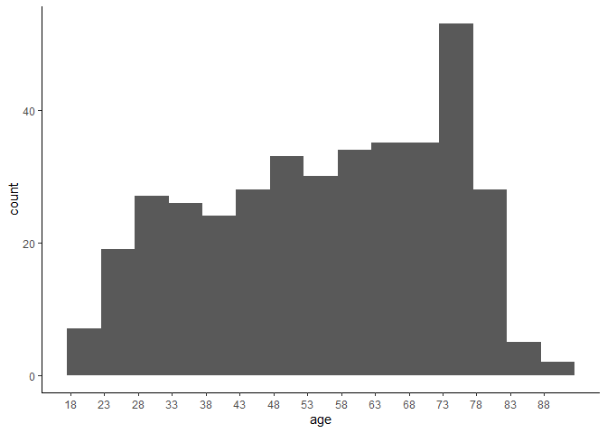
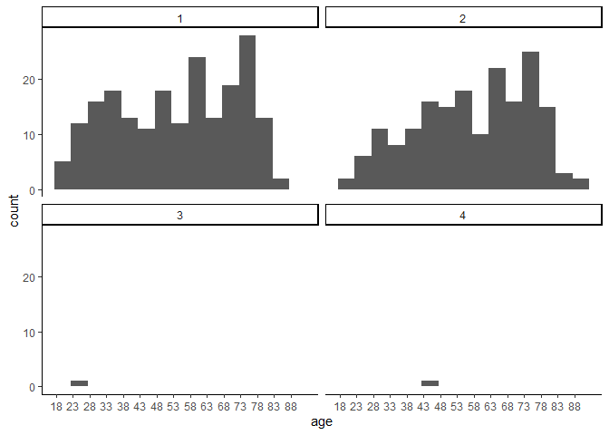
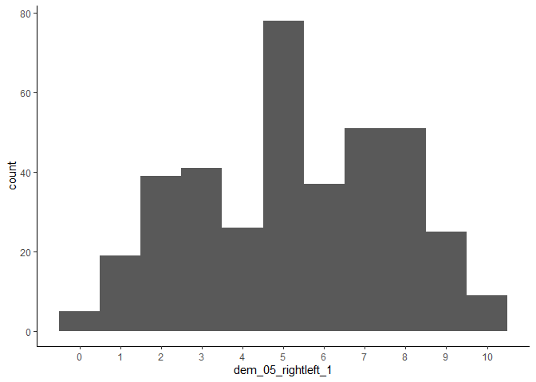

AMMSA – Swedish Validation, Analyses with Demographics
================
2022-11-26

# Descriptive and Correlation Analysis

## Demographics

### Age

``` r
ammsa %>% 
  summarise(
    mean = mean(age, na.rm = TRUE),
    sd = sd(age, na.rm = TRUE),
    median = median(age, na.rm = TRUE)
  )
```

    ## # A tibble: 1 × 3
    ##    mean    sd median
    ##   <dbl> <dbl>  <dbl>
    ## 1  55.6  17.7     57

``` r
ammsa %>% 
  group_by(dem_01_gender) %>% 
  summarise(
    mean = mean(age, na.rm = TRUE),
    sd = sd(age, na.rm = TRUE),
    median = median(age, na.rm = TRUE)
  )
```

    ## # A tibble: 4 × 4
    ##   dem_01_gender  mean    sd median
    ##           <dbl> <dbl> <dbl>  <dbl>
    ## 1             1  54.1  18.0   56.5
    ## 2             2  57.7  17.1   59.5
    ## 3             3  23    NA     23  
    ## 4             4  47    NA     47

``` r
ggplot(ammsa,
       aes(
         x = age
       )) +
  geom_histogram(
    binwidth = 5
  ) +
  scale_x_continuous(
    breaks = seq(18, 88, 5)
  ) +
  theme_classic()
```

<!-- -->

``` r
ggplot(ammsa,
       aes(
         x = age
       )) +
  facet_wrap(~ dem_01_gender) +
  geom_histogram(
    binwidth = 5
  ) +
  scale_x_continuous(
    breaks = seq(18, 88, 5)
  ) +
  theme_classic()
```

<!-- -->

### Gender

1 = Woman

2 = Man

3 = Non-binary

4 = Other genders

``` r
table(ammsa$dem_01_gender)
```

    ## 
    ##   1   2   3   4 
    ## 204 180   1   1

### Education

1 = Primary school

2 = High school or equivalent

3 = Post-high school education

13 = Studying bachelor’s right now

4 = Vocational training

5 = Bachelor’s

6 = Master’s

7 = Doctorate

``` r
table(ammsa$dem_02_edu)
```

    ## 
    ##   1   2   3   4   5   6   7  13 
    ##  28 123  59  41  75  50   7   3

### Occupation

1 = Studying

2 = Unemployed

3 = Working fulltime

4 = Working parttime

5 = Medical leave

6 = Retired

8 = Parental leave

``` r
table(ammsa$dem_03_occu)
```

    ## 
    ##   1   2   3   4   5   6   8 
    ##  18  19 149  23  13 159   5

### Place of residence

1 =

2 =

3 =

4 =

5 =

6 =

7 =

8 =

9 =

``` r
table(ammsa$dem_04_living)
```

    ## 
    ##   1   2   3   4   5   6   7   8   9 
    ##  86  34  74  19   5 103   6  50   9

### Political spectrum

``` r
ammsa %>% 
  summarise(
    mean = mean(dem_05_rightleft_1, na.rm = TRUE),
    sd = sd(dem_05_rightleft_1, na.rm = TRUE),
    median = median(dem_05_rightleft_1, na.rm = TRUE)
  )
```

    ## # A tibble: 1 × 3
    ##    mean    sd median
    ##   <dbl> <dbl>  <dbl>
    ## 1  5.29  2.44      5

``` r
ggplot(ammsa,
       aes(
         x = dem_05_rightleft_1
       )) +
  geom_histogram(
    binwidth = 1
  ) +
  scale_x_continuous(
    breaks = seq(0, 10, 1)
  ) +
  theme_classic()
```

    ## Warning: Removed 5 rows containing non-finite values (stat_bin).

<!-- -->

### Correlations

``` r
covergent_ci
```

    ##                    ammsa_total               asi_total                
    ## ammsa_total        " 1.000 [ 1.000,  1.000]" "  .625 [  .561,   .683]"
    ## asi_total          "  .625 [  .561,   .683]" " 1.000 [ 1.000,  1.000]"
    ## asi_hostile        "  .614 [  .548,   .673]" "  .850 [  .820,   .876]"
    ## asi_benevolent     "  .450 [  .367,   .526]" "  .851 [  .821,   .877]"
    ## asi_paternalism    "  .358 [  .268,   .442]" "  .690 [  .634,   .739]"
    ## asi_genderdiff     "  .298 [  .204,   .386]" "  .635 [  .571,   .691]"
    ## asi_heterointim    "  .361 [  .271,   .445]" "  .600 [  .532,   .660]"
    ## irma_total         "  .844 [  .813,   .870]" "  .505 [  .427,   .576]"
    ## irma_asked_for_it  "  .769 [  .724,   .807]" "  .439 [  .354,   .516]"
    ## irma_didnt_mean_to "  .717 [  .665,   .762]" "  .445 [  .361,   .522]"
    ## irma_not_rape      "  .648 [  .587,   .703]" "  .358 [  .267,   .442]"
    ## irma_she_lied      "  .798 [  .758,   .831]" "  .505 [  .427,   .576]"
    ## sc_total           "  .616 [  .550,   .674]" "  .447 [  .363,   .523]"
    ## sdo_total          "  .450 [  .366,   .526]" "  .381 [  .292,   .463]"
    ## age                "  .283 [  .189,   .372]" "  .109 [  .009,   .206]"
    ## dem_02_edu         "- .149 [- .245, - .050]" "- .189 [- .284, - .091]"
    ## dem_04_living      "  .005 [- .095,   .104]" "  .044 [- .056,   .143]"
    ## dem_05_rightleft_1 "  .216 [  .119,   .309]" "  .202 [  .104,   .295]"
    ##                    asi_hostile               asi_benevolent           
    ## ammsa_total        "  .614 [  .548,   .673]" "  .450 [  .367,   .526]"
    ## asi_total          "  .850 [  .820,   .876]" "  .851 [  .821,   .877]"
    ## asi_hostile        " 1.000 [ 1.000,  1.000]" "  .448 [  .364,   .524]"
    ## asi_benevolent     "  .448 [  .364,   .524]" " 1.000 [ 1.000,  1.000]"
    ## asi_paternalism    "  .383 [  .294,   .465]" "  .791 [  .750,   .825]"
    ## asi_genderdiff     "  .372 [  .283,   .455]" "  .707 [  .654,   .754]"
    ## asi_heterointim    "  .257 [  .161,   .348]" "  .762 [  .717,   .801]"
    ## irma_total         "  .488 [  .408,   .561]" "  .371 [  .282,   .454]"
    ## irma_asked_for_it  "  .405 [  .318,   .485]" "  .342 [  .250,   .427]"
    ## irma_didnt_mean_to "  .415 [  .329,   .494]" "  .343 [  .251,   .428]"
    ## irma_not_rape      "  .323 [  .231,   .410]" "  .286 [  .191,   .375]"
    ## irma_she_lied      "  .538 [  .464,   .606]" "  .321 [  .229,   .408]"
    ## sc_total           "  .395 [  .307,   .476]" "  .366 [  .276,   .449]"
    ## sdo_total          "  .414 [  .327,   .493]" "  .235 [  .139,   .327]"
    ## age                "  .098 [- .002,   .196]" "  .087 [- .013,   .186]"
    ## dem_02_edu         "- .202 [- .296, - .104]" "- .121 [- .218, - .021]"
    ## dem_04_living      "  .054 [- .046,   .153]" "  .021 [- .079,   .121]"
    ## dem_05_rightleft_1 "  .179 [  .081,   .274]" "  .162 [  .064,   .258]"
    ##                    asi_paternalism           asi_genderdiff           
    ## ammsa_total        "  .358 [  .268,   .442]" "  .298 [  .204,   .386]"
    ## asi_total          "  .690 [  .634,   .739]" "  .635 [  .571,   .691]"
    ## asi_hostile        "  .383 [  .294,   .465]" "  .372 [  .283,   .455]"
    ## asi_benevolent     "  .791 [  .750,   .825]" "  .707 [  .654,   .754]"
    ## asi_paternalism    " 1.000 [ 1.000,  1.000]" "  .332 [  .240,   .418]"
    ## asi_genderdiff     "  .332 [  .240,   .418]" " 1.000 [ 1.000,  1.000]"
    ## asi_heterointim    "  .455 [  .372,   .531]" "  .268 [  .173,   .359]"
    ## irma_total         "  .298 [  .204,   .386]" "  .241 [  .144,   .332]"
    ## irma_asked_for_it  "  .274 [  .179,   .364]" "  .195 [  .097,   .289]"
    ## irma_didnt_mean_to "  .272 [  .177,   .362]" "  .241 [  .145,   .333]"
    ## irma_not_rape      "  .241 [  .145,   .333]" "  .186 [  .088,   .281]"
    ## irma_she_lied      "  .252 [  .156,   .343]" "  .215 [  .118,   .308]"
    ## sc_total           "  .266 [  .171,   .357]" "  .306 [  .213,   .394]"
    ## sdo_total          "  .158 [  .059,   .254]" "  .199 [  .101,   .293]"
    ## age                "  .023 [- .077,   .123]" "  .002 [- .098,   .102]"
    ## dem_02_edu         "- .077 [- .175,   .023]" "- .126 [- .223, - .027]"
    ## dem_04_living      "- .026 [- .125,   .074]" "  .089 [- .011,   .187]"
    ## dem_05_rightleft_1 "  .121 [  .021,   .218]" "  .079 [- .021,   .177]"
    ##                    asi_heterointim           irma_total               
    ## ammsa_total        "  .361 [  .271,   .445]" "  .844 [  .813,   .870]"
    ## asi_total          "  .600 [  .532,   .660]" "  .505 [  .427,   .576]"
    ## asi_hostile        "  .257 [  .161,   .348]" "  .488 [  .408,   .561]"
    ## asi_benevolent     "  .762 [  .717,   .801]" "  .371 [  .282,   .454]"
    ## asi_paternalism    "  .455 [  .372,   .531]" "  .298 [  .204,   .386]"
    ## asi_genderdiff     "  .268 [  .173,   .359]" "  .241 [  .144,   .332]"
    ## asi_heterointim    " 1.000 [ 1.000,  1.000]" "  .301 [  .207,   .389]"
    ## irma_total         "  .301 [  .207,   .389]" " 1.000 [ 1.000,  1.000]"
    ## irma_asked_for_it  "  .303 [  .210,   .391]" "  .919 [  .902,   .933]"
    ## irma_didnt_mean_to "  .262 [  .166,   .352]" "  .876 [  .851,   .897]"
    ## irma_not_rape      "  .218 [  .121,   .311]" "  .833 [  .800,   .861]"
    ## irma_she_lied      "  .259 [  .164,   .350]" "  .866 [  .838,   .889]"
    ## sc_total           "  .255 [  .159,   .346]" "  .633 [  .569,   .689]"
    ## sdo_total          "  .175 [  .077,   .270]" "  .420 [  .334,   .499]"
    ## age                "  .172 [  .074,   .268]" "  .339 [  .248,   .425]"
    ## dem_02_edu         "- .069 [- .168,   .031]" "- .155 [- .251, - .057]"
    ## dem_04_living      "- .015 [- .115,   .085]" "  .012 [- .088,   .112]"
    ## dem_05_rightleft_1 "  .167 [  .068,   .262]" "  .180 [  .082,   .275]"
    ##                    irma_asked_for_it         irma_didnt_mean_to       
    ## ammsa_total        "  .769 [  .724,   .807]" "  .717 [  .665,   .762]"
    ## asi_total          "  .439 [  .354,   .516]" "  .445 [  .361,   .522]"
    ## asi_hostile        "  .405 [  .318,   .485]" "  .415 [  .329,   .494]"
    ## asi_benevolent     "  .342 [  .250,   .427]" "  .343 [  .251,   .428]"
    ## asi_paternalism    "  .274 [  .179,   .364]" "  .272 [  .177,   .362]"
    ## asi_genderdiff     "  .195 [  .097,   .289]" "  .241 [  .145,   .333]"
    ## asi_heterointim    "  .303 [  .210,   .391]" "  .262 [  .166,   .352]"
    ## irma_total         "  .919 [  .902,   .933]" "  .876 [  .851,   .897]"
    ## irma_asked_for_it  " 1.000 [ 1.000,  1.000]" "  .735 [  .686,   .778]"
    ## irma_didnt_mean_to "  .735 [  .686,   .778]" " 1.000 [ 1.000,  1.000]"
    ## irma_not_rape      "  .748 [  .701,   .789]" "  .645 [  .582,   .699]"
    ## irma_she_lied      "  .720 [  .668,   .765]" "  .662 [  .602,   .714]"
    ## sc_total           "  .648 [  .586,   .702]" "  .536 [  .461,   .604]"
    ## sdo_total          "  .377 [  .288,   .460]" "  .292 [  .198,   .381]"
    ## age                "  .361 [  .271,   .445]" "  .256 [  .160,   .347]"
    ## dem_02_edu         "- .112 [- .209, - .012]" "- .146 [- .243, - .047]"
    ## dem_04_living      "- .016 [- .115,   .084]" "  .000 [- .100,   .100]"
    ## dem_05_rightleft_1 "  .221 [  .124,   .314]" "  .099 [- .001,   .197]"
    ##                    irma_not_rape             irma_she_lied            
    ## ammsa_total        "  .648 [  .587,   .703]" "  .798 [  .758,   .831]"
    ## asi_total          "  .358 [  .267,   .442]" "  .505 [  .427,   .576]"
    ## asi_hostile        "  .323 [  .231,   .410]" "  .538 [  .464,   .606]"
    ## asi_benevolent     "  .286 [  .191,   .375]" "  .321 [  .229,   .408]"
    ## asi_paternalism    "  .241 [  .145,   .333]" "  .252 [  .156,   .343]"
    ## asi_genderdiff     "  .186 [  .088,   .281]" "  .215 [  .118,   .308]"
    ## asi_heterointim    "  .218 [  .121,   .311]" "  .259 [  .164,   .350]"
    ## irma_total         "  .833 [  .800,   .861]" "  .866 [  .838,   .889]"
    ## irma_asked_for_it  "  .748 [  .701,   .789]" "  .720 [  .668,   .765]"
    ## irma_didnt_mean_to "  .645 [  .582,   .699]" "  .662 [  .602,   .714]"
    ## irma_not_rape      " 1.000 [ 1.000,  1.000]" "  .605 [  .538,   .665]"
    ## irma_she_lied      "  .605 [  .538,   .665]" " 1.000 [ 1.000,  1.000]"
    ## sc_total           "  .513 [  .435,   .583]" "  .510 [  .432,   .581]"
    ## sdo_total          "  .388 [  .300,   .470]" "  .420 [  .334,   .499]"
    ## age                "  .274 [  .179,   .363]" "  .291 [  .197,   .380]"
    ## dem_02_edu         "- .114 [- .212, - .015]" "- .167 [- .262, - .068]"
    ## dem_04_living      "- .014 [- .113,   .086]" "  .065 [- .035,   .164]"
    ## dem_05_rightleft_1 "  .116 [  .016,   .213]" "  .181 [  .083,   .276]"
    ##                    sc_total                  sdo_total                
    ## ammsa_total        "  .616 [  .550,   .674]" "  .450 [  .366,   .526]"
    ## asi_total          "  .447 [  .363,   .523]" "  .381 [  .292,   .463]"
    ## asi_hostile        "  .395 [  .307,   .476]" "  .414 [  .327,   .493]"
    ## asi_benevolent     "  .366 [  .276,   .449]" "  .235 [  .139,   .327]"
    ## asi_paternalism    "  .266 [  .171,   .357]" "  .158 [  .059,   .254]"
    ## asi_genderdiff     "  .306 [  .213,   .394]" "  .199 [  .101,   .293]"
    ## asi_heterointim    "  .255 [  .159,   .346]" "  .175 [  .077,   .270]"
    ## irma_total         "  .633 [  .569,   .689]" "  .420 [  .334,   .499]"
    ## irma_asked_for_it  "  .648 [  .586,   .702]" "  .377 [  .288,   .460]"
    ## irma_didnt_mean_to "  .536 [  .461,   .604]" "  .292 [  .198,   .381]"
    ## irma_not_rape      "  .513 [  .435,   .583]" "  .388 [  .300,   .470]"
    ## irma_she_lied      "  .510 [  .432,   .581]" "  .420 [  .334,   .499]"
    ## sc_total           " 1.000 [ 1.000,  1.000]" "  .300 [  .207,   .388]"
    ## sdo_total          "  .300 [  .207,   .388]" " 1.000 [ 1.000,  1.000]"
    ## age                "  .292 [  .198,   .381]" "  .070 [- .030,   .169]"
    ## dem_02_edu         "- .135 [- .232, - .036]" "- .087 [- .185,   .013]"
    ## dem_04_living      "  .094 [- .006,   .192]" "- .023 [- .123,   .077]"
    ## dem_05_rightleft_1 "  .123 [  .024,   .220]" "  .477 [  .396,   .551]"
    ##                    age                       dem_02_edu               
    ## ammsa_total        "  .283 [  .189,   .372]" "- .149 [- .245, - .050]"
    ## asi_total          "  .109 [  .009,   .206]" "- .189 [- .284, - .091]"
    ## asi_hostile        "  .098 [- .002,   .196]" "- .202 [- .296, - .104]"
    ## asi_benevolent     "  .087 [- .013,   .186]" "- .121 [- .218, - .021]"
    ## asi_paternalism    "  .023 [- .077,   .123]" "- .077 [- .175,   .023]"
    ## asi_genderdiff     "  .002 [- .098,   .102]" "- .126 [- .223, - .027]"
    ## asi_heterointim    "  .172 [  .074,   .268]" "- .069 [- .168,   .031]"
    ## irma_total         "  .339 [  .248,   .425]" "- .155 [- .251, - .057]"
    ## irma_asked_for_it  "  .361 [  .271,   .445]" "- .112 [- .209, - .012]"
    ## irma_didnt_mean_to "  .256 [  .160,   .347]" "- .146 [- .243, - .047]"
    ## irma_not_rape      "  .274 [  .179,   .363]" "- .114 [- .212, - .015]"
    ## irma_she_lied      "  .291 [  .197,   .380]" "- .167 [- .262, - .068]"
    ## sc_total           "  .292 [  .198,   .381]" "- .135 [- .232, - .036]"
    ## sdo_total          "  .070 [- .030,   .169]" "- .087 [- .185,   .013]"
    ## age                " 1.000 [ 1.000,  1.000]" "  .025 [- .075,   .124]"
    ## dem_02_edu         "  .025 [- .075,   .124]" " 1.000 [ 1.000,  1.000]"
    ## dem_04_living      "  .006 [- .094,   .105]" "- .269 [- .359, - .173]"
    ## dem_05_rightleft_1 "  .094 [- .006,   .192]" "  .008 [- .092,   .107]"
    ##                    dem_04_living             dem_05_rightleft_1       
    ## ammsa_total        "  .005 [- .095,   .104]" "  .216 [  .119,   .309]"
    ## asi_total          "  .044 [- .056,   .143]" "  .202 [  .104,   .295]"
    ## asi_hostile        "  .054 [- .046,   .153]" "  .179 [  .081,   .274]"
    ## asi_benevolent     "  .021 [- .079,   .121]" "  .162 [  .064,   .258]"
    ## asi_paternalism    "- .026 [- .125,   .074]" "  .121 [  .021,   .218]"
    ## asi_genderdiff     "  .089 [- .011,   .187]" "  .079 [- .021,   .177]"
    ## asi_heterointim    "- .015 [- .115,   .085]" "  .167 [  .068,   .262]"
    ## irma_total         "  .012 [- .088,   .112]" "  .180 [  .082,   .275]"
    ## irma_asked_for_it  "- .016 [- .115,   .084]" "  .221 [  .124,   .314]"
    ## irma_didnt_mean_to "  .000 [- .100,   .100]" "  .099 [- .001,   .197]"
    ## irma_not_rape      "- .014 [- .113,   .086]" "  .116 [  .016,   .213]"
    ## irma_she_lied      "  .065 [- .035,   .164]" "  .181 [  .083,   .276]"
    ## sc_total           "  .094 [- .006,   .192]" "  .123 [  .024,   .220]"
    ## sdo_total          "- .023 [- .123,   .077]" "  .477 [  .396,   .551]"
    ## age                "  .006 [- .094,   .105]" "  .094 [- .006,   .192]"
    ## dem_02_edu         "- .269 [- .359, - .173]" "  .008 [- .092,   .107]"
    ## dem_04_living      " 1.000 [ 1.000,  1.000]" "- .113 [- .211, - .014]"
    ## dem_05_rightleft_1 "- .113 [- .211, - .014]" " 1.000 [ 1.000,  1.000]"
