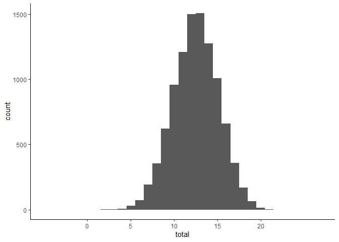

AMMSA – Swedish Validation, Exploratory Analyses
================
2022-10-30

# IRMA Explorations

## Factor Analyses

### Unidimensional Model

``` r
summary(irma_uni_fit,
        standardized = TRUE,
        fit.measures = TRUE)
```

    ## lavaan 0.6-12 ended normally after 33 iterations
    ## 
    ##   Estimator                                         ML
    ##   Optimization method                           NLMINB
    ##   Number of model parameters                        66
    ## 
    ##   Number of observations                           386
    ## 
    ## Model Test User Model:
    ##                                                       
    ##   Test statistic                              1170.167
    ##   Degrees of freedom                               209
    ##   P-value (Chi-square)                           0.000
    ## 
    ## Model Test Baseline Model:
    ## 
    ##   Test statistic                              4815.522
    ##   Degrees of freedom                               231
    ##   P-value                                        0.000
    ## 
    ## User Model versus Baseline Model:
    ## 
    ##   Comparative Fit Index (CFI)                    0.790
    ##   Tucker-Lewis Index (TLI)                       0.768
    ## 
    ## Loglikelihood and Information Criteria:
    ## 
    ##   Loglikelihood user model (H0)              -9325.579
    ##   Loglikelihood unrestricted model (H1)      -8740.496
    ##                                                       
    ##   Akaike (AIC)                               18783.159
    ##   Bayesian (BIC)                             19044.244
    ##   Sample-size adjusted Bayesian (BIC)        18834.833
    ## 
    ## Root Mean Square Error of Approximation:
    ## 
    ##   RMSEA                                          0.109
    ##   90 Percent confidence interval - lower         0.103
    ##   90 Percent confidence interval - upper         0.115
    ##   P-value RMSEA <= 0.05                          0.000
    ## 
    ## Standardized Root Mean Square Residual:
    ## 
    ##   SRMR                                           0.071
    ## 
    ## Parameter Estimates:
    ## 
    ##   Standard errors                            Bootstrap
    ##   Number of requested bootstrap draws             5000
    ##   Number of successful bootstrap draws            5000
    ## 
    ## Latent Variables:
    ##                    Estimate  Std.Err  z-value  P(>|z|)   Std.lv  Std.all
    ##   rma =~                                                                
    ##     irm_01_whldrnk    1.000                               0.594    0.702
    ##     irm_02_slttycl    1.052    0.076   13.751    0.000    0.625    0.638
    ##     irma_03_roomln    0.842    0.069   12.132    0.000    0.500    0.675
    ##     irma_04_actslt    1.137    0.124    9.140    0.000    0.675    0.582
    ##     irma_05_nonclr    1.009    0.088   11.403    0.000    0.599    0.679
    ##     irma_06_grlntt    1.136    0.112   10.171    0.000    0.674    0.612
    ##     irm_07_strngds    0.941    0.108    8.750    0.000    0.559    0.483
    ##     irma_08_crrdwy    1.034    0.112    9.258    0.000    0.614    0.587
    ##     irma_09_sxdrvc    1.036    0.114    9.126    0.000    0.615    0.481
    ##     irm_10_drnknnt    0.887    0.086   10.260    0.000    0.527    0.561
    ##     irm_11_ddntrlz    0.685    0.066   10.378    0.000    0.407    0.639
    ##     irm_12_bthdrnk    0.915    0.069   13.282    0.000    0.544    0.678
    ##     irm_13_physcrs    0.817    0.082    9.937    0.000    0.485    0.630
    ##     irm_14_physfgh    0.898    0.074   12.092    0.000    0.533    0.687
    ##     irm_15_brssmrk    0.752    0.064   11.686    0.000    0.447    0.694
    ##     irma_16_nowepn    0.550    0.066    8.340    0.000    0.327    0.631
    ##     irm_17_dsntsyn    1.146    0.085   13.462    0.000    0.681    0.658
    ##     irma_18_grrgrt    1.250    0.125   10.004    0.000    0.742    0.724
    ##     irm_19_gtbcktg    1.259    0.122   10.309    0.000    0.748    0.743
    ##     irm_20_ldnrgrt    1.331    0.120   11.058    0.000    0.790    0.780
    ##     irm_21_mtnlprb    1.111    0.096   11.544    0.000    0.660    0.712
    ##     irm_22_cghtcht    0.986    0.110    8.959    0.000    0.586    0.620
    ## 
    ## Intercepts:
    ##                    Estimate  Std.Err  z-value  P(>|z|)   Std.lv  Std.all
    ##    .irm_01_whldrnk    1.534    0.043   35.831    0.000    1.534    1.814
    ##    .irm_02_slttycl    1.826    0.050   36.187    0.000    1.826    1.867
    ##    .irma_03_roomln    1.448    0.038   38.176    0.000    1.448    1.957
    ##    .irma_04_actslt    2.681    0.059   45.204    0.000    2.681    2.311
    ##    .irma_05_nonclr    1.658    0.045   37.006    0.000    1.658    1.878
    ##    .irma_06_grlntt    2.290    0.057   40.139    0.000    2.290    2.077
    ##    .irm_07_strngds    2.394    0.059   40.778    0.000    2.394    2.070
    ##    .irma_08_crrdwy    2.490    0.054   46.078    0.000    2.490    2.380
    ##    .irma_09_sxdrvc    2.601    0.065   40.262    0.000    2.601    2.035
    ##    .irm_10_drnknnt    1.702    0.048   35.574    0.000    1.702    1.812
    ##    .irm_11_ddntrlz    1.339    0.032   41.443    0.000    1.339    2.103
    ##    .irm_12_bthdrnk    1.609    0.041   39.347    0.000    1.609    2.007
    ##    .irm_13_physcrs    1.433    0.039   36.447    0.000    1.433    1.861
    ##    .irm_14_physfgh    1.479    0.039   37.802    0.000    1.479    1.907
    ##    .irm_15_brssmrk    1.334    0.032   41.158    0.000    1.334    2.073
    ##    .irma_16_nowepn    1.218    0.026   46.562    0.000    1.218    2.349
    ##    .irm_17_dsntsyn    1.891    0.052   36.376    0.000    1.891    1.827
    ##    .irma_18_grrgrt    2.453    0.052   47.055    0.000    2.453    2.393
    ##    .irm_19_gtbcktg    2.360    0.052   45.459    0.000    2.360    2.345
    ##    .irm_20_ldnrgrt    2.231    0.052   42.803    0.000    2.231    2.201
    ##    .irm_21_mtnlprb    1.878    0.048   39.156    0.000    1.878    2.027
    ##    .irm_22_cghtcht    2.495    0.049   51.405    0.000    2.495    2.641
    ##     rma               0.000                               0.000    0.000
    ## 
    ## Variances:
    ##                    Estimate  Std.Err  z-value  P(>|z|)   Std.lv  Std.all
    ##    .irm_01_whldrnk    0.362    0.038    9.523    0.000    0.362    0.507
    ##    .irm_02_slttycl    0.567    0.054   10.472    0.000    0.567    0.592
    ##    .irma_03_roomln    0.298    0.034    8.690    0.000    0.298    0.544
    ##    .irma_04_actslt    0.891    0.063   14.083    0.000    0.891    0.662
    ##    .irma_05_nonclr    0.420    0.056    7.520    0.000    0.420    0.539
    ##    .irma_06_grlntt    0.761    0.057   13.409    0.000    0.761    0.626
    ##    .irm_07_strngds    1.025    0.074   13.861    0.000    1.025    0.766
    ##    .irma_08_crrdwy    0.718    0.048   14.918    0.000    0.718    0.656
    ##    .irma_09_sxdrvc    1.255    0.086   14.522    0.000    1.255    0.768
    ##    .irm_10_drnknnt    0.605    0.059   10.185    0.000    0.605    0.685
    ##    .irm_11_ddntrlz    0.240    0.044    5.405    0.000    0.240    0.591
    ##    .irm_12_bthdrnk    0.347    0.044    7.825    0.000    0.347    0.540
    ##    .irm_13_physcrs    0.357    0.063    5.635    0.000    0.357    0.603
    ##    .irm_14_physfgh    0.318    0.048    6.641    0.000    0.318    0.528
    ##    .irm_15_brssmrk    0.215    0.026    8.144    0.000    0.215    0.518
    ##    .irma_16_nowepn    0.162    0.023    7.168    0.000    0.162    0.602
    ##    .irm_17_dsntsyn    0.608    0.063    9.579    0.000    0.608    0.567
    ##    .irma_18_grrgrt    0.500    0.051    9.708    0.000    0.500    0.475
    ##    .irm_19_gtbcktg    0.454    0.043   10.543    0.000    0.454    0.448
    ##    .irm_20_ldnrgrt    0.402    0.043    9.350    0.000    0.402    0.392
    ##    .irm_21_mtnlprb    0.423    0.039   10.902    0.000    0.423    0.493
    ##    .irm_22_cghtcht    0.549    0.039   13.923    0.000    0.549    0.615
    ##     rma               0.353    0.056    6.312    0.000    1.000    1.000

``` r
semPlot::semPaths(irma_uni_fit, 
                    what = "paths",
                    whatLabels = "std",
                    intercepts = FALSE,
                    residuals = FALSE,
                    curvePivot = TRUE,
                    layout = "circle",
                    sizeLat = 4,
                    sizeMan = 3,
                    groups = "latents",
                    nodeLabels = c(1:22, "RMA"))
```

<!-- -->

### Four-Factor Model

``` r
summary(irma_4_fit,
        standardized = TRUE,
        fit.measures = TRUE)
```

    ## lavaan 0.6-12 ended normally after 63 iterations
    ## 
    ##   Estimator                                         ML
    ##   Optimization method                           NLMINB
    ##   Number of model parameters                        72
    ## 
    ##   Number of observations                           386
    ## 
    ## Model Test User Model:
    ##                                                       
    ##   Test statistic                               721.857
    ##   Degrees of freedom                               203
    ##   P-value (Chi-square)                           0.000
    ## 
    ## Model Test Baseline Model:
    ## 
    ##   Test statistic                              4815.522
    ##   Degrees of freedom                               231
    ##   P-value                                        0.000
    ## 
    ## User Model versus Baseline Model:
    ## 
    ##   Comparative Fit Index (CFI)                    0.887
    ##   Tucker-Lewis Index (TLI)                       0.871
    ## 
    ## Loglikelihood and Information Criteria:
    ## 
    ##   Loglikelihood user model (H0)              -9101.424
    ##   Loglikelihood unrestricted model (H1)      -8740.496
    ##                                                       
    ##   Akaike (AIC)                               18346.848
    ##   Bayesian (BIC)                             18631.669
    ##   Sample-size adjusted Bayesian (BIC)        18403.221
    ## 
    ## Root Mean Square Error of Approximation:
    ## 
    ##   RMSEA                                          0.081
    ##   90 Percent confidence interval - lower         0.075
    ##   90 Percent confidence interval - upper         0.088
    ##   P-value RMSEA <= 0.05                          0.000
    ## 
    ## Standardized Root Mean Square Residual:
    ## 
    ##   SRMR                                           0.060
    ## 
    ## Parameter Estimates:
    ## 
    ##   Standard errors                            Bootstrap
    ##   Number of requested bootstrap draws             5000
    ##   Number of successful bootstrap draws            5000
    ## 
    ## Latent Variables:
    ##                    Estimate  Std.Err  z-value  P(>|z|)   Std.lv  Std.all
    ##   afi =~                                                                
    ##     irm_01_whldrnk    1.000                               0.617    0.730
    ##     irm_02_slttycl    1.040    0.078   13.325    0.000    0.642    0.656
    ##     irma_03_roomln    0.849    0.070   12.047    0.000    0.524    0.707
    ##     irma_04_actslt    1.077    0.117    9.198    0.000    0.665    0.573
    ##     irma_05_nonclr    0.968    0.088   10.958    0.000    0.597    0.676
    ##     irma_06_grlntt    1.079    0.104   10.407    0.000    0.666    0.604
    ##   dmt =~                                                                
    ##     irm_07_strngds    1.000                               0.563    0.487
    ##     irma_08_crrdwy    1.082    0.109    9.921    0.000    0.610    0.583
    ##     irma_09_sxdrvc    1.125    0.094   11.988    0.000    0.634    0.496
    ##     irm_10_drnknnt    0.992    0.130    7.626    0.000    0.559    0.595
    ##     irm_11_ddntrlz    0.759    0.119    6.400    0.000    0.428    0.672
    ##     irm_12_bthdrnk    1.015    0.141    7.214    0.000    0.572    0.714
    ##   nr =~                                                                 
    ##     irm_13_physcrs    1.000                               0.545    0.708
    ##     irm_14_physfgh    1.103    0.094   11.722    0.000    0.601    0.775
    ##     irm_15_brssmrk    0.935    0.085   11.030    0.000    0.510    0.792
    ##     irma_16_nowepn    0.716    0.067   10.699    0.000    0.390    0.753
    ##     irm_17_dsntsyn    1.221    0.132    9.242    0.000    0.666    0.643
    ##   sl =~                                                                 
    ##     irma_18_grrgrt    1.000                               0.851    0.830
    ##     irm_19_gtbcktg    0.997    0.049   20.269    0.000    0.848    0.843
    ##     irm_20_ldnrgrt    1.044    0.043   24.256    0.000    0.888    0.876
    ##     irm_21_mtnlprb    0.829    0.049   16.841    0.000    0.705    0.761
    ##     irm_22_cghtcht    0.781    0.051   15.436    0.000    0.665    0.703
    ## 
    ## Covariances:
    ##                    Estimate  Std.Err  z-value  P(>|z|)   Std.lv  Std.all
    ##   afi ~~                                                                
    ##     dmt               0.340    0.043    7.852    0.000    0.979    0.979
    ##     nr                0.304    0.045    6.818    0.000    0.904    0.904
    ##     sl                0.428    0.044    9.710    0.000    0.816    0.816
    ##   dmt ~~                                                                
    ##     nr                0.270    0.037    7.324    0.000    0.878    0.878
    ##     sl                0.380    0.051    7.419    0.000    0.793    0.793
    ##   nr ~~                                                                 
    ##     sl                0.304    0.039    7.778    0.000    0.654    0.654
    ## 
    ## Intercepts:
    ##                    Estimate  Std.Err  z-value  P(>|z|)   Std.lv  Std.all
    ##    .irm_01_whldrnk    1.534    0.043   35.661    0.000    1.534    1.814
    ##    .irm_02_slttycl    1.826    0.049   36.965    0.000    1.826    1.867
    ##    .irma_03_roomln    1.448    0.037   39.039    0.000    1.448    1.957
    ##    .irma_04_actslt    2.681    0.058   45.917    0.000    2.681    2.311
    ##    .irma_05_nonclr    1.658    0.044   37.430    0.000    1.658    1.878
    ##    .irma_06_grlntt    2.290    0.056   40.833    0.000    2.290    2.077
    ##    .irm_07_strngds    2.394    0.059   40.552    0.000    2.394    2.070
    ##    .irma_08_crrdwy    2.490    0.052   47.470    0.000    2.490    2.380
    ##    .irma_09_sxdrvc    2.601    0.065   39.967    0.000    2.601    2.035
    ##    .irm_10_drnknnt    1.702    0.048   35.724    0.000    1.702    1.812
    ##    .irm_11_ddntrlz    1.339    0.032   41.418    0.000    1.339    2.103
    ##    .irm_12_bthdrnk    1.609    0.041   39.452    0.000    1.609    2.007
    ##    .irm_13_physcrs    1.433    0.039   36.646    0.000    1.433    1.861
    ##    .irm_14_physfgh    1.479    0.039   37.965    0.000    1.479    1.907
    ##    .irm_15_brssmrk    1.334    0.032   41.426    0.000    1.334    2.073
    ##    .irma_16_nowepn    1.218    0.026   46.383    0.000    1.218    2.349
    ##    .irm_17_dsntsyn    1.891    0.052   36.542    0.000    1.891    1.827
    ##    .irma_18_grrgrt    2.453    0.051   47.944    0.000    2.453    2.393
    ##    .irm_19_gtbcktg    2.360    0.051   46.403    0.000    2.360    2.345
    ##    .irm_20_ldnrgrt    2.231    0.050   44.427    0.000    2.231    2.201
    ##    .irm_21_mtnlprb    1.878    0.046   40.704    0.000    1.878    2.027
    ##    .irm_22_cghtcht    2.495    0.048   51.810    0.000    2.495    2.641
    ##     afi               0.000                               0.000    0.000
    ##     dmt               0.000                               0.000    0.000
    ##     nr                0.000                               0.000    0.000
    ##     sl                0.000                               0.000    0.000
    ## 
    ## Variances:
    ##                    Estimate  Std.Err  z-value  P(>|z|)   Std.lv  Std.all
    ##    .irm_01_whldrnk    0.335    0.037    8.971    0.000    0.335    0.468
    ##    .irm_02_slttycl    0.545    0.055    9.905    0.000    0.545    0.570
    ##    .irma_03_roomln    0.274    0.033    8.409    0.000    0.274    0.500
    ##    .irma_04_actslt    0.905    0.067   13.410    0.000    0.905    0.672
    ##    .irma_05_nonclr    0.423    0.058    7.242    0.000    0.423    0.543
    ##    .irma_06_grlntt    0.773    0.060   12.988    0.000    0.773    0.635
    ##    .irm_07_strngds    1.020    0.079   12.936    0.000    1.020    0.763
    ##    .irma_08_crrdwy    0.723    0.053   13.588    0.000    0.723    0.660
    ##    .irma_09_sxdrvc    1.232    0.096   12.820    0.000    1.232    0.754
    ##    .irm_10_drnknnt    0.570    0.060    9.478    0.000    0.570    0.646
    ##    .irm_11_ddntrlz    0.223    0.047    4.730    0.000    0.223    0.549
    ##    .irm_12_bthdrnk    0.315    0.039    8.142    0.000    0.315    0.491
    ##    .irm_13_physcrs    0.295    0.068    4.365    0.000    0.295    0.498
    ##    .irm_14_physfgh    0.240    0.048    4.995    0.000    0.240    0.399
    ##    .irm_15_brssmrk    0.154    0.027    5.651    0.000    0.154    0.372
    ##    .irma_16_nowepn    0.116    0.020    5.689    0.000    0.116    0.433
    ##    .irm_17_dsntsyn    0.628    0.075    8.419    0.000    0.628    0.586
    ##    .irma_18_grrgrt    0.327    0.038    8.674    0.000    0.327    0.311
    ##    .irm_19_gtbcktg    0.294    0.036    8.204    0.000    0.294    0.290
    ##    .irm_20_ldnrgrt    0.238    0.032    7.333    0.000    0.238    0.232
    ##    .irm_21_mtnlprb    0.361    0.035   10.351    0.000    0.361    0.421
    ##    .irm_22_cghtcht    0.451    0.041   10.878    0.000    0.451    0.505
    ##     afi               0.381    0.058    6.572    0.000    1.000    1.000
    ##     dmt               0.317    0.065    4.919    0.000    1.000    1.000
    ##     nr                0.297    0.055    5.408    0.000    1.000    1.000
    ##     sl                0.724    0.062   11.633    0.000    1.000    1.000

``` r
semPlot::semPaths(irma_4_fit, 
                    what = "paths",
                    whatLabels = "std",
                    intercepts = FALSE,
                    residuals = FALSE,
                    curvePivot = TRUE,
                    layout = "tree2",
                    sizeLat = 4,
                    sizeMan = 3,
                    groups = "latents",
                    nodeLabels = c(1:22, "AFI", "DMT", "NR", "SL"))
```

<!-- -->

### Bifactor Model

``` r
summary(irma_bi_fit,
        standardized = TRUE,
        fit.measures = TRUE)
```

    ## lavaan 0.6-12 ended normally after 46 iterations
    ## 
    ##   Estimator                                         ML
    ##   Optimization method                           NLMINB
    ##   Number of model parameters                        88
    ## 
    ##   Number of observations                           386
    ## 
    ## Model Test User Model:
    ##                                                       
    ##   Test statistic                               473.154
    ##   Degrees of freedom                               187
    ##   P-value (Chi-square)                           0.000
    ## 
    ## Model Test Baseline Model:
    ## 
    ##   Test statistic                              4815.522
    ##   Degrees of freedom                               231
    ##   P-value                                        0.000
    ## 
    ## User Model versus Baseline Model:
    ## 
    ##   Comparative Fit Index (CFI)                    0.938
    ##   Tucker-Lewis Index (TLI)                       0.923
    ## 
    ## Loglikelihood and Information Criteria:
    ## 
    ##   Loglikelihood user model (H0)              -8977.073
    ##   Loglikelihood unrestricted model (H1)      -8740.496
    ##                                                       
    ##   Akaike (AIC)                               18130.145
    ##   Bayesian (BIC)                             18478.259
    ##   Sample-size adjusted Bayesian (BIC)        18199.045
    ## 
    ## Root Mean Square Error of Approximation:
    ## 
    ##   RMSEA                                          0.063
    ##   90 Percent confidence interval - lower         0.056
    ##   90 Percent confidence interval - upper         0.070
    ##   P-value RMSEA <= 0.05                          0.001
    ## 
    ## Standardized Root Mean Square Residual:
    ## 
    ##   SRMR                                           0.049
    ## 
    ## Parameter Estimates:
    ## 
    ##   Standard errors                            Bootstrap
    ##   Number of requested bootstrap draws             5000
    ##   Number of successful bootstrap draws            4934
    ## 
    ## Latent Variables:
    ##                    Estimate  Std.Err  z-value  P(>|z|)   Std.lv  Std.all
    ##   rma =~                                                                
    ##     irm_01_whldrnk    0.613    0.047   13.006    0.000    0.613    0.725
    ##     irm_02_slttycl    0.625    0.043   14.648    0.000    0.625    0.639
    ##     irma_03_roomln    0.514    0.047   10.908    0.000    0.514    0.695
    ##     irma_04_actslt    0.628    0.054   11.666    0.000    0.628    0.541
    ##     irma_05_nonclr    0.626    0.045   13.876    0.000    0.626    0.709
    ##     irma_06_grlntt    0.654    0.048   13.769    0.000    0.654    0.593
    ##     irm_07_strngds    0.530    0.054    9.865    0.000    0.530    0.459
    ##     irma_08_crrdwy    0.598    0.046   13.095    0.000    0.598    0.571
    ##     irma_09_sxdrvc    0.591    0.058   10.247    0.000    0.591    0.463
    ##     irm_10_drnknnt    0.548    0.048   11.368    0.000    0.548    0.584
    ##     irm_11_ddntrlz    0.432    0.042   10.309    0.000    0.432    0.679
    ##     irm_12_bthdrnk    0.574    0.041   13.980    0.000    0.574    0.716
    ##     irm_13_physcrs    0.485    0.051    9.444    0.000    0.485    0.631
    ##     irm_14_physfgh    0.542    0.044   12.303    0.000    0.542    0.698
    ##     irm_15_brssmrk    0.454    0.047    9.744    0.000    0.454    0.705
    ##     irma_16_nowepn    0.336    0.047    7.220    0.000    0.336    0.649
    ##     irm_17_dsntsyn    0.688    0.044   15.773    0.000    0.688    0.665
    ##     irma_18_grrgrt    0.651    0.045   14.322    0.000    0.651    0.635
    ##     irm_19_gtbcktg    0.662    0.041   16.159    0.000    0.662    0.658
    ##     irm_20_ldnrgrt    0.713    0.043   16.450    0.000    0.713    0.704
    ##     irm_21_mtnlprb    0.595    0.041   14.511    0.000    0.595    0.643
    ##     irm_22_cghtcht    0.503    0.040   12.431    0.000    0.503    0.532
    ##   afi =~                                                                
    ##     irm_01_whldrnk    0.056    0.059    0.955    0.340    0.056    0.067
    ##     irm_02_slttycl    0.584    4.787    0.122    0.903    0.584    0.597
    ##     irma_03_roomln    0.121    0.061    1.974    0.048    0.121    0.164
    ##     irma_04_actslt    0.463    2.958    0.156    0.876    0.463    0.399
    ##     irma_05_nonclr   -0.177    0.221   -0.800    0.424   -0.177   -0.200
    ##     irma_06_grlntt    0.083    0.090    0.915    0.360    0.083    0.075
    ##   dmt =~                                                                
    ##     irm_07_strngds    0.814    0.888    0.917    0.359    0.814    0.704
    ##     irma_08_crrdwy    0.248    0.064    3.846    0.000    0.248    0.237
    ##     irma_09_sxdrvc    0.701    0.946    0.740    0.459    0.701    0.548
    ##     irm_10_drnknnt    0.022    0.063    0.344    0.731    0.022    0.023
    ##     irm_11_ddntrlz   -0.097    0.034   -2.828    0.005   -0.097   -0.153
    ##     irm_12_bthdrnk   -0.072    0.051   -1.416    0.157   -0.072   -0.089
    ##   nr =~                                                                 
    ##     irm_13_physcrs    0.259    0.054    4.777    0.000    0.259    0.337
    ##     irm_14_physfgh    0.218    0.132    1.655    0.098    0.218    0.281
    ##     irm_15_brssmrk    0.266    0.145    1.838    0.066    0.266    0.413
    ##     irma_16_nowepn    0.234    0.129    1.820    0.069    0.234    0.452
    ##     irm_17_dsntsyn    0.002    0.081    0.028    0.978    0.002    0.002
    ##   sl =~                                                                 
    ##     irma_18_grrgrt    0.562    0.049   11.572    0.000    0.562    0.548
    ##     irm_19_gtbcktg    0.532    0.051   10.421    0.000    0.532    0.528
    ##     irm_20_ldnrgrt    0.521    0.052   10.066    0.000    0.521    0.514
    ##     irm_21_mtnlprb    0.374    0.052    7.212    0.000    0.374    0.404
    ##     irm_22_cghtcht    0.444    0.049    9.050    0.000    0.444    0.470
    ## 
    ## Covariances:
    ##                    Estimate  Std.Err  z-value  P(>|z|)   Std.lv  Std.all
    ##   rma ~~                                                                
    ##     afi               0.000                               0.000    0.000
    ##     dmt               0.000                               0.000    0.000
    ##     nr                0.000                               0.000    0.000
    ##     sl                0.000                               0.000    0.000
    ##   afi ~~                                                                
    ##     dmt               0.000                               0.000    0.000
    ##     nr                0.000                               0.000    0.000
    ##     sl                0.000                               0.000    0.000
    ##   dmt ~~                                                                
    ##     nr                0.000                               0.000    0.000
    ##     sl                0.000                               0.000    0.000
    ##   nr ~~                                                                 
    ##     sl                0.000                               0.000    0.000
    ## 
    ## Intercepts:
    ##                    Estimate  Std.Err  z-value  P(>|z|)   Std.lv  Std.all
    ##    .irm_01_whldrnk    1.534    0.043   35.827    0.000    1.534    1.814
    ##    .irm_02_slttycl    1.826    0.050   36.406    0.000    1.826    1.867
    ##    .irma_03_roomln    1.448    0.038   38.504    0.000    1.448    1.957
    ##    .irma_04_actslt    2.681    0.058   46.068    0.000    2.681    2.311
    ##    .irma_05_nonclr    1.658    0.045   36.641    0.000    1.658    1.878
    ##    .irma_06_grlntt    2.290    0.056   40.934    0.000    2.290    2.077
    ##    .irm_07_strngds    2.394    0.059   40.717    0.000    2.394    2.070
    ##    .irma_08_crrdwy    2.490    0.053   46.905    0.000    2.490    2.380
    ##    .irma_09_sxdrvc    2.601    0.065   40.103    0.000    2.601    2.035
    ##    .irm_10_drnknnt    1.702    0.047   36.289    0.000    1.702    1.812
    ##    .irm_11_ddntrlz    1.339    0.033   41.092    0.000    1.339    2.103
    ##    .irm_12_bthdrnk    1.609    0.041   39.581    0.000    1.609    2.007
    ##    .irm_13_physcrs    1.433    0.039   36.763    0.000    1.433    1.861
    ##    .irm_14_physfgh    1.479    0.039   38.050    0.000    1.479    1.907
    ##    .irm_15_brssmrk    1.334    0.032   41.428    0.000    1.334    2.073
    ##    .irma_16_nowepn    1.218    0.026   46.281    0.000    1.218    2.349
    ##    .irm_17_dsntsyn    1.891    0.053   35.858    0.000    1.891    1.827
    ##    .irma_18_grrgrt    2.453    0.052   47.394    0.000    2.453    2.393
    ##    .irm_19_gtbcktg    2.360    0.051   46.190    0.000    2.360    2.345
    ##    .irm_20_ldnrgrt    2.231    0.052   42.932    0.000    2.231    2.201
    ##    .irm_21_mtnlprb    1.878    0.048   39.454    0.000    1.878    2.027
    ##    .irm_22_cghtcht    2.495    0.048   51.829    0.000    2.495    2.641
    ##     rma               0.000                               0.000    0.000
    ##     afi               0.000                               0.000    0.000
    ##     dmt               0.000                               0.000    0.000
    ##     nr                0.000                               0.000    0.000
    ##     sl                0.000                               0.000    0.000
    ## 
    ## Variances:
    ##                    Estimate  Std.Err  z-value  P(>|z|)   Std.lv  Std.all
    ##    .irm_01_whldrnk    0.336    0.037    9.037    0.000    0.336    0.470
    ##    .irm_02_slttycl    0.226  120.481    0.002    0.999    0.226    0.236
    ##    .irma_03_roomln    0.269    0.031    8.768    0.000    0.269    0.490
    ##    .irma_04_actslt    0.738   95.711    0.008    0.994    0.738    0.548
    ##    .irma_05_nonclr    0.356    3.080    0.116    0.908    0.356    0.457
    ##    .irma_06_grlntt    0.782    0.061   12.785    0.000    0.782    0.643
    ##    .irm_07_strngds    0.393   27.701    0.014    0.989    0.393    0.294
    ##    .irma_08_crrdwy    0.676    0.053   12.803    0.000    0.676    0.617
    ##    .irma_09_sxdrvc    0.793   37.319    0.021    0.983    0.793    0.486
    ##    .irm_10_drnknnt    0.582    0.061    9.585    0.000    0.582    0.659
    ##    .irm_11_ddntrlz    0.209    0.041    5.093    0.000    0.209    0.516
    ##    .irm_12_bthdrnk    0.308    0.047    6.564    0.000    0.308    0.479
    ##    .irm_13_physcrs    0.290    0.068    4.270    0.000    0.290    0.489
    ##    .irm_14_physfgh    0.261    0.897    0.291    0.771    0.261    0.434
    ##    .irm_15_brssmrk    0.138    1.328    0.104    0.918    0.138    0.332
    ##    .irma_16_nowepn    0.101    0.795    0.127    0.899    0.101    0.375
    ##    .irm_17_dsntsyn    0.597    0.066    9.079    0.000    0.597    0.558
    ##    .irma_18_grrgrt    0.312    0.040    7.799    0.000    0.312    0.297
    ##    .irm_19_gtbcktg    0.292    0.043    6.823    0.000    0.292    0.288
    ##    .irm_20_ldnrgrt    0.247    0.036    6.840    0.000    0.247    0.241
    ##    .irm_21_mtnlprb    0.364    0.033   10.864    0.000    0.364    0.424
    ##    .irm_22_cghtcht    0.443    0.045    9.879    0.000    0.443    0.496
    ##     rma               1.000                               1.000    1.000
    ##     afi               1.000                               1.000    1.000
    ##     dmt               1.000                               1.000    1.000
    ##     nr                1.000                               1.000    1.000
    ##     sl                1.000                               1.000    1.000

``` r
semPlot::semPaths(irma_bi_fit, 
                    what = "paths",
                    whatLabels = "std",
                    intercepts = FALSE,
                    residuals = FALSE,
                    curvePivot = TRUE,
                    exoCov = FALSE,
                    layout = "tree2",
                    sizeLat = 4,
                    sizeMan = 3,
                    groups = "latents",
                    bifactor = "rma",
                    nodeLabels = c(1:22, "RMA", "AFI", "DMT", "NR", "SL"))
```

<!-- -->

## Network Model

``` r
network_pars_irma
```

    ##                     var1 var1_id  op                 var2 var2_id         est
    ## 1     irma_01_whiledrunk       1  ~1                 <NA>      NA  1.54228123
    ## 2    irma_02_sluttycloth       2  ~1                 <NA>      NA  1.82982095
    ## 3      irma_03_roomalone       3  ~1                 <NA>      NA  1.45312611
    ## 4        irma_04_actslut       4  ~1                 <NA>      NA  2.68685170
    ## 5      irma_05_nounclear       5  ~1                 <NA>      NA  1.67305689
    ## 6   irma_06_girlinitiate       6  ~1                 <NA>      NA  2.28423217
    ## 7   irma_07_strongdesire       7  ~1                 <NA>      NA  2.40155182
    ## 8    irma_08_carriedaway       8  ~1                 <NA>      NA  2.49146290
    ## 9    irma_09_sexdriveooc       9  ~1                 <NA>      NA  2.60543531
    ## 10    irma_10_drunkunint      10  ~1                 <NA>      NA  1.70510680
    ## 11  irma_11_didntrealize      11  ~1                 <NA>      NA  1.34948120
    ## 12     irma_12_bothdrunk      12  ~1                 <NA>      NA  1.61613285
    ## 13  irma_13_physicresist      13  ~1                 <NA>      NA  1.43609566
    ## 14  irma_14_physfightbck      14  ~1                 <NA>      NA  1.48609139
    ## 15  irma_15_bruisesmarks      15  ~1                 <NA>      NA  1.34271252
    ## 16      irma_16_noweapon      16  ~1                 <NA>      NA  1.22311362
    ## 17   irma_17_deosntsayno      17  ~1                 <NA>      NA  1.89955926
    ## 18   irma_18_agreeregret      18  ~1                 <NA>      NA  2.48092260
    ## 19  irma_19_getbckatguys      19  ~1                 <NA>      NA  2.39180579
    ## 20  irma_20_ledonregrets      20  ~1                 <NA>      NA  2.25587017
    ## 21  irma_21_emotionalprb      21  ~1                 <NA>      NA  1.89641382
    ## 22   irma_22_caughtcheat      22  ~1                 <NA>      NA  2.51647483
    ## 23   irma_02_sluttycloth       2  --   irma_01_whiledrunk       1  0.00000000
    ## 24     irma_03_roomalone       3  --   irma_01_whiledrunk       1  0.23839439
    ## 25       irma_04_actslut       4  --   irma_01_whiledrunk       1  0.00000000
    ## 26     irma_05_nounclear       5  --   irma_01_whiledrunk       1  0.00000000
    ## 27  irma_06_girlinitiate       6  --   irma_01_whiledrunk       1  0.00000000
    ## 28  irma_07_strongdesire       7  --   irma_01_whiledrunk       1  0.00000000
    ## 29   irma_08_carriedaway       8  --   irma_01_whiledrunk       1  0.00000000
    ## 30   irma_09_sexdriveooc       9  --   irma_01_whiledrunk       1  0.08551632
    ## 31    irma_10_drunkunint      10  --   irma_01_whiledrunk       1  0.00000000
    ## 32  irma_11_didntrealize      11  --   irma_01_whiledrunk       1  0.00000000
    ## 33     irma_12_bothdrunk      12  --   irma_01_whiledrunk       1  0.25652850
    ## 34  irma_13_physicresist      13  --   irma_01_whiledrunk       1  0.00000000
    ## 35  irma_14_physfightbck      14  --   irma_01_whiledrunk       1  0.18866892
    ## 36  irma_15_bruisesmarks      15  --   irma_01_whiledrunk       1  0.00000000
    ## 37      irma_16_noweapon      16  --   irma_01_whiledrunk       1  0.15428488
    ## 38   irma_17_deosntsayno      17  --   irma_01_whiledrunk       1  0.00000000
    ## 39   irma_18_agreeregret      18  --   irma_01_whiledrunk       1 -0.09710769
    ## 40  irma_19_getbckatguys      19  --   irma_01_whiledrunk       1  0.00000000
    ## 41  irma_20_ledonregrets      20  --   irma_01_whiledrunk       1  0.23594152
    ## 42  irma_21_emotionalprb      21  --   irma_01_whiledrunk       1  0.00000000
    ## 43   irma_22_caughtcheat      22  --   irma_01_whiledrunk       1  0.00000000
    ## 44     irma_03_roomalone       3  --  irma_02_sluttycloth       2  0.29134514
    ## 45       irma_04_actslut       4  --  irma_02_sluttycloth       2  0.39282961
    ## 46     irma_05_nounclear       5  --  irma_02_sluttycloth       2  0.00000000
    ## 47  irma_06_girlinitiate       6  --  irma_02_sluttycloth       2  0.00000000
    ## 48  irma_07_strongdesire       7  --  irma_02_sluttycloth       2  0.00000000
    ## 49   irma_08_carriedaway       8  --  irma_02_sluttycloth       2  0.00000000
    ## 50   irma_09_sexdriveooc       9  --  irma_02_sluttycloth       2  0.00000000
    ## 51    irma_10_drunkunint      10  --  irma_02_sluttycloth       2  0.00000000
    ## 52  irma_11_didntrealize      11  --  irma_02_sluttycloth       2  0.12416203
    ## 53     irma_12_bothdrunk      12  --  irma_02_sluttycloth       2  0.00000000
    ## 54  irma_13_physicresist      13  --  irma_02_sluttycloth       2  0.00000000
    ## 55  irma_14_physfightbck      14  --  irma_02_sluttycloth       2  0.00000000
    ## 56  irma_15_bruisesmarks      15  --  irma_02_sluttycloth       2  0.00000000
    ## 57      irma_16_noweapon      16  --  irma_02_sluttycloth       2  0.00000000
    ## 58   irma_17_deosntsayno      17  --  irma_02_sluttycloth       2  0.15748762
    ## 59   irma_18_agreeregret      18  --  irma_02_sluttycloth       2  0.00000000
    ## 60  irma_19_getbckatguys      19  --  irma_02_sluttycloth       2  0.00000000
    ## 61  irma_20_ledonregrets      20  --  irma_02_sluttycloth       2  0.00000000
    ## 62  irma_21_emotionalprb      21  --  irma_02_sluttycloth       2  0.00000000
    ## 63   irma_22_caughtcheat      22  --  irma_02_sluttycloth       2  0.00000000
    ## 64       irma_04_actslut       4  --    irma_03_roomalone       3  0.00000000
    ## 65     irma_05_nounclear       5  --    irma_03_roomalone       3  0.00000000
    ## 66  irma_06_girlinitiate       6  --    irma_03_roomalone       3  0.00000000
    ## 67  irma_07_strongdesire       7  --    irma_03_roomalone       3  0.00000000
    ## 68   irma_08_carriedaway       8  --    irma_03_roomalone       3  0.00000000
    ## 69   irma_09_sexdriveooc       9  --    irma_03_roomalone       3  0.00000000
    ## 70    irma_10_drunkunint      10  --    irma_03_roomalone       3  0.00000000
    ## 71  irma_11_didntrealize      11  --    irma_03_roomalone       3  0.00000000
    ## 72     irma_12_bothdrunk      12  --    irma_03_roomalone       3  0.00000000
    ## 73  irma_13_physicresist      13  --    irma_03_roomalone       3  0.00000000
    ## 74  irma_14_physfightbck      14  --    irma_03_roomalone       3  0.00000000
    ## 75  irma_15_bruisesmarks      15  --    irma_03_roomalone       3  0.14548157
    ## 76      irma_16_noweapon      16  --    irma_03_roomalone       3  0.18048579
    ## 77   irma_17_deosntsayno      17  --    irma_03_roomalone       3  0.00000000
    ## 78   irma_18_agreeregret      18  --    irma_03_roomalone       3  0.00000000
    ## 79  irma_19_getbckatguys      19  --    irma_03_roomalone       3  0.00000000
    ## 80  irma_20_ledonregrets      20  --    irma_03_roomalone       3  0.00000000
    ## 81  irma_21_emotionalprb      21  --    irma_03_roomalone       3  0.00000000
    ## 82   irma_22_caughtcheat      22  --    irma_03_roomalone       3  0.00000000
    ## 83     irma_05_nounclear       5  --      irma_04_actslut       4  0.00000000
    ## 84  irma_06_girlinitiate       6  --      irma_04_actslut       4  0.18274475
    ## 85  irma_07_strongdesire       7  --      irma_04_actslut       4  0.00000000
    ## 86   irma_08_carriedaway       8  --      irma_04_actslut       4  0.00000000
    ## 87   irma_09_sexdriveooc       9  --      irma_04_actslut       4  0.11822865
    ## 88    irma_10_drunkunint      10  --      irma_04_actslut       4  0.00000000
    ## 89  irma_11_didntrealize      11  --      irma_04_actslut       4  0.00000000
    ## 90     irma_12_bothdrunk      12  --      irma_04_actslut       4  0.00000000
    ## 91  irma_13_physicresist      13  --      irma_04_actslut       4  0.00000000
    ## 92  irma_14_physfightbck      14  --      irma_04_actslut       4  0.00000000
    ## 93  irma_15_bruisesmarks      15  --      irma_04_actslut       4  0.00000000
    ## 94      irma_16_noweapon      16  --      irma_04_actslut       4  0.00000000
    ## 95   irma_17_deosntsayno      17  --      irma_04_actslut       4  0.00000000
    ## 96   irma_18_agreeregret      18  --      irma_04_actslut       4  0.00000000
    ## 97  irma_19_getbckatguys      19  --      irma_04_actslut       4  0.00000000
    ## 98  irma_20_ledonregrets      20  --      irma_04_actslut       4  0.00000000
    ## 99  irma_21_emotionalprb      21  --      irma_04_actslut       4  0.00000000
    ## 100  irma_22_caughtcheat      22  --      irma_04_actslut       4  0.24278080
    ## 101 irma_06_girlinitiate       6  --    irma_05_nounclear       5  0.00000000
    ## 102 irma_07_strongdesire       7  --    irma_05_nounclear       5  0.00000000
    ## 103  irma_08_carriedaway       8  --    irma_05_nounclear       5  0.14629283
    ## 104  irma_09_sexdriveooc       9  --    irma_05_nounclear       5  0.00000000
    ## 105   irma_10_drunkunint      10  --    irma_05_nounclear       5  0.00000000
    ## 106 irma_11_didntrealize      11  --    irma_05_nounclear       5  0.00000000
    ## 107    irma_12_bothdrunk      12  --    irma_05_nounclear       5  0.19261914
    ## 108 irma_13_physicresist      13  --    irma_05_nounclear       5  0.11259890
    ## 109 irma_14_physfightbck      14  --    irma_05_nounclear       5  0.00000000
    ## 110 irma_15_bruisesmarks      15  --    irma_05_nounclear       5  0.13087924
    ## 111     irma_16_noweapon      16  --    irma_05_nounclear       5  0.00000000
    ## 112  irma_17_deosntsayno      17  --    irma_05_nounclear       5  0.23860573
    ## 113  irma_18_agreeregret      18  --    irma_05_nounclear       5  0.12737103
    ## 114 irma_19_getbckatguys      19  --    irma_05_nounclear       5  0.10578787
    ## 115 irma_20_ledonregrets      20  --    irma_05_nounclear       5  0.00000000
    ## 116 irma_21_emotionalprb      21  --    irma_05_nounclear       5  0.00000000
    ## 117  irma_22_caughtcheat      22  --    irma_05_nounclear       5  0.00000000
    ## 118 irma_07_strongdesire       7  -- irma_06_girlinitiate       6  0.00000000
    ## 119  irma_08_carriedaway       8  -- irma_06_girlinitiate       6  0.24900922
    ## 120  irma_09_sexdriveooc       9  -- irma_06_girlinitiate       6  0.00000000
    ## 121   irma_10_drunkunint      10  -- irma_06_girlinitiate       6  0.18776431
    ## 122 irma_11_didntrealize      11  -- irma_06_girlinitiate       6  0.00000000
    ## 123    irma_12_bothdrunk      12  -- irma_06_girlinitiate       6  0.00000000
    ## 124 irma_13_physicresist      13  -- irma_06_girlinitiate       6  0.07923039
    ## 125 irma_14_physfightbck      14  -- irma_06_girlinitiate       6  0.00000000
    ## 126 irma_15_bruisesmarks      15  -- irma_06_girlinitiate       6  0.00000000
    ## 127     irma_16_noweapon      16  -- irma_06_girlinitiate       6  0.00000000
    ## 128  irma_17_deosntsayno      17  -- irma_06_girlinitiate       6  0.21133460
    ## 129  irma_18_agreeregret      18  -- irma_06_girlinitiate       6  0.00000000
    ## 130 irma_19_getbckatguys      19  -- irma_06_girlinitiate       6  0.00000000
    ## 131 irma_20_ledonregrets      20  -- irma_06_girlinitiate       6  0.00000000
    ## 132 irma_21_emotionalprb      21  -- irma_06_girlinitiate       6  0.00000000
    ## 133  irma_22_caughtcheat      22  -- irma_06_girlinitiate       6  0.00000000
    ## 134  irma_08_carriedaway       8  -- irma_07_strongdesire       7  0.20223282
    ## 135  irma_09_sexdriveooc       9  -- irma_07_strongdesire       7  0.49184481
    ## 136   irma_10_drunkunint      10  -- irma_07_strongdesire       7  0.00000000
    ## 137 irma_11_didntrealize      11  -- irma_07_strongdesire       7  0.00000000
    ## 138    irma_12_bothdrunk      12  -- irma_07_strongdesire       7  0.00000000
    ## 139 irma_13_physicresist      13  -- irma_07_strongdesire       7  0.00000000
    ## 140 irma_14_physfightbck      14  -- irma_07_strongdesire       7  0.00000000
    ## 141 irma_15_bruisesmarks      15  -- irma_07_strongdesire       7  0.00000000
    ## 142     irma_16_noweapon      16  -- irma_07_strongdesire       7  0.00000000
    ## 143  irma_17_deosntsayno      17  -- irma_07_strongdesire       7  0.00000000
    ## 144  irma_18_agreeregret      18  -- irma_07_strongdesire       7  0.13703141
    ## 145 irma_19_getbckatguys      19  -- irma_07_strongdesire       7  0.00000000
    ## 146 irma_20_ledonregrets      20  -- irma_07_strongdesire       7  0.00000000
    ## 147 irma_21_emotionalprb      21  -- irma_07_strongdesire       7  0.00000000
    ## 148  irma_22_caughtcheat      22  -- irma_07_strongdesire       7  0.00000000
    ## 149  irma_09_sexdriveooc       9  --  irma_08_carriedaway       8  0.00000000
    ## 150   irma_10_drunkunint      10  --  irma_08_carriedaway       8  0.00000000
    ## 151 irma_11_didntrealize      11  --  irma_08_carriedaway       8  0.00000000
    ## 152    irma_12_bothdrunk      12  --  irma_08_carriedaway       8  0.00000000
    ## 153 irma_13_physicresist      13  --  irma_08_carriedaway       8  0.00000000
    ## 154 irma_14_physfightbck      14  --  irma_08_carriedaway       8  0.00000000
    ## 155 irma_15_bruisesmarks      15  --  irma_08_carriedaway       8  0.00000000
    ## 156     irma_16_noweapon      16  --  irma_08_carriedaway       8  0.00000000
    ## 157  irma_17_deosntsayno      17  --  irma_08_carriedaway       8  0.00000000
    ## 158  irma_18_agreeregret      18  --  irma_08_carriedaway       8  0.00000000
    ## 159 irma_19_getbckatguys      19  --  irma_08_carriedaway       8  0.00000000
    ## 160 irma_20_ledonregrets      20  --  irma_08_carriedaway       8  0.16229323
    ## 161 irma_21_emotionalprb      21  --  irma_08_carriedaway       8  0.00000000
    ## 162  irma_22_caughtcheat      22  --  irma_08_carriedaway       8  0.00000000
    ## 163   irma_10_drunkunint      10  --  irma_09_sexdriveooc       9  0.12971864
    ## 164 irma_11_didntrealize      11  --  irma_09_sexdriveooc       9  0.00000000
    ## 165    irma_12_bothdrunk      12  --  irma_09_sexdriveooc       9  0.00000000
    ## 166 irma_13_physicresist      13  --  irma_09_sexdriveooc       9  0.00000000
    ## 167 irma_14_physfightbck      14  --  irma_09_sexdriveooc       9  0.00000000
    ## 168 irma_15_bruisesmarks      15  --  irma_09_sexdriveooc       9  0.00000000
    ## 169     irma_16_noweapon      16  --  irma_09_sexdriveooc       9  0.00000000
    ## 170  irma_17_deosntsayno      17  --  irma_09_sexdriveooc       9  0.00000000
    ## 171  irma_18_agreeregret      18  --  irma_09_sexdriveooc       9  0.00000000
    ## 172 irma_19_getbckatguys      19  --  irma_09_sexdriveooc       9  0.00000000
    ## 173 irma_20_ledonregrets      20  --  irma_09_sexdriveooc       9  0.00000000
    ## 174 irma_21_emotionalprb      21  --  irma_09_sexdriveooc       9  0.00000000
    ## 175  irma_22_caughtcheat      22  --  irma_09_sexdriveooc       9  0.00000000
    ## 176 irma_11_didntrealize      11  --   irma_10_drunkunint      10  0.14776159
    ## 177    irma_12_bothdrunk      12  --   irma_10_drunkunint      10  0.17157351
    ## 178 irma_13_physicresist      13  --   irma_10_drunkunint      10  0.00000000
    ## 179 irma_14_physfightbck      14  --   irma_10_drunkunint      10  0.00000000
    ## 180 irma_15_bruisesmarks      15  --   irma_10_drunkunint      10  0.00000000
    ## 181     irma_16_noweapon      16  --   irma_10_drunkunint      10  0.00000000
    ## 182  irma_17_deosntsayno      17  --   irma_10_drunkunint      10  0.00000000
    ## 183  irma_18_agreeregret      18  --   irma_10_drunkunint      10  0.00000000
    ## 184 irma_19_getbckatguys      19  --   irma_10_drunkunint      10  0.12355328
    ## 185 irma_20_ledonregrets      20  --   irma_10_drunkunint      10  0.00000000
    ## 186 irma_21_emotionalprb      21  --   irma_10_drunkunint      10  0.00000000
    ## 187  irma_22_caughtcheat      22  --   irma_10_drunkunint      10  0.00000000
    ## 188    irma_12_bothdrunk      12  -- irma_11_didntrealize      11  0.24920471
    ## 189 irma_13_physicresist      13  -- irma_11_didntrealize      11  0.00000000
    ## 190 irma_14_physfightbck      14  -- irma_11_didntrealize      11  0.10418083
    ## 191 irma_15_bruisesmarks      15  -- irma_11_didntrealize      11  0.16878034
    ## 192     irma_16_noweapon      16  -- irma_11_didntrealize      11  0.15431440
    ## 193  irma_17_deosntsayno      17  -- irma_11_didntrealize      11  0.00000000
    ## 194  irma_18_agreeregret      18  -- irma_11_didntrealize      11  0.00000000
    ## 195 irma_19_getbckatguys      19  -- irma_11_didntrealize      11  0.00000000
    ## 196 irma_20_ledonregrets      20  -- irma_11_didntrealize      11  0.00000000
    ## 197 irma_21_emotionalprb      21  -- irma_11_didntrealize      11  0.00000000
    ## 198  irma_22_caughtcheat      22  -- irma_11_didntrealize      11  0.00000000
    ## 199 irma_13_physicresist      13  --    irma_12_bothdrunk      12  0.00000000
    ## 200 irma_14_physfightbck      14  --    irma_12_bothdrunk      12  0.00000000
    ## 201 irma_15_bruisesmarks      15  --    irma_12_bothdrunk      12  0.00000000
    ## 202     irma_16_noweapon      16  --    irma_12_bothdrunk      12  0.00000000
    ## 203  irma_17_deosntsayno      17  --    irma_12_bothdrunk      12  0.00000000
    ## 204  irma_18_agreeregret      18  --    irma_12_bothdrunk      12  0.00000000
    ## 205 irma_19_getbckatguys      19  --    irma_12_bothdrunk      12  0.00000000
    ## 206 irma_20_ledonregrets      20  --    irma_12_bothdrunk      12  0.00000000
    ## 207 irma_21_emotionalprb      21  --    irma_12_bothdrunk      12  0.00000000
    ## 208  irma_22_caughtcheat      22  --    irma_12_bothdrunk      12  0.00000000
    ## 209 irma_14_physfightbck      14  -- irma_13_physicresist      13  0.21823176
    ## 210 irma_15_bruisesmarks      15  -- irma_13_physicresist      13  0.19148777
    ## 211     irma_16_noweapon      16  -- irma_13_physicresist      13  0.17162023
    ## 212  irma_17_deosntsayno      17  -- irma_13_physicresist      13  0.00000000
    ## 213  irma_18_agreeregret      18  -- irma_13_physicresist      13  0.00000000
    ## 214 irma_19_getbckatguys      19  -- irma_13_physicresist      13  0.00000000
    ## 215 irma_20_ledonregrets      20  -- irma_13_physicresist      13  0.00000000
    ## 216 irma_21_emotionalprb      21  -- irma_13_physicresist      13  0.00000000
    ## 217  irma_22_caughtcheat      22  -- irma_13_physicresist      13  0.00000000
    ## 218 irma_15_bruisesmarks      15  -- irma_14_physfightbck      14  0.16378678
    ## 219     irma_16_noweapon      16  -- irma_14_physfightbck      14  0.08231125
    ## 220  irma_17_deosntsayno      17  -- irma_14_physfightbck      14  0.25689042
    ## 221  irma_18_agreeregret      18  -- irma_14_physfightbck      14  0.00000000
    ## 222 irma_19_getbckatguys      19  -- irma_14_physfightbck      14  0.00000000
    ## 223 irma_20_ledonregrets      20  -- irma_14_physfightbck      14  0.00000000
    ## 224 irma_21_emotionalprb      21  -- irma_14_physfightbck      14  0.00000000
    ## 225  irma_22_caughtcheat      22  -- irma_14_physfightbck      14  0.00000000
    ## 226     irma_16_noweapon      16  -- irma_15_bruisesmarks      15  0.25269951
    ## 227  irma_17_deosntsayno      17  -- irma_15_bruisesmarks      15  0.00000000
    ## 228  irma_18_agreeregret      18  -- irma_15_bruisesmarks      15  0.00000000
    ## 229 irma_19_getbckatguys      19  -- irma_15_bruisesmarks      15  0.00000000
    ## 230 irma_20_ledonregrets      20  -- irma_15_bruisesmarks      15  0.00000000
    ## 231 irma_21_emotionalprb      21  -- irma_15_bruisesmarks      15  0.00000000
    ## 232  irma_22_caughtcheat      22  -- irma_15_bruisesmarks      15  0.00000000
    ## 233  irma_17_deosntsayno      17  --     irma_16_noweapon      16  0.00000000
    ## 234  irma_18_agreeregret      18  --     irma_16_noweapon      16  0.00000000
    ## 235 irma_19_getbckatguys      19  --     irma_16_noweapon      16  0.00000000
    ## 236 irma_20_ledonregrets      20  --     irma_16_noweapon      16 -0.10795535
    ## 237 irma_21_emotionalprb      21  --     irma_16_noweapon      16  0.15641294
    ## 238  irma_22_caughtcheat      22  --     irma_16_noweapon      16  0.00000000
    ## 239  irma_18_agreeregret      18  --  irma_17_deosntsayno      17  0.00000000
    ## 240 irma_19_getbckatguys      19  --  irma_17_deosntsayno      17  0.00000000
    ## 241 irma_20_ledonregrets      20  --  irma_17_deosntsayno      17  0.00000000
    ## 242 irma_21_emotionalprb      21  --  irma_17_deosntsayno      17  0.00000000
    ## 243  irma_22_caughtcheat      22  --  irma_17_deosntsayno      17  0.00000000
    ## 244 irma_19_getbckatguys      19  --  irma_18_agreeregret      18  0.12396985
    ## 245 irma_20_ledonregrets      20  --  irma_18_agreeregret      18  0.39309376
    ## 246 irma_21_emotionalprb      21  --  irma_18_agreeregret      18  0.14069817
    ## 247  irma_22_caughtcheat      22  --  irma_18_agreeregret      18  0.19191658
    ## 248 irma_20_ledonregrets      20  -- irma_19_getbckatguys      19  0.24563893
    ## 249 irma_21_emotionalprb      21  -- irma_19_getbckatguys      19  0.20831007
    ## 250  irma_22_caughtcheat      22  -- irma_19_getbckatguys      19  0.34738881
    ## 251 irma_21_emotionalprb      21  -- irma_20_ledonregrets      20  0.26681581
    ## 252  irma_22_caughtcheat      22  -- irma_20_ledonregrets      20  0.00000000
    ## 253  irma_22_caughtcheat      22  -- irma_21_emotionalprb      21  0.00000000
    ## 254   irma_01_whiledrunk       1 ~/~   irma_01_whiledrunk       1  0.54963262
    ## 255  irma_02_sluttycloth       2 ~/~  irma_02_sluttycloth       2  0.68601176
    ## 256    irma_03_roomalone       3 ~/~    irma_03_roomalone       3  0.52212038
    ## 257      irma_04_actslut       4 ~/~      irma_04_actslut       4  0.84181401
    ## 258    irma_05_nounclear       5 ~/~    irma_05_nounclear       5  0.60547853
    ## 259 irma_06_girlinitiate       6 ~/~ irma_06_girlinitiate       6  0.85883150
    ## 260 irma_07_strongdesire       7 ~/~ irma_07_strongdesire       7  0.86423363
    ## 261  irma_08_carriedaway       8 ~/~  irma_08_carriedaway       8  0.81944246
    ## 262  irma_09_sexdriveooc       9 ~/~  irma_09_sexdriveooc       9  0.97645485
    ## 263   irma_10_drunkunint      10 ~/~   irma_10_drunkunint      10  0.75378994
    ## 264 irma_11_didntrealize      11 ~/~ irma_11_didntrealize      11  0.45186865
    ## 265    irma_12_bothdrunk      12 ~/~    irma_12_bothdrunk      12  0.57903254
    ## 266 irma_13_physicresist      13 ~/~ irma_13_physicresist      13  0.57472143
    ## 267 irma_14_physfightbck      14 ~/~ irma_14_physfightbck      14  0.52206115
    ## 268 irma_15_bruisesmarks      15 ~/~ irma_15_bruisesmarks      15  0.41964829
    ## 269     irma_16_noweapon      16 ~/~     irma_16_noweapon      16  0.34125733
    ## 270  irma_17_deosntsayno      17 ~/~  irma_17_deosntsayno      17  0.75907976
    ## 271  irma_18_agreeregret      18 ~/~  irma_18_agreeregret      18  0.60864616
    ## 272 irma_19_getbckatguys      19 ~/~ irma_19_getbckatguys      19  0.58596084
    ## 273 irma_20_ledonregrets      20 ~/~ irma_20_ledonregrets      20  0.54980327
    ## 274 irma_21_emotionalprb      21 ~/~ irma_21_emotionalprb      21  0.62392035
    ## 275  irma_22_caughtcheat      22 ~/~  irma_22_caughtcheat      22  0.65337580
    ##     std         se             p se_boot p_boot matrix row col par      group
    ## 1    NA 0.04304912 4.337184e-281      NA     NA     mu   1   1   1 fullsample
    ## 2    NA 0.04983416 3.741099e-295      NA     NA     mu   2   1   2 fullsample
    ## 3    NA 0.03776973  0.000000e+00      NA     NA     mu   3   1   3 fullsample
    ## 4    NA 0.05930759  0.000000e+00      NA     NA     mu   4   1   4 fullsample
    ## 5    NA 0.04496588 5.208440e-303      NA     NA     mu   5   1   5 fullsample
    ## 6    NA 0.05688941  0.000000e+00      NA     NA     mu   6   1   6 fullsample
    ## 7    NA 0.05909754  0.000000e+00      NA     NA     mu   7   1   7 fullsample
    ## 8    NA 0.05368629  0.000000e+00      NA     NA     mu   8   1   8 fullsample
    ## 9    NA 0.06544418  0.000000e+00      NA     NA     mu   9   1   9 fullsample
    ## 10   NA 0.04795530 6.670826e-277      NA     NA     mu  10   1  10 fullsample
    ## 11   NA 0.03255927  0.000000e+00      NA     NA     mu  11   1  11 fullsample
    ## 12   NA 0.04075359  0.000000e+00      NA     NA     mu  12   1  12 fullsample
    ## 13   NA 0.03956631 1.876350e-288      NA     NA     mu  13   1  13 fullsample
    ## 14   NA 0.03963587 1.171272e-307      NA     NA     mu  14   1  14 fullsample
    ## 15   NA 0.03291700  0.000000e+00      NA     NA     mu  15   1  15 fullsample
    ## 16   NA 0.02659509  0.000000e+00      NA     NA     mu  16   1  16 fullsample
    ## 17   NA 0.05265184 5.067819e-285      NA     NA     mu  17   1  17 fullsample
    ## 18   NA 0.05224597  0.000000e+00      NA     NA     mu  18   1  18 fullsample
    ## 19   NA 0.05136463  0.000000e+00      NA     NA     mu  19   1  19 fullsample
    ## 20   NA 0.05157925  0.000000e+00      NA     NA     mu  20   1  20 fullsample
    ## 21   NA 0.04711890  0.000000e+00      NA     NA     mu  21   1  21 fullsample
    ## 22   NA 0.04804079  0.000000e+00      NA     NA     mu  22   1  22 fullsample
    ## 23   NA         NA            NA      NA     NA  omega   2   1   0 fullsample
    ## 24   NA 0.03899187  9.719372e-10      NA     NA  omega   3   1  23 fullsample
    ## 25   NA         NA            NA      NA     NA  omega   4   1   0 fullsample
    ## 26   NA         NA            NA      NA     NA  omega   5   1   0 fullsample
    ## 27   NA         NA            NA      NA     NA  omega   6   1   0 fullsample
    ## 28   NA         NA            NA      NA     NA  omega   7   1   0 fullsample
    ## 29   NA         NA            NA      NA     NA  omega   8   1   0 fullsample
    ## 30   NA 0.03224392  7.997648e-03      NA     NA  omega   9   1  24 fullsample
    ## 31   NA         NA            NA      NA     NA  omega  10   1   0 fullsample
    ## 32   NA         NA            NA      NA     NA  omega  11   1   0 fullsample
    ## 33   NA 0.03765663  9.604616e-12      NA     NA  omega  12   1  25 fullsample
    ## 34   NA         NA            NA      NA     NA  omega  13   1   0 fullsample
    ## 35   NA 0.03827691  8.262895e-07      NA     NA  omega  14   1  26 fullsample
    ## 36   NA         NA            NA      NA     NA  omega  15   1   0 fullsample
    ## 37   NA 0.04128961  1.864869e-04      NA     NA  omega  16   1  27 fullsample
    ## 38   NA         NA            NA      NA     NA  omega  17   1   0 fullsample
    ## 39   NA 0.03615733  7.237827e-03      NA     NA  omega  18   1  28 fullsample
    ## 40   NA         NA            NA      NA     NA  omega  19   1   0 fullsample
    ## 41   NA 0.03584698  4.644506e-11      NA     NA  omega  20   1  29 fullsample
    ## 42   NA         NA            NA      NA     NA  omega  21   1   0 fullsample
    ## 43   NA         NA            NA      NA     NA  omega  22   1   0 fullsample
    ## 44   NA 0.03666973  1.940132e-15      NA     NA  omega   3   2  30 fullsample
    ## 45   NA 0.03565507  3.146845e-28      NA     NA  omega   4   2  31 fullsample
    ## 46   NA         NA            NA      NA     NA  omega   5   2   0 fullsample
    ## 47   NA         NA            NA      NA     NA  omega   6   2   0 fullsample
    ## 48   NA         NA            NA      NA     NA  omega   7   2   0 fullsample
    ## 49   NA         NA            NA      NA     NA  omega   8   2   0 fullsample
    ## 50   NA         NA            NA      NA     NA  omega   9   2   0 fullsample
    ## 51   NA         NA            NA      NA     NA  omega  10   2   0 fullsample
    ## 52   NA 0.03599920  5.626216e-04      NA     NA  omega  11   2  32 fullsample
    ## 53   NA         NA            NA      NA     NA  omega  12   2   0 fullsample
    ## 54   NA         NA            NA      NA     NA  omega  13   2   0 fullsample
    ## 55   NA         NA            NA      NA     NA  omega  14   2   0 fullsample
    ## 56   NA         NA            NA      NA     NA  omega  15   2   0 fullsample
    ## 57   NA         NA            NA      NA     NA  omega  16   2   0 fullsample
    ## 58   NA 0.03663649  1.718383e-05      NA     NA  omega  17   2  33 fullsample
    ## 59   NA         NA            NA      NA     NA  omega  18   2   0 fullsample
    ## 60   NA         NA            NA      NA     NA  omega  19   2   0 fullsample
    ## 61   NA         NA            NA      NA     NA  omega  20   2   0 fullsample
    ## 62   NA         NA            NA      NA     NA  omega  21   2   0 fullsample
    ## 63   NA         NA            NA      NA     NA  omega  22   2   0 fullsample
    ## 64   NA         NA            NA      NA     NA  omega   4   3   0 fullsample
    ## 65   NA         NA            NA      NA     NA  omega   5   3   0 fullsample
    ## 66   NA         NA            NA      NA     NA  omega   6   3   0 fullsample
    ## 67   NA         NA            NA      NA     NA  omega   7   3   0 fullsample
    ## 68   NA         NA            NA      NA     NA  omega   8   3   0 fullsample
    ## 69   NA         NA            NA      NA     NA  omega   9   3   0 fullsample
    ## 70   NA         NA            NA      NA     NA  omega  10   3   0 fullsample
    ## 71   NA         NA            NA      NA     NA  omega  11   3   0 fullsample
    ## 72   NA         NA            NA      NA     NA  omega  12   3   0 fullsample
    ## 73   NA         NA            NA      NA     NA  omega  13   3   0 fullsample
    ## 74   NA         NA            NA      NA     NA  omega  14   3   0 fullsample
    ## 75   NA 0.04123566  4.186288e-04      NA     NA  omega  15   3  34 fullsample
    ## 76   NA 0.04311298  2.834828e-05      NA     NA  omega  16   3  35 fullsample
    ## 77   NA         NA            NA      NA     NA  omega  17   3   0 fullsample
    ## 78   NA         NA            NA      NA     NA  omega  18   3   0 fullsample
    ## 79   NA         NA            NA      NA     NA  omega  19   3   0 fullsample
    ## 80   NA         NA            NA      NA     NA  omega  20   3   0 fullsample
    ## 81   NA         NA            NA      NA     NA  omega  21   3   0 fullsample
    ## 82   NA         NA            NA      NA     NA  omega  22   3   0 fullsample
    ## 83   NA         NA            NA      NA     NA  omega   5   4   0 fullsample
    ## 84   NA 0.03757494  1.153432e-06      NA     NA  omega   6   4  36 fullsample
    ## 85   NA         NA            NA      NA     NA  omega   7   4   0 fullsample
    ## 86   NA         NA            NA      NA     NA  omega   8   4   0 fullsample
    ## 87   NA 0.03475340  6.691155e-04      NA     NA  omega   9   4  37 fullsample
    ## 88   NA         NA            NA      NA     NA  omega  10   4   0 fullsample
    ## 89   NA         NA            NA      NA     NA  omega  11   4   0 fullsample
    ## 90   NA         NA            NA      NA     NA  omega  12   4   0 fullsample
    ## 91   NA         NA            NA      NA     NA  omega  13   4   0 fullsample
    ## 92   NA         NA            NA      NA     NA  omega  14   4   0 fullsample
    ## 93   NA         NA            NA      NA     NA  omega  15   4   0 fullsample
    ## 94   NA         NA            NA      NA     NA  omega  16   4   0 fullsample
    ## 95   NA         NA            NA      NA     NA  omega  17   4   0 fullsample
    ## 96   NA         NA            NA      NA     NA  omega  18   4   0 fullsample
    ## 97   NA         NA            NA      NA     NA  omega  19   4   0 fullsample
    ## 98   NA         NA            NA      NA     NA  omega  20   4   0 fullsample
    ## 99   NA         NA            NA      NA     NA  omega  21   4   0 fullsample
    ## 100  NA 0.03407848  1.047110e-12      NA     NA  omega  22   4  38 fullsample
    ## 101  NA         NA            NA      NA     NA  omega   6   5   0 fullsample
    ## 102  NA         NA            NA      NA     NA  omega   7   5   0 fullsample
    ## 103  NA 0.03913648  1.854770e-04      NA     NA  omega   8   5  39 fullsample
    ## 104  NA         NA            NA      NA     NA  omega   9   5   0 fullsample
    ## 105  NA         NA            NA      NA     NA  omega  10   5   0 fullsample
    ## 106  NA         NA            NA      NA     NA  omega  11   5   0 fullsample
    ## 107  NA 0.03782427  3.534200e-07      NA     NA  omega  12   5  40 fullsample
    ## 108  NA 0.04096244  5.980794e-03      NA     NA  omega  13   5  41 fullsample
    ## 109  NA         NA            NA      NA     NA  omega  14   5   0 fullsample
    ## 110  NA 0.03778140  5.319732e-04      NA     NA  omega  15   5  42 fullsample
    ## 111  NA         NA            NA      NA     NA  omega  16   5   0 fullsample
    ## 112  NA 0.03871320  7.118994e-10      NA     NA  omega  17   5  43 fullsample
    ## 113  NA 0.03658680  4.989144e-04      NA     NA  omega  18   5  44 fullsample
    ## 114  NA 0.03602269  3.317240e-03      NA     NA  omega  19   5  45 fullsample
    ## 115  NA         NA            NA      NA     NA  omega  20   5   0 fullsample
    ## 116  NA         NA            NA      NA     NA  omega  21   5   0 fullsample
    ## 117  NA         NA            NA      NA     NA  omega  22   5   0 fullsample
    ## 118  NA         NA            NA      NA     NA  omega   7   6   0 fullsample
    ## 119  NA 0.04003486  4.977593e-10      NA     NA  omega   8   6  46 fullsample
    ## 120  NA         NA            NA      NA     NA  omega   9   6   0 fullsample
    ## 121  NA 0.04071176  3.987345e-06      NA     NA  omega  10   6  47 fullsample
    ## 122  NA         NA            NA      NA     NA  omega  11   6   0 fullsample
    ## 123  NA         NA            NA      NA     NA  omega  12   6   0 fullsample
    ## 124  NA 0.03791524  3.664734e-02      NA     NA  omega  13   6  48 fullsample
    ## 125  NA         NA            NA      NA     NA  omega  14   6   0 fullsample
    ## 126  NA         NA            NA      NA     NA  omega  15   6   0 fullsample
    ## 127  NA         NA            NA      NA     NA  omega  16   6   0 fullsample
    ## 128  NA 0.04012089  1.383356e-07      NA     NA  omega  17   6  49 fullsample
    ## 129  NA         NA            NA      NA     NA  omega  18   6   0 fullsample
    ## 130  NA         NA            NA      NA     NA  omega  19   6   0 fullsample
    ## 131  NA         NA            NA      NA     NA  omega  20   6   0 fullsample
    ## 132  NA         NA            NA      NA     NA  omega  21   6   0 fullsample
    ## 133  NA         NA            NA      NA     NA  omega  22   6   0 fullsample
    ## 134  NA 0.03829332  1.283743e-07      NA     NA  omega   8   7  50 fullsample
    ## 135  NA 0.03572214  3.936330e-43      NA     NA  omega   9   7  51 fullsample
    ## 136  NA         NA            NA      NA     NA  omega  10   7   0 fullsample
    ## 137  NA         NA            NA      NA     NA  omega  11   7   0 fullsample
    ## 138  NA         NA            NA      NA     NA  omega  12   7   0 fullsample
    ## 139  NA         NA            NA      NA     NA  omega  13   7   0 fullsample
    ## 140  NA         NA            NA      NA     NA  omega  14   7   0 fullsample
    ## 141  NA         NA            NA      NA     NA  omega  15   7   0 fullsample
    ## 142  NA         NA            NA      NA     NA  omega  16   7   0 fullsample
    ## 143  NA         NA            NA      NA     NA  omega  17   7   0 fullsample
    ## 144  NA 0.03010563  5.321728e-06      NA     NA  omega  18   7  52 fullsample
    ## 145  NA         NA            NA      NA     NA  omega  19   7   0 fullsample
    ## 146  NA         NA            NA      NA     NA  omega  20   7   0 fullsample
    ## 147  NA         NA            NA      NA     NA  omega  21   7   0 fullsample
    ## 148  NA         NA            NA      NA     NA  omega  22   7   0 fullsample
    ## 149  NA         NA            NA      NA     NA  omega   9   8   0 fullsample
    ## 150  NA         NA            NA      NA     NA  omega  10   8   0 fullsample
    ## 151  NA         NA            NA      NA     NA  omega  11   8   0 fullsample
    ## 152  NA         NA            NA      NA     NA  omega  12   8   0 fullsample
    ## 153  NA         NA            NA      NA     NA  omega  13   8   0 fullsample
    ## 154  NA         NA            NA      NA     NA  omega  14   8   0 fullsample
    ## 155  NA         NA            NA      NA     NA  omega  15   8   0 fullsample
    ## 156  NA         NA            NA      NA     NA  omega  16   8   0 fullsample
    ## 157  NA         NA            NA      NA     NA  omega  17   8   0 fullsample
    ## 158  NA         NA            NA      NA     NA  omega  18   8   0 fullsample
    ## 159  NA         NA            NA      NA     NA  omega  19   8   0 fullsample
    ## 160  NA 0.03188021  3.567075e-07      NA     NA  omega  20   8  53 fullsample
    ## 161  NA         NA            NA      NA     NA  omega  21   8   0 fullsample
    ## 162  NA         NA            NA      NA     NA  omega  22   8   0 fullsample
    ## 163  NA 0.03863994  7.876097e-04      NA     NA  omega  10   9  54 fullsample
    ## 164  NA         NA            NA      NA     NA  omega  11   9   0 fullsample
    ## 165  NA         NA            NA      NA     NA  omega  12   9   0 fullsample
    ## 166  NA         NA            NA      NA     NA  omega  13   9   0 fullsample
    ## 167  NA         NA            NA      NA     NA  omega  14   9   0 fullsample
    ## 168  NA         NA            NA      NA     NA  omega  15   9   0 fullsample
    ## 169  NA         NA            NA      NA     NA  omega  16   9   0 fullsample
    ## 170  NA         NA            NA      NA     NA  omega  17   9   0 fullsample
    ## 171  NA         NA            NA      NA     NA  omega  18   9   0 fullsample
    ## 172  NA         NA            NA      NA     NA  omega  19   9   0 fullsample
    ## 173  NA         NA            NA      NA     NA  omega  20   9   0 fullsample
    ## 174  NA         NA            NA      NA     NA  omega  21   9   0 fullsample
    ## 175  NA         NA            NA      NA     NA  omega  22   9   0 fullsample
    ## 176  NA 0.04173543  3.994675e-04      NA     NA  omega  11  10  55 fullsample
    ## 177  NA 0.04304269  6.716127e-05      NA     NA  omega  12  10  56 fullsample
    ## 178  NA         NA            NA      NA     NA  omega  13  10   0 fullsample
    ## 179  NA         NA            NA      NA     NA  omega  14  10   0 fullsample
    ## 180  NA         NA            NA      NA     NA  omega  15  10   0 fullsample
    ## 181  NA         NA            NA      NA     NA  omega  16  10   0 fullsample
    ## 182  NA         NA            NA      NA     NA  omega  17  10   0 fullsample
    ## 183  NA         NA            NA      NA     NA  omega  18  10   0 fullsample
    ## 184  NA 0.03217378  1.229415e-04      NA     NA  omega  19  10  57 fullsample
    ## 185  NA         NA            NA      NA     NA  omega  20  10   0 fullsample
    ## 186  NA         NA            NA      NA     NA  omega  21  10   0 fullsample
    ## 187  NA         NA            NA      NA     NA  omega  22  10   0 fullsample
    ## 188  NA 0.04092642  1.135530e-09      NA     NA  omega  12  11  58 fullsample
    ## 189  NA         NA            NA      NA     NA  omega  13  11   0 fullsample
    ## 190  NA 0.04245335  1.412741e-02      NA     NA  omega  14  11  59 fullsample
    ## 191  NA 0.04378950  1.160342e-04      NA     NA  omega  15  11  60 fullsample
    ## 192  NA 0.04319065  3.530953e-04      NA     NA  omega  16  11  61 fullsample
    ## 193  NA         NA            NA      NA     NA  omega  17  11   0 fullsample
    ## 194  NA         NA            NA      NA     NA  omega  18  11   0 fullsample
    ## 195  NA         NA            NA      NA     NA  omega  19  11   0 fullsample
    ## 196  NA         NA            NA      NA     NA  omega  20  11   0 fullsample
    ## 197  NA         NA            NA      NA     NA  omega  21  11   0 fullsample
    ## 198  NA         NA            NA      NA     NA  omega  22  11   0 fullsample
    ## 199  NA         NA            NA      NA     NA  omega  13  12   0 fullsample
    ## 200  NA         NA            NA      NA     NA  omega  14  12   0 fullsample
    ## 201  NA         NA            NA      NA     NA  omega  15  12   0 fullsample
    ## 202  NA         NA            NA      NA     NA  omega  16  12   0 fullsample
    ## 203  NA         NA            NA      NA     NA  omega  17  12   0 fullsample
    ## 204  NA         NA            NA      NA     NA  omega  18  12   0 fullsample
    ## 205  NA         NA            NA      NA     NA  omega  19  12   0 fullsample
    ## 206  NA         NA            NA      NA     NA  omega  20  12   0 fullsample
    ## 207  NA         NA            NA      NA     NA  omega  21  12   0 fullsample
    ## 208  NA         NA            NA      NA     NA  omega  22  12   0 fullsample
    ## 209  NA 0.04440513  8.898099e-07      NA     NA  omega  14  13  62 fullsample
    ## 210  NA 0.04667321  4.082968e-05      NA     NA  omega  15  13  63 fullsample
    ## 211  NA 0.04490214  1.323228e-04      NA     NA  omega  16  13  64 fullsample
    ## 212  NA         NA            NA      NA     NA  omega  17  13   0 fullsample
    ## 213  NA         NA            NA      NA     NA  omega  18  13   0 fullsample
    ## 214  NA         NA            NA      NA     NA  omega  19  13   0 fullsample
    ## 215  NA         NA            NA      NA     NA  omega  20  13   0 fullsample
    ## 216  NA         NA            NA      NA     NA  omega  21  13   0 fullsample
    ## 217  NA         NA            NA      NA     NA  omega  22  13   0 fullsample
    ## 218  NA 0.04515947  2.868963e-04      NA     NA  omega  15  14  65 fullsample
    ## 219  NA 0.04566215  7.144876e-02      NA     NA  omega  16  14  66 fullsample
    ## 220  NA 0.03767340  9.175222e-12      NA     NA  omega  17  14  67 fullsample
    ## 221  NA         NA            NA      NA     NA  omega  18  14   0 fullsample
    ## 222  NA         NA            NA      NA     NA  omega  19  14   0 fullsample
    ## 223  NA         NA            NA      NA     NA  omega  20  14   0 fullsample
    ## 224  NA         NA            NA      NA     NA  omega  21  14   0 fullsample
    ## 225  NA         NA            NA      NA     NA  omega  22  14   0 fullsample
    ## 226  NA 0.04465621  1.524561e-08      NA     NA  omega  16  15  68 fullsample
    ## 227  NA         NA            NA      NA     NA  omega  17  15   0 fullsample
    ## 228  NA         NA            NA      NA     NA  omega  18  15   0 fullsample
    ## 229  NA         NA            NA      NA     NA  omega  19  15   0 fullsample
    ## 230  NA         NA            NA      NA     NA  omega  20  15   0 fullsample
    ## 231  NA         NA            NA      NA     NA  omega  21  15   0 fullsample
    ## 232  NA         NA            NA      NA     NA  omega  22  15   0 fullsample
    ## 233  NA         NA            NA      NA     NA  omega  17  16   0 fullsample
    ## 234  NA         NA            NA      NA     NA  omega  18  16   0 fullsample
    ## 235  NA         NA            NA      NA     NA  omega  19  16   0 fullsample
    ## 236  NA 0.03105254  5.079300e-04      NA     NA  omega  20  16  69 fullsample
    ## 237  NA 0.03458473  6.108413e-06      NA     NA  omega  21  16  70 fullsample
    ## 238  NA         NA            NA      NA     NA  omega  22  16   0 fullsample
    ## 239  NA         NA            NA      NA     NA  omega  18  17   0 fullsample
    ## 240  NA         NA            NA      NA     NA  omega  19  17   0 fullsample
    ## 241  NA         NA            NA      NA     NA  omega  20  17   0 fullsample
    ## 242  NA         NA            NA      NA     NA  omega  21  17   0 fullsample
    ## 243  NA         NA            NA      NA     NA  omega  22  17   0 fullsample
    ## 244  NA 0.04555456  6.501616e-03      NA     NA  omega  19  18  71 fullsample
    ## 245  NA 0.03970069  4.103535e-23      NA     NA  omega  20  18  72 fullsample
    ## 246  NA 0.04649799  2.478958e-03      NA     NA  omega  21  18  73 fullsample
    ## 247  NA 0.03953388  1.207011e-06      NA     NA  omega  22  18  74 fullsample
    ## 248  NA 0.04124903  2.600361e-09      NA     NA  omega  20  19  75 fullsample
    ## 249  NA 0.04339160  1.581118e-06      NA     NA  omega  21  19  76 fullsample
    ## 250  NA 0.03807862  7.311620e-20      NA     NA  omega  22  19  77 fullsample
    ## 251  NA 0.04408785  1.431362e-09      NA     NA  omega  21  20  78 fullsample
    ## 252  NA         NA            NA      NA     NA  omega  22  20   0 fullsample
    ## 253  NA         NA            NA      NA     NA  omega  22  21   0 fullsample
    ## 254  NA 0.01880261 7.668538e-188      NA     NA  delta   1   1  79 fullsample
    ## 255  NA 0.02339603 5.484451e-189      NA     NA  delta   2   2  80 fullsample
    ## 256  NA 0.01827019 1.271098e-179      NA     NA  delta   3   3  81 fullsample
    ## 257  NA 0.02891138 2.184460e-186      NA     NA  delta   4   4  82 fullsample
    ## 258  NA 0.02076946 7.800833e-187      NA     NA  delta   5   5  83 fullsample
    ## 259  NA 0.03006228 1.659255e-179      NA     NA  delta   6   6  84 fullsample
    ## 260  NA 0.03015840 1.330970e-180      NA     NA  delta   7   7  85 fullsample
    ## 261  NA 0.02885664 2.201215e-177      NA     NA  delta   8   8  86 fullsample
    ## 262  NA 0.03434848 9.144645e-178      NA     NA  delta   9   9  87 fullsample
    ## 263  NA 0.02670208 2.531264e-175      NA     NA  delta  10  10  88 fullsample
    ## 264  NA 0.01583907 5.156184e-179      NA     NA  delta  11  11  89 fullsample
    ## 265  NA 0.02034986 4.363330e-178      NA     NA  delta  12  12  90 fullsample
    ## 266  NA 0.02059622 2.371769e-171      NA     NA  delta  13  13  91 fullsample
    ## 267  NA 0.01819660 5.079062e-181      NA     NA  delta  14  14  92 fullsample
    ## 268  NA 0.01493650 1.112173e-173      NA     NA  delta  15  15  93 fullsample
    ## 269  NA 0.01200155 7.592409e-178      NA     NA  delta  16  16  94 fullsample
    ## 270  NA 0.02652215 3.724453e-180      NA     NA  delta  17  17  95 fullsample
    ## 271  NA 0.02118591 1.665886e-181      NA     NA  delta  18  18  96 fullsample
    ## 272  NA 0.02021414 9.410567e-185      NA     NA  delta  19  19  97 fullsample
    ## 273  NA 0.01904712 3.244555e-183      NA     NA  delta  20  20  98 fullsample
    ## 274  NA 0.02236838 3.247788e-171      NA     NA  delta  21  21  99 fullsample
    ## 275  NA 0.02285052 8.097191e-180      NA     NA  delta  22  22 100 fullsample
    ##     group_id fixed           mi          pmi           epc mi_free pmi_free
    ## 1          1 FALSE 1.043368e-03 0.9742318457  0.0009036445      NA       NA
    ## 2          1 FALSE 9.217183e-03 0.9235156798  0.0033522547      NA       NA
    ## 3          1 FALSE 9.542714e-04 0.9753562409  0.0008209429      NA       NA
    ## 4          1 FALSE 2.866332e-03 0.9573031432  0.0022939596      NA       NA
    ## 5          1 FALSE 8.173180e-03 0.9279648737 -0.0027861252      NA       NA
    ## 6          1 FALSE 5.752828e-02 0.8104461338  0.0104846755      NA       NA
    ## 7          1 FALSE 5.549300e-06 0.9981204283 -0.0001036231      NA       NA
    ## 8          1 FALSE 3.106837e-02 0.8600879332  0.0073516373      NA       NA
    ## 9          1 FALSE 2.510459e-03 0.9600391255  0.0024902051      NA       NA
    ## 10         1 FALSE 2.126708e-02 0.8840537099  0.0055951362      NA       NA
    ## 11         1 FALSE 4.440303e-02 0.8331055690 -0.0048464624      NA       NA
    ## 12         1 FALSE 2.237984e-03 0.9622682797  0.0013942409      NA       NA
    ## 13         1 FALSE 1.271421e-02 0.9102229514  0.0032984394      NA       NA
    ## 14         1 FALSE 3.994568e-04 0.9840542099  0.0005310833      NA       NA
    ## 15         1 FALSE 7.937448e-03 0.9290085114 -0.0019029714      NA       NA
    ## 16         1 FALSE 1.132960e-03 0.9731486955 -0.0005846496      NA       NA
    ## 17         1 FALSE 2.270920e-03 0.9619918546 -0.0018411736      NA       NA
    ## 18         1 FALSE 1.969677e-02 0.8883872565 -0.0043477923      NA       NA
    ## 19         1 FALSE 1.048570e-01 0.7460770921 -0.0096576995      NA       NA
    ## 20         1 FALSE 9.052962e-03 0.9241980231 -0.0026626189      NA       NA
    ## 21         1 FALSE 4.219735e-03 0.9482062592  0.0020628995      NA       NA
    ## 22         1 FALSE 6.407634e-03 0.9361993221 -0.0026620624      NA       NA
    ## 23         1  TRUE 5.583810e+00 0.0181272442  0.0894681850      NA       NA
    ## 24         1 FALSE 7.269609e-04 0.9784898726  0.0005439720      NA       NA
    ## 25         1  TRUE 2.264979e-01 0.6341327939  0.0160211825      NA       NA
    ## 26         1  TRUE 4.718028e-02 0.8280445156 -0.0087314039      NA       NA
    ## 27         1  TRUE 1.270879e-01 0.7214706694 -0.0128618269      NA       NA
    ## 28         1  TRUE 7.753429e-02 0.7806671031 -0.0100035161      NA       NA
    ## 29         1  TRUE 8.509958e-01 0.3562707865  0.0348537594      NA       NA
    ## 30         1 FALSE 1.207994e-02 0.9124817311  0.0026119868      NA       NA
    ## 31         1  TRUE 1.211668e+00 0.2710019872  0.0451629479      NA       NA
    ## 32         1  TRUE 6.921660e-01 0.4054286164 -0.0361233715      NA       NA
    ## 33         1 FALSE 8.716678e-03 0.9256150629 -0.0019432719      NA       NA
    ## 34         1  TRUE 1.077193e-01 0.7427557537  0.0139667568      NA       NA
    ## 35         1 FALSE 1.370897e-03 0.9704645697  0.0007147084      NA       NA
    ## 36         1  TRUE 1.676965e+00 0.1953282236  0.0562901775      NA       NA
    ## 37         1 FALSE 9.803540e-03 0.9211280834 -0.0018632124      NA       NA
    ## 38         1  TRUE 2.749826e+00 0.0972650359  0.0644248074      NA       NA
    ## 39         1 FALSE 1.520571e-02 0.9018604766  0.0022560288      NA       NA
    ## 40         1  TRUE 6.167062e-01 0.4322739366  0.0287517924      NA       NA
    ## 41         1 FALSE 2.387267e-03 0.9610311343  0.0007782899      NA       NA
    ## 42         1  TRUE 2.741584e-01 0.6005558070 -0.0225420766      NA       NA
    ## 43         1  TRUE 4.792484e-03 0.9448083197 -0.0023642332      NA       NA
    ## 44         1 FALSE 9.279704e-03 0.9232575171 -0.0021168600      NA       NA
    ## 45         1 FALSE 1.177526e-02 0.9135880674 -0.0024063837      NA       NA
    ## 46         1  TRUE 2.634436e+00 0.1045692172 -0.0601088120      NA       NA
    ## 47         1  TRUE 4.767996e-01 0.4898755705  0.0293524092      NA       NA
    ## 48         1  TRUE 1.799001e-01 0.6714590923  0.0136927617      NA       NA
    ## 49         1  TRUE 1.469749e+00 0.2253852947  0.0430038378      NA       NA
    ## 50         1  TRUE 1.403691e-01 0.7079143103 -0.0142870297      NA       NA
    ## 51         1  TRUE 5.212797e+00 0.0224212345  0.0887420317      NA       NA
    ## 52         1 FALSE 1.200427e-02 0.9127551481  0.0025190256      NA       NA
    ## 53         1  TRUE 5.788139e+00 0.0161346578  0.0916067602      NA       NA
    ## 54         1  TRUE 8.310127e-01 0.3619798733  0.0339184619      NA       NA
    ## 55         1  TRUE 6.039056e-02 0.8058797137  0.0093703933      NA       NA
    ## 56         1  TRUE 3.568478e-01 0.5502621402 -0.0228833947      NA       NA
    ## 57         1  TRUE 7.975692e-04 0.9774697240 -0.0010898890      NA       NA
    ## 58         1 FALSE 8.914230e-04 0.9761813324 -0.0007108436      NA       NA
    ## 59         1  TRUE 4.540826e+00 0.0330956123  0.0611454384      NA       NA
    ## 60         1  TRUE 1.488687e+00 0.2224202537  0.0350732776      NA       NA
    ## 61         1  TRUE 1.026084e+01 0.0013588348  0.0858314700      NA       NA
    ## 62         1  TRUE 9.020001e+00 0.0026704128  0.0955856365      NA       NA
    ## 63         1  TRUE 7.102009e-01 0.3993771314  0.0308054716      NA       NA
    ## 64         1  TRUE 7.195902e-02 0.7885055194  0.0106721432      NA       NA
    ## 65         1  TRUE 8.574815e-01 0.3544444469  0.0351109200      NA       NA
    ## 66         1  TRUE 5.790187e+00 0.0161158750  0.0889443555      NA       NA
    ## 67         1  TRUE 1.892389e+00 0.1689327188  0.0439596304      NA       NA
    ## 68         1  TRUE 2.102852e+00 0.1470246349  0.0510476000      NA       NA
    ## 69         1  TRUE 6.528671e-01 0.4190894785  0.0299026382      NA       NA
    ## 70         1  TRUE 7.660609e+00 0.0056439460  0.1054551979      NA       NA
    ## 71         1  TRUE 5.631713e-01 0.4529852733  0.0335692132      NA       NA
    ## 72         1  TRUE 1.113764e+01 0.0008459323  0.1375160891      NA       NA
    ## 73         1  TRUE 3.532944e+00 0.0601608678  0.0824664841      NA       NA
    ## 74         1  TRUE 1.704475e-03 0.9670684666  0.0018161062      NA       NA
    ## 75         1 FALSE 1.820000e-07 0.9996595976 -0.0000087202      NA       NA
    ## 76         1 FALSE 1.931406e-02 0.8894698820 -0.0028299646      NA       NA
    ## 77         1  TRUE 6.433223e-01 0.4225103160  0.0321911671      NA       NA
    ## 78         1  TRUE 3.611040e+00 0.0573972075  0.0577890531      NA       NA
    ## 79         1  TRUE 3.955025e+00 0.0467316284  0.0576781755      NA       NA
    ## 80         1  TRUE 7.140883e+00 0.0075346031  0.0814306100      NA       NA
    ## 81         1  TRUE 5.247266e+00 0.0219812882  0.0806151577      NA       NA
    ## 82         1  TRUE 2.543590e+00 0.1107427445  0.0512401793      NA       NA
    ## 83         1  TRUE 3.355091e+00 0.0669975150 -0.0651262713      NA       NA
    ## 84         1 FALSE 6.663182e-02 0.7963054925 -0.0066774189      NA       NA
    ## 85         1  TRUE 2.405648e+00 0.1208980430  0.0606884191      NA       NA
    ## 86         1  TRUE 4.703058e+00 0.0301090070  0.0855119787      NA       NA
    ## 87         1 FALSE 7.857584e-03 0.9293656237 -0.0023373431      NA       NA
    ## 88         1  TRUE 3.911748e-02 0.8432160994 -0.0080920662      NA       NA
    ## 89         1  TRUE 1.016623e+00 0.3133213832 -0.0383190958      NA       NA
    ## 90         1  TRUE 3.070892e-01 0.5794719022  0.0192709987      NA       NA
    ## 91         1  TRUE 6.015350e-01 0.4379929383 -0.0276254107      NA       NA
    ## 92         1  TRUE 3.863020e-05 0.9950409246  0.0002049720      NA       NA
    ## 93         1  TRUE 5.533349e+00 0.0186573604 -0.0755216433      NA       NA
    ## 94         1  TRUE 4.453190e+00 0.0348361163 -0.0684094614      NA       NA
    ## 95         1  TRUE 4.429957e-01 0.5056800727  0.0277290750      NA       NA
    ## 96         1  TRUE 8.398889e+00 0.0037545044  0.0967172734      NA       NA
    ## 97         1  TRUE 4.301355e+00 0.0380820116  0.0722743025      NA       NA
    ## 98         1  TRUE 9.303938e+00 0.0022866177  0.0898789514      NA       NA
    ## 99         1  TRUE 1.107176e+00 0.2926965536  0.0356700364      NA       NA
    ## 100        1 FALSE 2.822869e-04 0.9865950571 -0.0003843065      NA       NA
    ## 101        1  TRUE 9.223991e-01 0.3368458369 -0.0413068666      NA       NA
    ## 102        1  TRUE 1.379407e-03 0.9703730869  0.0013698153      NA       NA
    ## 103        1 FALSE 1.122855e-02 0.9156102568 -0.0026163456      NA       NA
    ## 104        1  TRUE 2.825565e-02 0.8665091935  0.0060191604      NA       NA
    ## 105        1  TRUE 2.129877e-03 0.9631902225 -0.0019798296      NA       NA
    ## 106        1  TRUE 8.029554e-01 0.3702112234  0.0375176938      NA       NA
    ## 107        1 FALSE 4.098709e-03 0.9489533791  0.0014384406      NA       NA
    ## 108        1 FALSE 1.185064e-02 0.9133130392 -0.0025440505      NA       NA
    ## 109        1  TRUE 8.811048e-01 0.3478992591 -0.0401212933      NA       NA
    ## 110        1 FALSE 1.188691e-04 0.9913010668 -0.0002195182      NA       NA
    ## 111        1  TRUE 1.364519e+00 0.2427558405 -0.0483459019      NA       NA
    ## 112        1 FALSE 9.241215e-03 0.9234163407 -0.0021674130      NA       NA
    ## 113        1 FALSE 2.185047e-04 0.9882061755 -0.0002727628      NA       NA
    ## 114        1 FALSE 1.183557e-02 0.9133679510 -0.0019575949      NA       NA
    ## 115        1  TRUE 3.770093e+00 0.0521767361  0.0802983963      NA       NA
    ## 116        1  TRUE 1.674436e-04 0.9896756608 -0.0005410564      NA       NA
    ## 117        1  TRUE 4.063853e+00 0.0438104267 -0.0822921586      NA       NA
    ## 118        1  TRUE 2.417446e+00 0.1199904535  0.0601329030      NA       NA
    ## 119        1 FALSE 2.614431e-01 0.6091304523 -0.0140800921      NA       NA
    ## 120        1  TRUE 2.062929e-02 0.8857934247  0.0057485413      NA       NA
    ## 121        1 FALSE 1.215341e-01 0.7273766008 -0.0100620751      NA       NA
    ## 122        1  TRUE 8.291354e-02 0.7733872278 -0.0113595661      NA       NA
    ## 123        1  TRUE 3.315758e-02 0.8555103389  0.0072220608      NA       NA
    ## 124        1 FALSE 5.042734e-03 0.9433880392  0.0019346761      NA       NA
    ## 125        1  TRUE 2.587815e+00 0.1076887872  0.0661730388      NA       NA
    ## 126        1  TRUE 1.414210e+00 0.2343587102  0.0451298927      NA       NA
    ## 127        1  TRUE 2.438519e-01 0.6214378168 -0.0182525872      NA       NA
    ## 128        1 FALSE 7.000546e-02 0.7913288280 -0.0068659202      NA       NA
    ## 129        1  TRUE 9.751032e+00 0.0017922211  0.1009503979      NA       NA
    ## 130        1  TRUE 9.704791e+00 0.0018378823  0.1026393581      NA       NA
    ## 131        1  TRUE 8.115246e+00 0.0043894528  0.0887711393      NA       NA
    ## 132        1  TRUE 6.739352e+00 0.0094308857  0.0908828897      NA       NA
    ## 133        1  TRUE 2.060604e+00 0.1511502380  0.0538501958      NA       NA
    ## 134        1 FALSE 3.671363e-02 0.8480492617 -0.0051876029      NA       NA
    ## 135        1 FALSE 1.669301e-02 0.8971982671 -0.0031818811      NA       NA
    ## 136        1  TRUE 2.389952e-01 0.6249328047 -0.0210840889      NA       NA
    ## 137        1  TRUE 6.308563e-01 0.4270413895 -0.0256117723      NA       NA
    ## 138        1  TRUE 2.637771e-02 0.8709813016  0.0055161454      NA       NA
    ## 139        1  TRUE 9.493863e-01 0.3298755644  0.0323389295      NA       NA
    ## 140        1  TRUE 6.715944e-01 0.4124962718  0.0252539876      NA       NA
    ## 141        1  TRUE 1.365807e+00 0.2425335709  0.0348554854      NA       NA
    ## 142        1  TRUE 4.270562e-01 0.5134369636 -0.0198866521      NA       NA
    ## 143        1  TRUE 1.679871e+00 0.1949415338  0.0439408175      NA       NA
    ## 144        1 FALSE 7.223930e-05 0.9932185674  0.0001760720      NA       NA
    ## 145        1  TRUE 1.203855e+00 0.2725525928  0.0381663209      NA       NA
    ## 146        1  TRUE 1.429984e-01 0.7053182524 -0.0140055112      NA       NA
    ## 147        1  TRUE 3.267959e-02 0.8565442062 -0.0067361902      NA       NA
    ## 148        1  TRUE 6.104818e-01 0.4346064771  0.0291178126      NA       NA
    ## 149        1  TRUE 2.660442e+00 0.1028721289  0.0720319568      NA       NA
    ## 150        1  TRUE 1.883525e-01 0.6642913788 -0.0190905445      NA       NA
    ## 151        1  TRUE 2.305553e-03 0.9617033502 -0.0017370372      NA       NA
    ## 152        1  TRUE 5.399125e-01 0.4624689737  0.0290000886      NA       NA
    ## 153        1  TRUE 4.616463e+00 0.0316664765  0.0866820320      NA       NA
    ## 154        1  TRUE 3.498133e+00 0.0614380689  0.0662660742      NA       NA
    ## 155        1  TRUE 1.439629e+00 0.2301993801  0.0424237479      NA       NA
    ## 156        1  TRUE 4.831996e-01 0.4869766124 -0.0242757503      NA       NA
    ## 157        1  TRUE 2.306403e+00 0.1288419234  0.0652041786      NA       NA
    ## 158        1  TRUE 3.286449e-01 0.5664580942 -0.0251781372      NA       NA
    ## 159        1  TRUE 2.002599e+00 0.1570297717  0.0573834831      NA       NA
    ## 160        1 FALSE 2.298770e-05 0.9961745183  0.0000923546      NA       NA
    ## 161        1  TRUE 1.056752e+00 0.3039571928  0.0442817685      NA       NA
    ## 162        1  TRUE 5.992727e-01 0.4388556589  0.0301355224      NA       NA
    ## 163        1 FALSE 6.861257e-02 0.7933676839 -0.0076556547      NA       NA
    ## 164        1  TRUE 3.888171e-01 0.5329218285 -0.0227812319      NA       NA
    ## 165        1  TRUE 7.299904e-01 0.3928863155  0.0335775696      NA       NA
    ## 166        1  TRUE 3.667220e-02 0.8481339727 -0.0067648195      NA       NA
    ## 167        1  TRUE 7.000991e-01 0.4027503912  0.0291805271      NA       NA
    ## 168        1  TRUE 1.523063e-04 0.9901533614 -0.0004039613      NA       NA
    ## 169        1  TRUE 4.958142e+00 0.0259680872 -0.0763664144      NA       NA
    ## 170        1  TRUE 5.023957e-02 0.8226469213  0.0080284238      NA       NA
    ## 171        1  TRUE 2.106825e+00 0.1466433035  0.0500723827      NA       NA
    ## 172        1  TRUE 5.320912e+00 0.0210709774  0.0728898316      NA       NA
    ## 173        1  TRUE 5.154760e-01 0.4727779164  0.0220249408      NA       NA
    ## 174        1  TRUE 7.627308e-01 0.3824752774  0.0298627067      NA       NA
    ## 175        1  TRUE 1.626875e+00 0.2021357839  0.0459673613      NA       NA
    ## 176        1 FALSE 1.878970e-02 0.8909711098 -0.0036122563      NA       NA
    ## 177        1 FALSE 2.720656e-03 0.9584012776 -0.0013992567      NA       NA
    ## 178        1  TRUE 6.466537e-01 0.4213116081  0.0326466198      NA       NA
    ## 179        1  TRUE 1.057110e+00 0.3038752460  0.0400224556      NA       NA
    ## 180        1  TRUE 9.618726e-01 0.3267155159  0.0378439474      NA       NA
    ## 181        1  TRUE 4.421210e+00 0.0354948649  0.0812586169      NA       NA
    ## 182        1  TRUE 1.606339e+00 0.2050072435  0.0528366503      NA       NA
    ## 183        1  TRUE 2.315689e-01 0.6303629335  0.0186092766      NA       NA
    ## 184        1 FALSE 2.333996e-02 0.8785763336  0.0033298226      NA       NA
    ## 185        1  TRUE 2.264130e+00 0.1324005825 -0.0560589756      NA       NA
    ## 186        1  TRUE 1.151720e-02 0.9145365477 -0.0044534078      NA       NA
    ## 187        1  TRUE 2.031286e+00 0.1540901812 -0.0608324741      NA       NA
    ## 188        1 FALSE 4.910496e-04 0.9823206132 -0.0005040005      NA       NA
    ## 189        1  TRUE 4.466356e-01 0.5039370023  0.0310934469      NA       NA
    ## 190        1 FALSE 3.841141e-03 0.9505811988  0.0013266138      NA       NA
    ## 191        1 FALSE 3.677900e-06 0.9984698301 -0.0000389499      NA       NA
    ## 192        1 FALSE 1.231746e-02 0.9116289941 -0.0022806498      NA       NA
    ## 193        1  TRUE 1.925062e+00 0.1652996905 -0.0574546562      NA       NA
    ## 194        1  TRUE 1.012314e+00 0.3143491724  0.0302098547      NA       NA
    ## 195        1  TRUE 1.167032e-01 0.7326379981  0.0103426427      NA       NA
    ## 196        1  TRUE 5.152801e+00 0.0232089118  0.0656944980      NA       NA
    ## 197        1  TRUE 6.209930e+00 0.0127035649  0.0869231432      NA       NA
    ## 198        1  TRUE 1.723858e-01 0.6780001223  0.0133636030      NA       NA
    ## 199        1  TRUE 6.123037e+00 0.0133431387  0.1007294255      NA       NA
    ## 200        1  TRUE 3.051476e+00 0.0806637932  0.0734253947      NA       NA
    ## 201        1  TRUE 5.134835e+00 0.0234503106  0.0922861600      NA       NA
    ## 202        1  TRUE 5.290423e+00 0.0214430085  0.0950344740      NA       NA
    ## 203        1  TRUE 6.843936e-01 0.4080778867  0.0336641268      NA       NA
    ## 204        1  TRUE 5.033985e+00 0.0248546458  0.0749367770      NA       NA
    ## 205        1  TRUE 6.741661e-01 0.4116028872  0.0271015593      NA       NA
    ## 206        1  TRUE 6.311783e+00 0.0119938148  0.0797981652      NA       NA
    ## 207        1  TRUE 7.207520e+00 0.0072598727  0.0946225119      NA       NA
    ## 208        1  TRUE 2.136783e+00 0.1438031618  0.0488375748      NA       NA
    ## 209        1 FALSE 6.815382e-02 0.7940440265 -0.0057286813      NA       NA
    ## 210        1 FALSE 2.612170e-02 0.8716034700 -0.0034177507      NA       NA
    ## 211        1 FALSE 7.005229e-03 0.9332971491 -0.0018014542      NA       NA
    ## 212        1  TRUE 6.561489e-02 0.7978319035 -0.0116874137      NA       NA
    ## 213        1  TRUE 3.499140e+00 0.0614007022  0.0596756327      NA       NA
    ## 214        1  TRUE 4.932675e-01 0.4824733404  0.0219135751      NA       NA
    ## 215        1  TRUE 8.309820e+00 0.0039431288  0.0872345730      NA       NA
    ## 216        1  TRUE 8.308606e+00 0.0039457662  0.1048200655      NA       NA
    ## 217        1  TRUE 1.347665e+00 0.2456867220  0.0382010358      NA       NA
    ## 218        1 FALSE 4.789370e-05 0.9944782630 -0.0001315050      NA       NA
    ## 219        1 FALSE 4.542751e-04 0.9829953917  0.0004137559      NA       NA
    ## 220        1 FALSE 8.908417e-03 0.9248037971 -0.0020740639      NA       NA
    ## 221        1  TRUE 5.045811e+00 0.0246855512  0.0665467122      NA       NA
    ## 222        1  TRUE 1.417752e+00 0.2337737074  0.0339733786      NA       NA
    ## 223        1  TRUE 3.791976e+00 0.0514988183  0.0572186665      NA       NA
    ## 224        1  TRUE 4.925392e+00 0.0264647971  0.0752038716      NA       NA
    ## 225        1  TRUE 5.553461e-01 0.4561414666  0.0225869917      NA       NA
    ## 226        1 FALSE 1.122473e-02 0.9156245419 -0.0019161283      NA       NA
    ## 227        1  TRUE 3.593736e-01 0.5488543011  0.0246533567      NA       NA
    ## 228        1  TRUE 5.348008e+00 0.0207459649  0.0696150498      NA       NA
    ## 229        1  TRUE 6.491974e-01 0.4203997894  0.0233930674      NA       NA
    ## 230        1  TRUE 9.740902e+00 0.0018021249  0.0916320084      NA       NA
    ## 231        1  TRUE 7.765073e+00 0.0053266151  0.0980710642      NA       NA
    ## 232        1  TRUE 2.000115e-01 0.6547115491  0.0133757839      NA       NA
    ## 233        1  TRUE 1.160633e-04 0.9914043421 -0.0004161971      NA       NA
    ## 234        1  TRUE 6.045845e-02 0.8057728112  0.0095616215      NA       NA
    ## 235        1  TRUE 8.729029e-01 0.3501529013 -0.0319347196      NA       NA
    ## 236        1 FALSE 3.981014e-02 0.8418522549  0.0034120451      NA       NA
    ## 237        1 FALSE 1.008403e-02 0.9200114748  0.0020828987      NA       NA
    ## 238        1  TRUE 5.997545e-01 0.4386717197 -0.0245817054      NA       NA
    ## 239        1  TRUE 1.052810e+01 0.0011757298  0.1048056020      NA       NA
    ## 240        1  TRUE 8.309198e+00 0.0039444811  0.0922426542      NA       NA
    ## 241        1  TRUE 1.227091e+01 0.0004600730  0.1028212629      NA       NA
    ## 242        1  TRUE 1.026329e+01 0.0013570335  0.1093059104      NA       NA
    ## 243        1  TRUE 1.604670e+00 0.2052426729  0.0432612961      NA       NA
    ## 244        1 FALSE 5.938960e-03 0.9385721172  0.0011173662      NA       NA
    ## 245        1 FALSE 8.317167e-03 0.9273348659  0.0011968550      NA       NA
    ## 246        1 FALSE 5.060834e-03 0.9432866989 -0.0012288501      NA       NA
    ## 247        1 FALSE 9.209687e-04 0.9757899409  0.0005452206      NA       NA
    ## 248        1 FALSE 2.482711e-03 0.9602604001  0.0006500758      NA       NA
    ## 249        1 FALSE 1.158846e-03 0.9728437956  0.0005699513      NA       NA
    ## 250        1 FALSE 2.225730e-03 0.9623716429  0.0008047813      NA       NA
    ## 251        1 FALSE 5.421678e-03 0.9413031695  0.0011344874      NA       NA
    ## 252        1  TRUE 1.601925e+00 0.2056306690  0.0557525083      NA       NA
    ## 253        1  TRUE 5.901245e-03 0.9387670903  0.0035028998      NA       NA
    ## 254        1 FALSE 3.868602e-04 0.9843076102  0.0002998290      NA       NA
    ## 255        1 FALSE 1.739350e-03 0.9667334574  0.0008356285      NA       NA
    ## 256        1 FALSE 2.654625e-03 0.9589087363 -0.0007879179      NA       NA
    ## 257        1 FALSE 2.536034e-03 0.9598362682 -0.0012636092      NA       NA
    ## 258        1 FALSE 2.071358e-03 0.9636990719  0.0007929332      NA       NA
    ## 259        1 FALSE 4.124264e-02 0.8390702784 -0.0054089583      NA       NA
    ## 260        1 FALSE 2.582007e-03 0.9594741709 -0.0013346091      NA       NA
    ## 261        1 FALSE 1.372083e-02 0.9067523137 -0.0029973221      NA       NA
    ## 262        1 FALSE 1.670606e-02 0.8971582994 -0.0038851157      NA       NA
    ## 263        1 FALSE 9.876330e-05 0.9920707768  0.0002381995      NA       NA
    ## 264        1 FALSE 2.846769e-02 0.8660139606 -0.0022389271      NA       NA
    ## 265        1 FALSE 6.197997e-03 0.9372494815  0.0013596622      NA       NA
    ## 266        1 FALSE 6.732810e-02 0.7952675422 -0.0045124241      NA       NA
    ## 267        1 FALSE 8.795179e-03 0.9252818399 -0.0013876763      NA       NA
    ## 268        1 FALSE 2.377823e-02 0.8774505275 -0.0017928628      NA       NA
    ## 269        1 FALSE 5.939316e-02 0.8074576638 -0.0023147244      NA       NA
    ## 270        1 FALSE 2.433984e-02 0.8760233079  0.0035660593      NA       NA
    ## 271        1 FALSE 1.343359e-02 0.9077291383 -0.0018313154      NA       NA
    ## 272        1 FALSE 4.556769e-02 0.8309635795 -0.0031968657      NA       NA
    ## 273        1 FALSE 6.583745e-03 0.9353303937 -0.0010828328      NA       NA
    ## 274        1 FALSE 8.379330e-05 0.9926963710 -0.0001624663      NA       NA
    ## 275        1 FALSE 4.949831e-04 0.9822499563  0.0004211241      NA       NA
    ##     epc_free mi_equal pmi_equal epc_equal minimum maximum identified
    ## 1         NA       NA        NA        NA    -Inf     Inf      FALSE
    ## 2         NA       NA        NA        NA    -Inf     Inf      FALSE
    ## 3         NA       NA        NA        NA    -Inf     Inf      FALSE
    ## 4         NA       NA        NA        NA    -Inf     Inf      FALSE
    ## 5         NA       NA        NA        NA    -Inf     Inf      FALSE
    ## 6         NA       NA        NA        NA    -Inf     Inf      FALSE
    ## 7         NA       NA        NA        NA    -Inf     Inf      FALSE
    ## 8         NA       NA        NA        NA    -Inf     Inf      FALSE
    ## 9         NA       NA        NA        NA    -Inf     Inf      FALSE
    ## 10        NA       NA        NA        NA    -Inf     Inf      FALSE
    ## 11        NA       NA        NA        NA    -Inf     Inf      FALSE
    ## 12        NA       NA        NA        NA    -Inf     Inf      FALSE
    ## 13        NA       NA        NA        NA    -Inf     Inf      FALSE
    ## 14        NA       NA        NA        NA    -Inf     Inf      FALSE
    ## 15        NA       NA        NA        NA    -Inf     Inf      FALSE
    ## 16        NA       NA        NA        NA    -Inf     Inf      FALSE
    ## 17        NA       NA        NA        NA    -Inf     Inf      FALSE
    ## 18        NA       NA        NA        NA    -Inf     Inf      FALSE
    ## 19        NA       NA        NA        NA    -Inf     Inf      FALSE
    ## 20        NA       NA        NA        NA    -Inf     Inf      FALSE
    ## 21        NA       NA        NA        NA    -Inf     Inf      FALSE
    ## 22        NA       NA        NA        NA    -Inf     Inf      FALSE
    ## 23        NA       NA        NA        NA      -1       1      FALSE
    ## 24        NA       NA        NA        NA      -1       1      FALSE
    ## 25        NA       NA        NA        NA      -1       1      FALSE
    ## 26        NA       NA        NA        NA      -1       1      FALSE
    ## 27        NA       NA        NA        NA      -1       1      FALSE
    ## 28        NA       NA        NA        NA      -1       1      FALSE
    ## 29        NA       NA        NA        NA      -1       1      FALSE
    ## 30        NA       NA        NA        NA      -1       1      FALSE
    ## 31        NA       NA        NA        NA      -1       1      FALSE
    ## 32        NA       NA        NA        NA      -1       1      FALSE
    ## 33        NA       NA        NA        NA      -1       1      FALSE
    ## 34        NA       NA        NA        NA      -1       1      FALSE
    ## 35        NA       NA        NA        NA      -1       1      FALSE
    ## 36        NA       NA        NA        NA      -1       1      FALSE
    ## 37        NA       NA        NA        NA      -1       1      FALSE
    ## 38        NA       NA        NA        NA      -1       1      FALSE
    ## 39        NA       NA        NA        NA      -1       1      FALSE
    ## 40        NA       NA        NA        NA      -1       1      FALSE
    ## 41        NA       NA        NA        NA      -1       1      FALSE
    ## 42        NA       NA        NA        NA      -1       1      FALSE
    ## 43        NA       NA        NA        NA      -1       1      FALSE
    ## 44        NA       NA        NA        NA      -1       1      FALSE
    ## 45        NA       NA        NA        NA      -1       1      FALSE
    ## 46        NA       NA        NA        NA      -1       1      FALSE
    ## 47        NA       NA        NA        NA      -1       1      FALSE
    ## 48        NA       NA        NA        NA      -1       1      FALSE
    ## 49        NA       NA        NA        NA      -1       1      FALSE
    ## 50        NA       NA        NA        NA      -1       1      FALSE
    ## 51        NA       NA        NA        NA      -1       1      FALSE
    ## 52        NA       NA        NA        NA      -1       1      FALSE
    ## 53        NA       NA        NA        NA      -1       1      FALSE
    ## 54        NA       NA        NA        NA      -1       1      FALSE
    ## 55        NA       NA        NA        NA      -1       1      FALSE
    ## 56        NA       NA        NA        NA      -1       1      FALSE
    ## 57        NA       NA        NA        NA      -1       1      FALSE
    ## 58        NA       NA        NA        NA      -1       1      FALSE
    ## 59        NA       NA        NA        NA      -1       1      FALSE
    ## 60        NA       NA        NA        NA      -1       1      FALSE
    ## 61        NA       NA        NA        NA      -1       1      FALSE
    ## 62        NA       NA        NA        NA      -1       1      FALSE
    ## 63        NA       NA        NA        NA      -1       1      FALSE
    ## 64        NA       NA        NA        NA      -1       1      FALSE
    ## 65        NA       NA        NA        NA      -1       1      FALSE
    ## 66        NA       NA        NA        NA      -1       1      FALSE
    ## 67        NA       NA        NA        NA      -1       1      FALSE
    ## 68        NA       NA        NA        NA      -1       1      FALSE
    ## 69        NA       NA        NA        NA      -1       1      FALSE
    ## 70        NA       NA        NA        NA      -1       1      FALSE
    ## 71        NA       NA        NA        NA      -1       1      FALSE
    ## 72        NA       NA        NA        NA      -1       1      FALSE
    ## 73        NA       NA        NA        NA      -1       1      FALSE
    ## 74        NA       NA        NA        NA      -1       1      FALSE
    ## 75        NA       NA        NA        NA      -1       1      FALSE
    ## 76        NA       NA        NA        NA      -1       1      FALSE
    ## 77        NA       NA        NA        NA      -1       1      FALSE
    ## 78        NA       NA        NA        NA      -1       1      FALSE
    ## 79        NA       NA        NA        NA      -1       1      FALSE
    ## 80        NA       NA        NA        NA      -1       1      FALSE
    ## 81        NA       NA        NA        NA      -1       1      FALSE
    ## 82        NA       NA        NA        NA      -1       1      FALSE
    ## 83        NA       NA        NA        NA      -1       1      FALSE
    ## 84        NA       NA        NA        NA      -1       1      FALSE
    ## 85        NA       NA        NA        NA      -1       1      FALSE
    ## 86        NA       NA        NA        NA      -1       1      FALSE
    ## 87        NA       NA        NA        NA      -1       1      FALSE
    ## 88        NA       NA        NA        NA      -1       1      FALSE
    ## 89        NA       NA        NA        NA      -1       1      FALSE
    ## 90        NA       NA        NA        NA      -1       1      FALSE
    ## 91        NA       NA        NA        NA      -1       1      FALSE
    ## 92        NA       NA        NA        NA      -1       1      FALSE
    ## 93        NA       NA        NA        NA      -1       1      FALSE
    ## 94        NA       NA        NA        NA      -1       1      FALSE
    ## 95        NA       NA        NA        NA      -1       1      FALSE
    ## 96        NA       NA        NA        NA      -1       1      FALSE
    ## 97        NA       NA        NA        NA      -1       1      FALSE
    ## 98        NA       NA        NA        NA      -1       1      FALSE
    ## 99        NA       NA        NA        NA      -1       1      FALSE
    ## 100       NA       NA        NA        NA      -1       1      FALSE
    ## 101       NA       NA        NA        NA      -1       1      FALSE
    ## 102       NA       NA        NA        NA      -1       1      FALSE
    ## 103       NA       NA        NA        NA      -1       1      FALSE
    ## 104       NA       NA        NA        NA      -1       1      FALSE
    ## 105       NA       NA        NA        NA      -1       1      FALSE
    ## 106       NA       NA        NA        NA      -1       1      FALSE
    ## 107       NA       NA        NA        NA      -1       1      FALSE
    ## 108       NA       NA        NA        NA      -1       1      FALSE
    ## 109       NA       NA        NA        NA      -1       1      FALSE
    ## 110       NA       NA        NA        NA      -1       1      FALSE
    ## 111       NA       NA        NA        NA      -1       1      FALSE
    ## 112       NA       NA        NA        NA      -1       1      FALSE
    ## 113       NA       NA        NA        NA      -1       1      FALSE
    ## 114       NA       NA        NA        NA      -1       1      FALSE
    ## 115       NA       NA        NA        NA      -1       1      FALSE
    ## 116       NA       NA        NA        NA      -1       1      FALSE
    ## 117       NA       NA        NA        NA      -1       1      FALSE
    ## 118       NA       NA        NA        NA      -1       1      FALSE
    ## 119       NA       NA        NA        NA      -1       1      FALSE
    ## 120       NA       NA        NA        NA      -1       1      FALSE
    ## 121       NA       NA        NA        NA      -1       1      FALSE
    ## 122       NA       NA        NA        NA      -1       1      FALSE
    ## 123       NA       NA        NA        NA      -1       1      FALSE
    ## 124       NA       NA        NA        NA      -1       1      FALSE
    ## 125       NA       NA        NA        NA      -1       1      FALSE
    ## 126       NA       NA        NA        NA      -1       1      FALSE
    ## 127       NA       NA        NA        NA      -1       1      FALSE
    ## 128       NA       NA        NA        NA      -1       1      FALSE
    ## 129       NA       NA        NA        NA      -1       1      FALSE
    ## 130       NA       NA        NA        NA      -1       1      FALSE
    ## 131       NA       NA        NA        NA      -1       1      FALSE
    ## 132       NA       NA        NA        NA      -1       1      FALSE
    ## 133       NA       NA        NA        NA      -1       1      FALSE
    ## 134       NA       NA        NA        NA      -1       1      FALSE
    ## 135       NA       NA        NA        NA      -1       1      FALSE
    ## 136       NA       NA        NA        NA      -1       1      FALSE
    ## 137       NA       NA        NA        NA      -1       1      FALSE
    ## 138       NA       NA        NA        NA      -1       1      FALSE
    ## 139       NA       NA        NA        NA      -1       1      FALSE
    ## 140       NA       NA        NA        NA      -1       1      FALSE
    ## 141       NA       NA        NA        NA      -1       1      FALSE
    ## 142       NA       NA        NA        NA      -1       1      FALSE
    ## 143       NA       NA        NA        NA      -1       1      FALSE
    ## 144       NA       NA        NA        NA      -1       1      FALSE
    ## 145       NA       NA        NA        NA      -1       1      FALSE
    ## 146       NA       NA        NA        NA      -1       1      FALSE
    ## 147       NA       NA        NA        NA      -1       1      FALSE
    ## 148       NA       NA        NA        NA      -1       1      FALSE
    ## 149       NA       NA        NA        NA      -1       1      FALSE
    ## 150       NA       NA        NA        NA      -1       1      FALSE
    ## 151       NA       NA        NA        NA      -1       1      FALSE
    ## 152       NA       NA        NA        NA      -1       1      FALSE
    ## 153       NA       NA        NA        NA      -1       1      FALSE
    ## 154       NA       NA        NA        NA      -1       1      FALSE
    ## 155       NA       NA        NA        NA      -1       1      FALSE
    ## 156       NA       NA        NA        NA      -1       1      FALSE
    ## 157       NA       NA        NA        NA      -1       1      FALSE
    ## 158       NA       NA        NA        NA      -1       1      FALSE
    ## 159       NA       NA        NA        NA      -1       1      FALSE
    ## 160       NA       NA        NA        NA      -1       1      FALSE
    ## 161       NA       NA        NA        NA      -1       1      FALSE
    ## 162       NA       NA        NA        NA      -1       1      FALSE
    ## 163       NA       NA        NA        NA      -1       1      FALSE
    ## 164       NA       NA        NA        NA      -1       1      FALSE
    ## 165       NA       NA        NA        NA      -1       1      FALSE
    ## 166       NA       NA        NA        NA      -1       1      FALSE
    ## 167       NA       NA        NA        NA      -1       1      FALSE
    ## 168       NA       NA        NA        NA      -1       1      FALSE
    ## 169       NA       NA        NA        NA      -1       1      FALSE
    ## 170       NA       NA        NA        NA      -1       1      FALSE
    ## 171       NA       NA        NA        NA      -1       1      FALSE
    ## 172       NA       NA        NA        NA      -1       1      FALSE
    ## 173       NA       NA        NA        NA      -1       1      FALSE
    ## 174       NA       NA        NA        NA      -1       1      FALSE
    ## 175       NA       NA        NA        NA      -1       1      FALSE
    ## 176       NA       NA        NA        NA      -1       1      FALSE
    ## 177       NA       NA        NA        NA      -1       1      FALSE
    ## 178       NA       NA        NA        NA      -1       1      FALSE
    ## 179       NA       NA        NA        NA      -1       1      FALSE
    ## 180       NA       NA        NA        NA      -1       1      FALSE
    ## 181       NA       NA        NA        NA      -1       1      FALSE
    ## 182       NA       NA        NA        NA      -1       1      FALSE
    ## 183       NA       NA        NA        NA      -1       1      FALSE
    ## 184       NA       NA        NA        NA      -1       1      FALSE
    ## 185       NA       NA        NA        NA      -1       1      FALSE
    ## 186       NA       NA        NA        NA      -1       1      FALSE
    ## 187       NA       NA        NA        NA      -1       1      FALSE
    ## 188       NA       NA        NA        NA      -1       1      FALSE
    ## 189       NA       NA        NA        NA      -1       1      FALSE
    ## 190       NA       NA        NA        NA      -1       1      FALSE
    ## 191       NA       NA        NA        NA      -1       1      FALSE
    ## 192       NA       NA        NA        NA      -1       1      FALSE
    ## 193       NA       NA        NA        NA      -1       1      FALSE
    ## 194       NA       NA        NA        NA      -1       1      FALSE
    ## 195       NA       NA        NA        NA      -1       1      FALSE
    ## 196       NA       NA        NA        NA      -1       1      FALSE
    ## 197       NA       NA        NA        NA      -1       1      FALSE
    ## 198       NA       NA        NA        NA      -1       1      FALSE
    ## 199       NA       NA        NA        NA      -1       1      FALSE
    ## 200       NA       NA        NA        NA      -1       1      FALSE
    ## 201       NA       NA        NA        NA      -1       1      FALSE
    ## 202       NA       NA        NA        NA      -1       1      FALSE
    ## 203       NA       NA        NA        NA      -1       1      FALSE
    ## 204       NA       NA        NA        NA      -1       1      FALSE
    ## 205       NA       NA        NA        NA      -1       1      FALSE
    ## 206       NA       NA        NA        NA      -1       1      FALSE
    ## 207       NA       NA        NA        NA      -1       1      FALSE
    ## 208       NA       NA        NA        NA      -1       1      FALSE
    ## 209       NA       NA        NA        NA      -1       1      FALSE
    ## 210       NA       NA        NA        NA      -1       1      FALSE
    ## 211       NA       NA        NA        NA      -1       1      FALSE
    ## 212       NA       NA        NA        NA      -1       1      FALSE
    ## 213       NA       NA        NA        NA      -1       1      FALSE
    ## 214       NA       NA        NA        NA      -1       1      FALSE
    ## 215       NA       NA        NA        NA      -1       1      FALSE
    ## 216       NA       NA        NA        NA      -1       1      FALSE
    ## 217       NA       NA        NA        NA      -1       1      FALSE
    ## 218       NA       NA        NA        NA      -1       1      FALSE
    ## 219       NA       NA        NA        NA      -1       1      FALSE
    ## 220       NA       NA        NA        NA      -1       1      FALSE
    ## 221       NA       NA        NA        NA      -1       1      FALSE
    ## 222       NA       NA        NA        NA      -1       1      FALSE
    ## 223       NA       NA        NA        NA      -1       1      FALSE
    ## 224       NA       NA        NA        NA      -1       1      FALSE
    ## 225       NA       NA        NA        NA      -1       1      FALSE
    ## 226       NA       NA        NA        NA      -1       1      FALSE
    ## 227       NA       NA        NA        NA      -1       1      FALSE
    ## 228       NA       NA        NA        NA      -1       1      FALSE
    ## 229       NA       NA        NA        NA      -1       1      FALSE
    ## 230       NA       NA        NA        NA      -1       1      FALSE
    ## 231       NA       NA        NA        NA      -1       1      FALSE
    ## 232       NA       NA        NA        NA      -1       1      FALSE
    ## 233       NA       NA        NA        NA      -1       1      FALSE
    ## 234       NA       NA        NA        NA      -1       1      FALSE
    ## 235       NA       NA        NA        NA      -1       1      FALSE
    ## 236       NA       NA        NA        NA      -1       1      FALSE
    ## 237       NA       NA        NA        NA      -1       1      FALSE
    ## 238       NA       NA        NA        NA      -1       1      FALSE
    ## 239       NA       NA        NA        NA      -1       1      FALSE
    ## 240       NA       NA        NA        NA      -1       1      FALSE
    ## 241       NA       NA        NA        NA      -1       1      FALSE
    ## 242       NA       NA        NA        NA      -1       1      FALSE
    ## 243       NA       NA        NA        NA      -1       1      FALSE
    ## 244       NA       NA        NA        NA      -1       1      FALSE
    ## 245       NA       NA        NA        NA      -1       1      FALSE
    ## 246       NA       NA        NA        NA      -1       1      FALSE
    ## 247       NA       NA        NA        NA      -1       1      FALSE
    ## 248       NA       NA        NA        NA      -1       1      FALSE
    ## 249       NA       NA        NA        NA      -1       1      FALSE
    ## 250       NA       NA        NA        NA      -1       1      FALSE
    ## 251       NA       NA        NA        NA      -1       1      FALSE
    ## 252       NA       NA        NA        NA      -1       1      FALSE
    ## 253       NA       NA        NA        NA      -1       1      FALSE
    ## 254       NA       NA        NA        NA       0     Inf      FALSE
    ## 255       NA       NA        NA        NA       0     Inf      FALSE
    ## 256       NA       NA        NA        NA       0     Inf      FALSE
    ## 257       NA       NA        NA        NA       0     Inf      FALSE
    ## 258       NA       NA        NA        NA       0     Inf      FALSE
    ## 259       NA       NA        NA        NA       0     Inf      FALSE
    ## 260       NA       NA        NA        NA       0     Inf      FALSE
    ## 261       NA       NA        NA        NA       0     Inf      FALSE
    ## 262       NA       NA        NA        NA       0     Inf      FALSE
    ## 263       NA       NA        NA        NA       0     Inf      FALSE
    ## 264       NA       NA        NA        NA       0     Inf      FALSE
    ## 265       NA       NA        NA        NA       0     Inf      FALSE
    ## 266       NA       NA        NA        NA       0     Inf      FALSE
    ## 267       NA       NA        NA        NA       0     Inf      FALSE
    ## 268       NA       NA        NA        NA       0     Inf      FALSE
    ## 269       NA       NA        NA        NA       0     Inf      FALSE
    ## 270       NA       NA        NA        NA       0     Inf      FALSE
    ## 271       NA       NA        NA        NA       0     Inf      FALSE
    ## 272       NA       NA        NA        NA       0     Inf      FALSE
    ## 273       NA       NA        NA        NA       0     Inf      FALSE
    ## 274       NA       NA        NA        NA       0     Inf      FALSE
    ## 275       NA       NA        NA        NA       0     Inf      FALSE

``` r
network_fit_ind_irm
```

    ##                             Measure         Value
    ## logl                           logl -8.866144e+03
    ## unrestricted.logl unrestricted.logl -8.740496e+03
    ## baseline.logl         baseline.logl -1.116679e+04
    ## nvar                           nvar  2.200000e+01
    ## nobs                           nobs  2.750000e+02
    ## npar                           npar  1.000000e+02
    ## df                               df  1.750000e+02
    ## objective                 objective  5.505274e+00
    ## chisq                         chisq  2.512964e+02
    ## pvalue                       pvalue  1.382777e-04
    ## baseline.chisq       baseline.chisq  4.852592e+03
    ## baseline.df             baseline.df  2.310000e+02
    ## baseline.pvalue     baseline.pvalue  0.000000e+00
    ## nfi                             nfi  9.482140e-01
    ## pnfi                           pnfi  7.183439e-01
    ## tli                             tli  9.782085e-01
    ## nnfi                           nnfi  9.782085e-01
    ## rfi                             rfi  9.316425e-01
    ## ifi                             ifi  9.836890e-01
    ## rni                             rni  9.834913e-01
    ## cfi                             cfi  9.834913e-01
    ## rmsea                         rmsea  3.360775e-02
    ## rmsea.ci.lower       rmsea.ci.lower  2.376684e-02
    ## rmsea.ci.upper       rmsea.ci.upper  4.257626e-02
    ## rmsea.pvalue           rmsea.pvalue  9.991434e-01
    ## aic.ll                       aic.ll  1.793229e+04
    ## aic.ll2                     aic.ll2  1.800317e+04
    ## aic.x                         aic.x -9.870359e+01
    ## aic.x2                       aic.x2  4.512964e+02
    ## bic                             bic  1.832787e+04
    ## bic2                           bic2  1.801058e+04
    ## ebic.25                     ebic.25  1.863698e+04
    ## ebic.5                       ebic.5  1.894608e+04
    ## ebic.75                     ebic.75  1.919336e+04
    ## ebic1                         ebic1  1.956429e+04

``` r
qgraph(getmatrix(network_model_final_irma, "omega"),
         labels = 1:22,
         layout = "spring",
         vsize = 4,
         edge.labels = TRUE,
         edge.label.cex = .40,
         edge.label.bg = "white",
         edge.label.position = .50,
         edge.color = "#151414",
         vTrans = 200,
         negDashed = FALSE)
```

<!-- -->

## Centrality

``` r
qgraph::centralityPlot(network_graph_irma,
                       include = c("Strength", "Closeness", "Betweenness"))
```

<!-- -->

``` r
irma_strength
```

    ##      graph type node  measure     value scale
    ## 1  graph 1   NA   20 Strength 1.4180426  irma
    ## 2  graph 1   NA    1 Strength 1.2744429  irma
    ## 3  graph 1   NA   16 Strength 1.2482053  irma
    ## 4  graph 1   NA   18 Strength 1.2160418  irma
    ## 5  graph 1   NA   19 Strength 1.1682687  irma
    ## 6  graph 1   NA   15 Strength 1.0600626  irma
    ## 7  graph 1   NA    5 Strength 1.0443962  irma
    ## 8  graph 1   NA   14 Strength 1.0108161  irma
    ## 9  graph 1   NA    2 Strength 0.9637091  irma
    ## 10 graph 1   NA   11 Strength 0.9441342  irma
    ## 11 graph 1   NA    4 Strength 0.9354402  irma
    ## 12 graph 1   NA    6 Strength 0.9254759  irma
    ## 13 graph 1   NA   12 Strength 0.8732901  irma
    ## 14 graph 1   NA   17 Strength 0.8683842  irma
    ## 15 graph 1   NA    3 Strength 0.8544093  irma
    ## 16 graph 1   NA    7 Strength 0.8380809  irma
    ## 17 graph 1   NA    9 Strength 0.8172497  irma
    ## 18 graph 1   NA   13 Strength 0.7889659  irma
    ## 19 graph 1   NA   22 Strength 0.7862244  irma
    ## 20 graph 1   NA   10 Strength 0.7687499  irma
    ## 21 graph 1   NA   21 Strength 0.7644274  irma
    ## 22 graph 1   NA    8 Strength 0.7617137  irma
    ##                                                                                                                 text
    ## 1                            A lot of times, girls who say they were raped often led the guy on and then had regrets
    ## 2  If a girl is raped while she is drunk, she is at least somewhat responsible for letting things get out of control
    ## 3                                     If the accused "rapist" doesn't have a weapon, you really can't call it a rape
    ## 4                                A lot of times, girls who say they were raped agreed to have sex and then regret it
    ## 5                                                   Rape accusations are often used as a way of getting back at guys
    ## 6                                                  A rape probably didn't happen if the girl has no bruises or marks
    ## 7                                        When girls are raped, it's often because the way they said "no" was unclear
    ## 8                                          If a girl doesn't physically fight back, you can't really say it was rape
    ## 9                                       When girls go to parties wearing slutty clothes, they are asking for trouble
    ## 10                            It shouldn't be considered rape if a guy is drunk and didn't realize what he was doing
    ## 11                                           If a girl acts like a slut, eventually she is going to get into trouble
    ## 12     If a girl initiates kissing or hooking up, she should not be surprised if a guy assumes she wants to have sex
    ## 13                                                                        If both people are drunk, it can't be rape
    ## 14                                                                   If a girl doesn't say "no" she can't claim rape
    ## 15                         If a girl goes to a room alone with a guy at a party, it is her own fault if she is raped
    ## 16                                              When guys rape, it is usually because of their strong desire for sex
    ## 17                                                           Rape happens when a guy's sex drive gets out of control
    ## 18               If a girl doesn't physically resist sex - even if protesting verbally - it can't be considered rape
    ## 19                              Girls who are caught cheating on their boyfriends sometimes claim that it was a rape
    ## 20                                                          If a guy is drunk, he might rape someone unintentionally
    ## 21                                      A lot of times, girls who claim they were raped just have emotional problems
    ## 22                Guys don't usually intend to force sex on a girl, but sometimes they get too sexually carried away

``` r
irma_between
```

    ##      graph type node     measure value scale
    ## 1  graph 1   NA   20 Betweenness    36  irma
    ## 2  graph 1   NA    1 Betweenness    32  irma
    ## 3  graph 1   NA    4 Betweenness    21  irma
    ## 4  graph 1   NA    2 Betweenness    20  irma
    ## 5  graph 1   NA   19 Betweenness    17  irma
    ## 6  graph 1   NA    6 Betweenness    14  irma
    ## 7  graph 1   NA    3 Betweenness    13  irma
    ## 8  graph 1   NA    8 Betweenness    12  irma
    ## 9  graph 1   NA   14 Betweenness    12  irma
    ## 10 graph 1   NA   16 Betweenness    12  irma
    ## 11 graph 1   NA   17 Betweenness    12  irma
    ## 12 graph 1   NA    5 Betweenness    10  irma
    ## 13 graph 1   NA   10 Betweenness     9  irma
    ## 14 graph 1   NA   12 Betweenness     9  irma
    ## 15 graph 1   NA   18 Betweenness     9  irma
    ## 16 graph 1   NA   22 Betweenness     9  irma
    ## 17 graph 1   NA    7 Betweenness     7  irma
    ## 18 graph 1   NA    9 Betweenness     6  irma
    ## 19 graph 1   NA   21 Betweenness     5  irma
    ## 20 graph 1   NA   11 Betweenness     4  irma
    ## 21 graph 1   NA   15 Betweenness     4  irma
    ## 22 graph 1   NA   13 Betweenness     0  irma
    ##                                                                                                                 text
    ## 1                            A lot of times, girls who say they were raped often led the guy on and then had regrets
    ## 2  If a girl is raped while she is drunk, she is at least somewhat responsible for letting things get out of control
    ## 3                                            If a girl acts like a slut, eventually she is going to get into trouble
    ## 4                                       When girls go to parties wearing slutty clothes, they are asking for trouble
    ## 5                                                   Rape accusations are often used as a way of getting back at guys
    ## 6      If a girl initiates kissing or hooking up, she should not be surprised if a guy assumes she wants to have sex
    ## 7                          If a girl goes to a room alone with a guy at a party, it is her own fault if she is raped
    ## 8                 Guys don't usually intend to force sex on a girl, but sometimes they get too sexually carried away
    ## 9                                          If a girl doesn't physically fight back, you can't really say it was rape
    ## 10                                    If the accused "rapist" doesn't have a weapon, you really can't call it a rape
    ## 11                                                                   If a girl doesn't say "no" she can't claim rape
    ## 12                                       When girls are raped, it's often because the way they said "no" was unclear
    ## 13                                                          If a guy is drunk, he might rape someone unintentionally
    ## 14                                                                        If both people are drunk, it can't be rape
    ## 15                               A lot of times, girls who say they were raped agreed to have sex and then regret it
    ## 16                              Girls who are caught cheating on their boyfriends sometimes claim that it was a rape
    ## 17                                              When guys rape, it is usually because of their strong desire for sex
    ## 18                                                           Rape happens when a guy's sex drive gets out of control
    ## 19                                      A lot of times, girls who claim they were raped just have emotional problems
    ## 20                            It shouldn't be considered rape if a guy is drunk and didn't realize what he was doing
    ## 21                                                 A rape probably didn't happen if the girl has no bruises or marks
    ## 22               If a girl doesn't physically resist sex - even if protesting verbally - it can't be considered rape

## Average Shortest Path Length (ASPL)

``` r
centrality(network_graph_irma)$ShortestPathLengths[centrality(network_graph_irma)$ShortestPathLengths %>% upper.tri()] %>% 
  mean()
```

    ## [1] 10.7293

## Expected Influence

``` r
centrality(network_graph_irma)$OutExpectedInfluence %>% 
  sort()
```

    ##         8        21        10        22        13         9         7         3 
    ## 0.7617137 0.7644274 0.7687499 0.7862244 0.7889659 0.8172497 0.8380809 0.8544093 
    ##        17        12         6         4        11         2        18        14 
    ## 0.8683842 0.8732901 0.9254759 0.9354402 0.9441342 0.9637091 1.0093218 1.0108161 
    ##        16         5        15         1        19        20 
    ## 1.0326541 1.0443962 1.0600626 1.0677229 1.1682687 1.2024914

## What would happen if you persuaded people?

### No persuasion, assuming moderate disagreement overall

``` r
irma_sim_base_hist
```

<!-- -->

### Strong persuasion to disagree with Item 20 (“Regretting Leading Men On”)

``` r
irma_sim_pers_hist
```

<!-- -->

``` r
t.test(irma_sim_pers$total, irma_sim_base$total)
```

    ## 
    ##  Welch Two Sample t-test
    ## 
    ## data:  irma_sim_pers$total and irma_sim_base$total
    ## t = -6.4589, df = 19859, p-value = 1.079e-10
    ## alternative hypothesis: true difference in means is not equal to 0
    ## 95 percent confidence interval:
    ##  -0.6259255 -0.3344745
    ## sample estimates:
    ## mean of x mean of y 
    ##  -14.5162  -14.0360

# AMMSA Exploration

## Profiles of responses, by total score

``` r
ammsa_profiles
```

<!-- -->
