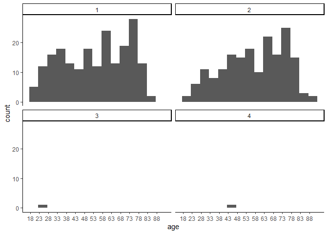
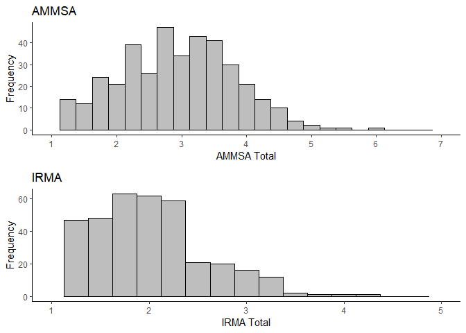
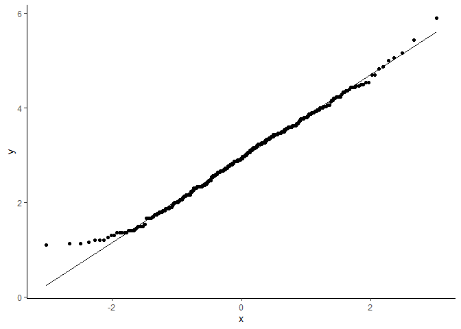
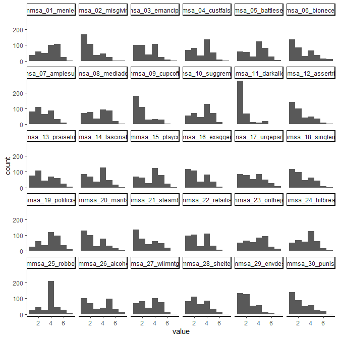
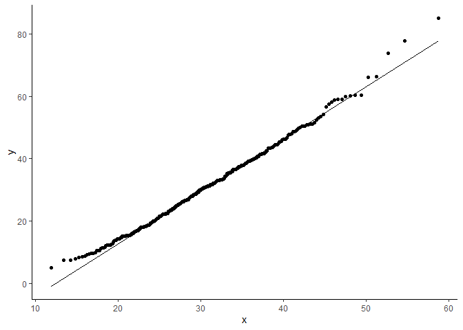
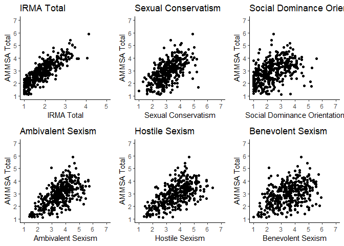
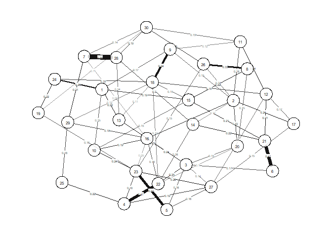
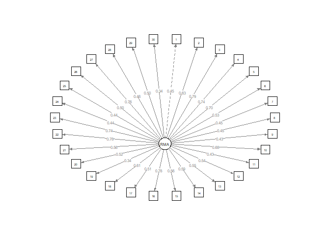
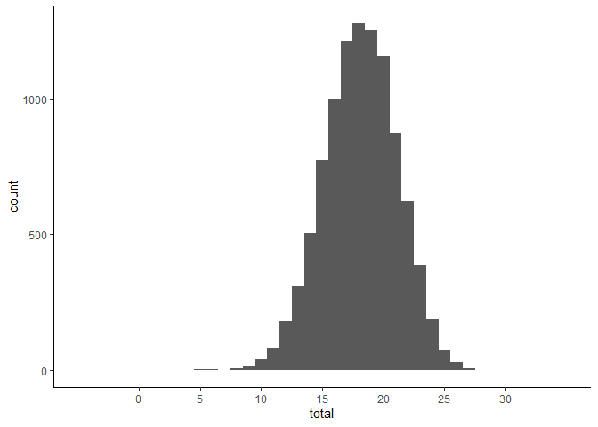
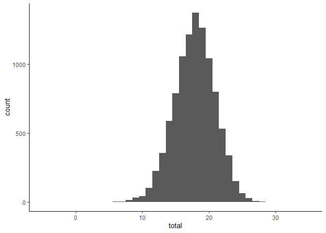

AMMSA – Swedish Validation, Main Analyses
================
2022-11-26

# Data screening and description

## Missing data

``` r
sum(
  is.na(ammsa_scale)
)
```

    ## [1] 0

## Bivariate correlations

### AMMSA Items

``` r
ammsa_cor_ci
```

    ##                      ammsa_01_menlead         ammsa_02_misgivings     
    ## ammsa_01_menlead     " 1.000 [ 1.000, 1.000]" "  .248 [  .152,  .339]"
    ## ammsa_02_misgivings  "  .248 [  .152,  .339]" " 1.000 [ 1.000, 1.000]"
    ## ammsa_03_emancipated "  .299 [  .206,  .388]" "  .490 [  .410,  .562]"
    ## ammsa_04_custfalsacc "  .317 [  .224,  .404]" "  .387 [  .298,  .468]"
    ## ammsa_05_battlesexes "  .358 [  .268,  .442]" "  .344 [  .253,  .429]"
    ## ammsa_06_bionecessit "  .280 [  .185,  .369]" "  .353 [  .262,  .437]"
    ## ammsa_07_amplesuppor "  .140 [  .041,  .236]" "  .268 [  .173,  .358]"
    ## ammsa_08_mediadepict "  .246 [  .149,  .337]" "  .271 [  .176,  .361]"
    ## ammsa_09_cupcoffee   "  .361 [  .271,  .445]" "  .379 [  .290,  .462]"
    ## ammsa_10_suggremarks "  .364 [  .274,  .447]" "  .434 [  .350,  .512]"
    ## ammsa_11_darkalleys  "  .168 [  .069,  .263]" "  .389 [  .301,  .471]"
    ## ammsa_12_assertright "  .346 [  .255,  .431]" "  .449 [  .366,  .525]"
    ## ammsa_13_praiselooks "  .406 [  .319,  .486]" "  .368 [  .278,  .451]"
    ## ammsa_14_fascination "  .304 [  .210,  .392]" "  .391 [  .303,  .472]"
    ## ammsa_15_playcoy     "  .365 [  .276,  .449]" "  .335 [  .244,  .421]"
    ## ammsa_16_exaggerate  "  .274 [  .180,  .364]" "  .511 [  .433,  .581]"
    ## ammsa_17_urgepartner "  .241 [  .145,  .333]" "  .445 [  .361,  .521]"
    ## ammsa_18_singleinvit "  .371 [  .282,  .454]" "  .439 [  .355,  .516]"
    ## ammsa_19_politicians "  .140 [  .041,  .237]" "  .132 [  .032,  .229]"
    ## ammsa_20_marital     "  .218 [  .121,  .311]" "  .411 [  .324,  .491]"
    ## ammsa_21_steamboil   "  .211 [  .113,  .304]" "  .418 [  .332,  .497]"
    ## ammsa_22_retailiate  "  .302 [  .209,  .390]" "  .475 [  .394,  .549]"
    ## ammsa_23_onthejob    "  .273 [  .178,  .363]" "  .399 [  .312,  .480]"
    ## ammsa_24_hitbreaks   "  .398 [  .310,  .479]" "  .293 [  .199,  .382]"
    ## ammsa_25_robbery     "  .150 [  .051,  .246]" "  .254 [  .159,  .345]"
    ## ammsa_26_alcohol     "  .214 [  .116,  .307]" "  .371 [  .281,  .454]"
    ## ammsa_27_wllmntgest  "  .345 [  .254,  .430]" "  .446 [  .362,  .522]"
    ## ammsa_28_shelters    "  .143 [  .044,  .239]" "  .323 [  .230,  .409]"
    ## ammsa_29_envdestr    "  .162 [  .064,  .258]" "  .283 [  .188,  .372]"
    ## ammsa_30_punish      "  .069 [- .031,  .168]" "  .232 [  .135,  .324]"
    ##                      ammsa_03_emancipated     ammsa_04_custfalsacc    
    ## ammsa_01_menlead     "  .299 [  .206,  .388]" "  .317 [  .224,  .404]"
    ## ammsa_02_misgivings  "  .490 [  .410,  .562]" "  .387 [  .298,  .468]"
    ## ammsa_03_emancipated " 1.000 [ 1.000, 1.000]" "  .606 [  .539,  .666]"
    ## ammsa_04_custfalsacc "  .606 [  .539,  .666]" " 1.000 [ 1.000, 1.000]"
    ## ammsa_05_battlesexes "  .603 [  .535,  .663]" "  .569 [  .498,  .633]"
    ## ammsa_06_bionecessit "  .414 [  .328,  .494]" "  .382 [  .294,  .465]"
    ## ammsa_07_amplesuppor "  .335 [  .243,  .420]" "  .268 [  .173,  .358]"
    ## ammsa_08_mediadepict "  .363 [  .273,  .447]" "  .344 [  .253,  .429]"
    ## ammsa_09_cupcoffee   "  .298 [  .204,  .386]" "  .232 [  .135,  .324]"
    ## ammsa_10_suggremarks "  .530 [  .454,  .598]" "  .455 [  .372,  .531]"
    ## ammsa_11_darkalleys  "  .339 [  .247,  .424]" "  .242 [  .146,  .334]"
    ## ammsa_12_assertright "  .393 [  .305,  .474]" "  .303 [  .209,  .391]"
    ## ammsa_13_praiselooks "  .472 [  .391,  .547]" "  .355 [  .264,  .439]"
    ## ammsa_14_fascination "  .426 [  .341,  .504]" "  .378 [  .289,  .460]"
    ## ammsa_15_playcoy     "  .373 [  .284,  .456]" "  .384 [  .295,  .466]"
    ## ammsa_16_exaggerate  "  .673 [  .614,  .724]" "  .595 [  .526,  .656]"
    ## ammsa_17_urgepartner "  .395 [  .307,  .476]" "  .366 [  .276,  .450]"
    ## ammsa_18_singleinvit "  .414 [  .328,  .494]" "  .384 [  .296,  .466]"
    ## ammsa_19_politicians "  .262 [  .166,  .352]" "  .282 [  .187,  .371]"
    ## ammsa_20_marital     "  .456 [  .374,  .532]" "  .307 [  .214,  .395]"
    ## ammsa_21_steamboil   "  .384 [  .296,  .466]" "  .347 [  .256,  .432]"
    ## ammsa_22_retailiate  "  .670 [  .611,  .721]" "  .690 [  .634,  .739]"
    ## ammsa_23_onthejob    "  .602 [  .534,  .662]" "  .633 [  .569,  .689]"
    ## ammsa_24_hitbreaks   "  .320 [  .228,  .407]" "  .320 [  .227,  .406]"
    ## ammsa_25_robbery     "  .336 [  .245,  .422]" "  .356 [  .265,  .440]"
    ## ammsa_26_alcohol     "  .357 [  .267,  .441]" "  .352 [  .261,  .437]"
    ## ammsa_27_wllmntgest  "  .622 [  .557,  .679]" "  .641 [  .578,  .696]"
    ## ammsa_28_shelters    "  .353 [  .263,  .437]" "  .248 [  .152,  .340]"
    ## ammsa_29_envdestr    "  .410 [  .323,  .489]" "  .352 [  .261,  .436]"
    ## ammsa_30_punish      "  .222 [  .125,  .315]" "  .253 [  .157,  .344]"
    ##                      ammsa_05_battlesexes     ammsa_06_bionecessit    
    ## ammsa_01_menlead     "  .358 [  .268,  .442]" "  .280 [  .185,  .369]"
    ## ammsa_02_misgivings  "  .344 [  .253,  .429]" "  .353 [  .262,  .437]"
    ## ammsa_03_emancipated "  .603 [  .535,  .663]" "  .414 [  .328,  .494]"
    ## ammsa_04_custfalsacc "  .569 [  .498,  .633]" "  .382 [  .294,  .465]"
    ## ammsa_05_battlesexes " 1.000 [ 1.000, 1.000]" "  .284 [  .189,  .373]"
    ## ammsa_06_bionecessit "  .284 [  .189,  .373]" " 1.000 [ 1.000, 1.000]"
    ## ammsa_07_amplesuppor "  .249 [  .153,  .340]" "  .256 [  .160,  .347]"
    ## ammsa_08_mediadepict "  .283 [  .189,  .372]" "  .146 [  .047,  .242]"
    ## ammsa_09_cupcoffee   "  .256 [  .160,  .347]" "  .301 [  .207,  .389]"
    ## ammsa_10_suggremarks "  .497 [  .418,  .569]" "  .319 [  .226,  .406]"
    ## ammsa_11_darkalleys  "  .197 [  .099,  .291]" "  .247 [  .151,  .339]"
    ## ammsa_12_assertright "  .340 [  .249,  .425]" "  .370 [  .280,  .453]"
    ## ammsa_13_praiselooks "  .373 [  .284,  .456]" "  .328 [  .236,  .414]"
    ## ammsa_14_fascination "  .398 [  .311,  .479]" "  .285 [  .191,  .375]"
    ## ammsa_15_playcoy     "  .400 [  .313,  .481]" "  .339 [  .247,  .424]"
    ## ammsa_16_exaggerate  "  .552 [  .479,  .618]" "  .400 [  .313,  .481]"
    ## ammsa_17_urgepartner "  .367 [  .278,  .451]" "  .330 [  .238,  .416]"
    ## ammsa_18_singleinvit "  .327 [  .235,  .414]" "  .415 [  .328,  .494]"
    ## ammsa_19_politicians "  .302 [  .209,  .390]" "  .218 [  .121,  .311]"
    ## ammsa_20_marital     "  .320 [  .228,  .407]" "  .241 [  .145,  .333]"
    ## ammsa_21_steamboil   "  .300 [  .206,  .388]" "  .610 [  .543,  .669]"
    ## ammsa_22_retailiate  "  .549 [  .475,  .615]" "  .395 [  .307,  .476]"
    ## ammsa_23_onthejob    "  .694 [  .639,  .743]" "  .327 [  .235,  .414]"
    ## ammsa_24_hitbreaks   "  .268 [  .173,  .359]" "  .224 [  .127,  .317]"
    ## ammsa_25_robbery     "  .291 [  .197,  .380]" "  .220 [  .123,  .313]"
    ## ammsa_26_alcohol     "  .298 [  .204,  .386]" "  .181 [  .083,  .276]"
    ## ammsa_27_wllmntgest  "  .627 [  .563,  .684]" "  .335 [  .243,  .421]"
    ## ammsa_28_shelters    "  .258 [  .163,  .349]" "  .265 [  .169,  .355]"
    ## ammsa_29_envdestr    "  .287 [  .193,  .376]" "  .235 [  .138,  .327]"
    ## ammsa_30_punish      "  .149 [  .050,  .245]" "  .088 [- .012,  .186]"
    ##                      ammsa_07_amplesuppor     ammsa_08_mediadepict    
    ## ammsa_01_menlead     "  .140 [  .041,  .236]" "  .246 [  .149,  .337]"
    ## ammsa_02_misgivings  "  .268 [  .173,  .358]" "  .271 [  .176,  .361]"
    ## ammsa_03_emancipated "  .335 [  .243,  .420]" "  .363 [  .273,  .447]"
    ## ammsa_04_custfalsacc "  .268 [  .173,  .358]" "  .344 [  .253,  .429]"
    ## ammsa_05_battlesexes "  .249 [  .153,  .340]" "  .283 [  .189,  .372]"
    ## ammsa_06_bionecessit "  .256 [  .160,  .347]" "  .146 [  .047,  .242]"
    ## ammsa_07_amplesuppor " 1.000 [ 1.000, 1.000]" "  .141 [  .041,  .237]"
    ## ammsa_08_mediadepict "  .141 [  .041,  .237]" " 1.000 [ 1.000, 1.000]"
    ## ammsa_09_cupcoffee   "  .207 [  .109,  .300]" "  .170 [  .071,  .265]"
    ## ammsa_10_suggremarks "  .261 [  .166,  .352]" "  .330 [  .238,  .417]"
    ## ammsa_11_darkalleys  "  .282 [  .188,  .372]" "  .218 [  .121,  .311]"
    ## ammsa_12_assertright "  .227 [  .131,  .320]" "  .232 [  .136,  .325]"
    ## ammsa_13_praiselooks "  .274 [  .179,  .364]" "  .258 [  .162,  .348]"
    ## ammsa_14_fascination "  .269 [  .174,  .359]" "  .266 [  .170,  .356]"
    ## ammsa_15_playcoy     "  .248 [  .152,  .339]" "  .343 [  .252,  .428]"
    ## ammsa_16_exaggerate  "  .419 [  .333,  .498]" "  .339 [  .247,  .424]"
    ## ammsa_17_urgepartner "  .250 [  .154,  .341]" "  .161 [  .062,  .256]"
    ## ammsa_18_singleinvit "  .340 [  .248,  .425]" "  .150 [  .051,  .246]"
    ## ammsa_19_politicians "  .021 [- .079,  .121]" "  .170 [  .072,  .266]"
    ## ammsa_20_marital     "  .161 [  .062,  .257]" "  .300 [  .207,  .388]"
    ## ammsa_21_steamboil   "  .246 [  .150,  .338]" "  .267 [  .171,  .357]"
    ## ammsa_22_retailiate  "  .289 [  .195,  .378]" "  .362 [  .272,  .445]"
    ## ammsa_23_onthejob    "  .251 [  .155,  .342]" "  .316 [  .223,  .403]"
    ## ammsa_24_hitbreaks   "  .171 [  .072,  .266]" "  .269 [  .174,  .359]"
    ## ammsa_25_robbery     "  .308 [  .214,  .395]" "  .229 [  .132,  .321]"
    ## ammsa_26_alcohol     "  .207 [  .109,  .300]" "  .416 [  .330,  .495]"
    ## ammsa_27_wllmntgest  "  .280 [  .185,  .369]" "  .332 [  .240,  .418]"
    ## ammsa_28_shelters    "  .710 [  .657,  .756]" "  .157 [  .059,  .253]"
    ## ammsa_29_envdestr    "  .391 [  .303,  .472]" "  .219 [  .122,  .312]"
    ## ammsa_30_punish      "  .421 [  .335,  .499]" "  .171 [  .073,  .267]"
    ##                      ammsa_09_cupcoffee       ammsa_10_suggremarks    
    ## ammsa_01_menlead     "  .361 [  .271,  .445]" "  .364 [  .274,  .447]"
    ## ammsa_02_misgivings  "  .379 [  .290,  .462]" "  .434 [  .350,  .512]"
    ## ammsa_03_emancipated "  .298 [  .204,  .386]" "  .530 [  .454,  .598]"
    ## ammsa_04_custfalsacc "  .232 [  .135,  .324]" "  .455 [  .372,  .531]"
    ## ammsa_05_battlesexes "  .256 [  .160,  .347]" "  .497 [  .418,  .569]"
    ## ammsa_06_bionecessit "  .301 [  .207,  .389]" "  .319 [  .226,  .406]"
    ## ammsa_07_amplesuppor "  .207 [  .109,  .300]" "  .261 [  .166,  .352]"
    ## ammsa_08_mediadepict "  .170 [  .071,  .265]" "  .330 [  .238,  .417]"
    ## ammsa_09_cupcoffee   " 1.000 [ 1.000, 1.000]" "  .295 [  .202,  .384]"
    ## ammsa_10_suggremarks "  .295 [  .202,  .384]" " 1.000 [ 1.000, 1.000]"
    ## ammsa_11_darkalleys  "  .324 [  .231,  .410]" "  .231 [  .134,  .323]"
    ## ammsa_12_assertright "  .309 [  .216,  .396]" "  .320 [  .227,  .407]"
    ## ammsa_13_praiselooks "  .352 [  .261,  .437]" "  .397 [  .309,  .478]"
    ## ammsa_14_fascination "  .248 [  .152,  .339]" "  .393 [  .305,  .474]"
    ## ammsa_15_playcoy     "  .299 [  .205,  .387]" "  .427 [  .341,  .505]"
    ## ammsa_16_exaggerate  "  .303 [  .210,  .391]" "  .540 [  .465,  .607]"
    ## ammsa_17_urgepartner "  .214 [  .117,  .307]" "  .355 [  .264,  .439]"
    ## ammsa_18_singleinvit "  .544 [  .470,  .611]" "  .429 [  .344,  .507]"
    ## ammsa_19_politicians "  .082 [- .018,  .181]" "  .257 [  .161,  .348]"
    ## ammsa_20_marital     "  .219 [  .122,  .312]" "  .361 [  .270,  .444]"
    ## ammsa_21_steamboil   "  .293 [  .199,  .382]" "  .359 [  .269,  .443]"
    ## ammsa_22_retailiate  "  .279 [  .184,  .368]" "  .480 [  .399,  .553]"
    ## ammsa_23_onthejob    "  .205 [  .107,  .298]" "  .571 [  .500,  .635]"
    ## ammsa_24_hitbreaks   "  .214 [  .117,  .307]" "  .319 [  .227,  .406]"
    ## ammsa_25_robbery     "  .124 [  .025,  .221]" "  .270 [  .175,  .360]"
    ## ammsa_26_alcohol     "  .174 [  .075,  .269]" "  .391 [  .303,  .473]"
    ## ammsa_27_wllmntgest  "  .250 [  .154,  .342]" "  .522 [  .446,  .591]"
    ## ammsa_28_shelters    "  .270 [  .175,  .360]" "  .314 [  .221,  .402]"
    ## ammsa_29_envdestr    "  .273 [  .178,  .363]" "  .325 [  .232,  .411]"
    ## ammsa_30_punish      "  .140 [  .041,  .237]" "  .248 [  .152,  .339]"
    ##                      ammsa_11_darkalleys      ammsa_12_assertright    
    ## ammsa_01_menlead     "  .168 [  .069,  .263]" "  .346 [  .255,  .431]"
    ## ammsa_02_misgivings  "  .389 [  .301,  .471]" "  .449 [  .366,  .525]"
    ## ammsa_03_emancipated "  .339 [  .247,  .424]" "  .393 [  .305,  .474]"
    ## ammsa_04_custfalsacc "  .242 [  .146,  .334]" "  .303 [  .209,  .391]"
    ## ammsa_05_battlesexes "  .197 [  .099,  .291]" "  .340 [  .249,  .425]"
    ## ammsa_06_bionecessit "  .247 [  .151,  .339]" "  .370 [  .280,  .453]"
    ## ammsa_07_amplesuppor "  .282 [  .188,  .372]" "  .227 [  .131,  .320]"
    ## ammsa_08_mediadepict "  .218 [  .121,  .311]" "  .232 [  .136,  .325]"
    ## ammsa_09_cupcoffee   "  .324 [  .231,  .410]" "  .309 [  .216,  .396]"
    ## ammsa_10_suggremarks "  .231 [  .134,  .323]" "  .320 [  .227,  .407]"
    ## ammsa_11_darkalleys  " 1.000 [ 1.000, 1.000]" "  .397 [  .309,  .478]"
    ## ammsa_12_assertright "  .397 [  .309,  .478]" " 1.000 [ 1.000, 1.000]"
    ## ammsa_13_praiselooks "  .277 [  .183,  .367]" "  .317 [  .225,  .404]"
    ## ammsa_14_fascination "  .284 [  .190,  .374]" "  .361 [  .271,  .445]"
    ## ammsa_15_playcoy     "  .197 [  .099,  .291]" "  .323 [  .231,  .410]"
    ## ammsa_16_exaggerate  "  .336 [  .244,  .422]" "  .362 [  .272,  .446]"
    ## ammsa_17_urgepartner "  .202 [  .105,  .296]" "  .379 [  .290,  .461]"
    ## ammsa_18_singleinvit "  .361 [  .271,  .445]" "  .450 [  .367,  .526]"
    ## ammsa_19_politicians "  .108 [  .008,  .205]" "  .165 [  .066,  .260]"
    ## ammsa_20_marital     "  .236 [  .139,  .328]" "  .296 [  .202,  .385]"
    ## ammsa_21_steamboil   "  .291 [  .197,  .380]" "  .426 [  .341,  .504]"
    ## ammsa_22_retailiate  "  .326 [  .234,  .412]" "  .375 [  .286,  .458]"
    ## ammsa_23_onthejob    "  .225 [  .128,  .318]" "  .315 [  .223,  .403]"
    ## ammsa_24_hitbreaks   "  .250 [  .154,  .341]" "  .299 [  .205,  .387]"
    ## ammsa_25_robbery     "  .167 [  .068,  .262]" "  .240 [  .143,  .332]"
    ## ammsa_26_alcohol     "  .268 [  .173,  .358]" "  .242 [  .145,  .333]"
    ## ammsa_27_wllmntgest  "  .215 [  .118,  .308]" "  .414 [  .327,  .493]"
    ## ammsa_28_shelters    "  .241 [  .145,  .333]" "  .199 [  .101,  .293]"
    ## ammsa_29_envdestr    "  .326 [  .234,  .413]" "  .295 [  .201,  .384]"
    ## ammsa_30_punish      "  .258 [  .162,  .349]" "  .173 [  .075,  .268]"
    ##                      ammsa_13_praiselooks     ammsa_14_fascination    
    ## ammsa_01_menlead     "  .406 [  .319,  .486]" "  .304 [  .210,  .392]"
    ## ammsa_02_misgivings  "  .368 [  .278,  .451]" "  .391 [  .303,  .472]"
    ## ammsa_03_emancipated "  .472 [  .391,  .547]" "  .426 [  .341,  .504]"
    ## ammsa_04_custfalsacc "  .355 [  .264,  .439]" "  .378 [  .289,  .460]"
    ## ammsa_05_battlesexes "  .373 [  .284,  .456]" "  .398 [  .311,  .479]"
    ## ammsa_06_bionecessit "  .328 [  .236,  .414]" "  .285 [  .191,  .375]"
    ## ammsa_07_amplesuppor "  .274 [  .179,  .364]" "  .269 [  .174,  .359]"
    ## ammsa_08_mediadepict "  .258 [  .162,  .348]" "  .266 [  .170,  .356]"
    ## ammsa_09_cupcoffee   "  .352 [  .261,  .437]" "  .248 [  .152,  .339]"
    ## ammsa_10_suggremarks "  .397 [  .309,  .478]" "  .393 [  .305,  .474]"
    ## ammsa_11_darkalleys  "  .277 [  .183,  .367]" "  .284 [  .190,  .374]"
    ## ammsa_12_assertright "  .317 [  .225,  .404]" "  .361 [  .271,  .445]"
    ## ammsa_13_praiselooks " 1.000 [ 1.000, 1.000]" "  .348 [  .258,  .433]"
    ## ammsa_14_fascination "  .348 [  .258,  .433]" " 1.000 [ 1.000, 1.000]"
    ## ammsa_15_playcoy     "  .300 [  .206,  .388]" "  .380 [  .291,  .462]"
    ## ammsa_16_exaggerate  "  .422 [  .336,  .501]" "  .462 [  .380,  .537]"
    ## ammsa_17_urgepartner "  .275 [  .180,  .364]" "  .257 [  .162,  .348]"
    ## ammsa_18_singleinvit "  .434 [  .349,  .512]" "  .392 [  .304,  .473]"
    ## ammsa_19_politicians "  .124 [  .025,  .221]" "  .127 [  .028,  .224]"
    ## ammsa_20_marital     "  .290 [  .196,  .379]" "  .314 [  .221,  .401]"
    ## ammsa_21_steamboil   "  .346 [  .255,  .431]" "  .390 [  .302,  .471]"
    ## ammsa_22_retailiate  "  .396 [  .309,  .477]" "  .444 [  .360,  .521]"
    ## ammsa_23_onthejob    "  .288 [  .193,  .377]" "  .405 [  .318,  .485]"
    ## ammsa_24_hitbreaks   "  .319 [  .227,  .406]" "  .250 [  .154,  .341]"
    ## ammsa_25_robbery     "  .228 [  .131,  .320]" "  .285 [  .190,  .374]"
    ## ammsa_26_alcohol     "  .290 [  .196,  .379]" "  .297 [  .204,  .386]"
    ## ammsa_27_wllmntgest  "  .337 [  .245,  .422]" "  .430 [  .345,  .508]"
    ## ammsa_28_shelters    "  .331 [  .239,  .417]" "  .347 [  .256,  .432]"
    ## ammsa_29_envdestr    "  .262 [  .166,  .352]" "  .336 [  .244,  .421]"
    ## ammsa_30_punish      "  .177 [  .078,  .272]" "  .228 [  .131,  .321]"
    ##                      ammsa_15_playcoy         ammsa_16_exaggerate     
    ## ammsa_01_menlead     "  .365 [  .276,  .449]" "  .274 [  .180,  .364]"
    ## ammsa_02_misgivings  "  .335 [  .244,  .421]" "  .511 [  .433,  .581]"
    ## ammsa_03_emancipated "  .373 [  .284,  .456]" "  .673 [  .614,  .724]"
    ## ammsa_04_custfalsacc "  .384 [  .295,  .466]" "  .595 [  .526,  .656]"
    ## ammsa_05_battlesexes "  .400 [  .313,  .481]" "  .552 [  .479,  .618]"
    ## ammsa_06_bionecessit "  .339 [  .247,  .424]" "  .400 [  .313,  .481]"
    ## ammsa_07_amplesuppor "  .248 [  .152,  .339]" "  .419 [  .333,  .498]"
    ## ammsa_08_mediadepict "  .343 [  .252,  .428]" "  .339 [  .247,  .424]"
    ## ammsa_09_cupcoffee   "  .299 [  .205,  .387]" "  .303 [  .210,  .391]"
    ## ammsa_10_suggremarks "  .427 [  .341,  .505]" "  .540 [  .465,  .607]"
    ## ammsa_11_darkalleys  "  .197 [  .099,  .291]" "  .336 [  .244,  .422]"
    ## ammsa_12_assertright "  .323 [  .231,  .410]" "  .362 [  .272,  .446]"
    ## ammsa_13_praiselooks "  .300 [  .206,  .388]" "  .422 [  .336,  .501]"
    ## ammsa_14_fascination "  .380 [  .291,  .462]" "  .462 [  .380,  .537]"
    ## ammsa_15_playcoy     " 1.000 [ 1.000, 1.000]" "  .433 [  .348,  .510]"
    ## ammsa_16_exaggerate  "  .433 [  .348,  .510]" " 1.000 [ 1.000, 1.000]"
    ## ammsa_17_urgepartner "  .272 [  .177,  .362]" "  .403 [  .316,  .484]"
    ## ammsa_18_singleinvit "  .399 [  .311,  .479]" "  .440 [  .356,  .517]"
    ## ammsa_19_politicians "  .248 [  .152,  .340]" "  .224 [  .127,  .317]"
    ## ammsa_20_marital     "  .325 [  .233,  .412]" "  .374 [  .285,  .457]"
    ## ammsa_21_steamboil   "  .409 [  .323,  .489]" "  .422 [  .337,  .501]"
    ## ammsa_22_retailiate  "  .408 [  .321,  .488]" "  .638 [  .574,  .693]"
    ## ammsa_23_onthejob    "  .390 [  .302,  .471]" "  .595 [  .526,  .656]"
    ## ammsa_24_hitbreaks   "  .299 [  .205,  .387]" "  .302 [  .208,  .390]"
    ## ammsa_25_robbery     "  .229 [  .133,  .322]" "  .316 [  .223,  .403]"
    ## ammsa_26_alcohol     "  .255 [  .159,  .346]" "  .346 [  .254,  .430]"
    ## ammsa_27_wllmntgest  "  .415 [  .329,  .494]" "  .573 [  .502,  .636]"
    ## ammsa_28_shelters    "  .237 [  .140,  .329]" "  .405 [  .318,  .485]"
    ## ammsa_29_envdestr    "  .220 [  .123,  .313]" "  .409 [  .323,  .489]"
    ## ammsa_30_punish      "  .208 [  .111,  .302]" "  .281 [  .187,  .371]"
    ##                      ammsa_17_urgepartner     ammsa_18_singleinvit    
    ## ammsa_01_menlead     "  .241 [  .145,  .333]" "  .371 [  .282,  .454]"
    ## ammsa_02_misgivings  "  .445 [  .361,  .521]" "  .439 [  .355,  .516]"
    ## ammsa_03_emancipated "  .395 [  .307,  .476]" "  .414 [  .328,  .494]"
    ## ammsa_04_custfalsacc "  .366 [  .276,  .450]" "  .384 [  .296,  .466]"
    ## ammsa_05_battlesexes "  .367 [  .278,  .451]" "  .327 [  .235,  .414]"
    ## ammsa_06_bionecessit "  .330 [  .238,  .416]" "  .415 [  .328,  .494]"
    ## ammsa_07_amplesuppor "  .250 [  .154,  .341]" "  .340 [  .248,  .425]"
    ## ammsa_08_mediadepict "  .161 [  .062,  .256]" "  .150 [  .051,  .246]"
    ## ammsa_09_cupcoffee   "  .214 [  .117,  .307]" "  .544 [  .470,  .611]"
    ## ammsa_10_suggremarks "  .355 [  .264,  .439]" "  .429 [  .344,  .507]"
    ## ammsa_11_darkalleys  "  .202 [  .105,  .296]" "  .361 [  .271,  .445]"
    ## ammsa_12_assertright "  .379 [  .290,  .461]" "  .450 [  .367,  .526]"
    ## ammsa_13_praiselooks "  .275 [  .180,  .364]" "  .434 [  .349,  .512]"
    ## ammsa_14_fascination "  .257 [  .162,  .348]" "  .392 [  .304,  .473]"
    ## ammsa_15_playcoy     "  .272 [  .177,  .362]" "  .399 [  .311,  .479]"
    ## ammsa_16_exaggerate  "  .403 [  .316,  .484]" "  .440 [  .356,  .517]"
    ## ammsa_17_urgepartner " 1.000 [ 1.000, 1.000]" "  .352 [  .261,  .436]"
    ## ammsa_18_singleinvit "  .352 [  .261,  .436]" " 1.000 [ 1.000, 1.000]"
    ## ammsa_19_politicians "  .134 [  .035,  .231]" "  .187 [  .089,  .282]"
    ## ammsa_20_marital     "  .272 [  .177,  .362]" "  .292 [  .198,  .381]"
    ## ammsa_21_steamboil   "  .326 [  .234,  .413]" "  .393 [  .305,  .474]"
    ## ammsa_22_retailiate  "  .336 [  .245,  .422]" "  .450 [  .366,  .526]"
    ## ammsa_23_onthejob    "  .338 [  .246,  .423]" "  .353 [  .262,  .437]"
    ## ammsa_24_hitbreaks   "  .242 [  .146,  .334]" "  .346 [  .255,  .431]"
    ## ammsa_25_robbery     "  .208 [  .110,  .301]" "  .269 [  .174,  .359]"
    ## ammsa_26_alcohol     "  .258 [  .162,  .349]" "  .289 [  .195,  .378]"
    ## ammsa_27_wllmntgest  "  .421 [  .335,  .500]" "  .371 [  .281,  .454]"
    ## ammsa_28_shelters    "  .231 [  .135,  .324]" "  .370 [  .281,  .453]"
    ## ammsa_29_envdestr    "  .230 [  .133,  .322]" "  .369 [  .280,  .452]"
    ## ammsa_30_punish      "  .178 [  .079,  .273]" "  .155 [  .056,  .251]"
    ##                      ammsa_19_politicians     ammsa_20_marital        
    ## ammsa_01_menlead     "  .140 [  .041,  .237]" "  .218 [  .121,  .311]"
    ## ammsa_02_misgivings  "  .132 [  .032,  .229]" "  .411 [  .324,  .491]"
    ## ammsa_03_emancipated "  .262 [  .166,  .352]" "  .456 [  .374,  .532]"
    ## ammsa_04_custfalsacc "  .282 [  .187,  .371]" "  .307 [  .214,  .395]"
    ## ammsa_05_battlesexes "  .302 [  .209,  .390]" "  .320 [  .228,  .407]"
    ## ammsa_06_bionecessit "  .218 [  .121,  .311]" "  .241 [  .145,  .333]"
    ## ammsa_07_amplesuppor "  .021 [- .079,  .121]" "  .161 [  .062,  .257]"
    ## ammsa_08_mediadepict "  .170 [  .072,  .266]" "  .300 [  .207,  .388]"
    ## ammsa_09_cupcoffee   "  .082 [- .018,  .181]" "  .219 [  .122,  .312]"
    ## ammsa_10_suggremarks "  .257 [  .161,  .348]" "  .361 [  .270,  .444]"
    ## ammsa_11_darkalleys  "  .108 [  .008,  .205]" "  .236 [  .139,  .328]"
    ## ammsa_12_assertright "  .165 [  .066,  .260]" "  .296 [  .202,  .385]"
    ## ammsa_13_praiselooks "  .124 [  .025,  .221]" "  .290 [  .196,  .379]"
    ## ammsa_14_fascination "  .127 [  .028,  .224]" "  .314 [  .221,  .401]"
    ## ammsa_15_playcoy     "  .248 [  .152,  .340]" "  .325 [  .233,  .412]"
    ## ammsa_16_exaggerate  "  .224 [  .127,  .317]" "  .374 [  .285,  .457]"
    ## ammsa_17_urgepartner "  .134 [  .035,  .231]" "  .272 [  .177,  .362]"
    ## ammsa_18_singleinvit "  .187 [  .089,  .282]" "  .292 [  .198,  .381]"
    ## ammsa_19_politicians " 1.000 [ 1.000, 1.000]" "  .219 [  .122,  .312]"
    ## ammsa_20_marital     "  .219 [  .122,  .312]" " 1.000 [ 1.000, 1.000]"
    ## ammsa_21_steamboil   "  .208 [  .110,  .301]" "  .318 [  .225,  .405]"
    ## ammsa_22_retailiate  "  .309 [  .216,  .396]" "  .432 [  .348,  .510]"
    ## ammsa_23_onthejob    "  .322 [  .230,  .409]" "  .376 [  .287,  .459]"
    ## ammsa_24_hitbreaks   "  .259 [  .163,  .350]" "  .291 [  .197,  .380]"
    ## ammsa_25_robbery     "  .160 [  .061,  .255]" "  .248 [  .152,  .339]"
    ## ammsa_26_alcohol     "  .111 [  .012,  .209]" "  .274 [  .179,  .364]"
    ## ammsa_27_wllmntgest  "  .300 [  .206,  .388]" "  .351 [  .260,  .435]"
    ## ammsa_28_shelters    "  .043 [- .057,  .142]" "  .176 [  .078,  .271]"
    ## ammsa_29_envdestr    "  .118 [  .018,  .215]" "  .267 [  .172,  .357]"
    ## ammsa_30_punish      "- .034 [- .133,  .066]" "  .130 [  .030,  .227]"
    ##                      ammsa_21_steamboil       ammsa_22_retailiate     
    ## ammsa_01_menlead     "  .211 [  .113,  .304]" "  .302 [  .209,  .390]"
    ## ammsa_02_misgivings  "  .418 [  .332,  .497]" "  .475 [  .394,  .549]"
    ## ammsa_03_emancipated "  .384 [  .296,  .466]" "  .670 [  .611,  .721]"
    ## ammsa_04_custfalsacc "  .347 [  .256,  .432]" "  .690 [  .634,  .739]"
    ## ammsa_05_battlesexes "  .300 [  .206,  .388]" "  .549 [  .475,  .615]"
    ## ammsa_06_bionecessit "  .610 [  .543,  .669]" "  .395 [  .307,  .476]"
    ## ammsa_07_amplesuppor "  .246 [  .150,  .338]" "  .289 [  .195,  .378]"
    ## ammsa_08_mediadepict "  .267 [  .171,  .357]" "  .362 [  .272,  .445]"
    ## ammsa_09_cupcoffee   "  .293 [  .199,  .382]" "  .279 [  .184,  .368]"
    ## ammsa_10_suggremarks "  .359 [  .269,  .443]" "  .480 [  .399,  .553]"
    ## ammsa_11_darkalleys  "  .291 [  .197,  .380]" "  .326 [  .234,  .412]"
    ## ammsa_12_assertright "  .426 [  .341,  .504]" "  .375 [  .286,  .458]"
    ## ammsa_13_praiselooks "  .346 [  .255,  .431]" "  .396 [  .309,  .477]"
    ## ammsa_14_fascination "  .390 [  .302,  .471]" "  .444 [  .360,  .521]"
    ## ammsa_15_playcoy     "  .409 [  .323,  .489]" "  .408 [  .321,  .488]"
    ## ammsa_16_exaggerate  "  .422 [  .337,  .501]" "  .638 [  .574,  .693]"
    ## ammsa_17_urgepartner "  .326 [  .234,  .413]" "  .336 [  .245,  .422]"
    ## ammsa_18_singleinvit "  .393 [  .305,  .474]" "  .450 [  .366,  .526]"
    ## ammsa_19_politicians "  .208 [  .110,  .301]" "  .309 [  .216,  .396]"
    ## ammsa_20_marital     "  .318 [  .225,  .405]" "  .432 [  .348,  .510]"
    ## ammsa_21_steamboil   " 1.000 [ 1.000, 1.000]" "  .399 [  .311,  .479]"
    ## ammsa_22_retailiate  "  .399 [  .311,  .479]" " 1.000 [ 1.000, 1.000]"
    ## ammsa_23_onthejob    "  .334 [  .242,  .420]" "  .595 [  .526,  .656]"
    ## ammsa_24_hitbreaks   "  .255 [  .159,  .346]" "  .299 [  .205,  .387]"
    ## ammsa_25_robbery     "  .254 [  .158,  .345]" "  .314 [  .221,  .402]"
    ## ammsa_26_alcohol     "  .288 [  .194,  .377]" "  .387 [  .298,  .468]"
    ## ammsa_27_wllmntgest  "  .342 [  .251,  .427]" "  .612 [  .545,  .671]"
    ## ammsa_28_shelters    "  .273 [  .178,  .363]" "  .286 [  .192,  .375]"
    ## ammsa_29_envdestr    "  .277 [  .182,  .367]" "  .369 [  .279,  .452]"
    ## ammsa_30_punish      "  .160 [  .061,  .256]" "  .238 [  .141,  .330]"
    ##                      ammsa_23_onthejob        ammsa_24_hitbreaks      
    ## ammsa_01_menlead     "  .273 [  .178,  .363]" "  .398 [  .310,  .479]"
    ## ammsa_02_misgivings  "  .399 [  .312,  .480]" "  .293 [  .199,  .382]"
    ## ammsa_03_emancipated "  .602 [  .534,  .662]" "  .320 [  .228,  .407]"
    ## ammsa_04_custfalsacc "  .633 [  .569,  .689]" "  .320 [  .227,  .406]"
    ## ammsa_05_battlesexes "  .694 [  .639,  .743]" "  .268 [  .173,  .359]"
    ## ammsa_06_bionecessit "  .327 [  .235,  .414]" "  .224 [  .127,  .317]"
    ## ammsa_07_amplesuppor "  .251 [  .155,  .342]" "  .171 [  .072,  .266]"
    ## ammsa_08_mediadepict "  .316 [  .223,  .403]" "  .269 [  .174,  .359]"
    ## ammsa_09_cupcoffee   "  .205 [  .107,  .298]" "  .214 [  .117,  .307]"
    ## ammsa_10_suggremarks "  .571 [  .500,  .635]" "  .319 [  .227,  .406]"
    ## ammsa_11_darkalleys  "  .225 [  .128,  .318]" "  .250 [  .154,  .341]"
    ## ammsa_12_assertright "  .315 [  .223,  .403]" "  .299 [  .205,  .387]"
    ## ammsa_13_praiselooks "  .288 [  .193,  .377]" "  .319 [  .227,  .406]"
    ## ammsa_14_fascination "  .405 [  .318,  .485]" "  .250 [  .154,  .341]"
    ## ammsa_15_playcoy     "  .390 [  .302,  .471]" "  .299 [  .205,  .387]"
    ## ammsa_16_exaggerate  "  .595 [  .526,  .656]" "  .302 [  .208,  .390]"
    ## ammsa_17_urgepartner "  .338 [  .246,  .423]" "  .242 [  .146,  .334]"
    ## ammsa_18_singleinvit "  .353 [  .262,  .437]" "  .346 [  .255,  .431]"
    ## ammsa_19_politicians "  .322 [  .230,  .409]" "  .259 [  .163,  .350]"
    ## ammsa_20_marital     "  .376 [  .287,  .459]" "  .291 [  .197,  .380]"
    ## ammsa_21_steamboil   "  .334 [  .242,  .420]" "  .255 [  .159,  .346]"
    ## ammsa_22_retailiate  "  .595 [  .526,  .656]" "  .299 [  .205,  .387]"
    ## ammsa_23_onthejob    " 1.000 [ 1.000, 1.000]" "  .251 [  .155,  .342]"
    ## ammsa_24_hitbreaks   "  .251 [  .155,  .342]" " 1.000 [ 1.000, 1.000]"
    ## ammsa_25_robbery     "  .336 [  .245,  .422]" "  .212 [  .115,  .305]"
    ## ammsa_26_alcohol     "  .405 [  .318,  .485]" "  .194 [  .096,  .288]"
    ## ammsa_27_wllmntgest  "  .697 [  .642,  .745]" "  .307 [  .214,  .395]"
    ## ammsa_28_shelters    "  .256 [  .160,  .347]" "  .112 [  .012,  .209]"
    ## ammsa_29_envdestr    "  .292 [  .198,  .381]" "  .243 [  .147,  .335]"
    ## ammsa_30_punish      "  .167 [  .068,  .262]" "  .120 [  .021,  .218]"
    ##                      ammsa_25_robbery         ammsa_26_alcohol        
    ## ammsa_01_menlead     "  .150 [  .051,  .246]" "  .214 [  .116,  .307]"
    ## ammsa_02_misgivings  "  .254 [  .159,  .345]" "  .371 [  .281,  .454]"
    ## ammsa_03_emancipated "  .336 [  .245,  .422]" "  .357 [  .267,  .441]"
    ## ammsa_04_custfalsacc "  .356 [  .265,  .440]" "  .352 [  .261,  .437]"
    ## ammsa_05_battlesexes "  .291 [  .197,  .380]" "  .298 [  .204,  .386]"
    ## ammsa_06_bionecessit "  .220 [  .123,  .313]" "  .181 [  .083,  .276]"
    ## ammsa_07_amplesuppor "  .308 [  .214,  .395]" "  .207 [  .109,  .300]"
    ## ammsa_08_mediadepict "  .229 [  .132,  .321]" "  .416 [  .330,  .495]"
    ## ammsa_09_cupcoffee   "  .124 [  .025,  .221]" "  .174 [  .075,  .269]"
    ## ammsa_10_suggremarks "  .270 [  .175,  .360]" "  .391 [  .303,  .473]"
    ## ammsa_11_darkalleys  "  .167 [  .068,  .262]" "  .268 [  .173,  .358]"
    ## ammsa_12_assertright "  .240 [  .143,  .332]" "  .242 [  .145,  .333]"
    ## ammsa_13_praiselooks "  .228 [  .131,  .320]" "  .290 [  .196,  .379]"
    ## ammsa_14_fascination "  .285 [  .190,  .374]" "  .297 [  .204,  .386]"
    ## ammsa_15_playcoy     "  .229 [  .133,  .322]" "  .255 [  .159,  .346]"
    ## ammsa_16_exaggerate  "  .316 [  .223,  .403]" "  .346 [  .254,  .430]"
    ## ammsa_17_urgepartner "  .208 [  .110,  .301]" "  .258 [  .162,  .349]"
    ## ammsa_18_singleinvit "  .269 [  .174,  .359]" "  .289 [  .195,  .378]"
    ## ammsa_19_politicians "  .160 [  .061,  .255]" "  .111 [  .012,  .209]"
    ## ammsa_20_marital     "  .248 [  .152,  .339]" "  .274 [  .179,  .364]"
    ## ammsa_21_steamboil   "  .254 [  .158,  .345]" "  .288 [  .194,  .377]"
    ## ammsa_22_retailiate  "  .314 [  .221,  .402]" "  .387 [  .298,  .468]"
    ## ammsa_23_onthejob    "  .336 [  .245,  .422]" "  .405 [  .318,  .485]"
    ## ammsa_24_hitbreaks   "  .212 [  .115,  .305]" "  .194 [  .096,  .288]"
    ## ammsa_25_robbery     " 1.000 [ 1.000, 1.000]" "  .210 [  .112,  .303]"
    ## ammsa_26_alcohol     "  .210 [  .112,  .303]" " 1.000 [ 1.000, 1.000]"
    ## ammsa_27_wllmntgest  "  .318 [  .226,  .405]" "  .419 [  .333,  .498]"
    ## ammsa_28_shelters    "  .300 [  .206,  .388]" "  .226 [  .129,  .319]"
    ## ammsa_29_envdestr    "  .301 [  .207,  .389]" "  .273 [  .178,  .363]"
    ## ammsa_30_punish      "  .155 [  .056,  .251]" "  .337 [  .245,  .423]"
    ##                      ammsa_27_wllmntgest      ammsa_28_shelters       
    ## ammsa_01_menlead     "  .345 [  .254,  .430]" "  .143 [  .044,  .239]"
    ## ammsa_02_misgivings  "  .446 [  .362,  .522]" "  .323 [  .230,  .409]"
    ## ammsa_03_emancipated "  .622 [  .557,  .679]" "  .353 [  .263,  .437]"
    ## ammsa_04_custfalsacc "  .641 [  .578,  .696]" "  .248 [  .152,  .340]"
    ## ammsa_05_battlesexes "  .627 [  .563,  .684]" "  .258 [  .163,  .349]"
    ## ammsa_06_bionecessit "  .335 [  .243,  .421]" "  .265 [  .169,  .355]"
    ## ammsa_07_amplesuppor "  .280 [  .185,  .369]" "  .710 [  .657,  .756]"
    ## ammsa_08_mediadepict "  .332 [  .240,  .418]" "  .157 [  .059,  .253]"
    ## ammsa_09_cupcoffee   "  .250 [  .154,  .342]" "  .270 [  .175,  .360]"
    ## ammsa_10_suggremarks "  .522 [  .446,  .591]" "  .314 [  .221,  .402]"
    ## ammsa_11_darkalleys  "  .215 [  .118,  .308]" "  .241 [  .145,  .333]"
    ## ammsa_12_assertright "  .414 [  .327,  .493]" "  .199 [  .101,  .293]"
    ## ammsa_13_praiselooks "  .337 [  .245,  .422]" "  .331 [  .239,  .417]"
    ## ammsa_14_fascination "  .430 [  .345,  .508]" "  .347 [  .256,  .432]"
    ## ammsa_15_playcoy     "  .415 [  .329,  .494]" "  .237 [  .140,  .329]"
    ## ammsa_16_exaggerate  "  .573 [  .502,  .636]" "  .405 [  .318,  .485]"
    ## ammsa_17_urgepartner "  .421 [  .335,  .500]" "  .231 [  .135,  .324]"
    ## ammsa_18_singleinvit "  .371 [  .281,  .454]" "  .370 [  .281,  .453]"
    ## ammsa_19_politicians "  .300 [  .206,  .388]" "  .043 [- .057,  .142]"
    ## ammsa_20_marital     "  .351 [  .260,  .435]" "  .176 [  .078,  .271]"
    ## ammsa_21_steamboil   "  .342 [  .251,  .427]" "  .273 [  .178,  .363]"
    ## ammsa_22_retailiate  "  .612 [  .545,  .671]" "  .286 [  .192,  .375]"
    ## ammsa_23_onthejob    "  .697 [  .642,  .745]" "  .256 [  .160,  .347]"
    ## ammsa_24_hitbreaks   "  .307 [  .214,  .395]" "  .112 [  .012,  .209]"
    ## ammsa_25_robbery     "  .318 [  .226,  .405]" "  .300 [  .206,  .388]"
    ## ammsa_26_alcohol     "  .419 [  .333,  .498]" "  .226 [  .129,  .319]"
    ## ammsa_27_wllmntgest  " 1.000 [ 1.000, 1.000]" "  .296 [  .202,  .384]"
    ## ammsa_28_shelters    "  .296 [  .202,  .384]" " 1.000 [ 1.000, 1.000]"
    ## ammsa_29_envdestr    "  .363 [  .274,  .447]" "  .388 [  .300,  .469]"
    ## ammsa_30_punish      "  .238 [  .141,  .330]" "  .420 [  .335,  .499]"
    ##                      ammsa_29_envdestr        ammsa_30_punish         
    ## ammsa_01_menlead     "  .162 [  .064,  .258]" "  .069 [- .031,  .168]"
    ## ammsa_02_misgivings  "  .283 [  .188,  .372]" "  .232 [  .135,  .324]"
    ## ammsa_03_emancipated "  .410 [  .323,  .489]" "  .222 [  .125,  .315]"
    ## ammsa_04_custfalsacc "  .352 [  .261,  .436]" "  .253 [  .157,  .344]"
    ## ammsa_05_battlesexes "  .287 [  .193,  .376]" "  .149 [  .050,  .245]"
    ## ammsa_06_bionecessit "  .235 [  .138,  .327]" "  .088 [- .012,  .186]"
    ## ammsa_07_amplesuppor "  .391 [  .303,  .472]" "  .421 [  .335,  .499]"
    ## ammsa_08_mediadepict "  .219 [  .122,  .312]" "  .171 [  .073,  .267]"
    ## ammsa_09_cupcoffee   "  .273 [  .178,  .363]" "  .140 [  .041,  .237]"
    ## ammsa_10_suggremarks "  .325 [  .232,  .411]" "  .248 [  .152,  .339]"
    ## ammsa_11_darkalleys  "  .326 [  .234,  .413]" "  .258 [  .162,  .349]"
    ## ammsa_12_assertright "  .295 [  .201,  .384]" "  .173 [  .075,  .268]"
    ## ammsa_13_praiselooks "  .262 [  .166,  .352]" "  .177 [  .078,  .272]"
    ## ammsa_14_fascination "  .336 [  .244,  .421]" "  .228 [  .131,  .321]"
    ## ammsa_15_playcoy     "  .220 [  .123,  .313]" "  .208 [  .111,  .302]"
    ## ammsa_16_exaggerate  "  .409 [  .323,  .489]" "  .281 [  .187,  .371]"
    ## ammsa_17_urgepartner "  .230 [  .133,  .322]" "  .178 [  .079,  .273]"
    ## ammsa_18_singleinvit "  .369 [  .280,  .452]" "  .155 [  .056,  .251]"
    ## ammsa_19_politicians "  .118 [  .018,  .215]" "- .034 [- .133,  .066]"
    ## ammsa_20_marital     "  .267 [  .172,  .357]" "  .130 [  .030,  .227]"
    ## ammsa_21_steamboil   "  .277 [  .182,  .367]" "  .160 [  .061,  .256]"
    ## ammsa_22_retailiate  "  .369 [  .279,  .452]" "  .238 [  .141,  .330]"
    ## ammsa_23_onthejob    "  .292 [  .198,  .381]" "  .167 [  .068,  .262]"
    ## ammsa_24_hitbreaks   "  .243 [  .147,  .335]" "  .120 [  .021,  .218]"
    ## ammsa_25_robbery     "  .301 [  .207,  .389]" "  .155 [  .056,  .251]"
    ## ammsa_26_alcohol     "  .273 [  .178,  .363]" "  .337 [  .245,  .423]"
    ## ammsa_27_wllmntgest  "  .363 [  .274,  .447]" "  .238 [  .141,  .330]"
    ## ammsa_28_shelters    "  .388 [  .300,  .469]" "  .420 [  .335,  .499]"
    ## ammsa_29_envdestr    " 1.000 [ 1.000, 1.000]" "  .313 [  .220,  .401]"
    ## ammsa_30_punish      "  .313 [  .220,  .401]" " 1.000 [ 1.000, 1.000]"

### With Other Measures

``` r
covergent_ci
```

    ##                    ammsa_total               asi_total                
    ## ammsa_total        " 1.000 [ 1.000,  1.000]" "  .625 [  .561,   .683]"
    ## asi_total          "  .625 [  .561,   .683]" " 1.000 [ 1.000,  1.000]"
    ## asi_hostile        "  .614 [  .548,   .673]" "  .850 [  .820,   .876]"
    ## asi_benevolent     "  .450 [  .367,   .526]" "  .851 [  .821,   .877]"
    ## asi_paternalism    "  .358 [  .268,   .442]" "  .690 [  .634,   .739]"
    ## asi_genderdiff     "  .298 [  .204,   .386]" "  .635 [  .571,   .691]"
    ## asi_heterointim    "  .361 [  .271,   .445]" "  .600 [  .532,   .660]"
    ## irma_total         "  .844 [  .813,   .870]" "  .505 [  .427,   .576]"
    ## irma_asked_for_it  "  .769 [  .724,   .807]" "  .439 [  .354,   .516]"
    ## irma_didnt_mean_to "  .717 [  .665,   .762]" "  .445 [  .361,   .522]"
    ## irma_not_rape      "  .648 [  .587,   .703]" "  .358 [  .267,   .442]"
    ## irma_she_lied      "  .798 [  .758,   .831]" "  .505 [  .427,   .576]"
    ## sc_total           "  .616 [  .550,   .674]" "  .447 [  .363,   .523]"
    ## sdo_total          "  .450 [  .366,   .526]" "  .381 [  .292,   .463]"
    ## age                "  .283 [  .189,   .372]" "  .109 [  .009,   .206]"
    ## dem_02_edu         "- .149 [- .245, - .050]" "- .189 [- .284, - .091]"
    ## dem_04_living      "  .005 [- .095,   .104]" "  .044 [- .056,   .143]"
    ## dem_05_rightleft_1 "  .216 [  .119,   .309]" "  .202 [  .104,   .295]"
    ##                    asi_hostile               asi_benevolent           
    ## ammsa_total        "  .614 [  .548,   .673]" "  .450 [  .367,   .526]"
    ## asi_total          "  .850 [  .820,   .876]" "  .851 [  .821,   .877]"
    ## asi_hostile        " 1.000 [ 1.000,  1.000]" "  .448 [  .364,   .524]"
    ## asi_benevolent     "  .448 [  .364,   .524]" " 1.000 [ 1.000,  1.000]"
    ## asi_paternalism    "  .383 [  .294,   .465]" "  .791 [  .750,   .825]"
    ## asi_genderdiff     "  .372 [  .283,   .455]" "  .707 [  .654,   .754]"
    ## asi_heterointim    "  .257 [  .161,   .348]" "  .762 [  .717,   .801]"
    ## irma_total         "  .488 [  .408,   .561]" "  .371 [  .282,   .454]"
    ## irma_asked_for_it  "  .405 [  .318,   .485]" "  .342 [  .250,   .427]"
    ## irma_didnt_mean_to "  .415 [  .329,   .494]" "  .343 [  .251,   .428]"
    ## irma_not_rape      "  .323 [  .231,   .410]" "  .286 [  .191,   .375]"
    ## irma_she_lied      "  .538 [  .464,   .606]" "  .321 [  .229,   .408]"
    ## sc_total           "  .395 [  .307,   .476]" "  .366 [  .276,   .449]"
    ## sdo_total          "  .414 [  .327,   .493]" "  .235 [  .139,   .327]"
    ## age                "  .098 [- .002,   .196]" "  .087 [- .013,   .186]"
    ## dem_02_edu         "- .202 [- .296, - .104]" "- .121 [- .218, - .021]"
    ## dem_04_living      "  .054 [- .046,   .153]" "  .021 [- .079,   .121]"
    ## dem_05_rightleft_1 "  .179 [  .081,   .274]" "  .162 [  .064,   .258]"
    ##                    asi_paternalism           asi_genderdiff           
    ## ammsa_total        "  .358 [  .268,   .442]" "  .298 [  .204,   .386]"
    ## asi_total          "  .690 [  .634,   .739]" "  .635 [  .571,   .691]"
    ## asi_hostile        "  .383 [  .294,   .465]" "  .372 [  .283,   .455]"
    ## asi_benevolent     "  .791 [  .750,   .825]" "  .707 [  .654,   .754]"
    ## asi_paternalism    " 1.000 [ 1.000,  1.000]" "  .332 [  .240,   .418]"
    ## asi_genderdiff     "  .332 [  .240,   .418]" " 1.000 [ 1.000,  1.000]"
    ## asi_heterointim    "  .455 [  .372,   .531]" "  .268 [  .173,   .359]"
    ## irma_total         "  .298 [  .204,   .386]" "  .241 [  .144,   .332]"
    ## irma_asked_for_it  "  .274 [  .179,   .364]" "  .195 [  .097,   .289]"
    ## irma_didnt_mean_to "  .272 [  .177,   .362]" "  .241 [  .145,   .333]"
    ## irma_not_rape      "  .241 [  .145,   .333]" "  .186 [  .088,   .281]"
    ## irma_she_lied      "  .252 [  .156,   .343]" "  .215 [  .118,   .308]"
    ## sc_total           "  .266 [  .171,   .357]" "  .306 [  .213,   .394]"
    ## sdo_total          "  .158 [  .059,   .254]" "  .199 [  .101,   .293]"
    ## age                "  .023 [- .077,   .123]" "  .002 [- .098,   .102]"
    ## dem_02_edu         "- .077 [- .175,   .023]" "- .126 [- .223, - .027]"
    ## dem_04_living      "- .026 [- .125,   .074]" "  .089 [- .011,   .187]"
    ## dem_05_rightleft_1 "  .121 [  .021,   .218]" "  .079 [- .021,   .177]"
    ##                    asi_heterointim           irma_total               
    ## ammsa_total        "  .361 [  .271,   .445]" "  .844 [  .813,   .870]"
    ## asi_total          "  .600 [  .532,   .660]" "  .505 [  .427,   .576]"
    ## asi_hostile        "  .257 [  .161,   .348]" "  .488 [  .408,   .561]"
    ## asi_benevolent     "  .762 [  .717,   .801]" "  .371 [  .282,   .454]"
    ## asi_paternalism    "  .455 [  .372,   .531]" "  .298 [  .204,   .386]"
    ## asi_genderdiff     "  .268 [  .173,   .359]" "  .241 [  .144,   .332]"
    ## asi_heterointim    " 1.000 [ 1.000,  1.000]" "  .301 [  .207,   .389]"
    ## irma_total         "  .301 [  .207,   .389]" " 1.000 [ 1.000,  1.000]"
    ## irma_asked_for_it  "  .303 [  .210,   .391]" "  .919 [  .902,   .933]"
    ## irma_didnt_mean_to "  .262 [  .166,   .352]" "  .876 [  .851,   .897]"
    ## irma_not_rape      "  .218 [  .121,   .311]" "  .833 [  .800,   .861]"
    ## irma_she_lied      "  .259 [  .164,   .350]" "  .866 [  .838,   .889]"
    ## sc_total           "  .255 [  .159,   .346]" "  .633 [  .569,   .689]"
    ## sdo_total          "  .175 [  .077,   .270]" "  .420 [  .334,   .499]"
    ## age                "  .172 [  .074,   .268]" "  .339 [  .248,   .425]"
    ## dem_02_edu         "- .069 [- .168,   .031]" "- .155 [- .251, - .057]"
    ## dem_04_living      "- .015 [- .115,   .085]" "  .012 [- .088,   .112]"
    ## dem_05_rightleft_1 "  .167 [  .068,   .262]" "  .180 [  .082,   .275]"
    ##                    irma_asked_for_it         irma_didnt_mean_to       
    ## ammsa_total        "  .769 [  .724,   .807]" "  .717 [  .665,   .762]"
    ## asi_total          "  .439 [  .354,   .516]" "  .445 [  .361,   .522]"
    ## asi_hostile        "  .405 [  .318,   .485]" "  .415 [  .329,   .494]"
    ## asi_benevolent     "  .342 [  .250,   .427]" "  .343 [  .251,   .428]"
    ## asi_paternalism    "  .274 [  .179,   .364]" "  .272 [  .177,   .362]"
    ## asi_genderdiff     "  .195 [  .097,   .289]" "  .241 [  .145,   .333]"
    ## asi_heterointim    "  .303 [  .210,   .391]" "  .262 [  .166,   .352]"
    ## irma_total         "  .919 [  .902,   .933]" "  .876 [  .851,   .897]"
    ## irma_asked_for_it  " 1.000 [ 1.000,  1.000]" "  .735 [  .686,   .778]"
    ## irma_didnt_mean_to "  .735 [  .686,   .778]" " 1.000 [ 1.000,  1.000]"
    ## irma_not_rape      "  .748 [  .701,   .789]" "  .645 [  .582,   .699]"
    ## irma_she_lied      "  .720 [  .668,   .765]" "  .662 [  .602,   .714]"
    ## sc_total           "  .648 [  .586,   .702]" "  .536 [  .461,   .604]"
    ## sdo_total          "  .377 [  .288,   .460]" "  .292 [  .198,   .381]"
    ## age                "  .361 [  .271,   .445]" "  .256 [  .160,   .347]"
    ## dem_02_edu         "- .112 [- .209, - .012]" "- .146 [- .243, - .047]"
    ## dem_04_living      "- .016 [- .115,   .084]" "  .000 [- .100,   .100]"
    ## dem_05_rightleft_1 "  .221 [  .124,   .314]" "  .099 [- .001,   .197]"
    ##                    irma_not_rape             irma_she_lied            
    ## ammsa_total        "  .648 [  .587,   .703]" "  .798 [  .758,   .831]"
    ## asi_total          "  .358 [  .267,   .442]" "  .505 [  .427,   .576]"
    ## asi_hostile        "  .323 [  .231,   .410]" "  .538 [  .464,   .606]"
    ## asi_benevolent     "  .286 [  .191,   .375]" "  .321 [  .229,   .408]"
    ## asi_paternalism    "  .241 [  .145,   .333]" "  .252 [  .156,   .343]"
    ## asi_genderdiff     "  .186 [  .088,   .281]" "  .215 [  .118,   .308]"
    ## asi_heterointim    "  .218 [  .121,   .311]" "  .259 [  .164,   .350]"
    ## irma_total         "  .833 [  .800,   .861]" "  .866 [  .838,   .889]"
    ## irma_asked_for_it  "  .748 [  .701,   .789]" "  .720 [  .668,   .765]"
    ## irma_didnt_mean_to "  .645 [  .582,   .699]" "  .662 [  .602,   .714]"
    ## irma_not_rape      " 1.000 [ 1.000,  1.000]" "  .605 [  .538,   .665]"
    ## irma_she_lied      "  .605 [  .538,   .665]" " 1.000 [ 1.000,  1.000]"
    ## sc_total           "  .513 [  .435,   .583]" "  .510 [  .432,   .581]"
    ## sdo_total          "  .388 [  .300,   .470]" "  .420 [  .334,   .499]"
    ## age                "  .274 [  .179,   .363]" "  .291 [  .197,   .380]"
    ## dem_02_edu         "- .114 [- .212, - .015]" "- .167 [- .262, - .068]"
    ## dem_04_living      "- .014 [- .113,   .086]" "  .065 [- .035,   .164]"
    ## dem_05_rightleft_1 "  .116 [  .016,   .213]" "  .181 [  .083,   .276]"
    ##                    sc_total                  sdo_total                
    ## ammsa_total        "  .616 [  .550,   .674]" "  .450 [  .366,   .526]"
    ## asi_total          "  .447 [  .363,   .523]" "  .381 [  .292,   .463]"
    ## asi_hostile        "  .395 [  .307,   .476]" "  .414 [  .327,   .493]"
    ## asi_benevolent     "  .366 [  .276,   .449]" "  .235 [  .139,   .327]"
    ## asi_paternalism    "  .266 [  .171,   .357]" "  .158 [  .059,   .254]"
    ## asi_genderdiff     "  .306 [  .213,   .394]" "  .199 [  .101,   .293]"
    ## asi_heterointim    "  .255 [  .159,   .346]" "  .175 [  .077,   .270]"
    ## irma_total         "  .633 [  .569,   .689]" "  .420 [  .334,   .499]"
    ## irma_asked_for_it  "  .648 [  .586,   .702]" "  .377 [  .288,   .460]"
    ## irma_didnt_mean_to "  .536 [  .461,   .604]" "  .292 [  .198,   .381]"
    ## irma_not_rape      "  .513 [  .435,   .583]" "  .388 [  .300,   .470]"
    ## irma_she_lied      "  .510 [  .432,   .581]" "  .420 [  .334,   .499]"
    ## sc_total           " 1.000 [ 1.000,  1.000]" "  .300 [  .207,   .388]"
    ## sdo_total          "  .300 [  .207,   .388]" " 1.000 [ 1.000,  1.000]"
    ## age                "  .292 [  .198,   .381]" "  .070 [- .030,   .169]"
    ## dem_02_edu         "- .135 [- .232, - .036]" "- .087 [- .185,   .013]"
    ## dem_04_living      "  .094 [- .006,   .192]" "- .023 [- .123,   .077]"
    ## dem_05_rightleft_1 "  .123 [  .024,   .220]" "  .477 [  .396,   .551]"
    ##                    age                       dem_02_edu               
    ## ammsa_total        "  .283 [  .189,   .372]" "- .149 [- .245, - .050]"
    ## asi_total          "  .109 [  .009,   .206]" "- .189 [- .284, - .091]"
    ## asi_hostile        "  .098 [- .002,   .196]" "- .202 [- .296, - .104]"
    ## asi_benevolent     "  .087 [- .013,   .186]" "- .121 [- .218, - .021]"
    ## asi_paternalism    "  .023 [- .077,   .123]" "- .077 [- .175,   .023]"
    ## asi_genderdiff     "  .002 [- .098,   .102]" "- .126 [- .223, - .027]"
    ## asi_heterointim    "  .172 [  .074,   .268]" "- .069 [- .168,   .031]"
    ## irma_total         "  .339 [  .248,   .425]" "- .155 [- .251, - .057]"
    ## irma_asked_for_it  "  .361 [  .271,   .445]" "- .112 [- .209, - .012]"
    ## irma_didnt_mean_to "  .256 [  .160,   .347]" "- .146 [- .243, - .047]"
    ## irma_not_rape      "  .274 [  .179,   .363]" "- .114 [- .212, - .015]"
    ## irma_she_lied      "  .291 [  .197,   .380]" "- .167 [- .262, - .068]"
    ## sc_total           "  .292 [  .198,   .381]" "- .135 [- .232, - .036]"
    ## sdo_total          "  .070 [- .030,   .169]" "- .087 [- .185,   .013]"
    ## age                " 1.000 [ 1.000,  1.000]" "  .025 [- .075,   .124]"
    ## dem_02_edu         "  .025 [- .075,   .124]" " 1.000 [ 1.000,  1.000]"
    ## dem_04_living      "  .006 [- .094,   .105]" "- .269 [- .359, - .173]"
    ## dem_05_rightleft_1 "  .094 [- .006,   .192]" "  .008 [- .092,   .107]"
    ##                    dem_04_living             dem_05_rightleft_1       
    ## ammsa_total        "  .005 [- .095,   .104]" "  .216 [  .119,   .309]"
    ## asi_total          "  .044 [- .056,   .143]" "  .202 [  .104,   .295]"
    ## asi_hostile        "  .054 [- .046,   .153]" "  .179 [  .081,   .274]"
    ## asi_benevolent     "  .021 [- .079,   .121]" "  .162 [  .064,   .258]"
    ## asi_paternalism    "- .026 [- .125,   .074]" "  .121 [  .021,   .218]"
    ## asi_genderdiff     "  .089 [- .011,   .187]" "  .079 [- .021,   .177]"
    ## asi_heterointim    "- .015 [- .115,   .085]" "  .167 [  .068,   .262]"
    ## irma_total         "  .012 [- .088,   .112]" "  .180 [  .082,   .275]"
    ## irma_asked_for_it  "- .016 [- .115,   .084]" "  .221 [  .124,   .314]"
    ## irma_didnt_mean_to "  .000 [- .100,   .100]" "  .099 [- .001,   .197]"
    ## irma_not_rape      "- .014 [- .113,   .086]" "  .116 [  .016,   .213]"
    ## irma_she_lied      "  .065 [- .035,   .164]" "  .181 [  .083,   .276]"
    ## sc_total           "  .094 [- .006,   .192]" "  .123 [  .024,   .220]"
    ## sdo_total          "- .023 [- .123,   .077]" "  .477 [  .396,   .551]"
    ## age                "  .006 [- .094,   .105]" "  .094 [- .006,   .192]"
    ## dem_02_edu         "- .269 [- .359, - .173]" "  .008 [- .092,   .107]"
    ## dem_04_living      " 1.000 [ 1.000,  1.000]" "- .113 [- .211, - .014]"
    ## dem_05_rightleft_1 "- .113 [- .211, - .014]" " 1.000 [ 1.000,  1.000]"

``` r
scatter_grid
```

<!-- -->

## Frequency distributions of AMMSA responses

``` r
hist_grid
```

<!-- -->

``` r
ggplot(ammsa,
        aes(
          sample = ammsa_total
        )) +
geom_qq(
  distribution = qnorm
) +
geom_qq_line(
  distribution = qnorm
) +
theme_classic()
```

<!-- -->

``` r
ammsa_scale %>% 
    pivot_longer(
        cols = everything(),
        names_to = "item",
        values_to = "value"
    ) %>% 
  ggplot(.,
         aes(
           x = value
         )) +
  facet_wrap(
    ~ item,
    nrow = 5) +
  geom_histogram(
    binwidth = 1
  ) +
  theme_classic()
```

<!-- -->

## Multivariate normality

### Mardia’s tests

``` r
mardia(ammsa_scale)
```

    ##   skewness   z.skew p.skew kurtosis   z.kurt p.kurt
    ## 1 120.4688 7750.163      0 1063.877 23.28807      0

### Mahalanobis distances

``` r
cfa_cov <- cov(ammsa_scale)

cfa_means <- colMeans(ammsa_scale)

mahal <- mahalanobis(ammsa_scale, center = cfa_means, cov = cfa_cov)

mahal_p <- pchisq(mahal, df = ncol(ammsa_scale), lower.tail = FALSE)

ID <- 1:nrow(ammsa_scale)

mahal_data <- data.frame(ID, mahal, mahal_p)
```

``` r
arrange(mahal_data, by = desc(mahal))
```

    ##      ID     mahal      mahal_p
    ## 1    57 84.978572 3.710789e-07
    ## 2   328 77.710275 4.193676e-06
    ## 3   248 73.837554 1.459967e-05
    ## 4   297 66.220305 1.527818e-04
    ## 5   379 66.042012 1.611150e-04
    ## 6    21 60.437011 8.148045e-04
    ## 7    68 60.278861 8.516992e-04
    ## 8    26 60.074580 9.017269e-04
    ## 9    80 59.889567 9.494519e-04
    ## 10  355 59.137297 1.169554e-03
    ## 11  183 58.964655 1.226537e-03
    ## 12    7 58.752312 1.300260e-03
    ## 13  118 58.074770 1.564779e-03
    ## 14  352 57.543212 1.807375e-03
    ## 15  176 56.562887 2.351321e-03
    ## 16    2 54.295118 4.261426e-03
    ## 17  211 53.553228 5.153688e-03
    ## 18  380 53.109337 5.768311e-03
    ## 19  247 52.402342 6.890362e-03
    ## 20  106 51.526986 8.561151e-03
    ## 21   31 51.214948 9.242572e-03
    ## 22   41 51.181350 9.318864e-03
    ## 23  238 50.968842 9.815078e-03
    ## 24   49 50.952283 9.854752e-03
    ## 25   90 50.524684 1.093203e-02
    ## 26  122 50.484532 1.103858e-02
    ## 27  293 50.416015 1.122262e-02
    ## 28  240 50.078232 1.217191e-02
    ## 29  326 49.862199 1.281721e-02
    ## 30  222 49.282909 1.470574e-02
    ## 31  336 48.987131 1.576528e-02
    ## 32  239 48.781729 1.654161e-02
    ## 33  214 48.695270 1.687869e-02
    ## 34  141 48.130895 1.923722e-02
    ## 35  179 47.859405 2.047515e-02
    ## 36  366 47.771019 2.089347e-02
    ## 37  362 47.607551 2.168759e-02
    ## 38    4 46.614562 2.712499e-02
    ## 39  304 46.315311 2.898816e-02
    ## 40   14 46.172188 2.991907e-02
    ## 41  305 46.166040 2.995964e-02
    ## 42  228 46.074691 3.056839e-02
    ## 43  315 45.667825 3.341573e-02
    ## 44  311 45.353600 3.577350e-02
    ## 45   15 45.324976 3.599543e-02
    ## 46   22 44.703564 4.112287e-02
    ## 47   17 44.551733 4.246935e-02
    ## 48  212 44.439138 4.349269e-02
    ## 49  153 44.405414 4.380338e-02
    ## 50  219 44.270247 4.506819e-02
    ## 51  342 43.942413 4.826923e-02
    ## 52  175 43.729713 5.045041e-02
    ## 53  117 43.686848 5.090020e-02
    ## 54  282 43.455910 5.338376e-02
    ## 55   53 43.387755 5.413647e-02
    ## 56  180 43.353603 5.451707e-02
    ## 57  233 43.350864 5.454770e-02
    ## 58  382 42.526473 6.446561e-02
    ## 59   20 42.474504 6.513942e-02
    ## 60  163 42.083524 7.040359e-02
    ## 61  225 41.930788 7.255578e-02
    ## 62  286 41.716418 7.566995e-02
    ## 63  310 41.631260 7.693789e-02
    ## 64  224 41.532388 7.843237e-02
    ## 65   78 41.529019 7.848372e-02
    ## 66   47 41.423001 8.011407e-02
    ## 67   34 41.329796 8.157071e-02
    ## 68  327 41.231243 8.313492e-02
    ## 69  371 40.854735 8.934265e-02
    ## 70  274 40.843820 8.952819e-02
    ## 71  123 40.823682 8.987135e-02
    ## 72  353 40.354518 9.817844e-02
    ## 73  121 40.215834 1.007512e-01
    ## 74   48 40.137489 1.022287e-01
    ## 75  284 39.997459 1.049135e-01
    ## 76  334 39.885150 1.071080e-01
    ## 77   59 39.846261 1.078764e-01
    ## 78  114 39.758414 1.096288e-01
    ## 79  236 39.623892 1.123567e-01
    ## 80  152 39.531153 1.142689e-01
    ## 81  321 39.383099 1.173757e-01
    ## 82  285 39.266828 1.198627e-01
    ## 83  173 39.206837 1.211622e-01
    ## 84   92 39.174574 1.218657e-01
    ## 85  385 39.067760 1.242179e-01
    ## 86  343 38.758662 1.312279e-01
    ## 87  271 38.517251 1.369162e-01
    ## 88  303 38.505668 1.371939e-01
    ## 89  281 38.503151 1.372543e-01
    ## 90  229 38.238200 1.437291e-01
    ## 91  213 38.219538 1.441939e-01
    ## 92  357 37.950946 1.510131e-01
    ## 93  280 37.889110 1.526175e-01
    ## 94   79 37.886884 1.526755e-01
    ## 95   69 37.865361 1.532372e-01
    ## 96   62 37.685877 1.579824e-01
    ## 97   81 37.654959 1.588110e-01
    ## 98  243 37.502344 1.629493e-01
    ## 99   40 37.438615 1.647012e-01
    ## 100  84 37.434493 1.648150e-01
    ## 101 185 37.235318 1.703846e-01
    ## 102 221 37.069310 1.751330e-01
    ## 103  29 37.050533 1.756762e-01
    ## 104 316 36.894598 1.802357e-01
    ## 105  18 36.651521 1.875158e-01
    ## 106 337 36.629353 1.881902e-01
    ## 107 127 36.617731 1.885445e-01
    ## 108 258 36.606172 1.888974e-01
    ## 109 154 36.492489 1.923933e-01
    ## 110 216 36.465482 1.932307e-01
    ## 111 302 36.341576 1.971061e-01
    ## 112 241 35.920278 2.106990e-01
    ## 113 351 35.919026 2.107404e-01
    ## 114 369 35.714418 2.175758e-01
    ## 115  98 35.615725 2.209274e-01
    ## 116 137 35.571584 2.224380e-01
    ## 117  72 35.491627 2.251923e-01
    ## 118  76 35.420234 2.276714e-01
    ## 119 347 35.419704 2.276898e-01
    ## 120 346 35.316354 2.313117e-01
    ## 121 301 35.258921 2.333413e-01
    ## 122 202 35.217130 2.348257e-01
    ## 123 367 34.848109 2.482092e-01
    ## 124 377 34.496212 2.614319e-01
    ## 125  60 34.388721 2.655599e-01
    ## 126 146 34.301276 2.689487e-01
    ## 127 147 34.102170 2.767665e-01
    ## 128 251 33.656386 2.947774e-01
    ## 129  36 33.423166 3.044753e-01
    ## 130   6 33.417813 3.047001e-01
    ## 131 276 33.413890 3.048648e-01
    ## 132 124 33.371002 3.066698e-01
    ## 133  23 33.327302 3.085154e-01
    ## 134 329 33.316031 3.089925e-01
    ## 135 309 33.266971 3.110740e-01
    ## 136 133 33.240343 3.122072e-01
    ## 137 155 33.204426 3.137394e-01
    ## 138  82 33.123168 3.172218e-01
    ## 139 105 33.080872 3.190431e-01
    ## 140 235 33.058534 3.200074e-01
    ## 141 167 33.057411 3.200559e-01
    ## 142 257 32.997872 3.226345e-01
    ## 143 148 32.941971 3.250660e-01
    ## 144 345 32.812342 3.307438e-01
    ## 145 136 32.588976 3.406540e-01
    ## 146 226 32.555059 3.421727e-01
    ## 147 332 32.394712 3.494010e-01
    ## 148 292 32.262696 3.554115e-01
    ## 149 250 32.261371 3.554721e-01
    ## 150 381 32.201365 3.582218e-01
    ## 151 135 32.122462 3.618538e-01
    ## 152 102 32.064991 3.645109e-01
    ## 153  86 31.744199 3.795180e-01
    ## 154 197 31.646563 3.841432e-01
    ## 155  33 31.643225 3.843018e-01
    ## 156 107 31.638177 3.845417e-01
    ## 157  63 31.624048 3.852135e-01
    ## 158 249 31.620224 3.853954e-01
    ## 159  25 31.596889 3.865064e-01
    ## 160 314 31.349621 3.983682e-01
    ## 161 192 31.249130 4.032344e-01
    ## 162  61 31.229603 4.041830e-01
    ## 163 140 31.189196 4.061489e-01
    ## 164  24 31.186754 4.062678e-01
    ## 165 203 31.171092 4.070310e-01
    ## 166 170 31.149777 4.080706e-01
    ## 167 177 31.148041 4.081553e-01
    ## 168 363 30.995949 4.156063e-01
    ## 169  52 30.877949 4.214251e-01
    ## 170 358 30.846026 4.230048e-01
    ## 171 319 30.790761 4.257451e-01
    ## 172 270 30.748032 4.278686e-01
    ## 173   5 30.702589 4.301313e-01
    ## 174 100 30.701145 4.302033e-01
    ## 175 184 30.656251 4.324434e-01
    ## 176  56 30.591317 4.356910e-01
    ## 177   3 30.371825 4.467338e-01
    ## 178 261 30.303284 4.502020e-01
    ## 179 134 30.291665 4.507909e-01
    ## 180  64 30.275470 4.516120e-01
    ## 181  16 30.194758 4.557119e-01
    ## 182 204 29.994528 4.659340e-01
    ## 183 196 29.936085 4.689307e-01
    ## 184  39 29.738920 4.790817e-01
    ## 185 277 29.675072 4.823817e-01
    ## 186 116 29.406798 4.963103e-01
    ## 187 291 29.212966 5.064306e-01
    ## 188 194 29.200407 5.070878e-01
    ## 189 230 29.161807 5.091087e-01
    ## 190 187 29.143157 5.100857e-01
    ## 191 186 28.824949 5.268060e-01
    ## 192  58 28.737358 5.314230e-01
    ## 193 128 28.642002 5.364553e-01
    ## 194 295 28.620437 5.375941e-01
    ## 195 215 28.585472 5.394412e-01
    ## 196 312 28.562817 5.406383e-01
    ## 197 217 28.465613 5.457775e-01
    ## 198 300 28.413316 5.485443e-01
    ## 199  89 28.399547 5.492729e-01
    ## 200 142 28.089611 5.656879e-01
    ## 201 340 28.040069 5.683133e-01
    ## 202 373 28.035520 5.685544e-01
    ## 203 208 27.997610 5.705634e-01
    ## 204 132 27.970919 5.719779e-01
    ## 205 356 27.799646 5.810531e-01
    ## 206  42 27.742978 5.840548e-01
    ## 207 244 27.629859 5.900441e-01
    ## 208 322 27.542715 5.946552e-01
    ## 209 386 27.252422 6.099876e-01
    ## 210 195 27.185362 6.135217e-01
    ## 211 307 26.985072 6.240549e-01
    ## 212 120 26.909369 6.280262e-01
    ## 213  28 26.904275 6.282932e-01
    ## 214 374 26.792750 6.341319e-01
    ## 215 360 26.726254 6.376062e-01
    ## 216 268 26.656994 6.412192e-01
    ## 217  85 26.644896 6.418496e-01
    ## 218 378 26.630889 6.425793e-01
    ## 219   1 26.583964 6.450219e-01
    ## 220 227 26.552217 6.466728e-01
    ## 221 207 26.518692 6.484145e-01
    ## 222 181 26.427536 6.531420e-01
    ## 223 298 26.316005 6.589087e-01
    ## 224 172 26.222572 6.637239e-01
    ## 225 283 26.148531 6.675289e-01
    ## 226 234 26.144571 6.677321e-01
    ## 227 359 25.966233 6.768540e-01
    ## 228 294 25.924959 6.789563e-01
    ## 229 320 25.765406 6.870499e-01
    ## 230  93 25.700830 6.903100e-01
    ## 231 151 25.650252 6.928569e-01
    ## 232 278 25.616149 6.945708e-01
    ## 233 166 25.454547 7.026549e-01
    ## 234 143 25.268110 7.119004e-01
    ## 235  19 25.267728 7.119192e-01
    ## 236  83 25.258392 7.123798e-01
    ## 237 188 25.066327 7.218021e-01
    ## 238  88 25.007594 7.246628e-01
    ## 239 111 24.959113 7.270165e-01
    ## 240  38 24.952551 7.273345e-01
    ## 241 145 24.812068 7.341126e-01
    ## 242 344 24.772634 7.360043e-01
    ## 243 178 24.652540 7.417355e-01
    ## 244  46 24.439253 7.517984e-01
    ## 245 365 24.248429 7.606702e-01
    ## 246 259 24.166659 7.644324e-01
    ## 247  37 24.099086 7.675231e-01
    ## 248 299 24.063538 7.691422e-01
    ## 249  43 24.018883 7.711695e-01
    ## 250 218 23.945229 7.744969e-01
    ## 251  95 23.762489 7.826625e-01
    ## 252  71 23.655927 7.873635e-01
    ## 253  30 23.645301 7.878298e-01
    ## 254 372 23.616130 7.891075e-01
    ## 255  87 23.445847 7.964963e-01
    ## 256 264 23.343157 8.008939e-01
    ## 257 113 23.283884 8.034118e-01
    ## 258  75 23.200919 8.069108e-01
    ## 259  55 23.049124 8.132350e-01
    ## 260 160 23.003972 8.150966e-01
    ## 261   8 22.572837 8.324052e-01
    ## 262 198 22.544172 8.335255e-01
    ## 263 129 22.479288 8.360469e-01
    ## 264 354 22.454731 8.369960e-01
    ## 265 289 22.414096 8.385601e-01
    ## 266 338 22.389421 8.395061e-01
    ## 267 174 22.341145 8.413483e-01
    ## 268  12 22.333635 8.416339e-01
    ## 269 220 22.239859 8.451770e-01
    ## 270 325 22.204002 8.465205e-01
    ## 271 209 22.191824 8.469753e-01
    ## 272 205 22.182834 8.473107e-01
    ## 273 138 22.159644 8.481738e-01
    ## 274  74 22.101299 8.503337e-01
    ## 275 156 21.934676 8.564097e-01
    ## 276  77 21.773863 8.621425e-01
    ## 277 168 21.614671 8.676893e-01
    ## 278 288 21.587395 8.686268e-01
    ## 279 125 21.503460 8.714878e-01
    ## 280 231 21.501068 8.715688e-01
    ## 281 306 21.493063 8.718397e-01
    ## 282 199 21.054635 8.861717e-01
    ## 283 308 20.975670 8.886471e-01
    ## 284 266 20.912644 8.905996e-01
    ## 285 157 20.877031 8.916936e-01
    ## 286 126 20.834601 8.929884e-01
    ## 287 232 20.775685 8.947707e-01
    ## 288 193 20.515094 9.024361e-01
    ## 289 223 20.475491 9.035699e-01
    ## 290 245 20.258596 9.096336e-01
    ## 291 161 20.160133 9.123051e-01
    ## 292 201 20.098019 9.139642e-01
    ## 293 200 20.023244 9.159349e-01
    ## 294 317 19.980793 9.170407e-01
    ## 295 246 19.761387 9.226067e-01
    ## 296 339 19.730432 9.233720e-01
    ## 297  32 19.610857 9.262815e-01
    ## 298 333 19.501111 9.288871e-01
    ## 299 279 19.370898 9.318989e-01
    ## 300 104 19.355048 9.322596e-01
    ## 301 341 19.035790 9.392555e-01
    ## 302 110 18.956449 9.409151e-01
    ## 303 262 18.838291 9.433290e-01
    ## 304  66 18.828854 9.435188e-01
    ## 305 287 18.788836 9.443190e-01
    ## 306 252 18.697687 9.461124e-01
    ## 307 324 18.505060 9.497706e-01
    ## 308 272 18.480840 9.502180e-01
    ## 309 144 18.431869 9.511142e-01
    ## 310 255 18.329700 9.529474e-01
    ## 311 242 18.319542 9.531270e-01
    ## 312  11 18.310058 9.532943e-01
    ## 313 159 18.237440 9.545610e-01
    ## 314 368 18.158386 9.559123e-01
    ## 315  27 18.135813 9.562929e-01
    ## 316  65 18.123274 9.565032e-01
    ## 317 330 18.088869 9.570769e-01
    ## 318  91 18.063074 9.575034e-01
    ## 319 169 17.962455 9.591385e-01
    ## 320 350 17.892559 9.602475e-01
    ## 321 273 17.798267 9.617094e-01
    ## 322 275 17.433130 9.670072e-01
    ## 323  73 17.375600 9.677906e-01
    ## 324 267 17.152436 9.707010e-01
    ## 325  35 17.059350 9.718560e-01
    ## 326 376 17.013158 9.724165e-01
    ## 327  67 16.922309 9.734947e-01
    ## 328 119 16.835953 9.744903e-01
    ## 329  45 16.828634 9.745734e-01
    ## 330 254 16.622761 9.768289e-01
    ## 331 370 16.567628 9.774066e-01
    ## 332 263 16.237014 9.806467e-01
    ## 333  13 16.174238 9.812198e-01
    ## 334 171 16.160166 9.813465e-01
    ## 335 265 16.054527 9.822769e-01
    ## 336 318 15.627499 9.856812e-01
    ## 337  70 15.607998 9.858236e-01
    ## 338 189 15.517387 9.864709e-01
    ## 339 150 15.477823 9.867463e-01
    ## 340  94 15.445921 9.869651e-01
    ## 341 335 15.412569 9.871909e-01
    ## 342 115 15.347416 9.876231e-01
    ## 343 348 15.322531 9.877852e-01
    ## 344 112 15.306627 9.878879e-01
    ## 345 375 15.283835 9.880339e-01
    ## 346  99 15.233052 9.883543e-01
    ## 347 323 15.227441 9.883893e-01
    ## 348 162 15.185467 9.886484e-01
    ## 349 165 15.149768 9.888652e-01
    ## 350 164 14.869060 9.904589e-01
    ## 351 296 14.834812 9.906403e-01
    ## 352 210 14.433767 9.925686e-01
    ## 353 130 14.385248 9.927786e-01
    ## 354  50 14.374742 9.928234e-01
    ## 355 383 14.302310 9.931265e-01
    ## 356  54 14.065418 9.940469e-01
    ## 357 139 13.962800 9.944135e-01
    ## 358 260 13.843930 9.948152e-01
    ## 359 158 13.674868 9.953459e-01
    ## 360 253 13.163196 9.966898e-01
    ## 361  10 12.767653 9.974945e-01
    ## 362 361 12.470114 9.979869e-01
    ## 363 237 12.442170 9.980286e-01
    ## 364 256 12.314023 9.982111e-01
    ## 365 190 12.297734 9.982333e-01
    ## 366 101 12.279118 9.982583e-01
    ## 367 103 12.132793 9.984450e-01
    ## 368 313 11.719768 9.988841e-01
    ## 369 131 11.495197 9.990753e-01
    ## 370  51 11.478135 9.990887e-01
    ## 371 349 11.203140 9.992820e-01
    ## 372 290 10.591372 9.995912e-01
    ## 373 384 10.567331 9.996006e-01
    ## 374 109 10.510815 9.996218e-01
    ## 375 149  9.817214 9.998135e-01
    ## 376 206  9.731235 9.998300e-01
    ## 377  97  9.606851 9.998516e-01
    ## 378 364  9.545969 9.998613e-01
    ## 379 269  9.249031 9.999010e-01
    ## 380 108  8.737634 9.999467e-01
    ## 381 191  8.585529 9.999561e-01
    ## 382  96  8.278327 9.999707e-01
    ## 383   9  8.021245 9.999795e-01
    ## 384  44  7.402983 9.999918e-01
    ## 385 182  7.402983 9.999918e-01
    ## 386 331  4.994461 9.999999e-01

``` r
ggplot(mahal_data,
        aes(
          sample = mahal
        )) +
geom_qq(
  distribution = qchisq,
  dparams = list(df = ncol(ammsa_scale))
) +
geom_qq_line(
  distribution = qchisq,
  dparams = list(df = ncol(ammsa_scale))
) +
theme_classic()
```

<!-- -->

# Factor analysis

## One-factor model

``` r
summary(ammsa_cfa_1_fit,
        standardized = TRUE,
        fit.measures = TRUE)
```

    ## lavaan 0.6-12 ended normally after 38 iterations
    ## 
    ##   Estimator                                         ML
    ##   Optimization method                           NLMINB
    ##   Number of model parameters                        90
    ## 
    ##   Number of observations                           386
    ## 
    ## Model Test User Model:
    ##                                                       
    ##   Test statistic                              1423.104
    ##   Degrees of freedom                               405
    ##   P-value (Chi-square)                           0.000
    ## 
    ## Model Test Baseline Model:
    ## 
    ##   Test statistic                              5298.463
    ##   Degrees of freedom                               435
    ##   P-value                                        0.000
    ## 
    ## User Model versus Baseline Model:
    ## 
    ##   Comparative Fit Index (CFI)                    0.791
    ##   Tucker-Lewis Index (TLI)                       0.775
    ## 
    ## Loglikelihood and Information Criteria:
    ## 
    ##   Loglikelihood user model (H0)             -19090.156
    ##   Loglikelihood unrestricted model (H1)     -18378.604
    ##                                                       
    ##   Akaike (AIC)                               38360.312
    ##   Bayesian (BIC)                             38716.337
    ##   Sample-size adjusted Bayesian (BIC)        38430.778
    ## 
    ## Root Mean Square Error of Approximation:
    ## 
    ##   RMSEA                                          0.081
    ##   90 Percent confidence interval - lower         0.076
    ##   90 Percent confidence interval - upper         0.085
    ##   P-value RMSEA <= 0.05                          0.000
    ## 
    ## Standardized Root Mean Square Residual:
    ## 
    ##   SRMR                                           0.064
    ## 
    ## Parameter Estimates:
    ## 
    ##   Standard errors                            Bootstrap
    ##   Number of requested bootstrap draws             5000
    ##   Number of successful bootstrap draws            5000
    ## 
    ## Latent Variables:
    ##                    Estimate  Std.Err  z-value  P(>|z|)   Std.lv  Std.all
    ##   ammsa =~                                                              
    ##     ammsa_01_menld    1.000                               0.664    0.453
    ##     amms_02_msgvng    1.240    0.166    7.473    0.000    0.823    0.631
    ##     amms_03_mncptd    1.707    0.198    8.633    0.000    1.134    0.795
    ##     amms_04_cstfls    1.606    0.189    8.519    0.000    1.067    0.737
    ##     amms_05_bttlsx    1.687    0.191    8.841    0.000    1.121    0.702
    ##     amms_06_bncsst    1.354    0.177    7.632    0.000    0.899    0.525
    ##     amms_07_mplspp    0.936    0.151    6.190    0.000    0.622    0.448
    ##     amms_08_mddpct    1.091    0.165    6.600    0.000    0.724    0.450
    ##     ammsa_09_cpcff    0.872    0.128    6.799    0.000    0.579    0.433
    ##     amms_10_sggrmr    1.467    0.167    8.809    0.000    0.974    0.680
    ##     amms_11_drklly    0.709    0.128    5.532    0.000    0.471    0.431
    ##     amms_12_ssrtrg    1.264    0.164    7.710    0.000    0.839    0.541
    ##     amms_13_prslks    1.336    0.154    8.701    0.000    0.887    0.552
    ##     amms_14_fscntn    1.360    0.172    7.888    0.000    0.903    0.585
    ##     ammsa_15_plycy    1.333    0.157    8.474    0.000    0.885    0.563
    ##     ammsa_16_xggrt    1.679    0.200    8.380    0.000    1.115    0.783
    ##     amms_17_rgprtn    1.283    0.174    7.370    0.000    0.852    0.515
    ##     amms_18_snglnv    1.372    0.165    8.320    0.000    0.911    0.605
    ##     amms_19_pltcns    0.756    0.145    5.199    0.000    0.502    0.337
    ##     ammsa_20_martl    1.242    0.180    6.893    0.000    0.825    0.516
    ##     ammsa_21_stmbl    1.377    0.188    7.325    0.000    0.915    0.556
    ##     ammsa_22_retlt    1.709    0.202    8.479    0.000    1.135    0.777
    ##     ammsa_23_nthjb    1.802    0.214    8.408    0.000    1.197    0.739
    ##     amms_24_htbrks    0.966    0.132    7.342    0.000    0.642    0.441
    ##     ammsa_25_rbbry    0.855    0.143    5.966    0.000    0.568    0.437
    ##     ammsa_26_alchl    1.418    0.202    7.024    0.000    0.942    0.501
    ##     amms_27_wllmnt    1.765    0.202    8.718    0.000    1.172    0.761
    ##     amms_28_shltrs    0.978    0.162    6.047    0.000    0.649    0.464
    ##     amms_29_nvdstr    0.938    0.148    6.337    0.000    0.623    0.504
    ##     ammsa_30_punsh    0.788    0.157    5.010    0.000    0.523    0.336
    ## 
    ## Intercepts:
    ##                    Estimate  Std.Err  z-value  P(>|z|)   Std.lv  Std.all
    ##    .ammsa_01_menld    3.712    0.075   49.505    0.000    3.712    2.530
    ##    .amms_02_msgvng    2.119    0.067   31.732    0.000    2.119    1.625
    ##    .amms_03_mncptd    2.720    0.073   37.432    0.000    2.720    1.907
    ##    .amms_04_cstfls    3.153    0.075   41.927    0.000    3.153    2.177
    ##    .amms_05_bttlsx    3.567    0.082   43.535    0.000    3.567    2.233
    ##    .amms_06_bncsst    2.679    0.087   30.756    0.000    2.679    1.566
    ##    .amms_07_mplspp    2.782    0.070   39.647    0.000    2.782    2.007
    ##    .amms_08_mddpct    3.321    0.082   40.645    0.000    3.321    2.065
    ##    .ammsa_09_cpcff    2.073    0.068   30.532    0.000    2.073    1.548
    ##    .amms_10_sggrmr    3.363    0.074   45.495    0.000    3.363    2.346
    ##    .amms_11_drklly    1.539    0.056   27.653    0.000    1.539    1.407
    ##    .amms_12_ssrtrg    2.448    0.078   31.481    0.000    2.448    1.579
    ##    .amms_13_prslks    3.057    0.081   37.537    0.000    3.057    1.902
    ##    .amms_14_fscntn    3.119    0.077   40.317    0.000    3.119    2.022
    ##    .ammsa_15_plycy    3.407    0.080   42.385    0.000    3.407    2.168
    ##    .ammsa_16_xggrt    2.562    0.073   35.092    0.000    2.562    1.799
    ##    .amms_17_rgprtn    3.137    0.084   37.425    0.000    3.137    1.895
    ##    .amms_18_snglnv    2.617    0.077   34.031    0.000    2.617    1.738
    ##    .amms_19_pltcns    3.915    0.076   51.329    0.000    3.915    2.625
    ##    .ammsa_20_martl    2.624    0.082   32.177    0.000    2.624    1.643
    ##    .ammsa_21_stmbl    2.689    0.084   32.078    0.000    2.689    1.633
    ##    .ammsa_22_retlt    2.775    0.075   37.156    0.000    2.775    1.900
    ##    .ammsa_23_nthjb    3.591    0.083   43.210    0.000    3.591    2.216
    ##    .amms_24_htbrks    3.358    0.074   45.173    0.000    3.358    2.308
    ##    .ammsa_25_rbbry    3.834    0.066   58.209    0.000    3.834    2.947
    ##    .ammsa_26_alchl    3.285    0.096   34.379    0.000    3.285    1.747
    ##    .amms_27_wllmnt    3.207    0.079   40.637    0.000    3.207    2.083
    ##    .amms_28_shltrs    2.777    0.072   38.663    0.000    2.777    1.986
    ##    .amms_29_nvdstr    2.233    0.063   35.654    0.000    2.233    1.805
    ##    .ammsa_30_punsh    2.513    0.079   32.010    0.000    2.513    1.615
    ##     ammsa             0.000                               0.000    0.000
    ## 
    ## Variances:
    ##                    Estimate  Std.Err  z-value  P(>|z|)   Std.lv  Std.all
    ##    .ammsa_01_menld    1.712    0.109   15.655    0.000    1.712    0.795
    ##    .amms_02_msgvng    1.023    0.084   12.189    0.000    1.023    0.601
    ##    .amms_03_mncptd    0.750    0.065   11.557    0.000    0.750    0.369
    ##    .amms_04_cstfls    0.960    0.084   11.481    0.000    0.960    0.458
    ##    .amms_05_bttlsx    1.296    0.122   10.585    0.000    1.296    0.508
    ##    .amms_06_bncsst    2.119    0.183   11.550    0.000    2.119    0.724
    ##    .amms_07_mplspp    1.535    0.102   15.113    0.000    1.535    0.799
    ##    .amms_08_mddpct    2.061    0.136   15.120    0.000    2.061    0.797
    ##    .ammsa_09_cpcff    1.457    0.142   10.263    0.000    1.457    0.813
    ##    .amms_10_sggrmr    1.106    0.078   14.256    0.000    1.106    0.538
    ##    .amms_11_drklly    0.975    0.137    7.119    0.000    0.975    0.815
    ##    .amms_12_ssrtrg    1.698    0.137   12.415    0.000    1.698    0.707
    ##    .amms_13_prslks    1.795    0.122   14.711    0.000    1.795    0.695
    ##    .amms_14_fscntn    1.564    0.103   15.143    0.000    1.564    0.657
    ##    .ammsa_15_plycy    1.686    0.135   12.449    0.000    1.686    0.683
    ##    .ammsa_16_xggrt    0.784    0.065   12.040    0.000    0.784    0.387
    ##    .amms_17_rgprtn    2.014    0.142   14.169    0.000    2.014    0.735
    ##    .amms_18_snglnv    1.437    0.105   13.660    0.000    1.437    0.634
    ##    .amms_19_pltcns    1.971    0.129   15.303    0.000    1.971    0.887
    ##    .ammsa_20_martl    1.870    0.172   10.893    0.000    1.870    0.733
    ##    .ammsa_21_stmbl    1.875    0.155   12.060    0.000    1.875    0.691
    ##    .ammsa_22_retlt    0.844    0.075   11.217    0.000    0.844    0.396
    ##    .ammsa_23_nthjb    1.193    0.104   11.516    0.000    1.193    0.454
    ##    .amms_24_htbrks    1.704    0.128   13.281    0.000    1.704    0.805
    ##    .ammsa_25_rbbry    1.370    0.117   11.719    0.000    1.370    0.809
    ##    .ammsa_26_alchl    2.648    0.164   16.152    0.000    2.648    0.749
    ##    .amms_27_wllmnt    0.998    0.090   11.028    0.000    0.998    0.421
    ##    .amms_28_shltrs    1.534    0.096   16.014    0.000    1.534    0.784
    ##    .amms_29_nvdstr    1.143    0.090   12.695    0.000    1.143    0.746
    ##    .ammsa_30_punsh    2.147    0.146   14.692    0.000    2.147    0.887
    ##     ammsa             0.441    0.094    4.668    0.000    1.000    1.000

``` r
standardizedsolution(ammsa_cfa_1_fit)
```

    ##                     lhs op                  rhs est.std    se      z pvalue
    ## 1                 ammsa =~     ammsa_01_menlead   0.453 0.044 10.357      0
    ## 2                 ammsa =~  ammsa_02_misgivings   0.631 0.034 18.803      0
    ## 3                 ammsa =~ ammsa_03_emancipated   0.795 0.022 35.507      0
    ## 4                 ammsa =~ ammsa_04_custfalsacc   0.737 0.031 24.090      0
    ## 5                 ammsa =~ ammsa_05_battlesexes   0.702 0.034 20.465      0
    ## 6                 ammsa =~ ammsa_06_bionecessit   0.525 0.042 12.560      0
    ## 7                 ammsa =~ ammsa_07_amplesuppor   0.448 0.049  9.086      0
    ## 8                 ammsa =~ ammsa_08_mediadepict   0.450 0.050  8.976      0
    ## 9                 ammsa =~   ammsa_09_cupcoffee   0.433 0.054  8.031      0
    ## 10                ammsa =~ ammsa_10_suggremarks   0.680 0.029 23.694      0
    ## 11                ammsa =~  ammsa_11_darkalleys   0.431 0.050  8.633      0
    ## 12                ammsa =~ ammsa_12_assertright   0.541 0.043 12.491      0
    ## 13                ammsa =~ ammsa_13_praiselooks   0.552 0.039 14.156      0
    ## 14                ammsa =~ ammsa_14_fascination   0.585 0.038 15.547      0
    ## 15                ammsa =~     ammsa_15_playcoy   0.563 0.042 13.313      0
    ## 16                ammsa =~  ammsa_16_exaggerate   0.783 0.022 35.359      0
    ## 17                ammsa =~ ammsa_17_urgepartner   0.515 0.043 11.919      0
    ## 18                ammsa =~ ammsa_18_singleinvit   0.605 0.038 15.894      0
    ## 19                ammsa =~ ammsa_19_politicians   0.337 0.052  6.454      0
    ## 20                ammsa =~     ammsa_20_marital   0.516 0.048 10.861      0
    ## 21                ammsa =~   ammsa_21_steamboil   0.556 0.043 13.005      0
    ## 22                ammsa =~  ammsa_22_retailiate   0.777 0.025 31.098      0
    ## 23                ammsa =~    ammsa_23_onthejob   0.739 0.031 24.217      0
    ## 24                ammsa =~   ammsa_24_hitbreaks   0.441 0.051  8.707      0
    ## 25                ammsa =~     ammsa_25_robbery   0.437 0.048  9.082      0
    ## 26                ammsa =~     ammsa_26_alcohol   0.501 0.043 11.639      0
    ## 27                ammsa =~  ammsa_27_wllmntgest   0.761 0.027 27.687      0
    ## 28                ammsa =~    ammsa_28_shelters   0.464 0.050  9.276      0
    ## 29                ammsa =~    ammsa_29_envdestr   0.504 0.048 10.441      0
    ## 30                ammsa =~      ammsa_30_punish   0.336 0.051  6.599      0
    ## 31     ammsa_01_menlead ~~     ammsa_01_menlead   0.795 0.040 20.097      0
    ## 32  ammsa_02_misgivings ~~  ammsa_02_misgivings   0.601 0.042 14.187      0
    ## 33 ammsa_03_emancipated ~~ ammsa_03_emancipated   0.369 0.036 10.363      0
    ## 34 ammsa_04_custfalsacc ~~ ammsa_04_custfalsacc   0.458 0.045 10.159      0
    ## 35 ammsa_05_battlesexes ~~ ammsa_05_battlesexes   0.508 0.048 10.559      0
    ## 36 ammsa_06_bionecessit ~~ ammsa_06_bionecessit   0.724 0.044 16.464      0
    ## 37 ammsa_07_amplesuppor ~~ ammsa_07_amplesuppor   0.799 0.044 18.048      0
    ## 38 ammsa_08_mediadepict ~~ ammsa_08_mediadepict   0.797 0.045 17.632      0
    ## 39   ammsa_09_cupcoffee ~~   ammsa_09_cupcoffee   0.813 0.047 17.440      0
    ## 40 ammsa_10_suggremarks ~~ ammsa_10_suggremarks   0.538 0.039 13.801      0
    ## 41  ammsa_11_darkalleys ~~  ammsa_11_darkalleys   0.815 0.043 18.968      0
    ## 42 ammsa_12_assertright ~~ ammsa_12_assertright   0.707 0.047 15.059      0
    ## 43 ammsa_13_praiselooks ~~ ammsa_13_praiselooks   0.695 0.043 16.133      0
    ## 44 ammsa_14_fascination ~~ ammsa_14_fascination   0.657 0.044 14.910      0
    ## 45     ammsa_15_playcoy ~~     ammsa_15_playcoy   0.683 0.048 14.327      0
    ## 46  ammsa_16_exaggerate ~~  ammsa_16_exaggerate   0.387 0.035 11.146      0
    ## 47 ammsa_17_urgepartner ~~ ammsa_17_urgepartner   0.735 0.044 16.514      0
    ## 48 ammsa_18_singleinvit ~~ ammsa_18_singleinvit   0.634 0.046 13.749      0
    ## 49 ammsa_19_politicians ~~ ammsa_19_politicians   0.887 0.035 25.237      0
    ## 50     ammsa_20_marital ~~     ammsa_20_marital   0.733 0.049 14.931      0
    ## 51   ammsa_21_steamboil ~~   ammsa_21_steamboil   0.691 0.047 14.565      0
    ## 52  ammsa_22_retailiate ~~  ammsa_22_retailiate   0.396 0.039 10.181      0
    ## 53    ammsa_23_onthejob ~~    ammsa_23_onthejob   0.454 0.045 10.085      0
    ## 54   ammsa_24_hitbreaks ~~   ammsa_24_hitbreaks   0.805 0.045 18.023      0
    ## 55     ammsa_25_robbery ~~     ammsa_25_robbery   0.809 0.042 19.289      0
    ## 56     ammsa_26_alcohol ~~     ammsa_26_alcohol   0.749 0.043 17.375      0
    ## 57  ammsa_27_wllmntgest ~~  ammsa_27_wllmntgest   0.421 0.042 10.052      0
    ## 58    ammsa_28_shelters ~~    ammsa_28_shelters   0.784 0.046 16.868      0
    ## 59    ammsa_29_envdestr ~~    ammsa_29_envdestr   0.746 0.049 15.356      0
    ## 60      ammsa_30_punish ~~      ammsa_30_punish   0.887 0.034 25.875      0
    ## 61                ammsa ~~                ammsa   1.000 0.000     NA     NA
    ## 62     ammsa_01_menlead ~1                        2.530 0.098 25.814      0
    ## 63  ammsa_02_misgivings ~1                        1.625 0.047 34.877      0
    ## 64 ammsa_03_emancipated ~1                        1.907 0.065 29.446      0
    ## 65 ammsa_04_custfalsacc ~1                        2.177 0.083 26.198      0
    ## 66 ammsa_05_battlesexes ~1                        2.233 0.090 24.764      0
    ## 67 ammsa_06_bionecessit ~1                        1.566 0.045 34.675      0
    ## 68 ammsa_07_amplesuppor ~1                        2.007 0.063 31.777      0
    ## 69 ammsa_08_mediadepict ~1                        2.065 0.071 29.027      0
    ## 70   ammsa_09_cupcoffee ~1                        1.548 0.040 38.313      0
    ## 71 ammsa_10_suggremarks ~1                        2.346 0.092 25.568      0
    ## 72  ammsa_11_darkalleys ~1                        1.407 0.061 23.007      0
    ## 73 ammsa_12_assertright ~1                        1.579 0.045 35.246      0
    ## 74 ammsa_13_praiselooks ~1                        1.902 0.057 33.292      0
    ## 75 ammsa_14_fascination ~1                        2.022 0.070 28.690      0
    ## 76     ammsa_15_playcoy ~1                        2.168 0.082 26.398      0
    ## 77  ammsa_16_exaggerate ~1                        1.799 0.057 31.575      0
    ## 78 ammsa_17_urgepartner ~1                        1.895 0.062 30.736      0
    ## 79 ammsa_18_singleinvit ~1                        1.738 0.051 34.181      0
    ## 80 ammsa_19_politicians ~1                        2.625 0.105 25.016      0
    ## 81     ammsa_20_marital ~1                        1.643 0.047 34.845      0
    ## 82   ammsa_21_steamboil ~1                        1.633 0.047 34.781      0
    ## 83  ammsa_22_retailiate ~1                        1.900 0.065 29.228      0
    ## 84    ammsa_23_onthejob ~1                        2.216 0.085 25.971      0
    ## 85   ammsa_24_hitbreaks ~1                        2.308 0.087 26.548      0
    ## 86     ammsa_25_robbery ~1                        2.947 0.137 21.581      0
    ## 87     ammsa_26_alcohol ~1                        1.747 0.058 30.300      0
    ## 88  ammsa_27_wllmntgest ~1                        2.083 0.077 27.086      0
    ## 89    ammsa_28_shelters ~1                        1.986 0.063 31.680      0
    ## 90    ammsa_29_envdestr ~1                        1.805 0.056 32.254      0
    ## 91      ammsa_30_punish ~1                        1.615 0.043 37.149      0
    ## 92                ammsa ~1                        0.000 0.000     NA     NA
    ##    ci.lower ci.upper
    ## 1     0.367    0.538
    ## 2     0.566    0.697
    ## 3     0.751    0.838
    ## 4     0.677    0.796
    ## 5     0.634    0.769
    ## 6     0.443    0.607
    ## 7     0.352    0.545
    ## 8     0.352    0.549
    ## 9     0.327    0.538
    ## 10    0.623    0.736
    ## 11    0.333    0.528
    ## 12    0.456    0.626
    ## 13    0.476    0.629
    ## 14    0.512    0.659
    ## 15    0.480    0.646
    ## 16    0.740    0.827
    ## 17    0.430    0.600
    ## 18    0.531    0.680
    ## 19    0.234    0.439
    ## 20    0.423    0.610
    ## 21    0.472    0.639
    ## 22    0.728    0.826
    ## 23    0.679    0.798
    ## 24    0.342    0.540
    ## 25    0.342    0.531
    ## 26    0.417    0.585
    ## 27    0.707    0.815
    ## 28    0.366    0.563
    ## 29    0.409    0.598
    ## 30    0.236    0.436
    ## 31    0.718    0.873
    ## 32    0.518    0.685
    ## 33    0.299    0.438
    ## 34    0.369    0.546
    ## 35    0.414    0.602
    ## 36    0.638    0.810
    ## 37    0.712    0.886
    ## 38    0.708    0.886
    ## 39    0.721    0.904
    ## 40    0.462    0.615
    ## 41    0.730    0.899
    ## 42    0.615    0.799
    ## 43    0.611    0.779
    ## 44    0.571    0.744
    ## 45    0.589    0.776
    ## 46    0.319    0.455
    ## 47    0.648    0.822
    ## 48    0.543    0.724
    ## 49    0.818    0.955
    ## 50    0.637    0.830
    ## 51    0.598    0.784
    ## 52    0.320    0.472
    ## 53    0.366    0.543
    ## 54    0.718    0.893
    ## 55    0.727    0.892
    ## 56    0.665    0.834
    ## 57    0.339    0.503
    ## 58    0.693    0.875
    ## 59    0.651    0.842
    ## 60    0.820    0.954
    ## 61    1.000    1.000
    ## 62    2.338    2.722
    ## 63    1.534    1.716
    ## 64    1.780    2.033
    ## 65    2.014    2.339
    ## 66    2.057    2.410
    ## 67    1.477    1.654
    ## 68    1.883    2.131
    ## 69    1.926    2.205
    ## 70    1.469    1.627
    ## 71    2.166    2.526
    ## 72    1.287    1.527
    ## 73    1.492    1.667
    ## 74    1.790    2.014
    ## 75    1.884    2.160
    ## 76    2.007    2.329
    ## 77    1.687    1.911
    ## 78    1.774    2.016
    ## 79    1.638    1.837
    ## 80    2.420    2.831
    ## 81    1.551    1.736
    ## 82    1.541    1.725
    ## 83    1.772    2.027
    ## 84    2.049    2.383
    ## 85    2.138    2.479
    ## 86    2.679    3.215
    ## 87    1.634    1.860
    ## 88    1.932    2.233
    ## 89    1.863    2.109
    ## 90    1.695    1.914
    ## 91    1.530    1.700
    ## 92    0.000    0.000

``` r
semPlot::semPaths(ammsa_cfa_1_fit, 
                    what = "paths",
                    whatLabels = "std",
                    intercepts = FALSE,
                    residuals = FALSE,
                    curvePivot = TRUE,
                    layout = "circle",
                    sizeLat = 4,
                    sizeMan = 3,
                    groups = "latents",
                    nodeLabels = c(1:30, "RMA"))
```

<!-- -->

## Seven-factor model

``` r
summary(ammsa_cfa_7_fit,
        standardized = TRUE,
        fit.measures = TRUE)
```

    ## lavaan 0.6-12 ended normally after 67 iterations
    ## 
    ##   Estimator                                         ML
    ##   Optimization method                           NLMINB
    ##   Number of model parameters                       111
    ## 
    ##   Number of observations                           386
    ## 
    ## Model Test User Model:
    ##                                                       
    ##   Test statistic                               869.000
    ##   Degrees of freedom                               384
    ##   P-value (Chi-square)                           0.000
    ## 
    ## Model Test Baseline Model:
    ## 
    ##   Test statistic                              5298.463
    ##   Degrees of freedom                               435
    ##   P-value                                        0.000
    ## 
    ## User Model versus Baseline Model:
    ## 
    ##   Comparative Fit Index (CFI)                    0.900
    ##   Tucker-Lewis Index (TLI)                       0.887
    ## 
    ## Loglikelihood and Information Criteria:
    ## 
    ##   Loglikelihood user model (H0)             -18813.104
    ##   Loglikelihood unrestricted model (H1)     -18378.604
    ##                                                       
    ##   Akaike (AIC)                               37848.208
    ##   Bayesian (BIC)                             38287.306
    ##   Sample-size adjusted Bayesian (BIC)        37935.116
    ## 
    ## Root Mean Square Error of Approximation:
    ## 
    ##   RMSEA                                          0.057
    ##   90 Percent confidence interval - lower         0.052
    ##   90 Percent confidence interval - upper         0.062
    ##   P-value RMSEA <= 0.05                          0.010
    ## 
    ## Standardized Root Mean Square Residual:
    ## 
    ##   SRMR                                           0.063
    ## 
    ## Parameter Estimates:
    ## 
    ##   Standard errors                            Bootstrap
    ##   Number of requested bootstrap draws             5000
    ##   Number of successful bootstrap draws            5000
    ## 
    ## Latent Variables:
    ##                    Estimate  Std.Err  z-value  P(>|z|)   Std.lv  Std.all
    ##   INV =~                                                                
    ##     amms_02_msgvng    1.000                               0.863    0.662
    ##     ammsa_09_cpcff    0.933    0.106    8.841    0.000    0.805    0.602
    ##     amms_11_drklly    0.674    0.094    7.169    0.000    0.581    0.532
    ##     amms_18_snglnv    1.310    0.119   11.025    0.000    1.130    0.751
    ##   CNH =~                                                                
    ##     amms_06_bncsst    1.000                               1.121    0.655
    ##     amms_08_mddpct    0.650    0.154    4.226    0.000    0.729    0.453
    ##     ammsa_21_stmbl    1.052    0.063   16.641    0.000    1.179    0.716
    ##     ammsa_26_alchl    0.820    0.178    4.594    0.000    0.919    0.489
    ##   EXG =~                                                                
    ##     amms_03_mncptd    1.000                               1.172    0.821
    ##     amms_04_cstfls    0.960    0.055   17.450    0.000    1.125    0.777
    ##     ammsa_16_xggrt    0.973    0.045   21.446    0.000    1.141    0.801
    ##     ammsa_22_retlt    1.016    0.052   19.411    0.000    1.190    0.815
    ##   GNR =~                                                                
    ##     ammsa_01_menld    1.000                               0.805    0.549
    ##     ammsa_15_plycy    1.164    0.131    8.913    0.000    0.938    0.597
    ##     amms_13_prslks    1.186    0.128    9.292    0.000    0.955    0.594
    ##     amms_24_htbrks    0.913    0.100    9.125    0.000    0.735    0.505
    ##     amms_12_ssrtrg    1.207    0.148    8.135    0.000    0.972    0.627
    ##   NHP =~                                                                
    ##     amms_05_bttlsx    1.000                               1.240    0.776
    ##     amms_10_sggrmr    0.785    0.056   14.086    0.000    0.974    0.679
    ##     ammsa_23_nthjb    1.077    0.050   21.556    0.000    1.336    0.824
    ##     amms_27_wllmnt    1.017    0.054   18.991    0.000    1.260    0.818
    ##     amms_17_rgprtn    0.656    0.070    9.334    0.000    0.813    0.491
    ##     ammsa_20_martl    0.629    0.073    8.627    0.000    0.780    0.488
    ##   ENG =~                                                                
    ##     amms_07_mplspp    1.000                               1.140    0.823
    ##     ammsa_25_rbbry    0.444    0.071    6.220    0.000    0.506    0.389
    ##     amms_28_shltrs    1.043    0.064   16.317    0.000    1.190    0.851
    ##     ammsa_30_punsh    0.688    0.075    9.179    0.000    0.784    0.504
    ##   NP =~                                                                 
    ##     amms_14_fscntn    1.000                               0.892    0.578
    ##     amms_19_pltcns    0.502    0.108    4.634    0.000    0.447    0.300
    ##     amms_29_nvdstr    0.719    0.086    8.394    0.000    0.641    0.518
    ## 
    ## Covariances:
    ##                    Estimate  Std.Err  z-value  P(>|z|)   Std.lv  Std.all
    ##   INV ~~                                                                
    ##     CNH               0.754    0.107    7.050    0.000    0.780    0.780
    ##     EXG               0.737    0.097    7.577    0.000    0.728    0.728
    ##     GNR               0.630    0.070    9.011    0.000    0.906    0.906
    ##     NHP               0.700    0.095    7.341    0.000    0.654    0.654
    ##     ENG               0.548    0.084    6.547    0.000    0.557    0.557
    ##     NP                0.687    0.096    7.193    0.000    0.893    0.893
    ##   CNH ~~                                                                
    ##     EXG               1.005    0.106    9.452    0.000    0.765    0.765
    ##     GNR               0.766    0.096    7.984    0.000    0.848    0.848
    ##     NHP               0.980    0.105    9.332    0.000    0.705    0.705
    ##     ENG               0.612    0.097    6.291    0.000    0.478    0.478
    ##     NP                0.874    0.101    8.620    0.000    0.873    0.873
    ##   EXG ~~                                                                
    ##     GNR               0.729    0.084    8.672    0.000    0.773    0.773
    ##     NHP               1.341    0.110   12.169    0.000    0.923    0.923
    ##     ENG               0.684    0.092    7.423    0.000    0.512    0.512
    ##     NP                0.986    0.101    9.809    0.000    0.943    0.943
    ##   GNR ~~                                                                
    ##     NHP               0.775    0.099    7.870    0.000    0.777    0.777
    ##     ENG               0.425    0.071    5.945    0.000    0.463    0.463
    ##     NP                0.666    0.087    7.684    0.000    0.928    0.928
    ##   NHP ~~                                                                
    ##     ENG               0.626    0.090    6.933    0.000    0.443    0.443
    ##     NP                0.996    0.111    8.986    0.000    0.900    0.900
    ##   ENG ~~                                                                
    ##     NP                0.732    0.095    7.667    0.000    0.720    0.720
    ## 
    ## Intercepts:
    ##                    Estimate  Std.Err  z-value  P(>|z|)   Std.lv  Std.all
    ##    .amms_02_msgvng    2.119    0.065   32.612    0.000    2.119    1.625
    ##    .ammsa_09_cpcff    2.073    0.068   30.296    0.000    2.073    1.548
    ##    .amms_11_drklly    1.539    0.056   27.632    0.000    1.539    1.407
    ##    .amms_18_snglnv    2.617    0.075   34.676    0.000    2.617    1.738
    ##    .amms_06_bncsst    2.679    0.086   31.055    0.000    2.679    1.566
    ##    .amms_08_mddpct    3.321    0.082   40.408    0.000    3.321    2.065
    ##    .ammsa_21_stmbl    2.689    0.083   32.325    0.000    2.689    1.633
    ##    .ammsa_26_alchl    3.285    0.096   34.264    0.000    3.285    1.747
    ##    .amms_03_mncptd    2.720    0.072   37.864    0.000    2.720    1.907
    ##    .amms_04_cstfls    3.153    0.073   43.255    0.000    3.153    2.177
    ##    .ammsa_16_xggrt    2.562    0.072   35.456    0.000    2.562    1.799
    ##    .ammsa_22_retlt    2.775    0.074   37.558    0.000    2.775    1.900
    ##    .ammsa_01_menld    3.712    0.073   50.994    0.000    3.712    2.530
    ##    .ammsa_15_plycy    3.407    0.079   42.962    0.000    3.407    2.168
    ##    .amms_13_prslks    3.057    0.082   37.344    0.000    3.057    1.902
    ##    .amms_24_htbrks    3.358    0.075   44.536    0.000    3.358    2.308
    ##    .amms_12_ssrtrg    2.448    0.077   31.820    0.000    2.448    1.579
    ##    .amms_05_bttlsx    3.567    0.081   43.824    0.000    3.567    2.233
    ##    .amms_10_sggrmr    3.363    0.073   46.222    0.000    3.363    2.346
    ##    .ammsa_23_nthjb    3.591    0.083   43.510    0.000    3.591    2.216
    ##    .amms_27_wllmnt    3.207    0.078   41.047    0.000    3.207    2.083
    ##    .amms_17_rgprtn    3.137    0.084   37.475    0.000    3.137    1.895
    ##    .ammsa_20_martl    2.624    0.081   32.368    0.000    2.624    1.643
    ##    .amms_07_mplspp    2.782    0.071   39.136    0.000    2.782    2.007
    ##    .ammsa_25_rbbry    3.834    0.066   58.485    0.000    3.834    2.947
    ##    .amms_28_shltrs    2.777    0.071   39.157    0.000    2.777    1.986
    ##    .ammsa_30_punsh    2.513    0.078   32.270    0.000    2.513    1.615
    ##    .amms_14_fscntn    3.119    0.078   39.835    0.000    3.119    2.022
    ##    .amms_19_pltcns    3.915    0.075   52.174    0.000    3.915    2.625
    ##    .amms_29_nvdstr    2.233    0.062   35.917    0.000    2.233    1.805
    ##     INV               0.000                               0.000    0.000
    ##     CNH               0.000                               0.000    0.000
    ##     EXG               0.000                               0.000    0.000
    ##     GNR               0.000                               0.000    0.000
    ##     NHP               0.000                               0.000    0.000
    ##     ENG               0.000                               0.000    0.000
    ##     NP                0.000                               0.000    0.000
    ## 
    ## Variances:
    ##                    Estimate  Std.Err  z-value  P(>|z|)   Std.lv  Std.all
    ##    .amms_02_msgvng    0.956    0.103    9.243    0.000    0.956    0.562
    ##    .ammsa_09_cpcff    1.144    0.144    7.960    0.000    1.144    0.638
    ##    .amms_11_drklly    0.859    0.109    7.857    0.000    0.859    0.717
    ##    .amms_18_snglnv    0.990    0.107    9.289    0.000    0.990    0.437
    ##    .amms_06_bncsst    1.670    0.256    6.525    0.000    1.670    0.571
    ##    .amms_08_mddpct    2.055    0.178   11.529    0.000    2.055    0.795
    ##    .ammsa_21_stmbl    1.321    0.243    5.439    0.000    1.321    0.487
    ##    .ammsa_26_alchl    2.690    0.227   11.854    0.000    2.690    0.761
    ##    .amms_03_mncptd    0.663    0.066    9.981    0.000    0.663    0.325
    ##    .amms_04_cstfls    0.832    0.087    9.528    0.000    0.832    0.397
    ##    .ammsa_16_xggrt    0.728    0.070   10.422    0.000    0.728    0.359
    ##    .ammsa_22_retlt    0.717    0.089    8.070    0.000    0.717    0.336
    ##    .ammsa_01_menld    1.505    0.111   13.541    0.000    1.505    0.699
    ##    .ammsa_15_plycy    1.590    0.145   10.971    0.000    1.590    0.644
    ##    .amms_13_prslks    1.670    0.135   12.339    0.000    1.670    0.647
    ##    .amms_24_htbrks    1.575    0.130   12.111    0.000    1.575    0.745
    ##    .amms_12_ssrtrg    1.458    0.124   11.712    0.000    1.458    0.607
    ##    .amms_05_bttlsx    1.014    0.125    8.094    0.000    1.014    0.398
    ##    .amms_10_sggrmr    1.107    0.086   12.823    0.000    1.107    0.539
    ##    .ammsa_23_nthjb    0.841    0.095    8.895    0.000    0.841    0.321
    ##    .amms_27_wllmnt    0.783    0.083    9.389    0.000    0.783    0.330
    ##    .amms_17_rgprtn    2.079    0.150   13.858    0.000    2.079    0.759
    ##    .ammsa_20_martl    1.943    0.176   11.033    0.000    1.943    0.762
    ##    .amms_07_mplspp    0.621    0.097    6.400    0.000    0.621    0.323
    ##    .ammsa_25_rbbry    1.436    0.129   11.142    0.000    1.436    0.848
    ##    .amms_28_shltrs    0.540    0.092    5.842    0.000    0.540    0.276
    ##    .ammsa_30_punsh    1.806    0.164   10.988    0.000    1.806    0.746
    ##    .amms_14_fscntn    1.584    0.146   10.843    0.000    1.584    0.666
    ##    .amms_19_pltcns    2.023    0.129   15.652    0.000    2.023    0.910
    ##    .amms_29_nvdstr    1.120    0.096   11.634    0.000    1.120    0.731
    ##     INV               0.745    0.111    6.691    0.000    1.000    1.000
    ##     CNH               1.257    0.262    4.791    0.000    1.000    1.000
    ##     EXG               1.373    0.116   11.879    0.000    1.000    1.000
    ##     GNR               0.648    0.122    5.317    0.000    1.000    1.000
    ##     NHP               1.537    0.157    9.765    0.000    1.000    1.000
    ##     ENG               1.300    0.133    9.780    0.000    1.000    1.000
    ##     NP                0.796    0.151    5.269    0.000    1.000    1.000

``` r
standardizedsolution(ammsa_cfa_7_fit)
```

    ##                      lhs op                  rhs est.std    se      z pvalue
    ## 1                    INV =~  ammsa_02_misgivings   0.662 0.039 16.988      0
    ## 2                    INV =~   ammsa_09_cupcoffee   0.602 0.053 11.316      0
    ## 3                    INV =~  ammsa_11_darkalleys   0.532 0.050 10.680      0
    ## 4                    INV =~ ammsa_18_singleinvit   0.751 0.035 21.719      0
    ## 5                    CNH =~ ammsa_06_bionecessit   0.655 0.064 10.311      0
    ## 6                    CNH =~ ammsa_08_mediadepict   0.453 0.070  6.483      0
    ## 7                    CNH =~   ammsa_21_steamboil   0.716 0.062 11.566      0
    ## 8                    CNH =~     ammsa_26_alcohol   0.489 0.065  7.575      0
    ## 9                    EXG =~ ammsa_03_emancipated   0.821 0.021 39.908      0
    ## 10                   EXG =~ ammsa_04_custfalsacc   0.777 0.029 26.927      0
    ## 11                   EXG =~  ammsa_16_exaggerate   0.801 0.022 36.973      0
    ## 12                   EXG =~  ammsa_22_retailiate   0.815 0.026 31.086      0
    ## 13                   GNR =~     ammsa_01_menlead   0.549 0.045 12.241      0
    ## 14                   GNR =~     ammsa_15_playcoy   0.597 0.044 13.442      0
    ## 15                   GNR =~ ammsa_13_praiselooks   0.594 0.041 14.665      0
    ## 16                   GNR =~   ammsa_24_hitbreaks   0.505 0.050 10.047      0
    ## 17                   GNR =~ ammsa_12_assertright   0.627 0.039 15.980      0
    ## 18                   NHP =~ ammsa_05_battlesexes   0.776 0.031 25.138      0
    ## 19                   NHP =~ ammsa_10_suggremarks   0.679 0.031 22.075      0
    ## 20                   NHP =~    ammsa_23_onthejob   0.824 0.024 34.689      0
    ## 21                   NHP =~  ammsa_27_wllmntgest   0.818 0.023 36.122      0
    ## 22                   NHP =~ ammsa_17_urgepartner   0.491 0.046 10.786      0
    ## 23                   NHP =~     ammsa_20_marital   0.488 0.050  9.838      0
    ## 24                   ENG =~ ammsa_07_amplesuppor   0.823 0.030 27.017      0
    ## 25                   ENG =~     ammsa_25_robbery   0.389 0.056  7.008      0
    ## 26                   ENG =~    ammsa_28_shelters   0.851 0.029 29.042      0
    ## 27                   ENG =~      ammsa_30_punish   0.504 0.051  9.916      0
    ## 28                    NP =~ ammsa_14_fascination   0.578 0.051 11.440      0
    ## 29                    NP =~ ammsa_19_politicians   0.300 0.057  5.286      0
    ## 30                    NP =~    ammsa_29_envdestr   0.518 0.059  8.849      0
    ## 31   ammsa_02_misgivings ~~  ammsa_02_misgivings   0.562 0.052 10.903      0
    ## 32    ammsa_09_cupcoffee ~~   ammsa_09_cupcoffee   0.638 0.064  9.977      0
    ## 33   ammsa_11_darkalleys ~~  ammsa_11_darkalleys   0.717 0.053 13.560      0
    ## 34  ammsa_18_singleinvit ~~ ammsa_18_singleinvit   0.437 0.052  8.419      0
    ## 35  ammsa_06_bionecessit ~~ ammsa_06_bionecessit   0.571 0.083  6.849      0
    ## 36  ammsa_08_mediadepict ~~ ammsa_08_mediadepict   0.795 0.063 12.541      0
    ## 37    ammsa_21_steamboil ~~   ammsa_21_steamboil   0.487 0.089  5.494      0
    ## 38      ammsa_26_alcohol ~~     ammsa_26_alcohol   0.761 0.063 12.056      0
    ## 39  ammsa_03_emancipated ~~ ammsa_03_emancipated   0.325 0.034  9.629      0
    ## 40  ammsa_04_custfalsacc ~~ ammsa_04_custfalsacc   0.397 0.045  8.848      0
    ## 41   ammsa_16_exaggerate ~~  ammsa_16_exaggerate   0.359 0.035 10.343      0
    ## 42   ammsa_22_retailiate ~~  ammsa_22_retailiate   0.336 0.043  7.864      0
    ## 43      ammsa_01_menlead ~~     ammsa_01_menlead   0.699 0.049 14.200      0
    ## 44      ammsa_15_playcoy ~~     ammsa_15_playcoy   0.644 0.053 12.160      0
    ## 45  ammsa_13_praiselooks ~~ ammsa_13_praiselooks   0.647 0.048 13.420      0
    ## 46    ammsa_24_hitbreaks ~~   ammsa_24_hitbreaks   0.745 0.051 14.649      0
    ## 47  ammsa_12_assertright ~~ ammsa_12_assertright   0.607 0.049 12.331      0
    ## 48  ammsa_05_battlesexes ~~ ammsa_05_battlesexes   0.398 0.048  8.295      0
    ## 49  ammsa_10_suggremarks ~~ ammsa_10_suggremarks   0.539 0.042 12.891      0
    ## 50     ammsa_23_onthejob ~~    ammsa_23_onthejob   0.321 0.039  8.182      0
    ## 51   ammsa_27_wllmntgest ~~  ammsa_27_wllmntgest   0.330 0.037  8.900      0
    ## 52  ammsa_17_urgepartner ~~ ammsa_17_urgepartner   0.759 0.045 16.954      0
    ## 53      ammsa_20_marital ~~     ammsa_20_marital   0.762 0.048 15.720      0
    ## 54  ammsa_07_amplesuppor ~~ ammsa_07_amplesuppor   0.323 0.050  6.455      0
    ## 55      ammsa_25_robbery ~~     ammsa_25_robbery   0.848 0.043 19.625      0
    ## 56     ammsa_28_shelters ~~    ammsa_28_shelters   0.276 0.050  5.536      0
    ## 57       ammsa_30_punish ~~      ammsa_30_punish   0.746 0.051 14.551      0
    ## 58  ammsa_14_fascination ~~ ammsa_14_fascination   0.666 0.058 11.390      0
    ## 59  ammsa_19_politicians ~~ ammsa_19_politicians   0.910 0.034 26.714      0
    ## 60     ammsa_29_envdestr ~~    ammsa_29_envdestr   0.731 0.061 12.049      0
    ## 61                   INV ~~                  INV   1.000 0.000     NA     NA
    ## 62                   CNH ~~                  CNH   1.000 0.000     NA     NA
    ## 63                   EXG ~~                  EXG   1.000 0.000     NA     NA
    ## 64                   GNR ~~                  GNR   1.000 0.000     NA     NA
    ## 65                   NHP ~~                  NHP   1.000 0.000     NA     NA
    ## 66                   ENG ~~                  ENG   1.000 0.000     NA     NA
    ## 67                    NP ~~                   NP   1.000 0.000     NA     NA
    ## 68                   INV ~~                  CNH   0.780 0.057 13.717      0
    ## 69                   INV ~~                  EXG   0.728 0.049 14.739      0
    ## 70                   INV ~~                  GNR   0.906 0.040 22.464      0
    ## 71                   INV ~~                  NHP   0.654 0.053 12.249      0
    ## 72                   INV ~~                  ENG   0.557 0.059  9.503      0
    ## 73                   INV ~~                   NP   0.893 0.069 12.851      0
    ## 74                   CNH ~~                  EXG   0.765 0.070 10.952      0
    ## 75                   CNH ~~                  GNR   0.848 0.061 13.889      0
    ## 76                   CNH ~~                  NHP   0.705 0.076  9.274      0
    ## 77                   CNH ~~                  ENG   0.478 0.065  7.405      0
    ## 78                   CNH ~~                   NP   0.873 0.095  9.167      0
    ## 79                   EXG ~~                  GNR   0.773 0.044 17.512      0
    ## 80                   EXG ~~                  NHP   0.923 0.019 49.615      0
    ## 81                   EXG ~~                  ENG   0.512 0.052  9.922      0
    ## 82                   EXG ~~                   NP   0.943 0.068 13.805      0
    ## 83                   GNR ~~                  NHP   0.777 0.045 17.221      0
    ## 84                   GNR ~~                  ENG   0.463 0.062  7.416      0
    ## 85                   GNR ~~                   NP   0.928 0.076 12.196      0
    ## 86                   NHP ~~                  ENG   0.443 0.052  8.537      0
    ## 87                   NHP ~~                   NP   0.900 0.072 12.485      0
    ## 88                   ENG ~~                   NP   0.720 0.069 10.378      0
    ## 89   ammsa_02_misgivings ~1                        1.625 0.043 37.890      0
    ## 90    ammsa_09_cupcoffee ~1                        1.548 0.040 38.632      0
    ## 91   ammsa_11_darkalleys ~1                        1.407 0.060 23.279      0
    ## 92  ammsa_18_singleinvit ~1                        1.738 0.050 34.968      0
    ## 93  ammsa_06_bionecessit ~1                        1.566 0.044 35.867      0
    ## 94  ammsa_08_mediadepict ~1                        2.065 0.073 28.205      0
    ## 95    ammsa_21_steamboil ~1                        1.633 0.046 35.711      0
    ## 96      ammsa_26_alcohol ~1                        1.747 0.058 30.297      0
    ## 97  ammsa_03_emancipated ~1                        1.907 0.057 33.431      0
    ## 98  ammsa_04_custfalsacc ~1                        2.177 0.078 27.960      0
    ## 99   ammsa_16_exaggerate ~1                        1.799 0.048 37.358      0
    ## 100  ammsa_22_retailiate ~1                        1.900 0.057 33.072      0
    ## 101     ammsa_01_menlead ~1                        2.530 0.096 26.346      0
    ## 102     ammsa_15_playcoy ~1                        2.168 0.082 26.587      0
    ## 103 ammsa_13_praiselooks ~1                        1.902 0.057 33.249      0
    ## 104   ammsa_24_hitbreaks ~1                        2.308 0.086 26.752      0
    ## 105 ammsa_12_assertright ~1                        1.579 0.045 34.745      0
    ## 106 ammsa_05_battlesexes ~1                        2.233 0.084 26.463      0
    ## 107 ammsa_10_suggremarks ~1                        2.346 0.088 26.688      0
    ## 108    ammsa_23_onthejob ~1                        2.216 0.079 28.011      0
    ## 109  ammsa_27_wllmntgest ~1                        2.083 0.070 29.917      0
    ## 110 ammsa_17_urgepartner ~1                        1.895 0.061 30.957      0
    ## 111     ammsa_20_marital ~1                        1.643 0.046 35.639      0
    ## 112 ammsa_07_amplesuppor ~1                        2.007 0.062 32.404      0
    ## 113     ammsa_25_robbery ~1                        2.947 0.134 21.937      0
    ## 114    ammsa_28_shelters ~1                        1.986 0.061 32.462      0
    ## 115      ammsa_30_punish ~1                        1.615 0.044 36.459      0
    ## 116 ammsa_14_fascination ~1                        2.022 0.068 29.603      0
    ## 117 ammsa_19_politicians ~1                        2.625 0.102 25.758      0
    ## 118    ammsa_29_envdestr ~1                        1.805 0.055 32.631      0
    ## 119                  INV ~1                        0.000 0.000     NA     NA
    ## 120                  CNH ~1                        0.000 0.000     NA     NA
    ## 121                  EXG ~1                        0.000 0.000     NA     NA
    ## 122                  GNR ~1                        0.000 0.000     NA     NA
    ## 123                  NHP ~1                        0.000 0.000     NA     NA
    ## 124                  ENG ~1                        0.000 0.000     NA     NA
    ## 125                   NP ~1                        0.000 0.000     NA     NA
    ##     ci.lower ci.upper
    ## 1      0.585    0.738
    ## 2      0.497    0.706
    ## 3      0.434    0.629
    ## 4      0.683    0.818
    ## 5      0.531    0.780
    ## 6      0.316    0.590
    ## 7      0.595    0.837
    ## 8      0.362    0.615
    ## 9      0.781    0.862
    ## 10     0.720    0.833
    ## 11     0.758    0.843
    ## 12     0.764    0.866
    ## 13     0.461    0.637
    ## 14     0.510    0.684
    ## 15     0.515    0.674
    ## 16     0.407    0.604
    ## 17     0.550    0.704
    ## 18     0.716    0.837
    ## 19     0.619    0.739
    ## 20     0.778    0.871
    ## 21     0.774    0.863
    ## 22     0.402    0.581
    ## 23     0.391    0.585
    ## 24     0.763    0.882
    ## 25     0.280    0.498
    ## 26     0.793    0.908
    ## 27     0.404    0.604
    ## 28     0.479    0.677
    ## 29     0.189    0.411
    ## 30     0.403    0.633
    ## 31     0.461    0.663
    ## 32     0.513    0.763
    ## 33     0.614    0.821
    ## 34     0.335    0.538
    ## 35     0.407    0.734
    ## 36     0.670    0.919
    ## 37     0.313    0.661
    ## 38     0.637    0.885
    ## 39     0.259    0.392
    ## 40     0.309    0.484
    ## 41     0.291    0.427
    ## 42     0.252    0.420
    ## 43     0.602    0.795
    ## 44     0.540    0.748
    ## 45     0.552    0.741
    ## 46     0.645    0.844
    ## 47     0.510    0.703
    ## 48     0.304    0.492
    ## 49     0.457    0.621
    ## 50     0.244    0.397
    ## 51     0.257    0.403
    ## 52     0.671    0.846
    ## 53     0.667    0.857
    ## 54     0.225    0.422
    ## 55     0.764    0.933
    ## 56     0.178    0.374
    ## 57     0.645    0.846
    ## 58     0.551    0.780
    ## 59     0.843    0.977
    ## 60     0.612    0.850
    ## 61     1.000    1.000
    ## 62     1.000    1.000
    ## 63     1.000    1.000
    ## 64     1.000    1.000
    ## 65     1.000    1.000
    ## 66     1.000    1.000
    ## 67     1.000    1.000
    ## 68     0.668    0.891
    ## 69     0.631    0.825
    ## 70     0.827    0.985
    ## 71     0.550    0.759
    ## 72     0.442    0.671
    ## 73     0.757    1.029
    ## 74     0.628    0.901
    ## 75     0.729    0.968
    ## 76     0.556    0.854
    ## 77     0.352    0.605
    ## 78     0.687    1.060
    ## 79     0.686    0.859
    ## 80     0.886    0.959
    ## 81     0.411    0.613
    ## 82     0.809    1.077
    ## 83     0.688    0.865
    ## 84     0.340    0.585
    ## 85     0.779    1.077
    ## 86     0.341    0.544
    ## 87     0.759    1.042
    ## 88     0.584    0.856
    ## 89     1.541    1.709
    ## 90     1.469    1.626
    ## 91     1.288    1.525
    ## 92     1.640    1.835
    ## 93     1.480    1.651
    ## 94     1.922    2.209
    ## 95     1.543    1.723
    ## 96     1.634    1.860
    ## 97     1.795    2.018
    ## 98     2.024    2.329
    ## 99     1.705    1.893
    ## 100    1.787    2.012
    ## 101    2.342    2.718
    ## 102    2.008    2.328
    ## 103    1.790    2.015
    ## 104    2.139    2.477
    ## 105    1.490    1.668
    ## 106    2.068    2.399
    ## 107    2.173    2.518
    ## 108    2.061    2.371
    ## 109    1.946    2.219
    ## 110    1.775    2.015
    ## 111    1.553    1.734
    ## 112    1.886    2.129
    ## 113    2.684    3.210
    ## 114    1.866    2.106
    ## 115    1.528    1.702
    ## 116    1.888    2.156
    ## 117    2.426    2.825
    ## 118    1.696    1.913
    ## 119    0.000    0.000
    ## 120    0.000    0.000
    ## 121    0.000    0.000
    ## 122    0.000    0.000
    ## 123    0.000    0.000
    ## 124    0.000    0.000
    ## 125    0.000    0.000

``` r
semPlot::semPaths(ammsa_cfa_7_fit, 
                  what = "paths",
                  whatLabels = "std",
                  intercepts = FALSE,
                  residuals = FALSE,
                  curvePivot = TRUE,
                  layout = "circle",
                  sizeLat = 4,
                  sizeMan = 3,
                  groups = "latents",
                  nodeLabels = node_names)
```

<!-- -->

# Model comparison

``` r
cfa_lrt
```

    ## Chi-Squared Difference Test
    ## 
    ##                  Df   AIC   BIC  Chisq Chisq diff Df diff Pr(>Chisq)    
    ## ammsa_cfa_7_fit 384 37848 38287  869.0                                  
    ## ammsa_cfa_1_fit 405 38360 38716 1423.1      554.1      21  < 2.2e-16 ***
    ## ---
    ## Signif. codes:  0 '***' 0.001 '**' 0.01 '*' 0.05 '.' 0.1 ' ' 1

# Invariance testing

## One-factor model

``` r
invar_cfa_1_fitind_1
```

    ##                npar                fmin               chisq                  df 
    ##             180.000               2.518            1933.919             810.000 
    ##              pvalue      baseline.chisq         baseline.df     baseline.pvalue 
    ##               0.000            5540.161             870.000               0.000 
    ##                 cfi                 tli                nnfi                 rfi 
    ##               0.759               0.742               0.742               0.625 
    ##                 nfi                pnfi                 ifi                 rni 
    ##               0.651               0.606               0.762               0.759 
    ##                logl   unrestricted.logl                 aic                 bic 
    ##          -18868.669          -17901.709           38097.338           38808.453 
    ##              ntotal                bic2               rmsea      rmsea.ci.lower 
    ##             384.000           38237.339               0.085               0.080 
    ##      rmsea.ci.upper        rmsea.pvalue                 rmr          rmr_nomean 
    ##               0.090               0.000               0.158               0.163 
    ##                srmr        srmr_bentler srmr_bentler_nomean                crmr 
    ##               0.074               0.074               0.077               0.077 
    ##         crmr_nomean          srmr_mplus   srmr_mplus_nomean               cn_05 
    ##               0.079               0.074               0.077             175.201 
    ##               cn_01                 gfi                agfi                pgfi 
    ##             181.008               0.883               0.857               0.722 
    ##                 mfi 
    ##               0.231

``` r
invar_cfa_1_fitind_2
```

    ##                npar                fmin               chisq                  df 
    ##             151.000               2.603            1998.773             839.000 
    ##              pvalue      baseline.chisq         baseline.df     baseline.pvalue 
    ##               0.000            5540.161             870.000               0.000 
    ##                 cfi                 tli                nnfi                 rfi 
    ##               0.752               0.742               0.742               0.626 
    ##                 nfi                pnfi                 ifi                 rni 
    ##               0.639               0.616               0.753               0.752 
    ##                logl   unrestricted.logl                 aic                 bic 
    ##          -18901.096          -17901.709           38104.192           38700.739 
    ##              ntotal                bic2               rmsea      rmsea.ci.lower 
    ##             384.000           38221.637               0.085               0.080 
    ##      rmsea.ci.upper        rmsea.pvalue                 rmr          rmr_nomean 
    ##               0.090               0.000               0.187               0.193 
    ##                srmr        srmr_bentler srmr_bentler_nomean                crmr 
    ##               0.087               0.087               0.089               0.085 
    ##         crmr_nomean          srmr_mplus   srmr_mplus_nomean               cn_05 
    ##               0.086               0.084               0.084             175.346 
    ##               cn_01                 gfi                agfi                pgfi 
    ##             181.058               0.874               0.851               0.740 
    ##                 mfi 
    ##               0.221

``` r
invar_cfa_1_fitind_3
```

    ##                npar                fmin               chisq                  df 
    ##             122.000               2.719            2088.211             868.000 
    ##              pvalue      baseline.chisq         baseline.df     baseline.pvalue 
    ##               0.000            5540.161             870.000               0.000 
    ##                 cfi                 tli                nnfi                 rfi 
    ##               0.739               0.738               0.738               0.622 
    ##                 nfi                pnfi                 ifi                 rni 
    ##               0.623               0.622               0.739               0.739 
    ##                logl   unrestricted.logl                 aic                 bic 
    ##          -18945.815          -17901.709           38135.630           38617.608 
    ##              ntotal                bic2               rmsea      rmsea.ci.lower 
    ##             384.000           38230.519               0.086               0.081 
    ##      rmsea.ci.upper        rmsea.pvalue                 rmr          rmr_nomean 
    ##               0.090               0.000               0.193               0.197 
    ##                srmr        srmr_bentler srmr_bentler_nomean                crmr 
    ##               0.090               0.090               0.091               0.087 
    ##         crmr_nomean          srmr_mplus   srmr_mplus_nomean               cn_05 
    ##               0.086               0.086               0.085             173.424 
    ##               cn_01                 gfi                agfi                pgfi 
    ##             178.979               0.867               0.849               0.760 
    ##                 mfi 
    ##               0.204

``` r
invar_cfa_1_fitind_4
```

    ##                npar                fmin               chisq                  df 
    ##              92.000               2.801            2151.399             898.000 
    ##              pvalue      baseline.chisq         baseline.df     baseline.pvalue 
    ##               0.000            5540.161             870.000               0.000 
    ##                 cfi                 tli                nnfi                 rfi 
    ##               0.732               0.740               0.740                  NA 
    ##                 nfi                pnfi                 ifi                 rni 
    ##                  NA               0.631               0.730               0.732 
    ##                logl   unrestricted.logl                 aic                 bic 
    ##          -18977.409          -17901.709           38138.817           38502.276 
    ##              ntotal                bic2               rmsea      rmsea.ci.lower 
    ##             384.000           38210.373               0.085               0.081 
    ##      rmsea.ci.upper        rmsea.pvalue                 rmr          rmr_nomean 
    ##               0.090               0.000               0.198               0.203 
    ##                srmr        srmr_bentler srmr_bentler_nomean                crmr 
    ##               0.093               0.093               0.094               0.090 
    ##         crmr_nomean          srmr_mplus   srmr_mplus_nomean               cn_05 
    ##               0.089               0.091               0.090             173.924 
    ##               cn_01                 gfi                agfi                pgfi 
    ##             179.403               0.865               0.851               0.785 
    ##                 mfi 
    ##               0.196

## Seven-factor model

``` r
invar_cfa_7_fitind_1
```

    ##                npar                fmin               chisq                  df 
    ##             222.000               1.786            1371.746             768.000 
    ##              pvalue      baseline.chisq         baseline.df     baseline.pvalue 
    ##               0.000            5540.161             870.000               0.000 
    ##                 cfi                 tli                nnfi                 rfi 
    ##               0.871               0.854               0.854               0.720 
    ##                 nfi                pnfi                 ifi                 rni 
    ##               0.752               0.664               0.873               0.871 
    ##                logl   unrestricted.logl                 aic                 bic 
    ##          -18587.582          -17901.709           37619.164           38496.207 
    ##              ntotal                bic2               rmsea      rmsea.ci.lower 
    ##             384.000           37791.832               0.064               0.058 
    ##      rmsea.ci.upper        rmsea.pvalue                 rmr          rmr_nomean 
    ##               0.069               0.000               0.165               0.171 
    ##                srmr        srmr_bentler srmr_bentler_nomean                crmr 
    ##               0.074               0.074               0.077               0.077 
    ##         crmr_nomean          srmr_mplus   srmr_mplus_nomean               cn_05 
    ##               0.079               0.074               0.077             234.349 
    ##               cn_01                 gfi                agfi                pgfi 
    ##             242.333               0.925               0.903               0.717 
    ##                 mfi 
    ##               0.456

``` r
invar_cfa_7_fitind_2
```

    ##                npar                fmin               chisq                  df 
    ##             199.000               1.835            1409.484             791.000 
    ##              pvalue      baseline.chisq         baseline.df     baseline.pvalue 
    ##               0.000            5540.161             870.000               0.000 
    ##                 cfi                 tli                nnfi                 rfi 
    ##               0.868               0.854               0.854               0.720 
    ##                 nfi                pnfi                 ifi                 rni 
    ##               0.746               0.678               0.870               0.868 
    ##                logl   unrestricted.logl                 aic                 bic 
    ##          -18606.451          -17901.709           37610.903           38397.081 
    ##              ntotal                bic2               rmsea      rmsea.ci.lower 
    ##             384.000           37765.682               0.064               0.058 
    ##      rmsea.ci.upper        rmsea.pvalue                 rmr          rmr_nomean 
    ##               0.069               0.000               0.180               0.186 
    ##                srmr        srmr_bentler srmr_bentler_nomean                crmr 
    ##               0.081               0.081               0.084               0.081 
    ##         crmr_nomean          srmr_mplus   srmr_mplus_nomean               cn_05 
    ##               0.083               0.080               0.081             234.628 
    ##               cn_01                 gfi                agfi                pgfi 
    ##             242.507               0.921               0.901               0.736 
    ##                 mfi 
    ##               0.447

``` r
invar_cfa_7_fitind_3
```

    ##                npar                fmin               chisq                  df 
    ##             176.000               1.928            1480.608             814.000 
    ##              pvalue      baseline.chisq         baseline.df     baseline.pvalue 
    ##               0.000            5540.161             870.000               0.000 
    ##                 cfi                 tli                nnfi                 rfi 
    ##               0.857               0.847               0.847               0.714 
    ##                 nfi                pnfi                 ifi                 rni 
    ##               0.733               0.686               0.859               0.857 
    ##                logl   unrestricted.logl                 aic                 bic 
    ##          -18642.013          -17901.709           37636.026           38331.339 
    ##              ntotal                bic2               rmsea      rmsea.ci.lower 
    ##             384.000           37772.916               0.065               0.060 
    ##      rmsea.ci.upper        rmsea.pvalue                 rmr          rmr_nomean 
    ##               0.071               0.000               0.186               0.191 
    ##                srmr        srmr_bentler srmr_bentler_nomean                crmr 
    ##               0.085               0.085               0.086               0.085 
    ##         crmr_nomean          srmr_mplus   srmr_mplus_nomean               cn_05 
    ##               0.085               0.083               0.083             229.616 
    ##               cn_01                 gfi                agfi                pgfi 
    ##             237.217               0.916               0.897               0.753 
    ##                 mfi 
    ##               0.420

``` r
invar_cfa_7_fitind_4
```

    ##                npar                fmin               chisq                  df 
    ##             146.000               2.025            1554.906             844.000 
    ##              pvalue      baseline.chisq         baseline.df     baseline.pvalue 
    ##               0.000            5540.161             870.000               0.000 
    ##                 cfi                 tli                nnfi                 rfi 
    ##               0.848               0.843               0.843               0.711 
    ##                 nfi                pnfi                 ifi                 rni 
    ##               0.719               0.698               0.849               0.848 
    ##                logl   unrestricted.logl                 aic                 bic 
    ##          -18679.162          -17901.709           37650.324           38227.118 
    ##              ntotal                bic2               rmsea      rmsea.ci.lower 
    ##             384.000           37763.881               0.066               0.061 
    ##      rmsea.ci.upper        rmsea.pvalue                 rmr          rmr_nomean 
    ##               0.071               0.000               0.187               0.192 
    ##                srmr        srmr_bentler srmr_bentler_nomean                crmr 
    ##               0.086               0.086               0.088               0.086 
    ##         crmr_nomean          srmr_mplus   srmr_mplus_nomean               cn_05 
    ##               0.086               0.086               0.086             226.400 
    ##               cn_01                 gfi                agfi                pgfi 
    ##             233.762               0.911               0.896               0.777 
    ##                 mfi 
    ##               0.396

# Network modeling

``` r
network_pars
```

    ##                     var1 var1_id  op                 var2 var2_id         est
    ## 1       ammsa_01_menlead       1  ~1                 <NA>      NA  3.76075460
    ## 2    ammsa_02_misgivings       2  ~1                 <NA>      NA  2.15168639
    ## 3   ammsa_03_emancipated       3  ~1                 <NA>      NA  2.73392058
    ## 4   ammsa_04_custfalsacc       4  ~1                 <NA>      NA  3.16706774
    ## 5   ammsa_05_battlesexes       5  ~1                 <NA>      NA  3.56480902
    ## 6   ammsa_06_bionecessit       6  ~1                 <NA>      NA  2.72835268
    ## 7   ammsa_07_amplesuppor       7  ~1                 <NA>      NA  2.81917673
    ## 8   ammsa_08_mediadepict       8  ~1                 <NA>      NA  3.34959567
    ## 9     ammsa_09_cupcoffee       9  ~1                 <NA>      NA  2.11413971
    ## 10  ammsa_10_suggremarks      10  ~1                 <NA>      NA  3.38851700
    ## 11   ammsa_11_darkalleys      11  ~1                 <NA>      NA  1.57612808
    ## 12  ammsa_12_assertright      12  ~1                 <NA>      NA  2.47651350
    ## 13  ammsa_13_praiselooks      13  ~1                 <NA>      NA  3.06962037
    ## 14  ammsa_14_fascination      14  ~1                 <NA>      NA  3.17827410
    ## 15      ammsa_15_playcoy      15  ~1                 <NA>      NA  3.44603667
    ## 16   ammsa_16_exaggerate      16  ~1                 <NA>      NA  2.57723226
    ## 17  ammsa_17_urgepartner      17  ~1                 <NA>      NA  3.18027883
    ## 18  ammsa_18_singleinvit      18  ~1                 <NA>      NA  2.63675113
    ## 19  ammsa_19_politicians      19  ~1                 <NA>      NA  3.96034476
    ## 20      ammsa_20_marital      20  ~1                 <NA>      NA  2.67419370
    ## 21    ammsa_21_steamboil      21  ~1                 <NA>      NA  2.75103867
    ## 22   ammsa_22_retailiate      22  ~1                 <NA>      NA  2.79591472
    ## 23     ammsa_23_onthejob      23  ~1                 <NA>      NA  3.55959067
    ## 24    ammsa_24_hitbreaks      24  ~1                 <NA>      NA  3.41657380
    ## 25      ammsa_25_robbery      25  ~1                 <NA>      NA  3.87422049
    ## 26      ammsa_26_alcohol      26  ~1                 <NA>      NA  3.28923843
    ## 27   ammsa_27_wllmntgest      27  ~1                 <NA>      NA  3.21190057
    ## 28     ammsa_28_shelters      28  ~1                 <NA>      NA  2.82762127
    ## 29     ammsa_29_envdestr      29  ~1                 <NA>      NA  2.27592546
    ## 30       ammsa_30_punish      30  ~1                 <NA>      NA  2.57454100
    ## 31   ammsa_02_misgivings       2  --     ammsa_01_menlead       1  0.00000000
    ## 32  ammsa_03_emancipated       3  --     ammsa_01_menlead       1  0.00000000
    ## 33  ammsa_04_custfalsacc       4  --     ammsa_01_menlead       1  0.00000000
    ## 34  ammsa_05_battlesexes       5  --     ammsa_01_menlead       1  0.00000000
    ## 35  ammsa_06_bionecessit       6  --     ammsa_01_menlead       1  0.00000000
    ## 36  ammsa_07_amplesuppor       7  --     ammsa_01_menlead       1  0.00000000
    ## 37  ammsa_08_mediadepict       8  --     ammsa_01_menlead       1  0.00000000
    ## 38    ammsa_09_cupcoffee       9  --     ammsa_01_menlead       1  0.16818918
    ## 39  ammsa_10_suggremarks      10  --     ammsa_01_menlead       1  0.15411505
    ## 40   ammsa_11_darkalleys      11  --     ammsa_01_menlead       1  0.00000000
    ## 41  ammsa_12_assertright      12  --     ammsa_01_menlead       1  0.00000000
    ## 42  ammsa_13_praiselooks      13  --     ammsa_01_menlead       1  0.21206337
    ## 43  ammsa_14_fascination      14  --     ammsa_01_menlead       1  0.00000000
    ## 44      ammsa_15_playcoy      15  --     ammsa_01_menlead       1  0.19828160
    ## 45   ammsa_16_exaggerate      16  --     ammsa_01_menlead       1  0.00000000
    ## 46  ammsa_17_urgepartner      17  --     ammsa_01_menlead       1  0.00000000
    ## 47  ammsa_18_singleinvit      18  --     ammsa_01_menlead       1  0.00000000
    ## 48  ammsa_19_politicians      19  --     ammsa_01_menlead       1  0.00000000
    ## 49      ammsa_20_marital      20  --     ammsa_01_menlead       1  0.00000000
    ## 50    ammsa_21_steamboil      21  --     ammsa_01_menlead       1  0.00000000
    ## 51   ammsa_22_retailiate      22  --     ammsa_01_menlead       1  0.00000000
    ## 52     ammsa_23_onthejob      23  --     ammsa_01_menlead       1  0.00000000
    ## 53    ammsa_24_hitbreaks      24  --     ammsa_01_menlead       1  0.25826025
    ## 54      ammsa_25_robbery      25  --     ammsa_01_menlead       1  0.00000000
    ## 55      ammsa_26_alcohol      26  --     ammsa_01_menlead       1  0.00000000
    ## 56   ammsa_27_wllmntgest      27  --     ammsa_01_menlead       1  0.00000000
    ## 57     ammsa_28_shelters      28  --     ammsa_01_menlead       1  0.00000000
    ## 58     ammsa_29_envdestr      29  --     ammsa_01_menlead       1  0.00000000
    ## 59       ammsa_30_punish      30  --     ammsa_01_menlead       1  0.00000000
    ## 60  ammsa_03_emancipated       3  --  ammsa_02_misgivings       2  0.00000000
    ## 61  ammsa_04_custfalsacc       4  --  ammsa_02_misgivings       2  0.00000000
    ## 62  ammsa_05_battlesexes       5  --  ammsa_02_misgivings       2  0.00000000
    ## 63  ammsa_06_bionecessit       6  --  ammsa_02_misgivings       2  0.00000000
    ## 64  ammsa_07_amplesuppor       7  --  ammsa_02_misgivings       2  0.00000000
    ## 65  ammsa_08_mediadepict       8  --  ammsa_02_misgivings       2  0.00000000
    ## 66    ammsa_09_cupcoffee       9  --  ammsa_02_misgivings       2  0.15470383
    ## 67  ammsa_10_suggremarks      10  --  ammsa_02_misgivings       2  0.00000000
    ## 68   ammsa_11_darkalleys      11  --  ammsa_02_misgivings       2  0.18025958
    ## 69  ammsa_12_assertright      12  --  ammsa_02_misgivings       2  0.00000000
    ## 70  ammsa_13_praiselooks      13  --  ammsa_02_misgivings       2  0.00000000
    ## 71  ammsa_14_fascination      14  --  ammsa_02_misgivings       2  0.10639060
    ## 72      ammsa_15_playcoy      15  --  ammsa_02_misgivings       2  0.00000000
    ## 73   ammsa_16_exaggerate      16  --  ammsa_02_misgivings       2  0.19680472
    ## 74  ammsa_17_urgepartner      17  --  ammsa_02_misgivings       2  0.23941521
    ## 75  ammsa_18_singleinvit      18  --  ammsa_02_misgivings       2  0.00000000
    ## 76  ammsa_19_politicians      19  --  ammsa_02_misgivings       2  0.00000000
    ## 77      ammsa_20_marital      20  --  ammsa_02_misgivings       2  0.18794705
    ## 78    ammsa_21_steamboil      21  --  ammsa_02_misgivings       2  0.00000000
    ## 79   ammsa_22_retailiate      22  --  ammsa_02_misgivings       2  0.00000000
    ## 80     ammsa_23_onthejob      23  --  ammsa_02_misgivings       2  0.00000000
    ## 81    ammsa_24_hitbreaks      24  --  ammsa_02_misgivings       2  0.00000000
    ## 82      ammsa_25_robbery      25  --  ammsa_02_misgivings       2  0.00000000
    ## 83      ammsa_26_alcohol      26  --  ammsa_02_misgivings       2  0.14336942
    ## 84   ammsa_27_wllmntgest      27  --  ammsa_02_misgivings       2  0.00000000
    ## 85     ammsa_28_shelters      28  --  ammsa_02_misgivings       2  0.00000000
    ## 86     ammsa_29_envdestr      29  --  ammsa_02_misgivings       2  0.00000000
    ## 87       ammsa_30_punish      30  --  ammsa_02_misgivings       2  0.00000000
    ## 88  ammsa_04_custfalsacc       4  -- ammsa_03_emancipated       3  0.00000000
    ## 89  ammsa_05_battlesexes       5  -- ammsa_03_emancipated       3  0.16497990
    ## 90  ammsa_06_bionecessit       6  -- ammsa_03_emancipated       3  0.16349975
    ## 91  ammsa_07_amplesuppor       7  -- ammsa_03_emancipated       3  0.00000000
    ## 92  ammsa_08_mediadepict       8  -- ammsa_03_emancipated       3  0.00000000
    ## 93    ammsa_09_cupcoffee       9  -- ammsa_03_emancipated       3  0.00000000
    ## 94  ammsa_10_suggremarks      10  -- ammsa_03_emancipated       3  0.00000000
    ## 95   ammsa_11_darkalleys      11  -- ammsa_03_emancipated       3  0.00000000
    ## 96  ammsa_12_assertright      12  -- ammsa_03_emancipated       3  0.00000000
    ## 97  ammsa_13_praiselooks      13  -- ammsa_03_emancipated       3  0.22551249
    ## 98  ammsa_14_fascination      14  -- ammsa_03_emancipated       3  0.00000000
    ## 99      ammsa_15_playcoy      15  -- ammsa_03_emancipated       3  0.00000000
    ## 100  ammsa_16_exaggerate      16  -- ammsa_03_emancipated       3  0.24831139
    ## 101 ammsa_17_urgepartner      17  -- ammsa_03_emancipated       3  0.00000000
    ## 102 ammsa_18_singleinvit      18  -- ammsa_03_emancipated       3  0.00000000
    ## 103 ammsa_19_politicians      19  -- ammsa_03_emancipated       3  0.00000000
    ## 104     ammsa_20_marital      20  -- ammsa_03_emancipated       3  0.15495816
    ## 105   ammsa_21_steamboil      21  -- ammsa_03_emancipated       3  0.00000000
    ## 106  ammsa_22_retailiate      22  -- ammsa_03_emancipated       3  0.24221484
    ## 107    ammsa_23_onthejob      23  -- ammsa_03_emancipated       3  0.00000000
    ## 108   ammsa_24_hitbreaks      24  -- ammsa_03_emancipated       3  0.00000000
    ## 109     ammsa_25_robbery      25  -- ammsa_03_emancipated       3  0.00000000
    ## 110     ammsa_26_alcohol      26  -- ammsa_03_emancipated       3  0.00000000
    ## 111  ammsa_27_wllmntgest      27  -- ammsa_03_emancipated       3  0.13648426
    ## 112    ammsa_28_shelters      28  -- ammsa_03_emancipated       3  0.00000000
    ## 113    ammsa_29_envdestr      29  -- ammsa_03_emancipated       3  0.00000000
    ## 114      ammsa_30_punish      30  -- ammsa_03_emancipated       3  0.00000000
    ## 115 ammsa_05_battlesexes       5  -- ammsa_04_custfalsacc       4  0.00000000
    ## 116 ammsa_06_bionecessit       6  -- ammsa_04_custfalsacc       4  0.00000000
    ## 117 ammsa_07_amplesuppor       7  -- ammsa_04_custfalsacc       4  0.00000000
    ## 118 ammsa_08_mediadepict       8  -- ammsa_04_custfalsacc       4  0.00000000
    ## 119   ammsa_09_cupcoffee       9  -- ammsa_04_custfalsacc       4  0.00000000
    ## 120 ammsa_10_suggremarks      10  -- ammsa_04_custfalsacc       4  0.00000000
    ## 121  ammsa_11_darkalleys      11  -- ammsa_04_custfalsacc       4  0.00000000
    ## 122 ammsa_12_assertright      12  -- ammsa_04_custfalsacc       4  0.00000000
    ## 123 ammsa_13_praiselooks      13  -- ammsa_04_custfalsacc       4  0.00000000
    ## 124 ammsa_14_fascination      14  -- ammsa_04_custfalsacc       4  0.00000000
    ## 125     ammsa_15_playcoy      15  -- ammsa_04_custfalsacc       4  0.00000000
    ## 126  ammsa_16_exaggerate      16  -- ammsa_04_custfalsacc       4  0.00000000
    ## 127 ammsa_17_urgepartner      17  -- ammsa_04_custfalsacc       4  0.00000000
    ## 128 ammsa_18_singleinvit      18  -- ammsa_04_custfalsacc       4  0.00000000
    ## 129 ammsa_19_politicians      19  -- ammsa_04_custfalsacc       4  0.00000000
    ## 130     ammsa_20_marital      20  -- ammsa_04_custfalsacc       4  0.00000000
    ## 131   ammsa_21_steamboil      21  -- ammsa_04_custfalsacc       4  0.00000000
    ## 132  ammsa_22_retailiate      22  -- ammsa_04_custfalsacc       4  0.41268505
    ## 133    ammsa_23_onthejob      23  -- ammsa_04_custfalsacc       4  0.17534763
    ## 134   ammsa_24_hitbreaks      24  -- ammsa_04_custfalsacc       4  0.00000000
    ## 135     ammsa_25_robbery      25  -- ammsa_04_custfalsacc       4  0.21376675
    ## 136     ammsa_26_alcohol      26  -- ammsa_04_custfalsacc       4  0.00000000
    ## 137  ammsa_27_wllmntgest      27  -- ammsa_04_custfalsacc       4  0.19383565
    ## 138    ammsa_28_shelters      28  -- ammsa_04_custfalsacc       4  0.00000000
    ## 139    ammsa_29_envdestr      29  -- ammsa_04_custfalsacc       4  0.00000000
    ## 140      ammsa_30_punish      30  -- ammsa_04_custfalsacc       4  0.00000000
    ## 141 ammsa_06_bionecessit       6  -- ammsa_05_battlesexes       5  0.00000000
    ## 142 ammsa_07_amplesuppor       7  -- ammsa_05_battlesexes       5  0.00000000
    ## 143 ammsa_08_mediadepict       8  -- ammsa_05_battlesexes       5  0.00000000
    ## 144   ammsa_09_cupcoffee       9  -- ammsa_05_battlesexes       5  0.00000000
    ## 145 ammsa_10_suggremarks      10  -- ammsa_05_battlesexes       5  0.00000000
    ## 146  ammsa_11_darkalleys      11  -- ammsa_05_battlesexes       5  0.00000000
    ## 147 ammsa_12_assertright      12  -- ammsa_05_battlesexes       5  0.00000000
    ## 148 ammsa_13_praiselooks      13  -- ammsa_05_battlesexes       5  0.00000000
    ## 149 ammsa_14_fascination      14  -- ammsa_05_battlesexes       5  0.00000000
    ## 150     ammsa_15_playcoy      15  -- ammsa_05_battlesexes       5  0.00000000
    ## 151  ammsa_16_exaggerate      16  -- ammsa_05_battlesexes       5  0.00000000
    ## 152 ammsa_17_urgepartner      17  -- ammsa_05_battlesexes       5  0.00000000
    ## 153 ammsa_18_singleinvit      18  -- ammsa_05_battlesexes       5  0.00000000
    ## 154 ammsa_19_politicians      19  -- ammsa_05_battlesexes       5  0.00000000
    ## 155     ammsa_20_marital      20  -- ammsa_05_battlesexes       5  0.00000000
    ## 156   ammsa_21_steamboil      21  -- ammsa_05_battlesexes       5  0.00000000
    ## 157  ammsa_22_retailiate      22  -- ammsa_05_battlesexes       5  0.00000000
    ## 158    ammsa_23_onthejob      23  -- ammsa_05_battlesexes       5  0.37209188
    ## 159   ammsa_24_hitbreaks      24  -- ammsa_05_battlesexes       5  0.00000000
    ## 160     ammsa_25_robbery      25  -- ammsa_05_battlesexes       5  0.00000000
    ## 161     ammsa_26_alcohol      26  -- ammsa_05_battlesexes       5  0.00000000
    ## 162  ammsa_27_wllmntgest      27  -- ammsa_05_battlesexes       5  0.16331945
    ## 163    ammsa_28_shelters      28  -- ammsa_05_battlesexes       5  0.00000000
    ## 164    ammsa_29_envdestr      29  -- ammsa_05_battlesexes       5  0.00000000
    ## 165      ammsa_30_punish      30  -- ammsa_05_battlesexes       5  0.00000000
    ## 166 ammsa_07_amplesuppor       7  -- ammsa_06_bionecessit       6  0.00000000
    ## 167 ammsa_08_mediadepict       8  -- ammsa_06_bionecessit       6  0.00000000
    ## 168   ammsa_09_cupcoffee       9  -- ammsa_06_bionecessit       6  0.00000000
    ## 169 ammsa_10_suggremarks      10  -- ammsa_06_bionecessit       6  0.00000000
    ## 170  ammsa_11_darkalleys      11  -- ammsa_06_bionecessit       6  0.00000000
    ## 171 ammsa_12_assertright      12  -- ammsa_06_bionecessit       6  0.00000000
    ## 172 ammsa_13_praiselooks      13  -- ammsa_06_bionecessit       6  0.00000000
    ## 173 ammsa_14_fascination      14  -- ammsa_06_bionecessit       6  0.00000000
    ## 174     ammsa_15_playcoy      15  -- ammsa_06_bionecessit       6  0.00000000
    ## 175  ammsa_16_exaggerate      16  -- ammsa_06_bionecessit       6  0.00000000
    ## 176 ammsa_17_urgepartner      17  -- ammsa_06_bionecessit       6  0.00000000
    ## 177 ammsa_18_singleinvit      18  -- ammsa_06_bionecessit       6  0.00000000
    ## 178 ammsa_19_politicians      19  -- ammsa_06_bionecessit       6  0.00000000
    ## 179     ammsa_20_marital      20  -- ammsa_06_bionecessit       6  0.00000000
    ## 180   ammsa_21_steamboil      21  -- ammsa_06_bionecessit       6  0.47043523
    ## 181  ammsa_22_retailiate      22  -- ammsa_06_bionecessit       6  0.00000000
    ## 182    ammsa_23_onthejob      23  -- ammsa_06_bionecessit       6  0.00000000
    ## 183   ammsa_24_hitbreaks      24  -- ammsa_06_bionecessit       6  0.00000000
    ## 184     ammsa_25_robbery      25  -- ammsa_06_bionecessit       6  0.00000000
    ## 185     ammsa_26_alcohol      26  -- ammsa_06_bionecessit       6  0.00000000
    ## 186  ammsa_27_wllmntgest      27  -- ammsa_06_bionecessit       6  0.00000000
    ## 187    ammsa_28_shelters      28  -- ammsa_06_bionecessit       6  0.00000000
    ## 188    ammsa_29_envdestr      29  -- ammsa_06_bionecessit       6  0.00000000
    ## 189      ammsa_30_punish      30  -- ammsa_06_bionecessit       6  0.00000000
    ## 190 ammsa_08_mediadepict       8  -- ammsa_07_amplesuppor       7  0.00000000
    ## 191   ammsa_09_cupcoffee       9  -- ammsa_07_amplesuppor       7  0.00000000
    ## 192 ammsa_10_suggremarks      10  -- ammsa_07_amplesuppor       7  0.00000000
    ## 193  ammsa_11_darkalleys      11  -- ammsa_07_amplesuppor       7  0.00000000
    ## 194 ammsa_12_assertright      12  -- ammsa_07_amplesuppor       7  0.00000000
    ## 195 ammsa_13_praiselooks      13  -- ammsa_07_amplesuppor       7  0.00000000
    ## 196 ammsa_14_fascination      14  -- ammsa_07_amplesuppor       7  0.00000000
    ## 197     ammsa_15_playcoy      15  -- ammsa_07_amplesuppor       7  0.00000000
    ## 198  ammsa_16_exaggerate      16  -- ammsa_07_amplesuppor       7  0.08992076
    ## 199 ammsa_17_urgepartner      17  -- ammsa_07_amplesuppor       7  0.00000000
    ## 200 ammsa_18_singleinvit      18  -- ammsa_07_amplesuppor       7  0.00000000
    ## 201 ammsa_19_politicians      19  -- ammsa_07_amplesuppor       7  0.00000000
    ## 202     ammsa_20_marital      20  -- ammsa_07_amplesuppor       7  0.00000000
    ## 203   ammsa_21_steamboil      21  -- ammsa_07_amplesuppor       7  0.00000000
    ## 204  ammsa_22_retailiate      22  -- ammsa_07_amplesuppor       7  0.00000000
    ## 205    ammsa_23_onthejob      23  -- ammsa_07_amplesuppor       7  0.00000000
    ## 206   ammsa_24_hitbreaks      24  -- ammsa_07_amplesuppor       7  0.00000000
    ## 207     ammsa_25_robbery      25  -- ammsa_07_amplesuppor       7  0.00000000
    ## 208     ammsa_26_alcohol      26  -- ammsa_07_amplesuppor       7  0.00000000
    ## 209  ammsa_27_wllmntgest      27  -- ammsa_07_amplesuppor       7  0.00000000
    ## 210    ammsa_28_shelters      28  -- ammsa_07_amplesuppor       7  0.54570524
    ## 211    ammsa_29_envdestr      29  -- ammsa_07_amplesuppor       7  0.20782516
    ## 212      ammsa_30_punish      30  -- ammsa_07_amplesuppor       7  0.14780334
    ## 213   ammsa_09_cupcoffee       9  -- ammsa_08_mediadepict       8  0.00000000
    ## 214 ammsa_10_suggremarks      10  -- ammsa_08_mediadepict       8  0.00000000
    ## 215  ammsa_11_darkalleys      11  -- ammsa_08_mediadepict       8  0.00000000
    ## 216 ammsa_12_assertright      12  -- ammsa_08_mediadepict       8  0.00000000
    ## 217 ammsa_13_praiselooks      13  -- ammsa_08_mediadepict       8  0.00000000
    ## 218 ammsa_14_fascination      14  -- ammsa_08_mediadepict       8  0.00000000
    ## 219     ammsa_15_playcoy      15  -- ammsa_08_mediadepict       8  0.21644509
    ## 220  ammsa_16_exaggerate      16  -- ammsa_08_mediadepict       8  0.00000000
    ## 221 ammsa_17_urgepartner      17  -- ammsa_08_mediadepict       8  0.00000000
    ## 222 ammsa_18_singleinvit      18  -- ammsa_08_mediadepict       8  0.00000000
    ## 223 ammsa_19_politicians      19  -- ammsa_08_mediadepict       8  0.00000000
    ## 224     ammsa_20_marital      20  -- ammsa_08_mediadepict       8  0.14549596
    ## 225   ammsa_21_steamboil      21  -- ammsa_08_mediadepict       8  0.00000000
    ## 226  ammsa_22_retailiate      22  -- ammsa_08_mediadepict       8  0.00000000
    ## 227    ammsa_23_onthejob      23  -- ammsa_08_mediadepict       8  0.00000000
    ## 228   ammsa_24_hitbreaks      24  -- ammsa_08_mediadepict       8  0.00000000
    ## 229     ammsa_25_robbery      25  -- ammsa_08_mediadepict       8  0.00000000
    ## 230     ammsa_26_alcohol      26  -- ammsa_08_mediadepict       8  0.32641978
    ## 231  ammsa_27_wllmntgest      27  -- ammsa_08_mediadepict       8  0.00000000
    ## 232    ammsa_28_shelters      28  -- ammsa_08_mediadepict       8  0.00000000
    ## 233    ammsa_29_envdestr      29  -- ammsa_08_mediadepict       8  0.00000000
    ## 234      ammsa_30_punish      30  -- ammsa_08_mediadepict       8  0.00000000
    ## 235 ammsa_10_suggremarks      10  --   ammsa_09_cupcoffee       9  0.00000000
    ## 236  ammsa_11_darkalleys      11  --   ammsa_09_cupcoffee       9  0.11721773
    ## 237 ammsa_12_assertright      12  --   ammsa_09_cupcoffee       9  0.00000000
    ## 238 ammsa_13_praiselooks      13  --   ammsa_09_cupcoffee       9  0.00000000
    ## 239 ammsa_14_fascination      14  --   ammsa_09_cupcoffee       9  0.00000000
    ## 240     ammsa_15_playcoy      15  --   ammsa_09_cupcoffee       9  0.00000000
    ## 241  ammsa_16_exaggerate      16  --   ammsa_09_cupcoffee       9  0.00000000
    ## 242 ammsa_17_urgepartner      17  --   ammsa_09_cupcoffee       9  0.00000000
    ## 243 ammsa_18_singleinvit      18  --   ammsa_09_cupcoffee       9  0.34076779
    ## 244 ammsa_19_politicians      19  --   ammsa_09_cupcoffee       9  0.00000000
    ## 245     ammsa_20_marital      20  --   ammsa_09_cupcoffee       9  0.00000000
    ## 246   ammsa_21_steamboil      21  --   ammsa_09_cupcoffee       9  0.00000000
    ## 247  ammsa_22_retailiate      22  --   ammsa_09_cupcoffee       9  0.00000000
    ## 248    ammsa_23_onthejob      23  --   ammsa_09_cupcoffee       9  0.00000000
    ## 249   ammsa_24_hitbreaks      24  --   ammsa_09_cupcoffee       9  0.00000000
    ## 250     ammsa_25_robbery      25  --   ammsa_09_cupcoffee       9  0.00000000
    ## 251     ammsa_26_alcohol      26  --   ammsa_09_cupcoffee       9  0.00000000
    ## 252  ammsa_27_wllmntgest      27  --   ammsa_09_cupcoffee       9  0.00000000
    ## 253    ammsa_28_shelters      28  --   ammsa_09_cupcoffee       9  0.00000000
    ## 254    ammsa_29_envdestr      29  --   ammsa_09_cupcoffee       9  0.00000000
    ## 255      ammsa_30_punish      30  --   ammsa_09_cupcoffee       9  0.00000000
    ## 256  ammsa_11_darkalleys      11  -- ammsa_10_suggremarks      10  0.00000000
    ## 257 ammsa_12_assertright      12  -- ammsa_10_suggremarks      10  0.00000000
    ## 258 ammsa_13_praiselooks      13  -- ammsa_10_suggremarks      10  0.00000000
    ## 259 ammsa_14_fascination      14  -- ammsa_10_suggremarks      10  0.00000000
    ## 260     ammsa_15_playcoy      15  -- ammsa_10_suggremarks      10  0.14804051
    ## 261  ammsa_16_exaggerate      16  -- ammsa_10_suggremarks      10  0.19208535
    ## 262 ammsa_17_urgepartner      17  -- ammsa_10_suggremarks      10  0.00000000
    ## 263 ammsa_18_singleinvit      18  -- ammsa_10_suggremarks      10  0.00000000
    ## 264 ammsa_19_politicians      19  -- ammsa_10_suggremarks      10  0.00000000
    ## 265     ammsa_20_marital      20  -- ammsa_10_suggremarks      10  0.00000000
    ## 266   ammsa_21_steamboil      21  -- ammsa_10_suggremarks      10  0.00000000
    ## 267  ammsa_22_retailiate      22  -- ammsa_10_suggremarks      10  0.00000000
    ## 268    ammsa_23_onthejob      23  -- ammsa_10_suggremarks      10  0.23230832
    ## 269   ammsa_24_hitbreaks      24  -- ammsa_10_suggremarks      10  0.00000000
    ## 270     ammsa_25_robbery      25  -- ammsa_10_suggremarks      10  0.00000000
    ## 271     ammsa_26_alcohol      26  -- ammsa_10_suggremarks      10  0.00000000
    ## 272  ammsa_27_wllmntgest      27  -- ammsa_10_suggremarks      10  0.00000000
    ## 273    ammsa_28_shelters      28  -- ammsa_10_suggremarks      10  0.00000000
    ## 274    ammsa_29_envdestr      29  -- ammsa_10_suggremarks      10  0.00000000
    ## 275      ammsa_30_punish      30  -- ammsa_10_suggremarks      10  0.00000000
    ## 276 ammsa_12_assertright      12  --  ammsa_11_darkalleys      11  0.23024159
    ## 277 ammsa_13_praiselooks      13  --  ammsa_11_darkalleys      11  0.00000000
    ## 278 ammsa_14_fascination      14  --  ammsa_11_darkalleys      11  0.00000000
    ## 279     ammsa_15_playcoy      15  --  ammsa_11_darkalleys      11  0.00000000
    ## 280  ammsa_16_exaggerate      16  --  ammsa_11_darkalleys      11  0.00000000
    ## 281 ammsa_17_urgepartner      17  --  ammsa_11_darkalleys      11  0.00000000
    ## 282 ammsa_18_singleinvit      18  --  ammsa_11_darkalleys      11  0.00000000
    ## 283 ammsa_19_politicians      19  --  ammsa_11_darkalleys      11  0.00000000
    ## 284     ammsa_20_marital      20  --  ammsa_11_darkalleys      11  0.00000000
    ## 285   ammsa_21_steamboil      21  --  ammsa_11_darkalleys      11  0.00000000
    ## 286  ammsa_22_retailiate      22  --  ammsa_11_darkalleys      11  0.00000000
    ## 287    ammsa_23_onthejob      23  --  ammsa_11_darkalleys      11  0.00000000
    ## 288   ammsa_24_hitbreaks      24  --  ammsa_11_darkalleys      11  0.00000000
    ## 289     ammsa_25_robbery      25  --  ammsa_11_darkalleys      11  0.00000000
    ## 290     ammsa_26_alcohol      26  --  ammsa_11_darkalleys      11  0.00000000
    ## 291  ammsa_27_wllmntgest      27  --  ammsa_11_darkalleys      11  0.00000000
    ## 292    ammsa_28_shelters      28  --  ammsa_11_darkalleys      11  0.00000000
    ## 293    ammsa_29_envdestr      29  --  ammsa_11_darkalleys      11  0.00000000
    ## 294      ammsa_30_punish      30  --  ammsa_11_darkalleys      11  0.14863597
    ## 295 ammsa_13_praiselooks      13  -- ammsa_12_assertright      12  0.00000000
    ## 296 ammsa_14_fascination      14  -- ammsa_12_assertright      12  0.00000000
    ## 297     ammsa_15_playcoy      15  -- ammsa_12_assertright      12  0.00000000
    ## 298  ammsa_16_exaggerate      16  -- ammsa_12_assertright      12  0.00000000
    ## 299 ammsa_17_urgepartner      17  -- ammsa_12_assertright      12  0.17291344
    ## 300 ammsa_18_singleinvit      18  -- ammsa_12_assertright      12  0.18349652
    ## 301 ammsa_19_politicians      19  -- ammsa_12_assertright      12  0.00000000
    ## 302     ammsa_20_marital      20  -- ammsa_12_assertright      12  0.00000000
    ## 303   ammsa_21_steamboil      21  -- ammsa_12_assertright      12  0.21382482
    ## 304  ammsa_22_retailiate      22  -- ammsa_12_assertright      12  0.00000000
    ## 305    ammsa_23_onthejob      23  -- ammsa_12_assertright      12  0.00000000
    ## 306   ammsa_24_hitbreaks      24  -- ammsa_12_assertright      12  0.00000000
    ## 307     ammsa_25_robbery      25  -- ammsa_12_assertright      12  0.00000000
    ## 308     ammsa_26_alcohol      26  -- ammsa_12_assertright      12  0.00000000
    ## 309  ammsa_27_wllmntgest      27  -- ammsa_12_assertright      12  0.12982997
    ## 310    ammsa_28_shelters      28  -- ammsa_12_assertright      12  0.00000000
    ## 311    ammsa_29_envdestr      29  -- ammsa_12_assertright      12  0.00000000
    ## 312      ammsa_30_punish      30  -- ammsa_12_assertright      12  0.00000000
    ## 313 ammsa_14_fascination      14  -- ammsa_13_praiselooks      13  0.00000000
    ## 314     ammsa_15_playcoy      15  -- ammsa_13_praiselooks      13  0.00000000
    ## 315  ammsa_16_exaggerate      16  -- ammsa_13_praiselooks      13  0.00000000
    ## 316 ammsa_17_urgepartner      17  -- ammsa_13_praiselooks      13  0.00000000
    ## 317 ammsa_18_singleinvit      18  -- ammsa_13_praiselooks      13  0.11584224
    ## 318 ammsa_19_politicians      19  -- ammsa_13_praiselooks      13  0.00000000
    ## 319     ammsa_20_marital      20  -- ammsa_13_praiselooks      13  0.00000000
    ## 320   ammsa_21_steamboil      21  -- ammsa_13_praiselooks      13  0.00000000
    ## 321  ammsa_22_retailiate      22  -- ammsa_13_praiselooks      13  0.00000000
    ## 322    ammsa_23_onthejob      23  -- ammsa_13_praiselooks      13  0.00000000
    ## 323   ammsa_24_hitbreaks      24  -- ammsa_13_praiselooks      13  0.00000000
    ## 324     ammsa_25_robbery      25  -- ammsa_13_praiselooks      13  0.00000000
    ## 325     ammsa_26_alcohol      26  -- ammsa_13_praiselooks      13  0.00000000
    ## 326  ammsa_27_wllmntgest      27  -- ammsa_13_praiselooks      13  0.00000000
    ## 327    ammsa_28_shelters      28  -- ammsa_13_praiselooks      13  0.13733831
    ## 328    ammsa_29_envdestr      29  -- ammsa_13_praiselooks      13  0.00000000
    ## 329      ammsa_30_punish      30  -- ammsa_13_praiselooks      13  0.00000000
    ## 330     ammsa_15_playcoy      15  -- ammsa_14_fascination      14  0.00000000
    ## 331  ammsa_16_exaggerate      16  -- ammsa_14_fascination      14  0.00000000
    ## 332 ammsa_17_urgepartner      17  -- ammsa_14_fascination      14  0.00000000
    ## 333 ammsa_18_singleinvit      18  -- ammsa_14_fascination      14  0.00000000
    ## 334 ammsa_19_politicians      19  -- ammsa_14_fascination      14  0.00000000
    ## 335     ammsa_20_marital      20  -- ammsa_14_fascination      14  0.00000000
    ## 336   ammsa_21_steamboil      21  -- ammsa_14_fascination      14  0.21514664
    ## 337  ammsa_22_retailiate      22  -- ammsa_14_fascination      14  0.15717212
    ## 338    ammsa_23_onthejob      23  -- ammsa_14_fascination      14  0.00000000
    ## 339   ammsa_24_hitbreaks      24  -- ammsa_14_fascination      14  0.00000000
    ## 340     ammsa_25_robbery      25  -- ammsa_14_fascination      14  0.00000000
    ## 341     ammsa_26_alcohol      26  -- ammsa_14_fascination      14  0.00000000
    ## 342  ammsa_27_wllmntgest      27  -- ammsa_14_fascination      14  0.00000000
    ## 343    ammsa_28_shelters      28  -- ammsa_14_fascination      14  0.20111223
    ## 344    ammsa_29_envdestr      29  -- ammsa_14_fascination      14  0.00000000
    ## 345      ammsa_30_punish      30  -- ammsa_14_fascination      14  0.00000000
    ## 346  ammsa_16_exaggerate      16  --     ammsa_15_playcoy      15  0.00000000
    ## 347 ammsa_17_urgepartner      17  --     ammsa_15_playcoy      15  0.00000000
    ## 348 ammsa_18_singleinvit      18  --     ammsa_15_playcoy      15  0.15068290
    ## 349 ammsa_19_politicians      19  --     ammsa_15_playcoy      15  0.00000000
    ## 350     ammsa_20_marital      20  --     ammsa_15_playcoy      15  0.00000000
    ## 351   ammsa_21_steamboil      21  --     ammsa_15_playcoy      15  0.21370251
    ## 352  ammsa_22_retailiate      22  --     ammsa_15_playcoy      15  0.00000000
    ## 353    ammsa_23_onthejob      23  --     ammsa_15_playcoy      15  0.00000000
    ## 354   ammsa_24_hitbreaks      24  --     ammsa_15_playcoy      15  0.00000000
    ## 355     ammsa_25_robbery      25  --     ammsa_15_playcoy      15  0.00000000
    ## 356     ammsa_26_alcohol      26  --     ammsa_15_playcoy      15  0.00000000
    ## 357  ammsa_27_wllmntgest      27  --     ammsa_15_playcoy      15  0.00000000
    ## 358    ammsa_28_shelters      28  --     ammsa_15_playcoy      15  0.00000000
    ## 359    ammsa_29_envdestr      29  --     ammsa_15_playcoy      15  0.00000000
    ## 360      ammsa_30_punish      30  --     ammsa_15_playcoy      15  0.00000000
    ## 361 ammsa_17_urgepartner      17  --  ammsa_16_exaggerate      16  0.00000000
    ## 362 ammsa_18_singleinvit      18  --  ammsa_16_exaggerate      16  0.00000000
    ## 363 ammsa_19_politicians      19  --  ammsa_16_exaggerate      16  0.00000000
    ## 364     ammsa_20_marital      20  --  ammsa_16_exaggerate      16  0.00000000
    ## 365   ammsa_21_steamboil      21  --  ammsa_16_exaggerate      16  0.00000000
    ## 366  ammsa_22_retailiate      22  --  ammsa_16_exaggerate      16  0.15813417
    ## 367    ammsa_23_onthejob      23  --  ammsa_16_exaggerate      16  0.09269760
    ## 368   ammsa_24_hitbreaks      24  --  ammsa_16_exaggerate      16  0.00000000
    ## 369     ammsa_25_robbery      25  --  ammsa_16_exaggerate      16  0.00000000
    ## 370     ammsa_26_alcohol      26  --  ammsa_16_exaggerate      16  0.00000000
    ## 371  ammsa_27_wllmntgest      27  --  ammsa_16_exaggerate      16  0.00000000
    ## 372    ammsa_28_shelters      28  --  ammsa_16_exaggerate      16  0.00000000
    ## 373    ammsa_29_envdestr      29  --  ammsa_16_exaggerate      16  0.17395750
    ## 374      ammsa_30_punish      30  --  ammsa_16_exaggerate      16  0.00000000
    ## 375 ammsa_18_singleinvit      18  -- ammsa_17_urgepartner      17  0.00000000
    ## 376 ammsa_19_politicians      19  -- ammsa_17_urgepartner      17  0.00000000
    ## 377     ammsa_20_marital      20  -- ammsa_17_urgepartner      17  0.00000000
    ## 378   ammsa_21_steamboil      21  -- ammsa_17_urgepartner      17  0.00000000
    ## 379  ammsa_22_retailiate      22  -- ammsa_17_urgepartner      17  0.00000000
    ## 380    ammsa_23_onthejob      23  -- ammsa_17_urgepartner      17  0.00000000
    ## 381   ammsa_24_hitbreaks      24  -- ammsa_17_urgepartner      17  0.00000000
    ## 382     ammsa_25_robbery      25  -- ammsa_17_urgepartner      17  0.00000000
    ## 383     ammsa_26_alcohol      26  -- ammsa_17_urgepartner      17  0.00000000
    ## 384  ammsa_27_wllmntgest      27  -- ammsa_17_urgepartner      17  0.14979922
    ## 385    ammsa_28_shelters      28  -- ammsa_17_urgepartner      17  0.00000000
    ## 386    ammsa_29_envdestr      29  -- ammsa_17_urgepartner      17  0.00000000
    ## 387      ammsa_30_punish      30  -- ammsa_17_urgepartner      17  0.00000000
    ## 388 ammsa_19_politicians      19  -- ammsa_18_singleinvit      18  0.00000000
    ## 389     ammsa_20_marital      20  -- ammsa_18_singleinvit      18  0.00000000
    ## 390   ammsa_21_steamboil      21  -- ammsa_18_singleinvit      18  0.00000000
    ## 391  ammsa_22_retailiate      22  -- ammsa_18_singleinvit      18  0.12328515
    ## 392    ammsa_23_onthejob      23  -- ammsa_18_singleinvit      18  0.00000000
    ## 393   ammsa_24_hitbreaks      24  -- ammsa_18_singleinvit      18  0.17867498
    ## 394     ammsa_25_robbery      25  -- ammsa_18_singleinvit      18  0.00000000
    ## 395     ammsa_26_alcohol      26  -- ammsa_18_singleinvit      18  0.00000000
    ## 396  ammsa_27_wllmntgest      27  -- ammsa_18_singleinvit      18  0.00000000
    ## 397    ammsa_28_shelters      28  -- ammsa_18_singleinvit      18  0.00000000
    ## 398    ammsa_29_envdestr      29  -- ammsa_18_singleinvit      18  0.12862050
    ## 399      ammsa_30_punish      30  -- ammsa_18_singleinvit      18  0.00000000
    ## 400     ammsa_20_marital      20  -- ammsa_19_politicians      19  0.00000000
    ## 401   ammsa_21_steamboil      21  -- ammsa_19_politicians      19  0.00000000
    ## 402  ammsa_22_retailiate      22  -- ammsa_19_politicians      19  0.00000000
    ## 403    ammsa_23_onthejob      23  -- ammsa_19_politicians      19  0.16206730
    ## 404   ammsa_24_hitbreaks      24  -- ammsa_19_politicians      19  0.22123168
    ## 405     ammsa_25_robbery      25  -- ammsa_19_politicians      19  0.00000000
    ## 406     ammsa_26_alcohol      26  -- ammsa_19_politicians      19  0.00000000
    ## 407  ammsa_27_wllmntgest      27  -- ammsa_19_politicians      19  0.00000000
    ## 408    ammsa_28_shelters      28  -- ammsa_19_politicians      19  0.00000000
    ## 409    ammsa_29_envdestr      29  -- ammsa_19_politicians      19  0.00000000
    ## 410      ammsa_30_punish      30  -- ammsa_19_politicians      19 -0.10210609
    ## 411   ammsa_21_steamboil      21  --     ammsa_20_marital      20  0.00000000
    ## 412  ammsa_22_retailiate      22  --     ammsa_20_marital      20  0.09932857
    ## 413    ammsa_23_onthejob      23  --     ammsa_20_marital      20  0.00000000
    ## 414   ammsa_24_hitbreaks      24  --     ammsa_20_marital      20  0.00000000
    ## 415     ammsa_25_robbery      25  --     ammsa_20_marital      20  0.00000000
    ## 416     ammsa_26_alcohol      26  --     ammsa_20_marital      20  0.00000000
    ## 417  ammsa_27_wllmntgest      27  --     ammsa_20_marital      20  0.00000000
    ## 418    ammsa_28_shelters      28  --     ammsa_20_marital      20  0.00000000
    ## 419    ammsa_29_envdestr      29  --     ammsa_20_marital      20  0.00000000
    ## 420      ammsa_30_punish      30  --     ammsa_20_marital      20  0.00000000
    ## 421  ammsa_22_retailiate      22  --   ammsa_21_steamboil      21  0.00000000
    ## 422    ammsa_23_onthejob      23  --   ammsa_21_steamboil      21  0.00000000
    ## 423   ammsa_24_hitbreaks      24  --   ammsa_21_steamboil      21  0.00000000
    ## 424     ammsa_25_robbery      25  --   ammsa_21_steamboil      21  0.00000000
    ## 425     ammsa_26_alcohol      26  --   ammsa_21_steamboil      21  0.00000000
    ## 426  ammsa_27_wllmntgest      27  --   ammsa_21_steamboil      21  0.00000000
    ## 427    ammsa_28_shelters      28  --   ammsa_21_steamboil      21  0.00000000
    ## 428    ammsa_29_envdestr      29  --   ammsa_21_steamboil      21  0.00000000
    ## 429      ammsa_30_punish      30  --   ammsa_21_steamboil      21  0.00000000
    ## 430    ammsa_23_onthejob      23  --  ammsa_22_retailiate      22  0.00000000
    ## 431   ammsa_24_hitbreaks      24  --  ammsa_22_retailiate      22  0.00000000
    ## 432     ammsa_25_robbery      25  --  ammsa_22_retailiate      22  0.00000000
    ## 433     ammsa_26_alcohol      26  --  ammsa_22_retailiate      22  0.00000000
    ## 434  ammsa_27_wllmntgest      27  --  ammsa_22_retailiate      22  0.00000000
    ## 435    ammsa_28_shelters      28  --  ammsa_22_retailiate      22  0.00000000
    ## 436    ammsa_29_envdestr      29  --  ammsa_22_retailiate      22  0.00000000
    ## 437      ammsa_30_punish      30  --  ammsa_22_retailiate      22  0.00000000
    ## 438   ammsa_24_hitbreaks      24  --    ammsa_23_onthejob      23  0.00000000
    ## 439     ammsa_25_robbery      25  --    ammsa_23_onthejob      23  0.00000000
    ## 440     ammsa_26_alcohol      26  --    ammsa_23_onthejob      23  0.14961286
    ## 441  ammsa_27_wllmntgest      27  --    ammsa_23_onthejob      23  0.25802918
    ## 442    ammsa_28_shelters      28  --    ammsa_23_onthejob      23  0.00000000
    ## 443    ammsa_29_envdestr      29  --    ammsa_23_onthejob      23  0.00000000
    ## 444      ammsa_30_punish      30  --    ammsa_23_onthejob      23  0.00000000
    ## 445     ammsa_25_robbery      25  --   ammsa_24_hitbreaks      24  0.00000000
    ## 446     ammsa_26_alcohol      26  --   ammsa_24_hitbreaks      24  0.00000000
    ## 447  ammsa_27_wllmntgest      27  --   ammsa_24_hitbreaks      24  0.00000000
    ## 448    ammsa_28_shelters      28  --   ammsa_24_hitbreaks      24  0.00000000
    ## 449    ammsa_29_envdestr      29  --   ammsa_24_hitbreaks      24  0.00000000
    ## 450      ammsa_30_punish      30  --   ammsa_24_hitbreaks      24  0.00000000
    ## 451     ammsa_26_alcohol      26  --     ammsa_25_robbery      25  0.00000000
    ## 452  ammsa_27_wllmntgest      27  --     ammsa_25_robbery      25  0.00000000
    ## 453    ammsa_28_shelters      28  --     ammsa_25_robbery      25  0.00000000
    ## 454    ammsa_29_envdestr      29  --     ammsa_25_robbery      25  0.17615384
    ## 455      ammsa_30_punish      30  --     ammsa_25_robbery      25  0.00000000
    ## 456  ammsa_27_wllmntgest      27  --     ammsa_26_alcohol      26  0.00000000
    ## 457    ammsa_28_shelters      28  --     ammsa_26_alcohol      26  0.00000000
    ## 458    ammsa_29_envdestr      29  --     ammsa_26_alcohol      26  0.00000000
    ## 459      ammsa_30_punish      30  --     ammsa_26_alcohol      26  0.20076202
    ## 460    ammsa_28_shelters      28  --  ammsa_27_wllmntgest      27  0.00000000
    ## 461    ammsa_29_envdestr      29  --  ammsa_27_wllmntgest      27  0.00000000
    ## 462      ammsa_30_punish      30  --  ammsa_27_wllmntgest      27  0.00000000
    ## 463    ammsa_29_envdestr      29  --    ammsa_28_shelters      28  0.00000000
    ## 464      ammsa_30_punish      30  --    ammsa_28_shelters      28  0.18388018
    ## 465      ammsa_30_punish      30  --    ammsa_29_envdestr      29  0.00000000
    ## 466     ammsa_01_menlead       1 ~/~     ammsa_01_menlead       1  1.19804244
    ## 467  ammsa_02_misgivings       2 ~/~  ammsa_02_misgivings       2  1.00106982
    ## 468 ammsa_03_emancipated       3 ~/~ ammsa_03_emancipated       3  0.86854461
    ## 469 ammsa_04_custfalsacc       4 ~/~ ammsa_04_custfalsacc       4  0.94612650
    ## 470 ammsa_05_battlesexes       5 ~/~ ammsa_05_battlesexes       5  1.13483936
    ## 471 ammsa_06_bionecessit       6 ~/~ ammsa_06_bionecessit       6  1.36245092
    ## 472 ammsa_07_amplesuppor       7 ~/~ ammsa_07_amplesuppor       7  0.98287783
    ## 473 ammsa_08_mediadepict       8 ~/~ ammsa_08_mediadepict       8  1.45430835
    ## 474   ammsa_09_cupcoffee       9 ~/~   ammsa_09_cupcoffee       9  1.11821706
    ## 475 ammsa_10_suggremarks      10 ~/~ ammsa_10_suggremarks      10  1.15201147
    ## 476  ammsa_11_darkalleys      11 ~/~  ammsa_11_darkalleys      11  0.98587027
    ## 477 ammsa_12_assertright      12 ~/~ ammsa_12_assertright      12  1.24084349
    ## 478 ammsa_13_praiselooks      13 ~/~ ammsa_13_praiselooks      13  1.39743453
    ## 479 ammsa_14_fascination      14 ~/~ ammsa_14_fascination      14  1.33707249
    ## 480     ammsa_15_playcoy      15 ~/~     ammsa_15_playcoy      15  1.32824553
    ## 481  ammsa_16_exaggerate      16 ~/~  ammsa_16_exaggerate      16  0.92390131
    ## 482 ammsa_17_urgepartner      17 ~/~ ammsa_17_urgepartner      17  1.48180181
    ## 483 ammsa_18_singleinvit      18 ~/~ ammsa_18_singleinvit      18  1.13994604
    ## 484 ammsa_19_politicians      19 ~/~ ammsa_19_politicians      19  1.46680143
    ## 485     ammsa_20_marital      20 ~/~     ammsa_20_marital      20  1.42072583
    ## 486   ammsa_21_steamboil      21 ~/~   ammsa_21_steamboil      21  1.20728083
    ## 487  ammsa_22_retailiate      22 ~/~  ammsa_22_retailiate      22  0.88328490
    ## 488    ammsa_23_onthejob      23 ~/~    ammsa_23_onthejob      23  0.95555262
    ## 489   ammsa_24_hitbreaks      24 ~/~   ammsa_24_hitbreaks      24  1.33099827
    ## 490     ammsa_25_robbery      25 ~/~     ammsa_25_robbery      25  1.26582728
    ## 491     ammsa_26_alcohol      26 ~/~     ammsa_26_alcohol      26  1.59539625
    ## 492  ammsa_27_wllmntgest      27 ~/~  ammsa_27_wllmntgest      27  1.02430350
    ## 493    ammsa_28_shelters      28 ~/~    ammsa_28_shelters      28  0.98675564
    ## 494    ammsa_29_envdestr      29 ~/~    ammsa_29_envdestr      29  1.10082592
    ## 495      ammsa_30_punish      30 ~/~      ammsa_30_punish      30  1.36875934
    ##     std         se             p se_boot p_boot matrix row col par      group
    ## 1    NA 0.07800706  0.000000e+00      NA     NA     mu   1   1   1 fullsample
    ## 2    NA 0.06995864 9.995260e-208      NA     NA     mu   2   1   2 fullsample
    ## 3    NA 0.07457947 3.435453e-294      NA     NA     mu   3   1   3 fullsample
    ## 4    NA 0.07563757  0.000000e+00      NA     NA     mu   4   1   4 fullsample
    ## 5    NA 0.08315682  0.000000e+00      NA     NA     mu   5   1   5 fullsample
    ## 6    NA 0.08942131 1.850359e-204      NA     NA     mu   6   1   6 fullsample
    ## 7    NA 0.07351191  0.000000e+00      NA     NA     mu   7   1   7 fullsample
    ## 8    NA 0.08710797  0.000000e+00      NA     NA     mu   8   1   8 fullsample
    ## 9    NA 0.07186613 3.256569e-190      NA     NA     mu   9   1   9 fullsample
    ## 10   NA 0.07608768  0.000000e+00      NA     NA     mu  10   1  10 fullsample
    ## 11   NA 0.05851005 7.942686e-160      NA     NA     mu  11   1  11 fullsample
    ## 12   NA 0.08138243 2.165686e-203      NA     NA     mu  12   1  12 fullsample
    ## 13   NA 0.08821453 2.679384e-265      NA     NA     mu  13   1  13 fullsample
    ## 14   NA 0.08365336  0.000000e+00      NA     NA     mu  14   1  14 fullsample
    ## 15   NA 0.08630536  0.000000e+00      NA     NA     mu  15   1  15 fullsample
    ## 16   NA 0.07408315 3.646457e-265      NA     NA     mu  16   1  16 fullsample
    ## 17   NA 0.08818979 9.022563e-285      NA     NA     mu  17   1  17 fullsample
    ## 18   NA 0.08171461 1.979820e-228      NA     NA     mu  18   1  18 fullsample
    ## 19   NA 0.08095433  0.000000e+00      NA     NA     mu  19   1  19 fullsample
    ## 20   NA 0.08583528 4.346690e-213      NA     NA     mu  20   1  20 fullsample
    ## 21   NA 0.08709124 5.395008e-219      NA     NA     mu  21   1  21 fullsample
    ## 22   NA 0.07582767 1.300973e-297      NA     NA     mu  22   1  22 fullsample
    ## 23   NA 0.08483064  0.000000e+00      NA     NA     mu  23   1  23 fullsample
    ## 24   NA 0.07844465  0.000000e+00      NA     NA     mu  24   1  24 fullsample
    ## 25   NA 0.07058459  0.000000e+00      NA     NA     mu  25   1  25 fullsample
    ## 26   NA 0.10023205 3.454888e-236      NA     NA     mu  26   1  26 fullsample
    ## 27   NA 0.08056722  0.000000e+00      NA     NA     mu  27   1  27 fullsample
    ## 28   NA 0.07440938  0.000000e+00      NA     NA     mu  28   1  28 fullsample
    ## 29   NA 0.06707171 2.193861e-252      NA     NA     mu  29   1  29 fullsample
    ## 30   NA 0.08250685 9.413106e-214      NA     NA     mu  30   1  30 fullsample
    ## 31   NA         NA            NA      NA     NA  omega   2   1   0 fullsample
    ## 32   NA         NA            NA      NA     NA  omega   3   1   0 fullsample
    ## 33   NA         NA            NA      NA     NA  omega   4   1   0 fullsample
    ## 34   NA         NA            NA      NA     NA  omega   5   1   0 fullsample
    ## 35   NA         NA            NA      NA     NA  omega   6   1   0 fullsample
    ## 36   NA         NA            NA      NA     NA  omega   7   1   0 fullsample
    ## 37   NA         NA            NA      NA     NA  omega   8   1   0 fullsample
    ## 38   NA 0.03951683  2.079860e-05      NA     NA  omega   9   1  31 fullsample
    ## 39   NA 0.04018061  1.252797e-04      NA     NA  omega  10   1  32 fullsample
    ## 40   NA         NA            NA      NA     NA  omega  11   1   0 fullsample
    ## 41   NA         NA            NA      NA     NA  omega  12   1   0 fullsample
    ## 42   NA 0.04043269  1.564095e-07      NA     NA  omega  13   1  33 fullsample
    ## 43   NA         NA            NA      NA     NA  omega  14   1   0 fullsample
    ## 44   NA 0.04117473  1.467480e-06      NA     NA  omega  15   1  34 fullsample
    ## 45   NA         NA            NA      NA     NA  omega  16   1   0 fullsample
    ## 46   NA         NA            NA      NA     NA  omega  17   1   0 fullsample
    ## 47   NA         NA            NA      NA     NA  omega  18   1   0 fullsample
    ## 48   NA         NA            NA      NA     NA  omega  19   1   0 fullsample
    ## 49   NA         NA            NA      NA     NA  omega  20   1   0 fullsample
    ## 50   NA         NA            NA      NA     NA  omega  21   1   0 fullsample
    ## 51   NA         NA            NA      NA     NA  omega  22   1   0 fullsample
    ## 52   NA         NA            NA      NA     NA  omega  23   1   0 fullsample
    ## 53   NA 0.04103370  3.096721e-10      NA     NA  omega  24   1  35 fullsample
    ## 54   NA         NA            NA      NA     NA  omega  25   1   0 fullsample
    ## 55   NA         NA            NA      NA     NA  omega  26   1   0 fullsample
    ## 56   NA         NA            NA      NA     NA  omega  27   1   0 fullsample
    ## 57   NA         NA            NA      NA     NA  omega  28   1   0 fullsample
    ## 58   NA         NA            NA      NA     NA  omega  29   1   0 fullsample
    ## 59   NA         NA            NA      NA     NA  omega  30   1   0 fullsample
    ## 60   NA         NA            NA      NA     NA  omega   3   2   0 fullsample
    ## 61   NA         NA            NA      NA     NA  omega   4   2   0 fullsample
    ## 62   NA         NA            NA      NA     NA  omega   5   2   0 fullsample
    ## 63   NA         NA            NA      NA     NA  omega   6   2   0 fullsample
    ## 64   NA         NA            NA      NA     NA  omega   7   2   0 fullsample
    ## 65   NA         NA            NA      NA     NA  omega   8   2   0 fullsample
    ## 66   NA 0.03832872  5.431522e-05      NA     NA  omega   9   2  36 fullsample
    ## 67   NA         NA            NA      NA     NA  omega  10   2   0 fullsample
    ## 68   NA 0.04051809  8.632453e-06      NA     NA  omega  11   2  37 fullsample
    ## 69   NA         NA            NA      NA     NA  omega  12   2   0 fullsample
    ## 70   NA         NA            NA      NA     NA  omega  13   2   0 fullsample
    ## 71   NA 0.03856988  5.808771e-03      NA     NA  omega  14   2  38 fullsample
    ## 72   NA         NA            NA      NA     NA  omega  15   2   0 fullsample
    ## 73   NA 0.03520642  2.270391e-08      NA     NA  omega  16   2  39 fullsample
    ## 74   NA 0.03982503  1.836140e-09      NA     NA  omega  17   2  40 fullsample
    ## 75   NA         NA            NA      NA     NA  omega  18   2   0 fullsample
    ## 76   NA         NA            NA      NA     NA  omega  19   2   0 fullsample
    ## 77   NA 0.04102783  4.628359e-06      NA     NA  omega  20   2  41 fullsample
    ## 78   NA         NA            NA      NA     NA  omega  21   2   0 fullsample
    ## 79   NA         NA            NA      NA     NA  omega  22   2   0 fullsample
    ## 80   NA         NA            NA      NA     NA  omega  23   2   0 fullsample
    ## 81   NA         NA            NA      NA     NA  omega  24   2   0 fullsample
    ## 82   NA         NA            NA      NA     NA  omega  25   2   0 fullsample
    ## 83   NA 0.03787547  1.535330e-04      NA     NA  omega  26   2  42 fullsample
    ## 84   NA         NA            NA      NA     NA  omega  27   2   0 fullsample
    ## 85   NA         NA            NA      NA     NA  omega  28   2   0 fullsample
    ## 86   NA         NA            NA      NA     NA  omega  29   2   0 fullsample
    ## 87   NA         NA            NA      NA     NA  omega  30   2   0 fullsample
    ## 88   NA         NA            NA      NA     NA  omega   4   3   0 fullsample
    ## 89   NA 0.03640952  5.864138e-06      NA     NA  omega   5   3  43 fullsample
    ## 90   NA 0.02959333  3.296994e-08      NA     NA  omega   6   3  44 fullsample
    ## 91   NA         NA            NA      NA     NA  omega   7   3   0 fullsample
    ## 92   NA         NA            NA      NA     NA  omega   8   3   0 fullsample
    ## 93   NA         NA            NA      NA     NA  omega   9   3   0 fullsample
    ## 94   NA         NA            NA      NA     NA  omega  10   3   0 fullsample
    ## 95   NA         NA            NA      NA     NA  omega  11   3   0 fullsample
    ## 96   NA         NA            NA      NA     NA  omega  12   3   0 fullsample
    ## 97   NA 0.03379871  2.519582e-11      NA     NA  omega  13   3  45 fullsample
    ## 98   NA         NA            NA      NA     NA  omega  14   3   0 fullsample
    ## 99   NA         NA            NA      NA     NA  omega  15   3   0 fullsample
    ## 100  NA 0.03892150  1.773200e-10      NA     NA  omega  16   3  46 fullsample
    ## 101  NA         NA            NA      NA     NA  omega  17   3   0 fullsample
    ## 102  NA         NA            NA      NA     NA  omega  18   3   0 fullsample
    ## 103  NA         NA            NA      NA     NA  omega  19   3   0 fullsample
    ## 104  NA 0.04036093  1.233799e-04      NA     NA  omega  20   3  47 fullsample
    ## 105  NA         NA            NA      NA     NA  omega  21   3   0 fullsample
    ## 106  NA 0.03754825  1.112892e-10      NA     NA  omega  22   3  48 fullsample
    ## 107  NA         NA            NA      NA     NA  omega  23   3   0 fullsample
    ## 108  NA         NA            NA      NA     NA  omega  24   3   0 fullsample
    ## 109  NA         NA            NA      NA     NA  omega  25   3   0 fullsample
    ## 110  NA         NA            NA      NA     NA  omega  26   3   0 fullsample
    ## 111  NA 0.03684859  2.122922e-04      NA     NA  omega  27   3  49 fullsample
    ## 112  NA         NA            NA      NA     NA  omega  28   3   0 fullsample
    ## 113  NA         NA            NA      NA     NA  omega  29   3   0 fullsample
    ## 114  NA         NA            NA      NA     NA  omega  30   3   0 fullsample
    ## 115  NA         NA            NA      NA     NA  omega   5   4   0 fullsample
    ## 116  NA         NA            NA      NA     NA  omega   6   4   0 fullsample
    ## 117  NA         NA            NA      NA     NA  omega   7   4   0 fullsample
    ## 118  NA         NA            NA      NA     NA  omega   8   4   0 fullsample
    ## 119  NA         NA            NA      NA     NA  omega   9   4   0 fullsample
    ## 120  NA         NA            NA      NA     NA  omega  10   4   0 fullsample
    ## 121  NA         NA            NA      NA     NA  omega  11   4   0 fullsample
    ## 122  NA         NA            NA      NA     NA  omega  12   4   0 fullsample
    ## 123  NA         NA            NA      NA     NA  omega  13   4   0 fullsample
    ## 124  NA         NA            NA      NA     NA  omega  14   4   0 fullsample
    ## 125  NA         NA            NA      NA     NA  omega  15   4   0 fullsample
    ## 126  NA         NA            NA      NA     NA  omega  16   4   0 fullsample
    ## 127  NA         NA            NA      NA     NA  omega  17   4   0 fullsample
    ## 128  NA         NA            NA      NA     NA  omega  18   4   0 fullsample
    ## 129  NA         NA            NA      NA     NA  omega  19   4   0 fullsample
    ## 130  NA         NA            NA      NA     NA  omega  20   4   0 fullsample
    ## 131  NA         NA            NA      NA     NA  omega  21   4   0 fullsample
    ## 132  NA 0.03417114  1.397144e-33      NA     NA  omega  22   4  50 fullsample
    ## 133  NA 0.03586666  1.014134e-06      NA     NA  omega  23   4  51 fullsample
    ## 134  NA         NA            NA      NA     NA  omega  24   4   0 fullsample
    ## 135  NA 0.03382499  2.619242e-10      NA     NA  omega  25   4  52 fullsample
    ## 136  NA         NA            NA      NA     NA  omega  26   4   0 fullsample
    ## 137  NA 0.03983398  1.138288e-06      NA     NA  omega  27   4  53 fullsample
    ## 138  NA         NA            NA      NA     NA  omega  28   4   0 fullsample
    ## 139  NA         NA            NA      NA     NA  omega  29   4   0 fullsample
    ## 140  NA         NA            NA      NA     NA  omega  30   4   0 fullsample
    ## 141  NA         NA            NA      NA     NA  omega   6   5   0 fullsample
    ## 142  NA         NA            NA      NA     NA  omega   7   5   0 fullsample
    ## 143  NA         NA            NA      NA     NA  omega   8   5   0 fullsample
    ## 144  NA         NA            NA      NA     NA  omega   9   5   0 fullsample
    ## 145  NA         NA            NA      NA     NA  omega  10   5   0 fullsample
    ## 146  NA         NA            NA      NA     NA  omega  11   5   0 fullsample
    ## 147  NA         NA            NA      NA     NA  omega  12   5   0 fullsample
    ## 148  NA         NA            NA      NA     NA  omega  13   5   0 fullsample
    ## 149  NA         NA            NA      NA     NA  omega  14   5   0 fullsample
    ## 150  NA         NA            NA      NA     NA  omega  15   5   0 fullsample
    ## 151  NA         NA            NA      NA     NA  omega  16   5   0 fullsample
    ## 152  NA         NA            NA      NA     NA  omega  17   5   0 fullsample
    ## 153  NA         NA            NA      NA     NA  omega  18   5   0 fullsample
    ## 154  NA         NA            NA      NA     NA  omega  19   5   0 fullsample
    ## 155  NA         NA            NA      NA     NA  omega  20   5   0 fullsample
    ## 156  NA         NA            NA      NA     NA  omega  21   5   0 fullsample
    ## 157  NA         NA            NA      NA     NA  omega  22   5   0 fullsample
    ## 158  NA 0.03866464  6.358436e-22      NA     NA  omega  23   5  54 fullsample
    ## 159  NA         NA            NA      NA     NA  omega  24   5   0 fullsample
    ## 160  NA         NA            NA      NA     NA  omega  25   5   0 fullsample
    ## 161  NA         NA            NA      NA     NA  omega  26   5   0 fullsample
    ## 162  NA 0.04561432  3.430124e-04      NA     NA  omega  27   5  55 fullsample
    ## 163  NA         NA            NA      NA     NA  omega  28   5   0 fullsample
    ## 164  NA         NA            NA      NA     NA  omega  29   5   0 fullsample
    ## 165  NA         NA            NA      NA     NA  omega  30   5   0 fullsample
    ## 166  NA         NA            NA      NA     NA  omega   7   6   0 fullsample
    ## 167  NA         NA            NA      NA     NA  omega   8   6   0 fullsample
    ## 168  NA         NA            NA      NA     NA  omega   9   6   0 fullsample
    ## 169  NA         NA            NA      NA     NA  omega  10   6   0 fullsample
    ## 170  NA         NA            NA      NA     NA  omega  11   6   0 fullsample
    ## 171  NA         NA            NA      NA     NA  omega  12   6   0 fullsample
    ## 172  NA         NA            NA      NA     NA  omega  13   6   0 fullsample
    ## 173  NA         NA            NA      NA     NA  omega  14   6   0 fullsample
    ## 174  NA         NA            NA      NA     NA  omega  15   6   0 fullsample
    ## 175  NA         NA            NA      NA     NA  omega  16   6   0 fullsample
    ## 176  NA         NA            NA      NA     NA  omega  17   6   0 fullsample
    ## 177  NA         NA            NA      NA     NA  omega  18   6   0 fullsample
    ## 178  NA         NA            NA      NA     NA  omega  19   6   0 fullsample
    ## 179  NA         NA            NA      NA     NA  omega  20   6   0 fullsample
    ## 180  NA 0.03515942  7.908079e-41      NA     NA  omega  21   6  56 fullsample
    ## 181  NA         NA            NA      NA     NA  omega  22   6   0 fullsample
    ## 182  NA         NA            NA      NA     NA  omega  23   6   0 fullsample
    ## 183  NA         NA            NA      NA     NA  omega  24   6   0 fullsample
    ## 184  NA         NA            NA      NA     NA  omega  25   6   0 fullsample
    ## 185  NA         NA            NA      NA     NA  omega  26   6   0 fullsample
    ## 186  NA         NA            NA      NA     NA  omega  27   6   0 fullsample
    ## 187  NA         NA            NA      NA     NA  omega  28   6   0 fullsample
    ## 188  NA         NA            NA      NA     NA  omega  29   6   0 fullsample
    ## 189  NA         NA            NA      NA     NA  omega  30   6   0 fullsample
    ## 190  NA         NA            NA      NA     NA  omega   8   7   0 fullsample
    ## 191  NA         NA            NA      NA     NA  omega   9   7   0 fullsample
    ## 192  NA         NA            NA      NA     NA  omega  10   7   0 fullsample
    ## 193  NA         NA            NA      NA     NA  omega  11   7   0 fullsample
    ## 194  NA         NA            NA      NA     NA  omega  12   7   0 fullsample
    ## 195  NA         NA            NA      NA     NA  omega  13   7   0 fullsample
    ## 196  NA         NA            NA      NA     NA  omega  14   7   0 fullsample
    ## 197  NA         NA            NA      NA     NA  omega  15   7   0 fullsample
    ## 198  NA 0.02993564  2.666280e-03      NA     NA  omega  16   7  57 fullsample
    ## 199  NA         NA            NA      NA     NA  omega  17   7   0 fullsample
    ## 200  NA         NA            NA      NA     NA  omega  18   7   0 fullsample
    ## 201  NA         NA            NA      NA     NA  omega  19   7   0 fullsample
    ## 202  NA         NA            NA      NA     NA  omega  20   7   0 fullsample
    ## 203  NA         NA            NA      NA     NA  omega  21   7   0 fullsample
    ## 204  NA         NA            NA      NA     NA  omega  22   7   0 fullsample
    ## 205  NA         NA            NA      NA     NA  omega  23   7   0 fullsample
    ## 206  NA         NA            NA      NA     NA  omega  24   7   0 fullsample
    ## 207  NA         NA            NA      NA     NA  omega  25   7   0 fullsample
    ## 208  NA         NA            NA      NA     NA  omega  26   7   0 fullsample
    ## 209  NA         NA            NA      NA     NA  omega  27   7   0 fullsample
    ## 210  NA 0.03301687  2.303851e-61      NA     NA  omega  28   7  58 fullsample
    ## 211  NA 0.03674766  1.554235e-08      NA     NA  omega  29   7  59 fullsample
    ## 212  NA 0.04548999  1.157544e-03      NA     NA  omega  30   7  60 fullsample
    ## 213  NA         NA            NA      NA     NA  omega   9   8   0 fullsample
    ## 214  NA         NA            NA      NA     NA  omega  10   8   0 fullsample
    ## 215  NA         NA            NA      NA     NA  omega  11   8   0 fullsample
    ## 216  NA         NA            NA      NA     NA  omega  12   8   0 fullsample
    ## 217  NA         NA            NA      NA     NA  omega  13   8   0 fullsample
    ## 218  NA         NA            NA      NA     NA  omega  14   8   0 fullsample
    ## 219  NA 0.03875159  2.330949e-08      NA     NA  omega  15   8  61 fullsample
    ## 220  NA         NA            NA      NA     NA  omega  16   8   0 fullsample
    ## 221  NA         NA            NA      NA     NA  omega  17   8   0 fullsample
    ## 222  NA         NA            NA      NA     NA  omega  18   8   0 fullsample
    ## 223  NA         NA            NA      NA     NA  omega  19   8   0 fullsample
    ## 224  NA 0.04134817  4.335028e-04      NA     NA  omega  20   8  62 fullsample
    ## 225  NA         NA            NA      NA     NA  omega  21   8   0 fullsample
    ## 226  NA         NA            NA      NA     NA  omega  22   8   0 fullsample
    ## 227  NA         NA            NA      NA     NA  omega  23   8   0 fullsample
    ## 228  NA         NA            NA      NA     NA  omega  24   8   0 fullsample
    ## 229  NA         NA            NA      NA     NA  omega  25   8   0 fullsample
    ## 230  NA 0.04047625  7.354992e-16      NA     NA  omega  26   8  63 fullsample
    ## 231  NA         NA            NA      NA     NA  omega  27   8   0 fullsample
    ## 232  NA         NA            NA      NA     NA  omega  28   8   0 fullsample
    ## 233  NA         NA            NA      NA     NA  omega  29   8   0 fullsample
    ## 234  NA         NA            NA      NA     NA  omega  30   8   0 fullsample
    ## 235  NA         NA            NA      NA     NA  omega  10   9   0 fullsample
    ## 236  NA 0.04287250  6.255092e-03      NA     NA  omega  11   9  64 fullsample
    ## 237  NA         NA            NA      NA     NA  omega  12   9   0 fullsample
    ## 238  NA         NA            NA      NA     NA  omega  13   9   0 fullsample
    ## 239  NA         NA            NA      NA     NA  omega  14   9   0 fullsample
    ## 240  NA         NA            NA      NA     NA  omega  15   9   0 fullsample
    ## 241  NA         NA            NA      NA     NA  omega  16   9   0 fullsample
    ## 242  NA         NA            NA      NA     NA  omega  17   9   0 fullsample
    ## 243  NA 0.03878186  1.539042e-18      NA     NA  omega  18   9  65 fullsample
    ## 244  NA         NA            NA      NA     NA  omega  19   9   0 fullsample
    ## 245  NA         NA            NA      NA     NA  omega  20   9   0 fullsample
    ## 246  NA         NA            NA      NA     NA  omega  21   9   0 fullsample
    ## 247  NA         NA            NA      NA     NA  omega  22   9   0 fullsample
    ## 248  NA         NA            NA      NA     NA  omega  23   9   0 fullsample
    ## 249  NA         NA            NA      NA     NA  omega  24   9   0 fullsample
    ## 250  NA         NA            NA      NA     NA  omega  25   9   0 fullsample
    ## 251  NA         NA            NA      NA     NA  omega  26   9   0 fullsample
    ## 252  NA         NA            NA      NA     NA  omega  27   9   0 fullsample
    ## 253  NA         NA            NA      NA     NA  omega  28   9   0 fullsample
    ## 254  NA         NA            NA      NA     NA  omega  29   9   0 fullsample
    ## 255  NA         NA            NA      NA     NA  omega  30   9   0 fullsample
    ## 256  NA         NA            NA      NA     NA  omega  11  10   0 fullsample
    ## 257  NA         NA            NA      NA     NA  omega  12  10   0 fullsample
    ## 258  NA         NA            NA      NA     NA  omega  13  10   0 fullsample
    ## 259  NA         NA            NA      NA     NA  omega  14  10   0 fullsample
    ## 260  NA 0.04056222  2.625319e-04      NA     NA  omega  15  10  66 fullsample
    ## 261  NA 0.03860811  6.516054e-07      NA     NA  omega  16  10  67 fullsample
    ## 262  NA         NA            NA      NA     NA  omega  17  10   0 fullsample
    ## 263  NA         NA            NA      NA     NA  omega  18  10   0 fullsample
    ## 264  NA         NA            NA      NA     NA  omega  19  10   0 fullsample
    ## 265  NA         NA            NA      NA     NA  omega  20  10   0 fullsample
    ## 266  NA         NA            NA      NA     NA  omega  21  10   0 fullsample
    ## 267  NA         NA            NA      NA     NA  omega  22  10   0 fullsample
    ## 268  NA 0.03491827  2.873433e-11      NA     NA  omega  23  10  68 fullsample
    ## 269  NA         NA            NA      NA     NA  omega  24  10   0 fullsample
    ## 270  NA         NA            NA      NA     NA  omega  25  10   0 fullsample
    ## 271  NA         NA            NA      NA     NA  omega  26  10   0 fullsample
    ## 272  NA         NA            NA      NA     NA  omega  27  10   0 fullsample
    ## 273  NA         NA            NA      NA     NA  omega  28  10   0 fullsample
    ## 274  NA         NA            NA      NA     NA  omega  29  10   0 fullsample
    ## 275  NA         NA            NA      NA     NA  omega  30  10   0 fullsample
    ## 276  NA 0.04108127  2.088106e-08      NA     NA  omega  12  11  69 fullsample
    ## 277  NA         NA            NA      NA     NA  omega  13  11   0 fullsample
    ## 278  NA         NA            NA      NA     NA  omega  14  11   0 fullsample
    ## 279  NA         NA            NA      NA     NA  omega  15  11   0 fullsample
    ## 280  NA         NA            NA      NA     NA  omega  16  11   0 fullsample
    ## 281  NA         NA            NA      NA     NA  omega  17  11   0 fullsample
    ## 282  NA         NA            NA      NA     NA  omega  18  11   0 fullsample
    ## 283  NA         NA            NA      NA     NA  omega  19  11   0 fullsample
    ## 284  NA         NA            NA      NA     NA  omega  20  11   0 fullsample
    ## 285  NA         NA            NA      NA     NA  omega  21  11   0 fullsample
    ## 286  NA         NA            NA      NA     NA  omega  22  11   0 fullsample
    ## 287  NA         NA            NA      NA     NA  omega  23  11   0 fullsample
    ## 288  NA         NA            NA      NA     NA  omega  24  11   0 fullsample
    ## 289  NA         NA            NA      NA     NA  omega  25  11   0 fullsample
    ## 290  NA         NA            NA      NA     NA  omega  26  11   0 fullsample
    ## 291  NA         NA            NA      NA     NA  omega  27  11   0 fullsample
    ## 292  NA         NA            NA      NA     NA  omega  28  11   0 fullsample
    ## 293  NA         NA            NA      NA     NA  omega  29  11   0 fullsample
    ## 294  NA 0.04064977  2.556803e-04      NA     NA  omega  30  11  70 fullsample
    ## 295  NA         NA            NA      NA     NA  omega  13  12   0 fullsample
    ## 296  NA         NA            NA      NA     NA  omega  14  12   0 fullsample
    ## 297  NA         NA            NA      NA     NA  omega  15  12   0 fullsample
    ## 298  NA         NA            NA      NA     NA  omega  16  12   0 fullsample
    ## 299  NA 0.04282846  5.405868e-05      NA     NA  omega  17  12  71 fullsample
    ## 300  NA 0.03729044  8.621816e-07      NA     NA  omega  18  12  72 fullsample
    ## 301  NA         NA            NA      NA     NA  omega  19  12   0 fullsample
    ## 302  NA         NA            NA      NA     NA  omega  20  12   0 fullsample
    ## 303  NA 0.03540424  1.545679e-09      NA     NA  omega  21  12  73 fullsample
    ## 304  NA         NA            NA      NA     NA  omega  22  12   0 fullsample
    ## 305  NA         NA            NA      NA     NA  omega  23  12   0 fullsample
    ## 306  NA         NA            NA      NA     NA  omega  24  12   0 fullsample
    ## 307  NA         NA            NA      NA     NA  omega  25  12   0 fullsample
    ## 308  NA         NA            NA      NA     NA  omega  26  12   0 fullsample
    ## 309  NA 0.03498137  2.061138e-04      NA     NA  omega  27  12  74 fullsample
    ## 310  NA         NA            NA      NA     NA  omega  28  12   0 fullsample
    ## 311  NA         NA            NA      NA     NA  omega  29  12   0 fullsample
    ## 312  NA         NA            NA      NA     NA  omega  30  12   0 fullsample
    ## 313  NA         NA            NA      NA     NA  omega  14  13   0 fullsample
    ## 314  NA         NA            NA      NA     NA  omega  15  13   0 fullsample
    ## 315  NA         NA            NA      NA     NA  omega  16  13   0 fullsample
    ## 316  NA         NA            NA      NA     NA  omega  17  13   0 fullsample
    ## 317  NA 0.03912351  3.067052e-03      NA     NA  omega  18  13  75 fullsample
    ## 318  NA         NA            NA      NA     NA  omega  19  13   0 fullsample
    ## 319  NA         NA            NA      NA     NA  omega  20  13   0 fullsample
    ## 320  NA         NA            NA      NA     NA  omega  21  13   0 fullsample
    ## 321  NA         NA            NA      NA     NA  omega  22  13   0 fullsample
    ## 322  NA         NA            NA      NA     NA  omega  23  13   0 fullsample
    ## 323  NA         NA            NA      NA     NA  omega  24  13   0 fullsample
    ## 324  NA         NA            NA      NA     NA  omega  25  13   0 fullsample
    ## 325  NA         NA            NA      NA     NA  omega  26  13   0 fullsample
    ## 326  NA         NA            NA      NA     NA  omega  27  13   0 fullsample
    ## 327  NA 0.03330753  3.734163e-05      NA     NA  omega  28  13  76 fullsample
    ## 328  NA         NA            NA      NA     NA  omega  29  13   0 fullsample
    ## 329  NA         NA            NA      NA     NA  omega  30  13   0 fullsample
    ## 330  NA         NA            NA      NA     NA  omega  15  14   0 fullsample
    ## 331  NA         NA            NA      NA     NA  omega  16  14   0 fullsample
    ## 332  NA         NA            NA      NA     NA  omega  17  14   0 fullsample
    ## 333  NA         NA            NA      NA     NA  omega  18  14   0 fullsample
    ## 334  NA         NA            NA      NA     NA  omega  19  14   0 fullsample
    ## 335  NA         NA            NA      NA     NA  omega  20  14   0 fullsample
    ## 336  NA 0.03627467  3.010145e-09      NA     NA  omega  21  14  77 fullsample
    ## 337  NA 0.03343207  2.585885e-06      NA     NA  omega  22  14  78 fullsample
    ## 338  NA         NA            NA      NA     NA  omega  23  14   0 fullsample
    ## 339  NA         NA            NA      NA     NA  omega  24  14   0 fullsample
    ## 340  NA         NA            NA      NA     NA  omega  25  14   0 fullsample
    ## 341  NA         NA            NA      NA     NA  omega  26  14   0 fullsample
    ## 342  NA         NA            NA      NA     NA  omega  27  14   0 fullsample
    ## 343  NA 0.03430625  4.566055e-09      NA     NA  omega  28  14  79 fullsample
    ## 344  NA         NA            NA      NA     NA  omega  29  14   0 fullsample
    ## 345  NA         NA            NA      NA     NA  omega  30  14   0 fullsample
    ## 346  NA         NA            NA      NA     NA  omega  16  15   0 fullsample
    ## 347  NA         NA            NA      NA     NA  omega  17  15   0 fullsample
    ## 348  NA 0.03772029  6.476429e-05      NA     NA  omega  18  15  80 fullsample
    ## 349  NA         NA            NA      NA     NA  omega  19  15   0 fullsample
    ## 350  NA         NA            NA      NA     NA  omega  20  15   0 fullsample
    ## 351  NA 0.03520257  1.273931e-09      NA     NA  omega  21  15  81 fullsample
    ## 352  NA         NA            NA      NA     NA  omega  22  15   0 fullsample
    ## 353  NA         NA            NA      NA     NA  omega  23  15   0 fullsample
    ## 354  NA         NA            NA      NA     NA  omega  24  15   0 fullsample
    ## 355  NA         NA            NA      NA     NA  omega  25  15   0 fullsample
    ## 356  NA         NA            NA      NA     NA  omega  26  15   0 fullsample
    ## 357  NA         NA            NA      NA     NA  omega  27  15   0 fullsample
    ## 358  NA         NA            NA      NA     NA  omega  28  15   0 fullsample
    ## 359  NA         NA            NA      NA     NA  omega  29  15   0 fullsample
    ## 360  NA         NA            NA      NA     NA  omega  30  15   0 fullsample
    ## 361  NA         NA            NA      NA     NA  omega  17  16   0 fullsample
    ## 362  NA         NA            NA      NA     NA  omega  18  16   0 fullsample
    ## 363  NA         NA            NA      NA     NA  omega  19  16   0 fullsample
    ## 364  NA         NA            NA      NA     NA  omega  20  16   0 fullsample
    ## 365  NA         NA            NA      NA     NA  omega  21  16   0 fullsample
    ## 366  NA 0.03868571  4.357399e-05      NA     NA  omega  22  16  82 fullsample
    ## 367  NA 0.03445721  7.140409e-03      NA     NA  omega  23  16  83 fullsample
    ## 368  NA         NA            NA      NA     NA  omega  24  16   0 fullsample
    ## 369  NA         NA            NA      NA     NA  omega  25  16   0 fullsample
    ## 370  NA         NA            NA      NA     NA  omega  26  16   0 fullsample
    ## 371  NA         NA            NA      NA     NA  omega  27  16   0 fullsample
    ## 372  NA         NA            NA      NA     NA  omega  28  16   0 fullsample
    ## 373  NA 0.03686919  2.378992e-06      NA     NA  omega  29  16  84 fullsample
    ## 374  NA         NA            NA      NA     NA  omega  30  16   0 fullsample
    ## 375  NA         NA            NA      NA     NA  omega  18  17   0 fullsample
    ## 376  NA         NA            NA      NA     NA  omega  19  17   0 fullsample
    ## 377  NA         NA            NA      NA     NA  omega  20  17   0 fullsample
    ## 378  NA         NA            NA      NA     NA  omega  21  17   0 fullsample
    ## 379  NA         NA            NA      NA     NA  omega  22  17   0 fullsample
    ## 380  NA         NA            NA      NA     NA  omega  23  17   0 fullsample
    ## 381  NA         NA            NA      NA     NA  omega  24  17   0 fullsample
    ## 382  NA         NA            NA      NA     NA  omega  25  17   0 fullsample
    ## 383  NA         NA            NA      NA     NA  omega  26  17   0 fullsample
    ## 384  NA 0.03682189  4.737546e-05      NA     NA  omega  27  17  85 fullsample
    ## 385  NA         NA            NA      NA     NA  omega  28  17   0 fullsample
    ## 386  NA         NA            NA      NA     NA  omega  29  17   0 fullsample
    ## 387  NA         NA            NA      NA     NA  omega  30  17   0 fullsample
    ## 388  NA         NA            NA      NA     NA  omega  19  18   0 fullsample
    ## 389  NA         NA            NA      NA     NA  omega  20  18   0 fullsample
    ## 390  NA         NA            NA      NA     NA  omega  21  18   0 fullsample
    ## 391  NA 0.03115309  7.577069e-05      NA     NA  omega  22  18  86 fullsample
    ## 392  NA         NA            NA      NA     NA  omega  23  18   0 fullsample
    ## 393  NA 0.03756533  1.970950e-06      NA     NA  omega  24  18  87 fullsample
    ## 394  NA         NA            NA      NA     NA  omega  25  18   0 fullsample
    ## 395  NA         NA            NA      NA     NA  omega  26  18   0 fullsample
    ## 396  NA         NA            NA      NA     NA  omega  27  18   0 fullsample
    ## 397  NA         NA            NA      NA     NA  omega  28  18   0 fullsample
    ## 398  NA 0.03736383  5.766195e-04      NA     NA  omega  29  18  88 fullsample
    ## 399  NA         NA            NA      NA     NA  omega  30  18   0 fullsample
    ## 400  NA         NA            NA      NA     NA  omega  20  19   0 fullsample
    ## 401  NA         NA            NA      NA     NA  omega  21  19   0 fullsample
    ## 402  NA         NA            NA      NA     NA  omega  22  19   0 fullsample
    ## 403  NA 0.02997009  6.386220e-08      NA     NA  omega  23  19  89 fullsample
    ## 404  NA 0.04318244  3.004149e-07      NA     NA  omega  24  19  90 fullsample
    ## 405  NA         NA            NA      NA     NA  omega  25  19   0 fullsample
    ## 406  NA         NA            NA      NA     NA  omega  26  19   0 fullsample
    ## 407  NA         NA            NA      NA     NA  omega  27  19   0 fullsample
    ## 408  NA         NA            NA      NA     NA  omega  28  19   0 fullsample
    ## 409  NA         NA            NA      NA     NA  omega  29  19   0 fullsample
    ## 410  NA 0.04078117  1.228829e-02      NA     NA  omega  30  19  91 fullsample
    ## 411  NA         NA            NA      NA     NA  omega  21  20   0 fullsample
    ## 412  NA 0.04011867  1.329123e-02      NA     NA  omega  22  20  92 fullsample
    ## 413  NA         NA            NA      NA     NA  omega  23  20   0 fullsample
    ## 414  NA         NA            NA      NA     NA  omega  24  20   0 fullsample
    ## 415  NA         NA            NA      NA     NA  omega  25  20   0 fullsample
    ## 416  NA         NA            NA      NA     NA  omega  26  20   0 fullsample
    ## 417  NA         NA            NA      NA     NA  omega  27  20   0 fullsample
    ## 418  NA         NA            NA      NA     NA  omega  28  20   0 fullsample
    ## 419  NA         NA            NA      NA     NA  omega  29  20   0 fullsample
    ## 420  NA         NA            NA      NA     NA  omega  30  20   0 fullsample
    ## 421  NA         NA            NA      NA     NA  omega  22  21   0 fullsample
    ## 422  NA         NA            NA      NA     NA  omega  23  21   0 fullsample
    ## 423  NA         NA            NA      NA     NA  omega  24  21   0 fullsample
    ## 424  NA         NA            NA      NA     NA  omega  25  21   0 fullsample
    ## 425  NA         NA            NA      NA     NA  omega  26  21   0 fullsample
    ## 426  NA         NA            NA      NA     NA  omega  27  21   0 fullsample
    ## 427  NA         NA            NA      NA     NA  omega  28  21   0 fullsample
    ## 428  NA         NA            NA      NA     NA  omega  29  21   0 fullsample
    ## 429  NA         NA            NA      NA     NA  omega  30  21   0 fullsample
    ## 430  NA         NA            NA      NA     NA  omega  23  22   0 fullsample
    ## 431  NA         NA            NA      NA     NA  omega  24  22   0 fullsample
    ## 432  NA         NA            NA      NA     NA  omega  25  22   0 fullsample
    ## 433  NA         NA            NA      NA     NA  omega  26  22   0 fullsample
    ## 434  NA         NA            NA      NA     NA  omega  27  22   0 fullsample
    ## 435  NA         NA            NA      NA     NA  omega  28  22   0 fullsample
    ## 436  NA         NA            NA      NA     NA  omega  29  22   0 fullsample
    ## 437  NA         NA            NA      NA     NA  omega  30  22   0 fullsample
    ## 438  NA         NA            NA      NA     NA  omega  24  23   0 fullsample
    ## 439  NA         NA            NA      NA     NA  omega  25  23   0 fullsample
    ## 440  NA 0.03016759  7.071468e-07      NA     NA  omega  26  23  93 fullsample
    ## 441  NA 0.04070998  2.324221e-10      NA     NA  omega  27  23  94 fullsample
    ## 442  NA         NA            NA      NA     NA  omega  28  23   0 fullsample
    ## 443  NA         NA            NA      NA     NA  omega  29  23   0 fullsample
    ## 444  NA         NA            NA      NA     NA  omega  30  23   0 fullsample
    ## 445  NA         NA            NA      NA     NA  omega  25  24   0 fullsample
    ## 446  NA         NA            NA      NA     NA  omega  26  24   0 fullsample
    ## 447  NA         NA            NA      NA     NA  omega  27  24   0 fullsample
    ## 448  NA         NA            NA      NA     NA  omega  28  24   0 fullsample
    ## 449  NA         NA            NA      NA     NA  omega  29  24   0 fullsample
    ## 450  NA         NA            NA      NA     NA  omega  30  24   0 fullsample
    ## 451  NA         NA            NA      NA     NA  omega  26  25   0 fullsample
    ## 452  NA         NA            NA      NA     NA  omega  27  25   0 fullsample
    ## 453  NA         NA            NA      NA     NA  omega  28  25   0 fullsample
    ## 454  NA 0.04297827  4.155279e-05      NA     NA  omega  29  25  95 fullsample
    ## 455  NA         NA            NA      NA     NA  omega  30  25   0 fullsample
    ## 456  NA         NA            NA      NA     NA  omega  27  26   0 fullsample
    ## 457  NA         NA            NA      NA     NA  omega  28  26   0 fullsample
    ## 458  NA         NA            NA      NA     NA  omega  29  26   0 fullsample
    ## 459  NA 0.03921435  3.061753e-07      NA     NA  omega  30  26  96 fullsample
    ## 460  NA         NA            NA      NA     NA  omega  28  27   0 fullsample
    ## 461  NA         NA            NA      NA     NA  omega  29  27   0 fullsample
    ## 462  NA         NA            NA      NA     NA  omega  30  27   0 fullsample
    ## 463  NA         NA            NA      NA     NA  omega  29  28   0 fullsample
    ## 464  NA 0.04490383  4.222085e-05      NA     NA  omega  30  28  97 fullsample
    ## 465  NA         NA            NA      NA     NA  omega  30  29   0 fullsample
    ## 466  NA 0.04192483 1.336808e-179      NA     NA  delta   1   1  98 fullsample
    ## 467  NA 0.03433022 6.236317e-187      NA     NA  delta   2   2  99 fullsample
    ## 468  NA 0.02897128 1.815922e-197      NA     NA  delta   3   3 100 fullsample
    ## 469  NA 0.03216523 3.576151e-190      NA     NA  delta   4   4 101 fullsample
    ## 470  NA 0.04058819 5.004957e-172      NA     NA  delta   5   5 102 fullsample
    ## 471  NA 0.04832806 7.387903e-175      NA     NA  delta   6   6 103 fullsample
    ## 472  NA 0.03421617 1.830960e-181      NA     NA  delta   7   7 104 fullsample
    ## 473  NA 0.05164706 1.881101e-174      NA     NA  delta   8   8 105 fullsample
    ## 474  NA 0.03953576 5.486097e-176      NA     NA  delta   9   9 106 fullsample
    ## 475  NA 0.04080362 2.297240e-175      NA     NA  delta  10  10 107 fullsample
    ## 476  NA 0.03514304 3.664541e-173      NA     NA  delta  11  11 108 fullsample
    ## 477  NA 0.04327303 7.878391e-181      NA     NA  delta  12  12 109 fullsample
    ## 478  NA 0.04938203 3.611918e-176      NA     NA  delta  13  13 110 fullsample
    ## 479  NA 0.04713888 5.539680e-177      NA     NA  delta  14  14 111 fullsample
    ## 480  NA 0.04631890 7.578548e-181      NA     NA  delta  15  15 112 fullsample
    ## 481  NA 0.03128109 1.009511e-191      NA     NA  delta  16  16 113 fullsample
    ## 482  NA 0.05300690 5.750112e-172      NA     NA  delta  17  17 114 fullsample
    ## 483  NA 0.03873097 2.113960e-190      NA     NA  delta  18  18 115 fullsample
    ## 484  NA 0.05255092 1.907961e-171      NA     NA  delta  19  19 116 fullsample
    ## 485  NA 0.05071797 1.151487e-172      NA     NA  delta  20  20 117 fullsample
    ## 486  NA 0.04075017 6.831111e-193      NA     NA  delta  21  21 118 fullsample
    ## 487  NA 0.02941295 3.926996e-198      NA     NA  delta  22  22 119 fullsample
    ## 488  NA 0.03168504 8.464006e-200      NA     NA  delta  23  23 120 fullsample
    ## 489  NA 0.04735185 7.671540e-174      NA     NA  delta  24  24 121 fullsample
    ## 490  NA 0.04543543 8.168663e-171      NA     NA  delta  25  25 122 fullsample
    ## 491  NA 0.05590590 4.052976e-179      NA     NA  delta  26  26 123 fullsample
    ## 492  NA 0.03573615 1.105432e-180      NA     NA  delta  27  27 124 fullsample
    ## 493  NA 0.03428224 3.472286e-182      NA     NA  delta  28  28 125 fullsample
    ## 494  NA 0.03921815 2.322862e-173      NA     NA  delta  29  29 126 fullsample
    ## 495  NA 0.04847315 2.028378e-175      NA     NA  delta  30  30 127 fullsample
    ##     group_id fixed           mi         pmi           epc mi_free pmi_free
    ## 1          1 FALSE 0.0499674524 0.823119919 -0.0136308254      NA       NA
    ## 2          1 FALSE 0.0014212287 0.969927524  0.0019208909      NA       NA
    ## 3          1 FALSE 0.0233251606 0.878614538  0.0067516636      NA       NA
    ## 4          1 FALSE 0.0038054501 0.950811034 -0.0029706985      NA       NA
    ## 5          1 FALSE 0.0163700565 0.898192086 -0.0073903640      NA       NA
    ## 6          1 FALSE 0.0362652243 0.848968818 -0.0132060336      NA       NA
    ## 7          1 FALSE 0.0170106375 0.896230319  0.0065247846      NA       NA
    ## 8          1 FALSE 0.0195364564 0.888839446 -0.0103463161      NA       NA
    ## 9          1 FALSE 0.0860846461 0.769215011 -0.0166991863      NA       NA
    ## 10         1 FALSE 0.1018738793 0.749592389 -0.0187152043      NA       NA
    ## 11         1 FALSE 0.0944468006 0.758598305 -0.0154212558      NA       NA
    ## 12         1 FALSE 0.0125059301 0.910958267  0.0070628723      NA       NA
    ## 13         1 FALSE 0.0569438746 0.811393154  0.0169731061      NA       NA
    ## 14         1 FALSE 0.0944974883 0.758535551 -0.0209204699      NA       NA
    ## 15         1 FALSE 0.0000702993 0.993310240 -0.0005668397      NA       NA
    ## 16         1 FALSE 0.0329910309 0.855869703  0.0085414160      NA       NA
    ## 17         1 FALSE 0.1063312024 0.744360306 -0.0245938675      NA       NA
    ## 18         1 FALSE 0.1634148969 0.686031768  0.0234550555      NA       NA
    ## 19         1 FALSE 0.3781351104 0.538602987 -0.0459093533      NA       NA
    ## 20         1 FALSE 0.1750954926 0.675622425 -0.0302589677      NA       NA
    ## 21         1 FALSE 0.0698158277 0.791605124 -0.0162364694      NA       NA
    ## 22         1 FALSE 0.0004655925 0.982784909  0.0009700857      NA       NA
    ## 23         1 FALSE 0.8775635849 0.348869863  0.0455617348      NA       NA
    ## 24         1 FALSE 0.2201594402 0.638918460 -0.0317872160      NA       NA
    ## 25         1 FALSE 0.1794742639 0.671825440 -0.0272949239      NA       NA
    ## 26         1 FALSE 0.0604485879 0.805788329  0.0199649393      NA       NA
    ## 27         1 FALSE 0.0003271465 0.985569295 -0.0009429880      NA       NA
    ## 28         1 FALSE 0.0580515365 0.809602500 -0.0121010435      NA       NA
    ## 29         1 FALSE 0.1604443923 0.688747705 -0.0224433285      NA       NA
    ## 30         1 FALSE 0.2835280527 0.594398075 -0.0370963741      NA       NA
    ## 31         1  TRUE 1.8179240064 0.177560587 -0.0503271475      NA       NA
    ## 32         1  TRUE 3.5013452990 0.061318999 -0.0628540934      NA       NA
    ## 33         1  TRUE 0.1594685494 0.689646282  0.0127155326      NA       NA
    ## 34         1  TRUE 2.9569737002 0.085507845  0.0591792626      NA       NA
    ## 35         1  TRUE 1.4671987247 0.225788192  0.0438947110      NA       NA
    ## 36         1  TRUE 2.8016341615 0.094168284 -0.0530990854      NA       NA
    ## 37         1  TRUE 0.2510798025 0.616315780  0.0204726279      NA       NA
    ## 38         1 FALSE 1.1223409347 0.289414948 -0.0311343375      NA       NA
    ## 39         1 FALSE 1.1717975185 0.279032206 -0.0308848607      NA       NA
    ## 40         1  TRUE 0.9081767704 0.340598638 -0.0385367040      NA       NA
    ## 41         1  TRUE 2.6518551255 0.103429131  0.0621389493      NA       NA
    ## 42         1 FALSE 0.8585669930 0.354140019 -0.0274900554      NA       NA
    ## 43         1  TRUE 1.6071847339 0.204887994  0.0484489106      NA       NA
    ## 44         1 FALSE 3.2729264924 0.070431877 -0.0518946095      NA       NA
    ## 45         1  TRUE 4.5044642185 0.033806486 -0.0752136134      NA       NA
    ## 46         1  TRUE 0.6825114670 0.408723249  0.0319981791      NA       NA
    ## 47         1  TRUE 3.1141727993 0.077613879 -0.0788135391      NA       NA
    ## 48         1  TRUE 0.7856630370 0.375414758 -0.0387896123      NA       NA
    ## 49         1  TRUE 0.0831702815 0.773046245 -0.0113658721      NA       NA
    ## 50         1  TRUE 2.7891672901 0.094903532 -0.0598383422      NA       NA
    ## 51         1  TRUE 0.9500299918 0.329711663 -0.0309860001      NA       NA
    ## 52         1  TRUE 3.9699621866 0.046318813 -0.0635476207      NA       NA
    ## 53         1 FALSE 0.6326398650 0.426388644 -0.0253382942      NA       NA
    ## 54         1  TRUE 0.0454563488 0.831167111  0.0083834340      NA       NA
    ## 55         1  TRUE 0.0310944749 0.860029781 -0.0066244847      NA       NA
    ## 56         1  TRUE 0.6121352767 0.433984972  0.0258249826      NA       NA
    ## 57         1  TRUE 3.8192159807 0.050667942 -0.0636136497      NA       NA
    ## 58         1  TRUE 1.9938369944 0.157940265 -0.0558894653      NA       NA
    ## 59         1  TRUE 2.8212796962 0.093022213 -0.0625194752      NA       NA
    ## 60         1  TRUE 0.0218095748 0.882594802  0.0055924155      NA       NA
    ## 61         1  TRUE 0.1891483974 0.663626346 -0.0146740886      NA       NA
    ## 62         1  TRUE 0.2987797429 0.584648425 -0.0193092689      NA       NA
    ## 63         1  TRUE 3.5115440167 0.060942635  0.0669574779      NA       NA
    ## 64         1  TRUE 0.7351685130 0.391212985 -0.0288554262      NA       NA
    ## 65         1  TRUE 0.1284026626 0.720093996 -0.0148309922      NA       NA
    ## 66         1 FALSE 1.1049730338 0.293177316 -0.0286582363      NA       NA
    ## 67         1  TRUE 3.0766999602 0.079421522  0.0709703100      NA       NA
    ## 68         1 FALSE 0.4624828726 0.496465880 -0.0201492853      NA       NA
    ## 69         1  TRUE 2.7586493209 0.096729873  0.0688064118      NA       NA
    ## 70         1  TRUE 0.6022611345 0.437716599  0.0302635885      NA       NA
    ## 71         1 FALSE 0.0095095362 0.922315953 -0.0027722251      NA       NA
    ## 72         1  TRUE 0.0251168702 0.874076193  0.0058776368      NA       NA
    ## 73         1 FALSE 0.5879576823 0.443209959 -0.0160193167      NA       NA
    ## 74         1 FALSE 0.1811476596 0.670388810 -0.0124079408      NA       NA
    ## 75         1  TRUE 0.2815695503 0.595674318  0.0208239198      NA       NA
    ## 76         1  TRUE 0.0157949980 0.899986696 -0.0049188438      NA       NA
    ## 77         1 FALSE 0.6621214279 0.415811997 -0.0234746156      NA       NA
    ## 78         1  TRUE 4.7581695874 0.029159542  0.0748030242      NA       NA
    ## 79         1  TRUE 0.0356683880 0.850201946  0.0069699465      NA       NA
    ## 80         1  TRUE 1.4070340866 0.235549376 -0.0393932548      NA       NA
    ## 81         1  TRUE 3.0548960904 0.080494144  0.0646423177      NA       NA
    ## 82         1  TRUE 1.8271576757 0.176463636  0.0522416976      NA       NA
    ## 83         1 FALSE 0.4140742656 0.519908779 -0.0181202261      NA       NA
    ## 84         1  TRUE 0.1732472884 0.677241819  0.0150172585      NA       NA
    ## 85         1  TRUE 0.1646870662 0.684877403  0.0131877981      NA       NA
    ## 86         1  TRUE 0.2718474601 0.602095164 -0.0215994856      NA       NA
    ## 87         1  TRUE 0.4230558135 0.515416178 -0.0259612654      NA       NA
    ## 88         1  TRUE 0.6346192051 0.425666004  0.0322621100      NA       NA
    ## 89         1 FALSE 0.1079777843 0.742458250  0.0060219695      NA       NA
    ## 90         1 FALSE 0.1403822858 0.707901264 -0.0081006872      NA       NA
    ## 91         1  TRUE 0.2144137413 0.643329737 -0.0143687825      NA       NA
    ## 92         1  TRUE 3.7098804209 0.054091266  0.0631863651      NA       NA
    ## 93         1  TRUE 1.8429942567 0.174600407 -0.0439174997      NA       NA
    ## 94         1  TRUE 3.9593023897 0.046613017  0.0792627442      NA       NA
    ## 95         1  TRUE 1.4973060522 0.221086336  0.0402361804      NA       NA
    ## 96         1  TRUE 0.0025134884 0.960015046 -0.0017678056      NA       NA
    ## 97         1 FALSE 1.3743928797 0.241058558 -0.0255777757      NA       NA
    ## 98         1  TRUE 0.2457420681 0.620089306  0.0195632492      NA       NA
    ## 99         1  TRUE 0.1009786019 0.750658419 -0.0104514740      NA       NA
    ## 100        1 FALSE 0.0632675265 0.801404086 -0.0040269772      NA       NA
    ## 101        1  TRUE 2.3418132410 0.125942880  0.0566322290      NA       NA
    ## 102        1  TRUE 3.0100970450 0.082747337 -0.0638013959      NA       NA
    ## 103        1  TRUE 2.3129682058 0.128298847  0.0543414079      NA       NA
    ## 104        1 FALSE 0.2566060276 0.612461506 -0.0117441620      NA       NA
    ## 105        1  TRUE 0.6174114354 0.432010842 -0.0257002612      NA       NA
    ## 106        1 FALSE 0.2733177272 0.601114846 -0.0077639914      NA       NA
    ## 107        1  TRUE 0.0415811376 0.838420286 -0.0080671861      NA       NA
    ## 108        1  TRUE 2.4591534843 0.116841736  0.0498082883      NA       NA
    ## 109        1  TRUE 3.4256780896 0.064189877  0.0663900712      NA       NA
    ## 110        1  TRUE 0.2052366260 0.650526786  0.0156248481      NA       NA
    ## 111        1 FALSE 0.0029206022 0.956901227  0.0009103568      NA       NA
    ## 112        1  TRUE 0.0004034217 0.983975279 -0.0005808110      NA       NA
    ## 113        1  TRUE 1.2897791937 0.256088646  0.0438066077      NA       NA
    ## 114        1  TRUE 0.1526202110 0.696043862 -0.0121342016      NA       NA
    ## 115        1  TRUE 4.7788694823 0.028811029  0.0947667368      NA       NA
    ## 116        1  TRUE 5.2841040107 0.021520963  0.0760204754      NA       NA
    ## 117        1  TRUE 0.2501182231 0.616991845 -0.0142341714      NA       NA
    ## 118        1  TRUE 5.1921190211 0.022689535  0.0745717382      NA       NA
    ## 119        1  TRUE 2.5830035549 0.108016525 -0.0521049961      NA       NA
    ## 120        1  TRUE 0.9259073422 0.335928663  0.0381021423      NA       NA
    ## 121        1  TRUE 0.0039787172 0.949705131 -0.0020999670      NA       NA
    ## 122        1  TRUE 1.7185468884 0.189880200 -0.0477517384      NA       NA
    ## 123        1  TRUE 0.0188382136 0.890831316 -0.0049414887      NA       NA
    ## 124        1  TRUE 0.1408692727 0.707418362  0.0155186670      NA       NA
    ## 125        1  TRUE 1.8354970365 0.175479640  0.0440395691      NA       NA
    ## 126        1  TRUE 3.8420393429 0.049982692  0.0795638535      NA       NA
    ## 127        1  TRUE 2.2335513614 0.135043137  0.0578258634      NA       NA
    ## 128        1  TRUE 0.8210099275 0.364885052 -0.0339180391      NA       NA
    ## 129        1  TRUE 3.6916349609 0.054685986  0.0759138744      NA       NA
    ## 130        1  TRUE 2.3552512927 0.124861763 -0.0660637568      NA       NA
    ## 131        1  TRUE 0.3926154153 0.530927822  0.0183492344      NA       NA
    ## 132        1 FALSE 0.3513681999 0.553339645 -0.0093474528      NA       NA
    ## 133        1 FALSE 0.0072168842 0.932299355 -0.0013508113      NA       NA
    ## 134        1  TRUE 4.6666833726 0.030753262  0.0708272888      NA       NA
    ## 135        1 FALSE 0.5274260026 0.467691036 -0.0201801962      NA       NA
    ## 136        1  TRUE 1.0162327890 0.313414272  0.0371938962      NA       NA
    ## 137        1 FALSE 0.0260377534 0.871808152  0.0029039292      NA       NA
    ## 138        1  TRUE 0.7556819653 0.384683228 -0.0236486796      NA       NA
    ## 139        1  TRUE 0.2414096812 0.623189818  0.0181586891      NA       NA
    ## 140        1  TRUE 1.2246155800 0.268456741  0.0352228774      NA       NA
    ## 141        1  TRUE 0.0730242206 0.786983360  0.0098710186      NA       NA
    ## 142        1  TRUE 0.0030622410 0.955869572 -0.0016461890      NA       NA
    ## 143        1  TRUE 1.4358242044 0.230816272  0.0423522400      NA       NA
    ## 144        1  TRUE 0.0480892015 0.826422202 -0.0073903938      NA       NA
    ## 145        1  TRUE 4.3848315173 0.036260076  0.0951199708      NA       NA
    ## 146        1  TRUE 0.2925410662 0.588596738 -0.0191785586      NA       NA
    ## 147        1  TRUE 0.1945196205 0.659181299  0.0170986672      NA       NA
    ## 148        1  TRUE 0.6693645059 0.413273257  0.0326729767      NA       NA
    ## 149        1  TRUE 6.1129336043 0.013419621  0.0906340367      NA       NA
    ## 150        1  TRUE 4.9142479781 0.026636056  0.0769168960      NA       NA
    ## 151        1  TRUE 4.4513835266 0.034872983  0.0905832163      NA       NA
    ## 152        1  TRUE 3.7852129559 0.051707330  0.0809079654      NA       NA
    ## 153        1  TRUE 0.2736674448 0.600882162 -0.0176278956      NA       NA
    ## 154        1  TRUE 4.3587985190 0.036818264  0.0972623286      NA       NA
    ## 155        1  TRUE 0.0084660771 0.926689071  0.0037883834      NA       NA
    ## 156        1  TRUE 0.0458980585 0.830361213  0.0066689253      NA       NA
    ## 157        1  TRUE 3.3272341940 0.068141373  0.0686267014      NA       NA
    ## 158        1 FALSE 0.1037302418 0.747398304 -0.0053990496      NA       NA
    ## 159        1  TRUE 1.8498883281 0.173796383  0.0474977066      NA       NA
    ## 160        1  TRUE 2.8055863841 0.093936493  0.0655061970      NA       NA
    ## 161        1  TRUE 0.2558310637 0.612998847 -0.0217872025      NA       NA
    ## 162        1 FALSE 0.0057391354 0.939612362  0.0014913276      NA       NA
    ## 163        1  TRUE 0.0456731289 0.830771087  0.0061053682      NA       NA
    ## 164        1  TRUE 0.1378363981 0.710441470  0.0137256828      NA       NA
    ## 165        1  TRUE 0.4739522993 0.491174523 -0.0237015864      NA       NA
    ## 166        1  TRUE 1.5522817038 0.212798915  0.0383843741      NA       NA
    ## 167        1  TRUE 0.3633740562 0.546638316 -0.0226851280      NA       NA
    ## 168        1  TRUE 3.3661981993 0.066547158  0.0658015039      NA       NA
    ## 169        1  TRUE 2.1757124516 0.140204574  0.0551000980      NA       NA
    ## 170        1  TRUE 1.4737339598 0.224757482  0.0466501239      NA       NA
    ## 171        1  TRUE 1.5455389315 0.213795226  0.0545713657      NA       NA
    ## 172        1  TRUE 2.0270076342 0.154524593  0.0579845196      NA       NA
    ## 173        1  TRUE 0.9599581848 0.327197413 -0.0448428348      NA       NA
    ## 174        1  TRUE 0.0864226311 0.768775278  0.0128770761      NA       NA
    ## 175        1  TRUE 3.8840281072 0.048747469  0.0731767674      NA       NA
    ## 176        1  TRUE 7.6275498180 0.005748334  0.1077741337      NA       NA
    ## 177        1  TRUE 8.1018697787 0.004421962  0.1006400309      NA       NA
    ## 178        1  TRUE 5.1516626062 0.023224126  0.0884683529      NA       NA
    ## 179        1  TRUE 0.0407255281 0.840068649  0.0083319278      NA       NA
    ## 180        1 FALSE 0.2059083645 0.649993465 -0.0108381213      NA       NA
    ## 181        1  TRUE 2.1692832792 0.140791839  0.0525348527      NA       NA
    ## 182        1  TRUE 0.4074165674 0.523283675  0.0194166720      NA       NA
    ## 183        1  TRUE 2.2991007373 0.129448925  0.0562654745      NA       NA
    ## 184        1  TRUE 3.1738203366 0.074827228  0.0694100758      NA       NA
    ## 185        1  TRUE 0.0251363581 0.874027759 -0.0057428315      NA       NA
    ## 186        1  TRUE 0.4662031385 0.494739108  0.0242693604      NA       NA
    ## 187        1  TRUE 1.3553067864 0.244352516  0.0360088969      NA       NA
    ## 188        1  TRUE 0.7168149121 0.397190667  0.0319932581      NA       NA
    ## 189        1  TRUE 1.1093055582 0.292232955 -0.0380379504      NA       NA
    ## 190        1  TRUE 0.4169566116 0.518459556 -0.0210365205      NA       NA
    ## 191        1  TRUE 0.1321458307 0.716217461 -0.0116379545      NA       NA
    ## 192        1  TRUE 0.0008701620 0.976467008  0.0010108409      NA       NA
    ## 193        1  TRUE 1.7896474729 0.180969121  0.0479951313      NA       NA
    ## 194        1  TRUE 0.0058816917 0.938868420 -0.0024229389      NA       NA
    ## 195        1  TRUE 2.2164117016 0.136550104 -0.0640220951      NA       NA
    ## 196        1  TRUE 6.1653570319 0.013027608 -0.1093234565      NA       NA
    ## 197        1  TRUE 0.1403381467 0.707945080  0.0118091673      NA       NA
    ## 198        1 FALSE 0.0001119027 0.991559809 -0.0002163790      NA       NA
    ## 199        1  TRUE 1.7188270216 0.189844103  0.0439235069      NA       NA
    ## 200        1  TRUE 0.9735739294 0.323790466  0.0316366905      NA       NA
    ## 201        1  TRUE 0.7078917020 0.400144605 -0.0309932407      NA       NA
    ## 202        1  TRUE 1.5479468728 0.213438794 -0.0428837705      NA       NA
    ## 203        1  TRUE 0.0320921735 0.857825509  0.0051941130      NA       NA
    ## 204        1  TRUE 1.8901762786 0.169182040 -0.0410960323      NA       NA
    ## 205        1  TRUE 1.5239304742 0.217025663 -0.0333541817      NA       NA
    ## 206        1  TRUE 0.3662653749 0.545047030  0.0197773595      NA       NA
    ## 207        1  TRUE 7.0778295668 0.007804348  0.0987736375      NA       NA
    ## 208        1  TRUE 1.0922770633 0.295967235 -0.0365151088      NA       NA
    ## 209        1  TRUE 0.0009564254 0.975328453 -0.0008873423      NA       NA
    ## 210        1 FALSE 0.3639693472 0.546309983 -0.0116092372      NA       NA
    ## 211        1 FALSE 1.1577025412 0.281942523 -0.0287862743      NA       NA
    ## 212        1 FALSE 0.2337846522 0.628731656 -0.0130616800      NA       NA
    ## 213        1  TRUE 0.3416025986 0.558905629 -0.0227949525      NA       NA
    ## 214        1  TRUE 3.2745323455 0.070362978  0.0740210413      NA       NA
    ## 215        1  TRUE 1.0041635138 0.316305152  0.0410398159      NA       NA
    ## 216        1  TRUE 0.4096113903 0.522166814  0.0244567930      NA       NA
    ## 217        1  TRUE 1.0902574507 0.296414173  0.0413420157      NA       NA
    ## 218        1  TRUE 1.8836807824 0.169916392  0.0546740432      NA       NA
    ## 219        1 FALSE 1.2154652697 0.270252434 -0.0351600402      NA       NA
    ## 220        1  TRUE 2.3816914138 0.122764563  0.0526360514      NA       NA
    ## 221        1  TRUE 0.0238435892 0.877283556 -0.0063237097      NA       NA
    ## 222        1  TRUE 4.6645555422 0.030791392 -0.0814825662      NA       NA
    ## 223        1  TRUE 2.2821487553 0.130870448  0.0642301836      NA       NA
    ## 224        1 FALSE 0.1914172074 0.661739696 -0.0153082237      NA       NA
    ## 225        1  TRUE 0.7263548130 0.394067293  0.0315430394      NA       NA
    ## 226        1  TRUE 4.7294717393 0.029649991  0.0699545265      NA       NA
    ## 227        1  TRUE 0.3884342720 0.533123565  0.0201306596      NA       NA
    ## 228        1  TRUE 6.1880913001 0.012861283  0.1002921345      NA       NA
    ## 229        1  TRUE 4.9186790756 0.026567823  0.0921458814      NA       NA
    ## 230        1 FALSE 1.4768945157 0.224261037 -0.0389645145      NA       NA
    ## 231        1  TRUE 3.3053725376 0.069053686  0.0611717869      NA       NA
    ## 232        1  TRUE 0.1449347315 0.703423684 -0.0122909052      NA       NA
    ## 233        1  TRUE 1.0666637124 0.301700252  0.0409688440      NA       NA
    ## 234        1  TRUE 0.1624800704 0.686883365 -0.0175361860      NA       NA
    ## 235        1  TRUE 0.0068994723 0.933801396 -0.0033113104      NA       NA
    ## 236        1 FALSE 0.1910606465 0.662035313 -0.0144077998      NA       NA
    ## 237        1  TRUE 0.6222041885 0.430229373 -0.0350320930      NA       NA
    ## 238        1  TRUE 0.2971825650 0.585654114  0.0246584911      NA       NA
    ## 239        1  TRUE 0.0477104721 0.827096220 -0.0087988334      NA       NA
    ## 240        1  TRUE 1.1278090403 0.288243158 -0.0471966339      NA       NA
    ## 241        1  TRUE 1.9988819958 0.157415279 -0.0507678952      NA       NA
    ## 242        1  TRUE 0.6990936178 0.403088420 -0.0360363632      NA       NA
    ## 243        1 FALSE 0.9301846725 0.334814943 -0.0242853414      NA       NA
    ## 244        1  TRUE 0.9123090247 0.339502508 -0.0391702213      NA       NA
    ## 245        1  TRUE 0.7057650769 0.400853299 -0.0355561903      NA       NA
    ## 246        1  TRUE 0.2863559313 0.592565255  0.0184318893      NA       NA
    ## 247        1  TRUE 4.4427315618 0.035050126 -0.0724869703      NA       NA
    ## 248        1  TRUE 7.2378109973 0.007138396 -0.0798813245      NA       NA
    ## 249        1  TRUE 2.5168287773 0.112636896 -0.0749655604      NA       NA
    ## 250        1  TRUE 0.1597600800 0.689377501 -0.0160334589      NA       NA
    ## 251        1  TRUE 1.7530154239 0.185498100 -0.0523960902      NA       NA
    ## 252        1  TRUE 1.9520706175 0.162363897 -0.0463958769      NA       NA
    ## 253        1  TRUE 0.8000028885 0.371092506  0.0282929770      NA       NA
    ## 254        1  TRUE 0.1039736701 0.747112201  0.0140938059      NA       NA
    ## 255        1  TRUE 0.6719443848 0.412374526 -0.0320045373      NA       NA
    ## 256        1  TRUE 0.0582358891 0.809306233  0.0094392427      NA       NA
    ## 257        1  TRUE 0.3009974332 0.583257794  0.0212291644      NA       NA
    ## 258        1  TRUE 1.8286847429 0.176282976  0.0574683773      NA       NA
    ## 259        1  TRUE 6.0011557769 0.014296510  0.0973459426      NA       NA
    ## 260        1 FALSE 0.0802017647 0.777024172 -0.0080926327      NA       NA
    ## 261        1 FALSE 0.0060043012 0.938235794 -0.0017179934      NA       NA
    ## 262        1  TRUE 5.3506886272 0.020714088  0.0945766894      NA       NA
    ## 263        1  TRUE 1.8982675419 0.168272364  0.0535364104      NA       NA
    ## 264        1  TRUE 1.9260811464 0.165187826  0.0632601673      NA       NA
    ## 265        1  TRUE 2.9502926677 0.085862008  0.0718671159      NA       NA
    ## 266        1  TRUE 1.8554165601 0.173154728  0.0486078757      NA       NA
    ## 267        1  TRUE 1.3736765382 0.241181207  0.0443430384      NA       NA
    ## 268        1 FALSE 0.0346322375 0.852368391 -0.0036775993      NA       NA
    ## 269        1  TRUE 2.7287963877 0.098553532  0.0692792385      NA       NA
    ## 270        1  TRUE 2.7361428760 0.098101297  0.0683575523      NA       NA
    ## 271        1  TRUE 5.4907077241 0.019117803  0.0997809954      NA       NA
    ## 272        1  TRUE 5.2834484264 0.021529067  0.0982692215      NA       NA
    ## 273        1  TRUE 1.8618002356 0.172417171  0.0436221864      NA       NA
    ## 274        1  TRUE 0.8892479450 0.345681189  0.0406060137      NA       NA
    ## 275        1  TRUE 1.9356073576 0.164146275  0.0525504291      NA       NA
    ## 276        1 FALSE 0.3113419809 0.576857857 -0.0175666709      NA       NA
    ## 277        1  TRUE 1.2624198625 0.261193540  0.0459922249      NA       NA
    ## 278        1  TRUE 1.1703697522 0.279325279  0.0465394172      NA       NA
    ## 279        1  TRUE 0.3859891974 0.534415220 -0.0248169219      NA       NA
    ## 280        1  TRUE 0.8303244967 0.362178714  0.0337392177      NA       NA
    ## 281        1  TRUE 1.6885961110 0.193786136 -0.0626381805      NA       NA
    ## 282        1  TRUE 0.9435033492 0.331378495  0.0423363915      NA       NA
    ## 283        1  TRUE 0.4642741052 0.495633210  0.0297274291      NA       NA
    ## 284        1  TRUE 0.0850844427 0.770521838  0.0130233497      NA       NA
    ## 285        1  TRUE 0.8570416585 0.354567889  0.0355874919      NA       NA
    ## 286        1  TRUE 1.1777024314 0.277824232  0.0355232095      NA       NA
    ## 287        1  TRUE 0.8259284278 0.363452515 -0.0280965896      NA       NA
    ## 288        1  TRUE 4.1670562518 0.041217354  0.0847187961      NA       NA
    ## 289        1  TRUE 0.9196349825 0.337570832  0.0405371874      NA       NA
    ## 290        1  TRUE 0.5749443358 0.448300831  0.0331551929      NA       NA
    ## 291        1  TRUE 2.1275237886 0.144674306 -0.0529054552      NA       NA
    ## 292        1  TRUE 0.1108352191 0.739195247  0.0119002233      NA       NA
    ## 293        1  TRUE 6.9081029412 0.008580598  0.1095631638      NA       NA
    ## 294        1 FALSE 0.3848845221 0.535000646 -0.0220803264      NA       NA
    ## 295        1  TRUE 0.2916987112 0.589134007  0.0221182163      NA       NA
    ## 296        1  TRUE 1.4743040551 0.224667837  0.0515648756      NA       NA
    ## 297        1  TRUE 0.1551632915 0.693649171 -0.0167846971      NA       NA
    ## 298        1  TRUE 0.0234356407 0.878329639 -0.0054079926      NA       NA
    ## 299        1 FALSE 0.1705440247 0.679628768 -0.0130676363      NA       NA
    ## 300        1 FALSE 0.2775773970 0.598293491 -0.0135325417      NA       NA
    ## 301        1  TRUE 0.5106128817 0.474873665  0.0291095198      NA       NA
    ## 302        1  TRUE 0.7216336267 0.395608572  0.0344992624      NA       NA
    ## 303        1 FALSE 0.4794934002 0.488651875 -0.0176865507      NA       NA
    ## 304        1  TRUE 0.0392091716 0.843034846 -0.0068681993      NA       NA
    ## 305        1  TRUE 3.2185129558 0.072809745 -0.0634304910      NA       NA
    ## 306        1  TRUE 3.7764618308 0.051978463  0.0800891523      NA       NA
    ## 307        1  TRUE 2.5896047545 0.107567175  0.0646832318      NA       NA
    ## 308        1  TRUE 0.0002586595 0.987168260 -0.0006187270      NA       NA
    ## 309        1 FALSE 0.3270541072 0.567398907 -0.0134688390      NA       NA
    ## 310        1  TRUE 0.6912057437 0.405754565 -0.0260507113      NA       NA
    ## 311        1  TRUE 1.1811423920 0.277123550  0.0443577263      NA       NA
    ## 312        1  TRUE 0.2757896972 0.599474172 -0.0207082219      NA       NA
    ## 313        1  TRUE 0.8287202633 0.362642839  0.0393245906      NA       NA
    ## 314        1  TRUE 0.7084939578 0.399944235 -0.0363875749      NA       NA
    ## 315        1  TRUE 0.0240542986 0.876746832 -0.0064720658      NA       NA
    ## 316        1  TRUE 1.0322622126 0.309627931  0.0416318963      NA       NA
    ## 317        1 FALSE 0.0749840833 0.784213564 -0.0074277581      NA       NA
    ## 318        1  TRUE 0.0822903913 0.774217208 -0.0121603680      NA       NA
    ## 319        1  TRUE 0.0018702627 0.965505011  0.0019515297      NA       NA
    ## 320        1  TRUE 1.4701206135 0.225326665  0.0435257156      NA       NA
    ## 321        1  TRUE 0.9603636606 0.327095271 -0.0391303187      NA       NA
    ## 322        1  TRUE 5.3710550454 0.020473590 -0.0774819703      NA       NA
    ## 323        1  TRUE 1.7010494057 0.192150795  0.0590993856      NA       NA
    ## 324        1  TRUE 1.2415330455 0.265175803  0.0465417306      NA       NA
    ## 325        1  TRUE 1.0897896969 0.296517810  0.0408900958      NA       NA
    ## 326        1  TRUE 0.8238863916 0.364046321 -0.0350570823      NA       NA
    ## 327        1 FALSE 0.9881914653 0.320184798 -0.0260137270      NA       NA
    ## 328        1  TRUE 0.2172005747 0.641181269 -0.0202980211      NA       NA
    ## 329        1  TRUE 0.8073575607 0.368902644 -0.0378241974      NA       NA
    ## 330        1  TRUE 2.8417496479 0.091844157  0.0703861563      NA       NA
    ## 331        1  TRUE 3.5234086258 0.060507886  0.0772824957      NA       NA
    ## 332        1  TRUE 0.1759067571 0.674914767  0.0182862180      NA       NA
    ## 333        1  TRUE 1.9660402229 0.160868798  0.0551996684      NA       NA
    ## 334        1  TRUE 0.2243684880 0.635731320  0.0197664351      NA       NA
    ## 335        1  TRUE 0.7662278287 0.381386539  0.0397534053      NA       NA
    ## 336        1 FALSE 1.4303733112 0.231703524 -0.0322217391      NA       NA
    ## 337        1 FALSE 0.2061586937 0.649794987 -0.0102237291      NA       NA
    ## 338        1  TRUE 2.3968116859 0.121582823  0.0506017361      NA       NA
    ## 339        1  TRUE 2.8452095499 0.091646644  0.0664572531      NA       NA
    ## 340        1  TRUE 5.3155925786 0.021135404  0.0979243394      NA       NA
    ## 341        1  TRUE 1.2999119365 0.254229310  0.0464413322      NA       NA
    ## 342        1  TRUE 5.2447979394 0.022012485  0.0839916407      NA       NA
    ## 343        1 FALSE 2.8284477457 0.092607830 -0.0435603537      NA       NA
    ## 344        1  TRUE 2.3012589412 0.129269185  0.0643987089      NA       NA
    ## 345        1  TRUE 0.1130488641 0.736699393 -0.0146479457      NA       NA
    ## 346        1  TRUE 1.9643489436 0.161048969  0.0500948479      NA       NA
    ## 347        1  TRUE 0.9134919701 0.339189591  0.0378238515      NA       NA
    ## 348        1 FALSE 1.6529906667 0.198552374 -0.0335846573      NA       NA
    ## 349        1  TRUE 3.8732686355 0.049060887  0.0807447178      NA       NA
    ## 350        1  TRUE 1.2998560712 0.254239516  0.0472302620      NA       NA
    ## 351        1 FALSE 1.2481554534 0.263905068 -0.0288965281      NA       NA
    ## 352        1  TRUE 0.8386826627 0.359773802  0.0301871714      NA       NA
    ## 353        1  TRUE 0.1535360390 0.695178839  0.0126812182      NA       NA
    ## 354        1  TRUE 0.3809439989 0.537098457  0.0275468678      NA       NA
    ## 355        1  TRUE 2.1867107231 0.139206316  0.0586881344      NA       NA
    ## 356        1  TRUE 0.7363205646 0.390842088 -0.0354834073      NA       NA
    ## 357        1  TRUE 3.1519793724 0.075834921  0.0598431411      NA       NA
    ## 358        1  TRUE 0.0000881791 0.992507675 -0.0002944464      NA       NA
    ## 359        1  TRUE 0.2857039779 0.592986767 -0.0217275791      NA       NA
    ## 360        1  TRUE 0.3784644726 0.538426172  0.0230822509      NA       NA
    ## 361        1  TRUE 3.2259967416 0.072477661  0.0706794684      NA       NA
    ## 362        1  TRUE 0.1888606931 0.663866549 -0.0161979128      NA       NA
    ## 363        1  TRUE 0.7033279804 0.401667699  0.0324031293      NA       NA
    ## 364        1  TRUE 1.1864075053 0.276055405 -0.0497048269      NA       NA
    ## 365        1  TRUE 2.7081606577 0.099836043  0.0506640223      NA       NA
    ## 366        1 FALSE 0.0068828972 0.933880779 -0.0013526685      NA       NA
    ## 367        1 FALSE 0.0008879225 0.976228131 -0.0004800783      NA       NA
    ## 368        1  TRUE 1.8442646513 0.174451925  0.0457470387      NA       NA
    ## 369        1  TRUE 1.6018324096 0.205643725  0.0492786387      NA       NA
    ## 370        1  TRUE 0.0178529712 0.893707014 -0.0051597370      NA       NA
    ## 371        1  TRUE 1.9097606644 0.166989847  0.0575039742      NA       NA
    ## 372        1  TRUE 0.5983344372 0.439214220  0.0272144518      NA       NA
    ## 373        1 FALSE 0.9934675546 0.318896348 -0.0246991358      NA       NA
    ## 374        1  TRUE 0.1990749024 0.655468597  0.0157179178      NA       NA
    ## 375        1  TRUE 1.7975273683 0.180011712  0.0536274634      NA       NA
    ## 376        1  TRUE 0.2473301722 0.618961291  0.0216755977      NA       NA
    ## 377        1  TRUE 0.2702311618 0.603176749  0.0239194902      NA       NA
    ## 378        1  TRUE 2.9493097398 0.085914246  0.0657110349      NA       NA
    ## 379        1  TRUE 0.1793167845 0.671961044  0.0149819700      NA       NA
    ## 380        1  TRUE 0.0040745731 0.949103693 -0.0024249680      NA       NA
    ## 381        1  TRUE 3.6337656911 0.056618573  0.0777828436      NA       NA
    ## 382        1  TRUE 1.9616155794 0.161340640  0.0605528571      NA       NA
    ## 383        1  TRUE 0.4064289891 0.523787597  0.0276890023      NA       NA
    ## 384        1 FALSE 0.0004042762 0.983958318  0.0005276516      NA       NA
    ## 385        1  TRUE 0.8009485020 0.370809934  0.0295116540      NA       NA
    ## 386        1  TRUE 0.5218151863 0.470068401  0.0299647977      NA       NA
    ## 387        1  TRUE 0.2692912862 0.603807580  0.0210020027      NA       NA
    ## 388        1  TRUE 0.0012229358 0.972103265  0.0013976249      NA       NA
    ## 389        1  TRUE 0.1245217954 0.724181060 -0.0141200633      NA       NA
    ## 390        1  TRUE 0.3610366393 0.547931075  0.0216423480      NA       NA
    ## 391        1 FALSE 0.9182812658 0.337926661 -0.0186019189      NA       NA
    ## 392        1  TRUE 2.8027833067 0.094100825 -0.0510001484      NA       NA
    ## 393        1 FALSE 1.0480107634 0.305965671 -0.0300384711      NA       NA
    ## 394        1  TRUE 1.6184365914 0.203309920  0.0500003114      NA       NA
    ## 395        1  TRUE 0.1135144625 0.736177906  0.0121154071      NA       NA
    ## 396        1  TRUE 1.1857265483 0.276193260 -0.0379048316      NA       NA
    ## 397        1  TRUE 2.7555286782 0.096918774  0.0516938169      NA       NA
    ## 398        1 FALSE 0.1262339262 0.722369245 -0.0101413349      NA       NA
    ## 399        1  TRUE 1.2486962422 0.263801634 -0.0397799546      NA       NA
    ## 400        1  TRUE 4.0221128458 0.044907422  0.0865699540      NA       NA
    ## 401        1  TRUE 3.2803627298 0.070113432  0.0651114769      NA       NA
    ## 402        1  TRUE 7.4738967438 0.006259991  0.0959804395      NA       NA
    ## 403        1 FALSE 0.0000647904 0.993577699 -0.0002078531      NA       NA
    ## 404        1 FALSE 1.2598869507 0.261672490 -0.0437047842      NA       NA
    ## 405        1  TRUE 1.9468387481 0.162927913  0.0629990370      NA       NA
    ## 406        1  TRUE 0.0009744031 0.975097735  0.0014162352      NA       NA
    ## 407        1  TRUE 3.9078743402 0.048060349  0.0854308181      NA       NA
    ## 408        1  TRUE 0.1054149362 0.745425798 -0.0118849801      NA       NA
    ## 409        1  TRUE 0.0858587442 0.769509442  0.0125346279      NA       NA
    ## 410        1 FALSE 0.0506118012 0.822002093  0.0089095531      NA       NA
    ## 411        1  TRUE 2.0835411269 0.148894408  0.0525580859      NA       NA
    ## 412        1 FALSE 0.0997976703 0.752072573 -0.0074067159      NA       NA
    ## 413        1  TRUE 0.1766867768 0.674236171  0.0149533015      NA       NA
    ## 414        1  TRUE 6.7059661665 0.009609085  0.1051205767      NA       NA
    ## 415        1  TRUE 3.1017138169 0.078209920  0.0770723917      NA       NA
    ## 416        1  TRUE 0.0569405778 0.811398511 -0.0109535824      NA       NA
    ## 417        1  TRUE 0.0019202249 0.965047589 -0.0017759149      NA       NA
    ## 418        1  TRUE 0.8945031448 0.344259909 -0.0319246587      NA       NA
    ## 419        1  TRUE 0.7144384436 0.397974282  0.0359812343      NA       NA
    ## 420        1  TRUE 0.6909965645 0.405825619 -0.0336457827      NA       NA
    ## 421        1  TRUE 0.2876692693 0.591718003  0.0162545928      NA       NA
    ## 422        1  TRUE 0.0039381548 0.949961824 -0.0016864924      NA       NA
    ## 423        1  TRUE 2.0524786173 0.151958624  0.0501958011      NA       NA
    ## 424        1  TRUE 4.4663425045 0.034568914  0.0754238149      NA       NA
    ## 425        1  TRUE 1.5889288205 0.207479242  0.0427212698      NA       NA
    ## 426        1  TRUE 0.0059723920 0.938399805 -0.0024451801      NA       NA
    ## 427        1  TRUE 0.0463081168 0.829616686  0.0065274338      NA       NA
    ## 428        1  TRUE 1.1476994674 0.284031250  0.0375207388      NA       NA
    ## 429        1  TRUE 0.1071087303 0.743460125 -0.0111053191      NA       NA
    ## 430        1  TRUE 0.3126292916 0.576071211  0.0201182517      NA       NA
    ## 431        1  TRUE 1.3906483874 0.238295633  0.0384786185      NA       NA
    ## 432        1  TRUE 0.1093749653 0.740856854  0.0138835723      NA       NA
    ## 433        1  TRUE 2.3751537865 0.123279457  0.0519533523      NA       NA
    ## 434        1  TRUE 2.6361125149 0.104458867  0.0660716096      NA       NA
    ## 435        1  TRUE 2.2002472872 0.137988600 -0.0420399027      NA       NA
    ## 436        1  TRUE 0.0016658572 0.967443450  0.0015553676      NA       NA
    ## 437        1  TRUE 0.0170757395 0.896033064  0.0040211943      NA       NA
    ## 438        1  TRUE 0.0256161965 0.872841210 -0.0049693849      NA       NA
    ## 439        1  TRUE 2.9310273790 0.086892181  0.0622811341      NA       NA
    ## 440        1 FALSE 0.1666173971 0.683135699 -0.0089660810      NA       NA
    ## 441        1 FALSE 0.0510037810 0.821325735 -0.0035373420      NA       NA
    ## 442        1  TRUE 0.7983778333 0.371578814 -0.0223577275      NA       NA
    ## 443        1  TRUE 0.7683823802 0.380717942 -0.0297429744      NA       NA
    ## 444        1  TRUE 1.6567076265 0.198048440 -0.0405650493      NA       NA
    ## 445        1  TRUE 4.0966131056 0.042969209  0.0854000123      NA       NA
    ## 446        1  TRUE 0.8522264641 0.355923244  0.0357746392      NA       NA
    ## 447        1  TRUE 3.0355580572 0.081458535  0.0582455853      NA       NA
    ## 448        1  TRUE 0.3622593643 0.547254112 -0.0195610356      NA       NA
    ## 449        1  TRUE 2.0862043162 0.148634962  0.0612024595      NA       NA
    ## 450        1  TRUE 0.6471060562 0.421149244  0.0325928535      NA       NA
    ## 451        1  TRUE 1.7714473346 0.183203061  0.0547524449      NA       NA
    ## 452        1  TRUE 2.0402682338 0.153182632  0.0580768170      NA       NA
    ## 453        1  TRUE 7.6902334762 0.005552044  0.0969674910      NA       NA
    ## 454        1 FALSE 0.1378061776 0.710471783 -0.0138539168      NA       NA
    ## 455        1  TRUE 0.7964652411 0.372152310  0.0370986507      NA       NA
    ## 456        1  TRUE 5.1101566962 0.023786172  0.0914658954      NA       NA
    ## 457        1  TRUE 0.4706611603 0.492683161 -0.0237213187      NA       NA
    ## 458        1  TRUE 1.4780075446 0.224086521  0.0485451639      NA       NA
    ## 459        1 FALSE 0.1225320720 0.726304315 -0.0115822687      NA       NA
    ## 460        1  TRUE 0.1347847579 0.713521724  0.0100801240      NA       NA
    ## 461        1  TRUE 1.8877533704 0.169455537  0.0494951556      NA       NA
    ## 462        1  TRUE 0.4862632362 0.485598941  0.0229226360      NA       NA
    ## 463        1  TRUE 0.7612517264 0.382937082  0.0387900786      NA       NA
    ## 464        1 FALSE 0.6174428762 0.431999119 -0.0209341342      NA       NA
    ## 465        1  TRUE 3.4505727635 0.063229855  0.0819635201      NA       NA
    ## 466        1 FALSE 0.2077317692 0.648551059 -0.0171166111      NA       NA
    ## 467        1 FALSE 1.6122963069 0.204169312 -0.0380899542      NA       NA
    ## 468        1 FALSE 0.5848964716 0.444399435 -0.0172397445      NA       NA
    ## 469        1 FALSE 0.5453226827 0.460235167 -0.0190988516      NA       NA
    ## 470        1 FALSE 0.8535927124 0.355537960 -0.0304448252      NA       NA
    ## 471        1 FALSE 0.4170498708 0.518412784 -0.0274445295      NA       NA
    ## 472        1 FALSE 1.1216878043 0.289555316 -0.0298091523      NA       NA
    ## 473        1 FALSE 1.8059007099 0.179000762 -0.0644143921      NA       NA
    ## 474        1 FALSE 1.2132486271 0.270689693 -0.0389218166      NA       NA
    ## 475        1 FALSE 1.6946201035 0.192993056 -0.0465929855      NA       NA
    ## 476        1 FALSE 1.4735663134 0.224783852 -0.0396544979      NA       NA
    ## 477        1 FALSE 0.3625709153 0.547081870 -0.0233155566      NA       NA
    ## 478        1 FALSE 3.4528174173 0.063144049 -0.0829591328      NA       NA
    ## 479        1 FALSE 1.8671501224 0.171801837 -0.0586858850      NA       NA
    ## 480        1 FALSE 2.4989071852 0.113925327 -0.0659032996      NA       NA
    ## 481        1 FALSE 0.3209048711 0.571064357 -0.0142762856      NA       NA
    ## 482        1 FALSE 1.7575782388 0.184926872 -0.0649879705      NA       NA
    ## 483        1 FALSE 2.4043130528 0.121001230 -0.0520868133      NA       NA
    ## 484        1 FALSE 2.6968359053 0.100547612 -0.0831185165      NA       NA
    ## 485        1 FALSE 2.0608436530 0.151126479 -0.0668843382      NA       NA
    ## 486        1 FALSE 0.4438807973 0.505255283 -0.0236024381      NA       NA
    ## 487        1 FALSE 0.0333387170 0.855120572 -0.0041864764      NA       NA
    ## 488        1 FALSE 1.4209087247 0.233253889 -0.0288361125      NA       NA
    ## 489        1 FALSE 1.4936896041 0.221644878 -0.0541169475      NA       NA
    ## 490        1 FALSE 2.6880735894 0.101101978 -0.0712146021      NA       NA
    ## 491        1 FALSE 1.0118690443 0.314455490 -0.0514196486      NA       NA
    ## 492        1 FALSE 1.5717244795 0.209956754 -0.0355097113      NA       NA
    ## 493        1 FALSE 0.7392562100 0.389899245 -0.0241591608      NA       NA
    ## 494        1 FALSE 2.2644509712 0.132373117 -0.0540555813      NA       NA
    ## 495        1 FALSE 0.8739318196 0.349869110 -0.0420182078      NA       NA
    ##     epc_free mi_equal pmi_equal epc_equal minimum maximum identified
    ## 1         NA       NA        NA        NA    -Inf     Inf      FALSE
    ## 2         NA       NA        NA        NA    -Inf     Inf      FALSE
    ## 3         NA       NA        NA        NA    -Inf     Inf      FALSE
    ## 4         NA       NA        NA        NA    -Inf     Inf      FALSE
    ## 5         NA       NA        NA        NA    -Inf     Inf      FALSE
    ## 6         NA       NA        NA        NA    -Inf     Inf      FALSE
    ## 7         NA       NA        NA        NA    -Inf     Inf      FALSE
    ## 8         NA       NA        NA        NA    -Inf     Inf      FALSE
    ## 9         NA       NA        NA        NA    -Inf     Inf      FALSE
    ## 10        NA       NA        NA        NA    -Inf     Inf      FALSE
    ## 11        NA       NA        NA        NA    -Inf     Inf      FALSE
    ## 12        NA       NA        NA        NA    -Inf     Inf      FALSE
    ## 13        NA       NA        NA        NA    -Inf     Inf      FALSE
    ## 14        NA       NA        NA        NA    -Inf     Inf      FALSE
    ## 15        NA       NA        NA        NA    -Inf     Inf      FALSE
    ## 16        NA       NA        NA        NA    -Inf     Inf      FALSE
    ## 17        NA       NA        NA        NA    -Inf     Inf      FALSE
    ## 18        NA       NA        NA        NA    -Inf     Inf      FALSE
    ## 19        NA       NA        NA        NA    -Inf     Inf      FALSE
    ## 20        NA       NA        NA        NA    -Inf     Inf      FALSE
    ## 21        NA       NA        NA        NA    -Inf     Inf      FALSE
    ## 22        NA       NA        NA        NA    -Inf     Inf      FALSE
    ## 23        NA       NA        NA        NA    -Inf     Inf      FALSE
    ## 24        NA       NA        NA        NA    -Inf     Inf      FALSE
    ## 25        NA       NA        NA        NA    -Inf     Inf      FALSE
    ## 26        NA       NA        NA        NA    -Inf     Inf      FALSE
    ## 27        NA       NA        NA        NA    -Inf     Inf      FALSE
    ## 28        NA       NA        NA        NA    -Inf     Inf      FALSE
    ## 29        NA       NA        NA        NA    -Inf     Inf      FALSE
    ## 30        NA       NA        NA        NA    -Inf     Inf      FALSE
    ## 31        NA       NA        NA        NA      -1       1      FALSE
    ## 32        NA       NA        NA        NA      -1       1      FALSE
    ## 33        NA       NA        NA        NA      -1       1      FALSE
    ## 34        NA       NA        NA        NA      -1       1      FALSE
    ## 35        NA       NA        NA        NA      -1       1      FALSE
    ## 36        NA       NA        NA        NA      -1       1      FALSE
    ## 37        NA       NA        NA        NA      -1       1      FALSE
    ## 38        NA       NA        NA        NA      -1       1      FALSE
    ## 39        NA       NA        NA        NA      -1       1      FALSE
    ## 40        NA       NA        NA        NA      -1       1      FALSE
    ## 41        NA       NA        NA        NA      -1       1      FALSE
    ## 42        NA       NA        NA        NA      -1       1      FALSE
    ## 43        NA       NA        NA        NA      -1       1      FALSE
    ## 44        NA       NA        NA        NA      -1       1      FALSE
    ## 45        NA       NA        NA        NA      -1       1      FALSE
    ## 46        NA       NA        NA        NA      -1       1      FALSE
    ## 47        NA       NA        NA        NA      -1       1      FALSE
    ## 48        NA       NA        NA        NA      -1       1      FALSE
    ## 49        NA       NA        NA        NA      -1       1      FALSE
    ## 50        NA       NA        NA        NA      -1       1      FALSE
    ## 51        NA       NA        NA        NA      -1       1      FALSE
    ## 52        NA       NA        NA        NA      -1       1      FALSE
    ## 53        NA       NA        NA        NA      -1       1      FALSE
    ## 54        NA       NA        NA        NA      -1       1      FALSE
    ## 55        NA       NA        NA        NA      -1       1      FALSE
    ## 56        NA       NA        NA        NA      -1       1      FALSE
    ## 57        NA       NA        NA        NA      -1       1      FALSE
    ## 58        NA       NA        NA        NA      -1       1      FALSE
    ## 59        NA       NA        NA        NA      -1       1      FALSE
    ## 60        NA       NA        NA        NA      -1       1      FALSE
    ## 61        NA       NA        NA        NA      -1       1      FALSE
    ## 62        NA       NA        NA        NA      -1       1      FALSE
    ## 63        NA       NA        NA        NA      -1       1      FALSE
    ## 64        NA       NA        NA        NA      -1       1      FALSE
    ## 65        NA       NA        NA        NA      -1       1      FALSE
    ## 66        NA       NA        NA        NA      -1       1      FALSE
    ## 67        NA       NA        NA        NA      -1       1      FALSE
    ## 68        NA       NA        NA        NA      -1       1      FALSE
    ## 69        NA       NA        NA        NA      -1       1      FALSE
    ## 70        NA       NA        NA        NA      -1       1      FALSE
    ## 71        NA       NA        NA        NA      -1       1      FALSE
    ## 72        NA       NA        NA        NA      -1       1      FALSE
    ## 73        NA       NA        NA        NA      -1       1      FALSE
    ## 74        NA       NA        NA        NA      -1       1      FALSE
    ## 75        NA       NA        NA        NA      -1       1      FALSE
    ## 76        NA       NA        NA        NA      -1       1      FALSE
    ## 77        NA       NA        NA        NA      -1       1      FALSE
    ## 78        NA       NA        NA        NA      -1       1      FALSE
    ## 79        NA       NA        NA        NA      -1       1      FALSE
    ## 80        NA       NA        NA        NA      -1       1      FALSE
    ## 81        NA       NA        NA        NA      -1       1      FALSE
    ## 82        NA       NA        NA        NA      -1       1      FALSE
    ## 83        NA       NA        NA        NA      -1       1      FALSE
    ## 84        NA       NA        NA        NA      -1       1      FALSE
    ## 85        NA       NA        NA        NA      -1       1      FALSE
    ## 86        NA       NA        NA        NA      -1       1      FALSE
    ## 87        NA       NA        NA        NA      -1       1      FALSE
    ## 88        NA       NA        NA        NA      -1       1      FALSE
    ## 89        NA       NA        NA        NA      -1       1      FALSE
    ## 90        NA       NA        NA        NA      -1       1      FALSE
    ## 91        NA       NA        NA        NA      -1       1      FALSE
    ## 92        NA       NA        NA        NA      -1       1      FALSE
    ## 93        NA       NA        NA        NA      -1       1      FALSE
    ## 94        NA       NA        NA        NA      -1       1      FALSE
    ## 95        NA       NA        NA        NA      -1       1      FALSE
    ## 96        NA       NA        NA        NA      -1       1      FALSE
    ## 97        NA       NA        NA        NA      -1       1      FALSE
    ## 98        NA       NA        NA        NA      -1       1      FALSE
    ## 99        NA       NA        NA        NA      -1       1      FALSE
    ## 100       NA       NA        NA        NA      -1       1      FALSE
    ## 101       NA       NA        NA        NA      -1       1      FALSE
    ## 102       NA       NA        NA        NA      -1       1      FALSE
    ## 103       NA       NA        NA        NA      -1       1      FALSE
    ## 104       NA       NA        NA        NA      -1       1      FALSE
    ## 105       NA       NA        NA        NA      -1       1      FALSE
    ## 106       NA       NA        NA        NA      -1       1      FALSE
    ## 107       NA       NA        NA        NA      -1       1      FALSE
    ## 108       NA       NA        NA        NA      -1       1      FALSE
    ## 109       NA       NA        NA        NA      -1       1      FALSE
    ## 110       NA       NA        NA        NA      -1       1      FALSE
    ## 111       NA       NA        NA        NA      -1       1      FALSE
    ## 112       NA       NA        NA        NA      -1       1      FALSE
    ## 113       NA       NA        NA        NA      -1       1      FALSE
    ## 114       NA       NA        NA        NA      -1       1      FALSE
    ## 115       NA       NA        NA        NA      -1       1      FALSE
    ## 116       NA       NA        NA        NA      -1       1      FALSE
    ## 117       NA       NA        NA        NA      -1       1      FALSE
    ## 118       NA       NA        NA        NA      -1       1      FALSE
    ## 119       NA       NA        NA        NA      -1       1      FALSE
    ## 120       NA       NA        NA        NA      -1       1      FALSE
    ## 121       NA       NA        NA        NA      -1       1      FALSE
    ## 122       NA       NA        NA        NA      -1       1      FALSE
    ## 123       NA       NA        NA        NA      -1       1      FALSE
    ## 124       NA       NA        NA        NA      -1       1      FALSE
    ## 125       NA       NA        NA        NA      -1       1      FALSE
    ## 126       NA       NA        NA        NA      -1       1      FALSE
    ## 127       NA       NA        NA        NA      -1       1      FALSE
    ## 128       NA       NA        NA        NA      -1       1      FALSE
    ## 129       NA       NA        NA        NA      -1       1      FALSE
    ## 130       NA       NA        NA        NA      -1       1      FALSE
    ## 131       NA       NA        NA        NA      -1       1      FALSE
    ## 132       NA       NA        NA        NA      -1       1      FALSE
    ## 133       NA       NA        NA        NA      -1       1      FALSE
    ## 134       NA       NA        NA        NA      -1       1      FALSE
    ## 135       NA       NA        NA        NA      -1       1      FALSE
    ## 136       NA       NA        NA        NA      -1       1      FALSE
    ## 137       NA       NA        NA        NA      -1       1      FALSE
    ## 138       NA       NA        NA        NA      -1       1      FALSE
    ## 139       NA       NA        NA        NA      -1       1      FALSE
    ## 140       NA       NA        NA        NA      -1       1      FALSE
    ## 141       NA       NA        NA        NA      -1       1      FALSE
    ## 142       NA       NA        NA        NA      -1       1      FALSE
    ## 143       NA       NA        NA        NA      -1       1      FALSE
    ## 144       NA       NA        NA        NA      -1       1      FALSE
    ## 145       NA       NA        NA        NA      -1       1      FALSE
    ## 146       NA       NA        NA        NA      -1       1      FALSE
    ## 147       NA       NA        NA        NA      -1       1      FALSE
    ## 148       NA       NA        NA        NA      -1       1      FALSE
    ## 149       NA       NA        NA        NA      -1       1      FALSE
    ## 150       NA       NA        NA        NA      -1       1      FALSE
    ## 151       NA       NA        NA        NA      -1       1      FALSE
    ## 152       NA       NA        NA        NA      -1       1      FALSE
    ## 153       NA       NA        NA        NA      -1       1      FALSE
    ## 154       NA       NA        NA        NA      -1       1      FALSE
    ## 155       NA       NA        NA        NA      -1       1      FALSE
    ## 156       NA       NA        NA        NA      -1       1      FALSE
    ## 157       NA       NA        NA        NA      -1       1      FALSE
    ## 158       NA       NA        NA        NA      -1       1      FALSE
    ## 159       NA       NA        NA        NA      -1       1      FALSE
    ## 160       NA       NA        NA        NA      -1       1      FALSE
    ## 161       NA       NA        NA        NA      -1       1      FALSE
    ## 162       NA       NA        NA        NA      -1       1      FALSE
    ## 163       NA       NA        NA        NA      -1       1      FALSE
    ## 164       NA       NA        NA        NA      -1       1      FALSE
    ## 165       NA       NA        NA        NA      -1       1      FALSE
    ## 166       NA       NA        NA        NA      -1       1      FALSE
    ## 167       NA       NA        NA        NA      -1       1      FALSE
    ## 168       NA       NA        NA        NA      -1       1      FALSE
    ## 169       NA       NA        NA        NA      -1       1      FALSE
    ## 170       NA       NA        NA        NA      -1       1      FALSE
    ## 171       NA       NA        NA        NA      -1       1      FALSE
    ## 172       NA       NA        NA        NA      -1       1      FALSE
    ## 173       NA       NA        NA        NA      -1       1      FALSE
    ## 174       NA       NA        NA        NA      -1       1      FALSE
    ## 175       NA       NA        NA        NA      -1       1      FALSE
    ## 176       NA       NA        NA        NA      -1       1      FALSE
    ## 177       NA       NA        NA        NA      -1       1      FALSE
    ## 178       NA       NA        NA        NA      -1       1      FALSE
    ## 179       NA       NA        NA        NA      -1       1      FALSE
    ## 180       NA       NA        NA        NA      -1       1      FALSE
    ## 181       NA       NA        NA        NA      -1       1      FALSE
    ## 182       NA       NA        NA        NA      -1       1      FALSE
    ## 183       NA       NA        NA        NA      -1       1      FALSE
    ## 184       NA       NA        NA        NA      -1       1      FALSE
    ## 185       NA       NA        NA        NA      -1       1      FALSE
    ## 186       NA       NA        NA        NA      -1       1      FALSE
    ## 187       NA       NA        NA        NA      -1       1      FALSE
    ## 188       NA       NA        NA        NA      -1       1      FALSE
    ## 189       NA       NA        NA        NA      -1       1      FALSE
    ## 190       NA       NA        NA        NA      -1       1      FALSE
    ## 191       NA       NA        NA        NA      -1       1      FALSE
    ## 192       NA       NA        NA        NA      -1       1      FALSE
    ## 193       NA       NA        NA        NA      -1       1      FALSE
    ## 194       NA       NA        NA        NA      -1       1      FALSE
    ## 195       NA       NA        NA        NA      -1       1      FALSE
    ## 196       NA       NA        NA        NA      -1       1      FALSE
    ## 197       NA       NA        NA        NA      -1       1      FALSE
    ## 198       NA       NA        NA        NA      -1       1      FALSE
    ## 199       NA       NA        NA        NA      -1       1      FALSE
    ## 200       NA       NA        NA        NA      -1       1      FALSE
    ## 201       NA       NA        NA        NA      -1       1      FALSE
    ## 202       NA       NA        NA        NA      -1       1      FALSE
    ## 203       NA       NA        NA        NA      -1       1      FALSE
    ## 204       NA       NA        NA        NA      -1       1      FALSE
    ## 205       NA       NA        NA        NA      -1       1      FALSE
    ## 206       NA       NA        NA        NA      -1       1      FALSE
    ## 207       NA       NA        NA        NA      -1       1      FALSE
    ## 208       NA       NA        NA        NA      -1       1      FALSE
    ## 209       NA       NA        NA        NA      -1       1      FALSE
    ## 210       NA       NA        NA        NA      -1       1      FALSE
    ## 211       NA       NA        NA        NA      -1       1      FALSE
    ## 212       NA       NA        NA        NA      -1       1      FALSE
    ## 213       NA       NA        NA        NA      -1       1      FALSE
    ## 214       NA       NA        NA        NA      -1       1      FALSE
    ## 215       NA       NA        NA        NA      -1       1      FALSE
    ## 216       NA       NA        NA        NA      -1       1      FALSE
    ## 217       NA       NA        NA        NA      -1       1      FALSE
    ## 218       NA       NA        NA        NA      -1       1      FALSE
    ## 219       NA       NA        NA        NA      -1       1      FALSE
    ## 220       NA       NA        NA        NA      -1       1      FALSE
    ## 221       NA       NA        NA        NA      -1       1      FALSE
    ## 222       NA       NA        NA        NA      -1       1      FALSE
    ## 223       NA       NA        NA        NA      -1       1      FALSE
    ## 224       NA       NA        NA        NA      -1       1      FALSE
    ## 225       NA       NA        NA        NA      -1       1      FALSE
    ## 226       NA       NA        NA        NA      -1       1      FALSE
    ## 227       NA       NA        NA        NA      -1       1      FALSE
    ## 228       NA       NA        NA        NA      -1       1      FALSE
    ## 229       NA       NA        NA        NA      -1       1      FALSE
    ## 230       NA       NA        NA        NA      -1       1      FALSE
    ## 231       NA       NA        NA        NA      -1       1      FALSE
    ## 232       NA       NA        NA        NA      -1       1      FALSE
    ## 233       NA       NA        NA        NA      -1       1      FALSE
    ## 234       NA       NA        NA        NA      -1       1      FALSE
    ## 235       NA       NA        NA        NA      -1       1      FALSE
    ## 236       NA       NA        NA        NA      -1       1      FALSE
    ## 237       NA       NA        NA        NA      -1       1      FALSE
    ## 238       NA       NA        NA        NA      -1       1      FALSE
    ## 239       NA       NA        NA        NA      -1       1      FALSE
    ## 240       NA       NA        NA        NA      -1       1      FALSE
    ## 241       NA       NA        NA        NA      -1       1      FALSE
    ## 242       NA       NA        NA        NA      -1       1      FALSE
    ## 243       NA       NA        NA        NA      -1       1      FALSE
    ## 244       NA       NA        NA        NA      -1       1      FALSE
    ## 245       NA       NA        NA        NA      -1       1      FALSE
    ## 246       NA       NA        NA        NA      -1       1      FALSE
    ## 247       NA       NA        NA        NA      -1       1      FALSE
    ## 248       NA       NA        NA        NA      -1       1      FALSE
    ## 249       NA       NA        NA        NA      -1       1      FALSE
    ## 250       NA       NA        NA        NA      -1       1      FALSE
    ## 251       NA       NA        NA        NA      -1       1      FALSE
    ## 252       NA       NA        NA        NA      -1       1      FALSE
    ## 253       NA       NA        NA        NA      -1       1      FALSE
    ## 254       NA       NA        NA        NA      -1       1      FALSE
    ## 255       NA       NA        NA        NA      -1       1      FALSE
    ## 256       NA       NA        NA        NA      -1       1      FALSE
    ## 257       NA       NA        NA        NA      -1       1      FALSE
    ## 258       NA       NA        NA        NA      -1       1      FALSE
    ## 259       NA       NA        NA        NA      -1       1      FALSE
    ## 260       NA       NA        NA        NA      -1       1      FALSE
    ## 261       NA       NA        NA        NA      -1       1      FALSE
    ## 262       NA       NA        NA        NA      -1       1      FALSE
    ## 263       NA       NA        NA        NA      -1       1      FALSE
    ## 264       NA       NA        NA        NA      -1       1      FALSE
    ## 265       NA       NA        NA        NA      -1       1      FALSE
    ## 266       NA       NA        NA        NA      -1       1      FALSE
    ## 267       NA       NA        NA        NA      -1       1      FALSE
    ## 268       NA       NA        NA        NA      -1       1      FALSE
    ## 269       NA       NA        NA        NA      -1       1      FALSE
    ## 270       NA       NA        NA        NA      -1       1      FALSE
    ## 271       NA       NA        NA        NA      -1       1      FALSE
    ## 272       NA       NA        NA        NA      -1       1      FALSE
    ## 273       NA       NA        NA        NA      -1       1      FALSE
    ## 274       NA       NA        NA        NA      -1       1      FALSE
    ## 275       NA       NA        NA        NA      -1       1      FALSE
    ## 276       NA       NA        NA        NA      -1       1      FALSE
    ## 277       NA       NA        NA        NA      -1       1      FALSE
    ## 278       NA       NA        NA        NA      -1       1      FALSE
    ## 279       NA       NA        NA        NA      -1       1      FALSE
    ## 280       NA       NA        NA        NA      -1       1      FALSE
    ## 281       NA       NA        NA        NA      -1       1      FALSE
    ## 282       NA       NA        NA        NA      -1       1      FALSE
    ## 283       NA       NA        NA        NA      -1       1      FALSE
    ## 284       NA       NA        NA        NA      -1       1      FALSE
    ## 285       NA       NA        NA        NA      -1       1      FALSE
    ## 286       NA       NA        NA        NA      -1       1      FALSE
    ## 287       NA       NA        NA        NA      -1       1      FALSE
    ## 288       NA       NA        NA        NA      -1       1      FALSE
    ## 289       NA       NA        NA        NA      -1       1      FALSE
    ## 290       NA       NA        NA        NA      -1       1      FALSE
    ## 291       NA       NA        NA        NA      -1       1      FALSE
    ## 292       NA       NA        NA        NA      -1       1      FALSE
    ## 293       NA       NA        NA        NA      -1       1      FALSE
    ## 294       NA       NA        NA        NA      -1       1      FALSE
    ## 295       NA       NA        NA        NA      -1       1      FALSE
    ## 296       NA       NA        NA        NA      -1       1      FALSE
    ## 297       NA       NA        NA        NA      -1       1      FALSE
    ## 298       NA       NA        NA        NA      -1       1      FALSE
    ## 299       NA       NA        NA        NA      -1       1      FALSE
    ## 300       NA       NA        NA        NA      -1       1      FALSE
    ## 301       NA       NA        NA        NA      -1       1      FALSE
    ## 302       NA       NA        NA        NA      -1       1      FALSE
    ## 303       NA       NA        NA        NA      -1       1      FALSE
    ## 304       NA       NA        NA        NA      -1       1      FALSE
    ## 305       NA       NA        NA        NA      -1       1      FALSE
    ## 306       NA       NA        NA        NA      -1       1      FALSE
    ## 307       NA       NA        NA        NA      -1       1      FALSE
    ## 308       NA       NA        NA        NA      -1       1      FALSE
    ## 309       NA       NA        NA        NA      -1       1      FALSE
    ## 310       NA       NA        NA        NA      -1       1      FALSE
    ## 311       NA       NA        NA        NA      -1       1      FALSE
    ## 312       NA       NA        NA        NA      -1       1      FALSE
    ## 313       NA       NA        NA        NA      -1       1      FALSE
    ## 314       NA       NA        NA        NA      -1       1      FALSE
    ## 315       NA       NA        NA        NA      -1       1      FALSE
    ## 316       NA       NA        NA        NA      -1       1      FALSE
    ## 317       NA       NA        NA        NA      -1       1      FALSE
    ## 318       NA       NA        NA        NA      -1       1      FALSE
    ## 319       NA       NA        NA        NA      -1       1      FALSE
    ## 320       NA       NA        NA        NA      -1       1      FALSE
    ## 321       NA       NA        NA        NA      -1       1      FALSE
    ## 322       NA       NA        NA        NA      -1       1      FALSE
    ## 323       NA       NA        NA        NA      -1       1      FALSE
    ## 324       NA       NA        NA        NA      -1       1      FALSE
    ## 325       NA       NA        NA        NA      -1       1      FALSE
    ## 326       NA       NA        NA        NA      -1       1      FALSE
    ## 327       NA       NA        NA        NA      -1       1      FALSE
    ## 328       NA       NA        NA        NA      -1       1      FALSE
    ## 329       NA       NA        NA        NA      -1       1      FALSE
    ## 330       NA       NA        NA        NA      -1       1      FALSE
    ## 331       NA       NA        NA        NA      -1       1      FALSE
    ## 332       NA       NA        NA        NA      -1       1      FALSE
    ## 333       NA       NA        NA        NA      -1       1      FALSE
    ## 334       NA       NA        NA        NA      -1       1      FALSE
    ## 335       NA       NA        NA        NA      -1       1      FALSE
    ## 336       NA       NA        NA        NA      -1       1      FALSE
    ## 337       NA       NA        NA        NA      -1       1      FALSE
    ## 338       NA       NA        NA        NA      -1       1      FALSE
    ## 339       NA       NA        NA        NA      -1       1      FALSE
    ## 340       NA       NA        NA        NA      -1       1      FALSE
    ## 341       NA       NA        NA        NA      -1       1      FALSE
    ## 342       NA       NA        NA        NA      -1       1      FALSE
    ## 343       NA       NA        NA        NA      -1       1      FALSE
    ## 344       NA       NA        NA        NA      -1       1      FALSE
    ## 345       NA       NA        NA        NA      -1       1      FALSE
    ## 346       NA       NA        NA        NA      -1       1      FALSE
    ## 347       NA       NA        NA        NA      -1       1      FALSE
    ## 348       NA       NA        NA        NA      -1       1      FALSE
    ## 349       NA       NA        NA        NA      -1       1      FALSE
    ## 350       NA       NA        NA        NA      -1       1      FALSE
    ## 351       NA       NA        NA        NA      -1       1      FALSE
    ## 352       NA       NA        NA        NA      -1       1      FALSE
    ## 353       NA       NA        NA        NA      -1       1      FALSE
    ## 354       NA       NA        NA        NA      -1       1      FALSE
    ## 355       NA       NA        NA        NA      -1       1      FALSE
    ## 356       NA       NA        NA        NA      -1       1      FALSE
    ## 357       NA       NA        NA        NA      -1       1      FALSE
    ## 358       NA       NA        NA        NA      -1       1      FALSE
    ## 359       NA       NA        NA        NA      -1       1      FALSE
    ## 360       NA       NA        NA        NA      -1       1      FALSE
    ## 361       NA       NA        NA        NA      -1       1      FALSE
    ## 362       NA       NA        NA        NA      -1       1      FALSE
    ## 363       NA       NA        NA        NA      -1       1      FALSE
    ## 364       NA       NA        NA        NA      -1       1      FALSE
    ## 365       NA       NA        NA        NA      -1       1      FALSE
    ## 366       NA       NA        NA        NA      -1       1      FALSE
    ## 367       NA       NA        NA        NA      -1       1      FALSE
    ## 368       NA       NA        NA        NA      -1       1      FALSE
    ## 369       NA       NA        NA        NA      -1       1      FALSE
    ## 370       NA       NA        NA        NA      -1       1      FALSE
    ## 371       NA       NA        NA        NA      -1       1      FALSE
    ## 372       NA       NA        NA        NA      -1       1      FALSE
    ## 373       NA       NA        NA        NA      -1       1      FALSE
    ## 374       NA       NA        NA        NA      -1       1      FALSE
    ## 375       NA       NA        NA        NA      -1       1      FALSE
    ## 376       NA       NA        NA        NA      -1       1      FALSE
    ## 377       NA       NA        NA        NA      -1       1      FALSE
    ## 378       NA       NA        NA        NA      -1       1      FALSE
    ## 379       NA       NA        NA        NA      -1       1      FALSE
    ## 380       NA       NA        NA        NA      -1       1      FALSE
    ## 381       NA       NA        NA        NA      -1       1      FALSE
    ## 382       NA       NA        NA        NA      -1       1      FALSE
    ## 383       NA       NA        NA        NA      -1       1      FALSE
    ## 384       NA       NA        NA        NA      -1       1      FALSE
    ## 385       NA       NA        NA        NA      -1       1      FALSE
    ## 386       NA       NA        NA        NA      -1       1      FALSE
    ## 387       NA       NA        NA        NA      -1       1      FALSE
    ## 388       NA       NA        NA        NA      -1       1      FALSE
    ## 389       NA       NA        NA        NA      -1       1      FALSE
    ## 390       NA       NA        NA        NA      -1       1      FALSE
    ## 391       NA       NA        NA        NA      -1       1      FALSE
    ## 392       NA       NA        NA        NA      -1       1      FALSE
    ## 393       NA       NA        NA        NA      -1       1      FALSE
    ## 394       NA       NA        NA        NA      -1       1      FALSE
    ## 395       NA       NA        NA        NA      -1       1      FALSE
    ## 396       NA       NA        NA        NA      -1       1      FALSE
    ## 397       NA       NA        NA        NA      -1       1      FALSE
    ## 398       NA       NA        NA        NA      -1       1      FALSE
    ## 399       NA       NA        NA        NA      -1       1      FALSE
    ## 400       NA       NA        NA        NA      -1       1      FALSE
    ## 401       NA       NA        NA        NA      -1       1      FALSE
    ## 402       NA       NA        NA        NA      -1       1      FALSE
    ## 403       NA       NA        NA        NA      -1       1      FALSE
    ## 404       NA       NA        NA        NA      -1       1      FALSE
    ## 405       NA       NA        NA        NA      -1       1      FALSE
    ## 406       NA       NA        NA        NA      -1       1      FALSE
    ## 407       NA       NA        NA        NA      -1       1      FALSE
    ## 408       NA       NA        NA        NA      -1       1      FALSE
    ## 409       NA       NA        NA        NA      -1       1      FALSE
    ## 410       NA       NA        NA        NA      -1       1      FALSE
    ## 411       NA       NA        NA        NA      -1       1      FALSE
    ## 412       NA       NA        NA        NA      -1       1      FALSE
    ## 413       NA       NA        NA        NA      -1       1      FALSE
    ## 414       NA       NA        NA        NA      -1       1      FALSE
    ## 415       NA       NA        NA        NA      -1       1      FALSE
    ## 416       NA       NA        NA        NA      -1       1      FALSE
    ## 417       NA       NA        NA        NA      -1       1      FALSE
    ## 418       NA       NA        NA        NA      -1       1      FALSE
    ## 419       NA       NA        NA        NA      -1       1      FALSE
    ## 420       NA       NA        NA        NA      -1       1      FALSE
    ## 421       NA       NA        NA        NA      -1       1      FALSE
    ## 422       NA       NA        NA        NA      -1       1      FALSE
    ## 423       NA       NA        NA        NA      -1       1      FALSE
    ## 424       NA       NA        NA        NA      -1       1      FALSE
    ## 425       NA       NA        NA        NA      -1       1      FALSE
    ## 426       NA       NA        NA        NA      -1       1      FALSE
    ## 427       NA       NA        NA        NA      -1       1      FALSE
    ## 428       NA       NA        NA        NA      -1       1      FALSE
    ## 429       NA       NA        NA        NA      -1       1      FALSE
    ## 430       NA       NA        NA        NA      -1       1      FALSE
    ## 431       NA       NA        NA        NA      -1       1      FALSE
    ## 432       NA       NA        NA        NA      -1       1      FALSE
    ## 433       NA       NA        NA        NA      -1       1      FALSE
    ## 434       NA       NA        NA        NA      -1       1      FALSE
    ## 435       NA       NA        NA        NA      -1       1      FALSE
    ## 436       NA       NA        NA        NA      -1       1      FALSE
    ## 437       NA       NA        NA        NA      -1       1      FALSE
    ## 438       NA       NA        NA        NA      -1       1      FALSE
    ## 439       NA       NA        NA        NA      -1       1      FALSE
    ## 440       NA       NA        NA        NA      -1       1      FALSE
    ## 441       NA       NA        NA        NA      -1       1      FALSE
    ## 442       NA       NA        NA        NA      -1       1      FALSE
    ## 443       NA       NA        NA        NA      -1       1      FALSE
    ## 444       NA       NA        NA        NA      -1       1      FALSE
    ## 445       NA       NA        NA        NA      -1       1      FALSE
    ## 446       NA       NA        NA        NA      -1       1      FALSE
    ## 447       NA       NA        NA        NA      -1       1      FALSE
    ## 448       NA       NA        NA        NA      -1       1      FALSE
    ## 449       NA       NA        NA        NA      -1       1      FALSE
    ## 450       NA       NA        NA        NA      -1       1      FALSE
    ## 451       NA       NA        NA        NA      -1       1      FALSE
    ## 452       NA       NA        NA        NA      -1       1      FALSE
    ## 453       NA       NA        NA        NA      -1       1      FALSE
    ## 454       NA       NA        NA        NA      -1       1      FALSE
    ## 455       NA       NA        NA        NA      -1       1      FALSE
    ## 456       NA       NA        NA        NA      -1       1      FALSE
    ## 457       NA       NA        NA        NA      -1       1      FALSE
    ## 458       NA       NA        NA        NA      -1       1      FALSE
    ## 459       NA       NA        NA        NA      -1       1      FALSE
    ## 460       NA       NA        NA        NA      -1       1      FALSE
    ## 461       NA       NA        NA        NA      -1       1      FALSE
    ## 462       NA       NA        NA        NA      -1       1      FALSE
    ## 463       NA       NA        NA        NA      -1       1      FALSE
    ## 464       NA       NA        NA        NA      -1       1      FALSE
    ## 465       NA       NA        NA        NA      -1       1      FALSE
    ## 466       NA       NA        NA        NA       0     Inf      FALSE
    ## 467       NA       NA        NA        NA       0     Inf      FALSE
    ## 468       NA       NA        NA        NA       0     Inf      FALSE
    ## 469       NA       NA        NA        NA       0     Inf      FALSE
    ## 470       NA       NA        NA        NA       0     Inf      FALSE
    ## 471       NA       NA        NA        NA       0     Inf      FALSE
    ## 472       NA       NA        NA        NA       0     Inf      FALSE
    ## 473       NA       NA        NA        NA       0     Inf      FALSE
    ## 474       NA       NA        NA        NA       0     Inf      FALSE
    ## 475       NA       NA        NA        NA       0     Inf      FALSE
    ## 476       NA       NA        NA        NA       0     Inf      FALSE
    ## 477       NA       NA        NA        NA       0     Inf      FALSE
    ## 478       NA       NA        NA        NA       0     Inf      FALSE
    ## 479       NA       NA        NA        NA       0     Inf      FALSE
    ## 480       NA       NA        NA        NA       0     Inf      FALSE
    ## 481       NA       NA        NA        NA       0     Inf      FALSE
    ## 482       NA       NA        NA        NA       0     Inf      FALSE
    ## 483       NA       NA        NA        NA       0     Inf      FALSE
    ## 484       NA       NA        NA        NA       0     Inf      FALSE
    ## 485       NA       NA        NA        NA       0     Inf      FALSE
    ## 486       NA       NA        NA        NA       0     Inf      FALSE
    ## 487       NA       NA        NA        NA       0     Inf      FALSE
    ## 488       NA       NA        NA        NA       0     Inf      FALSE
    ## 489       NA       NA        NA        NA       0     Inf      FALSE
    ## 490       NA       NA        NA        NA       0     Inf      FALSE
    ## 491       NA       NA        NA        NA       0     Inf      FALSE
    ## 492       NA       NA        NA        NA       0     Inf      FALSE
    ## 493       NA       NA        NA        NA       0     Inf      FALSE
    ## 494       NA       NA        NA        NA       0     Inf      FALSE
    ## 495       NA       NA        NA        NA       0     Inf      FALSE

``` r
network_fit_ind
```

    ##                             Measure         Value
    ## logl                           logl -1.868949e+04
    ## unrestricted.logl unrestricted.logl -1.837860e+04
    ## baseline.logl         baseline.logl -2.105047e+04
    ## nvar                           nvar  3.000000e+01
    ## nobs                           nobs  4.950000e+02
    ## npar                           npar  1.270000e+02
    ## df                               df  3.680000e+02
    ## objective                 objective  4.170045e+01
    ## chisq                         chisq  6.217816e+02
    ## pvalue                       pvalue  2.673126e-15
    ## baseline.chisq       baseline.chisq  5.343735e+03
    ## baseline.df             baseline.df  4.350000e+02
    ## baseline.pvalue     baseline.pvalue  0.000000e+00
    ## nfi                             nfi  8.836429e-01
    ## pnfi                           pnfi  7.475416e-01
    ## tli                             tli  9.388872e-01
    ## nnfi                           nnfi  9.388872e-01
    ## rfi                             rfi  8.624583e-01
    ## ifi                             ifi  9.489962e-01
    ## rni                             rni  9.483000e-01
    ## cfi                             cfi  9.483000e-01
    ## rmsea                         rmsea  4.226807e-02
    ## rmsea.ci.lower       rmsea.ci.lower  3.646342e-02
    ## rmsea.ci.upper       rmsea.ci.upper  4.794920e-02
    ## rmsea.pvalue           rmsea.pvalue  9.881319e-01
    ## aic.ll                       aic.ll  3.763299e+04
    ## aic.ll2                     aic.ll2  3.775901e+04
    ## aic.x                         aic.x -1.142184e+02
    ## aic.x2                       aic.x2  8.757816e+02
    ## bic                             bic  3.813538e+04
    ## bic2                           bic2  3.773242e+04
    ## ebic.25                     ebic.25  3.856733e+04
    ## ebic.5                       ebic.5  3.899929e+04
    ## ebic.75                     ebic.75  3.934485e+04
    ## ebic1                         ebic1  3.986319e+04

``` r
qgraph(getmatrix(network_model_final, "omega"),
         labels = 1:30,
         layout = "spring",
         vsize = 4,
         edge.labels = TRUE,
         edge.label.cex = .40,
         edge.label.bg = "white",
         edge.label.position = .50,
         edge.color = "#151414",
         vTrans = 200,
         negDashed = FALSE)
```

<!-- -->

## Centrality

``` r
qgraph::centralityPlot(network_graph,
                       include = c("Strength", "Closeness", "Betweenness"))
```

<!-- -->

``` r
ammsa_strength
```

    ##      graph type node  measure     value scale
    ## 1  graph 1   NA   23 Strength 1.4324754 ammsa
    ## 2  graph 1   NA    3 Strength 1.3399473 ammsa
    ## 3  graph 1   NA   18 Strength 1.2172876 ammsa
    ## 4  graph 1   NA    2 Strength 1.2078895 ammsa
    ## 5  graph 1   NA   22 Strength 1.1978772 ammsa
    ## 6  graph 1   NA   16 Strength 1.1558007 ammsa
    ## 7  graph 1   NA   21 Strength 1.1134160 ammsa
    ## 8  graph 1   NA   28 Strength 1.0698643 ammsa
    ## 9  graph 1   NA   27 Strength 1.0364053 ammsa
    ## 10 graph 1   NA    4 Strength 0.9980013 ammsa
    ## 11 graph 1   NA    1 Strength 0.9941836 ammsa
    ## 12 graph 1   NA    7 Strength 0.9927042 ammsa
    ## 13 graph 1   NA   12 Strength 0.9324465 ammsa
    ## 14 graph 1   NA   15 Strength 0.9280719 ammsa
    ## 15 graph 1   NA   26 Strength 0.8152718 ammsa
    ## 16 graph 1   NA    9 Strength 0.7827171 ammsa
    ## 17 graph 1   NA   30 Strength 0.7782840 ammsa
    ## 18 graph 1   NA   10 Strength 0.7367684 ammsa
    ## 19 graph 1   NA    5 Strength 0.6968978 ammsa
    ## 20 graph 1   NA   13 Strength 0.6953561 ammsa
    ## 21 graph 1   NA   29 Strength 0.6919125 ammsa
    ## 22 graph 1   NA    8 Strength 0.6900168 ammsa
    ## 23 graph 1   NA   11 Strength 0.6846461 ammsa
    ## 24 graph 1   NA   14 Strength 0.6816700 ammsa
    ## 25 graph 1   NA   24 Strength 0.6576500 ammsa
    ## 26 graph 1   NA    6 Strength 0.6343223 ammsa
    ## 27 graph 1   NA   20 Strength 0.5865826 ammsa
    ## 28 graph 1   NA   17 Strength 0.5598424 ammsa
    ## 29 graph 1   NA   19 Strength 0.4710081 ammsa
    ## 30 graph 1   NA   25 Strength 0.3946882 ammsa
    ##                                                                                                                                                        text
    ## 1                      The discussion about sexual harassment on the job has mainly resulted in many a harmless behavior being misinterpreted as harassment
    ## 2                                                A lot of women strongly complain about sexual infringements for no real reason, just to appear emancipated
    ## 3                                                     When a single woman invites a single man to her flat she signals that she is not averse to having sex
    ## 4                                           Once a man and a woman have started "making out", a woman's misgivings against sex will automatically disappear
    ## 5                                                             Women often accuse their husbands of marital rape just to retaliate for a failed relationship
    ## 6                                                                                                Many women tend to exaggerate the problem of male violence
    ## 7                                               A man's sexuality functions like a steam boiler - when the pressure gets to high, he has to "let off steam"
    ## 8                      Nowadays, the victims of sexual violence receive sufficient help in the form of women's shelters, therapy offers, and support groups
    ## 9                                                                                Many women tend to misinterpret a well-meant gesture as a "sexual assault"
    ## 10                                      To get custody for their children, women often falsely accuse their ex-husband of a tendency toward sexual violence
    ## 11                                                                                      When it comes to sexual contacts, women expect men to take the lead
    ## 12                                                                                                       After a rape, women nowadays receive ample support
    ## 13                                          When a woman starts a relationship with a man, she must be aware that the man will assert his right to have sex
    ## 14                                                                                     Women like to play coy. This does not mean that they do not want sex
    ## 15                                                                                                    Alcohol is often the culprit when a man rapes a woman
    ## 16                                         If a woman invites a man to her home for a cup of coffee after a night out this means that she wants to have sex
    ## 17                                                                                      Nowadays, men who really sexually assault women are punished justly
    ## 18                                            As long as they don't go too far, suggestive remarks and allusions simply tell a woman that she is attractive
    ## 19                                                     Interpreting harmless gestures as "sexual harassment" is a popular weapon in the battle of the sexes
    ## 20                                                                           Most women prefer to be praised for their looks rather than their intelligence
    ## 21     Instead of worrying about alleged victims of sexual violence society should rather attend to more urgent problems, such as environmental destruction
    ## 22 Nowadays, a large proportion of rapes is partly caused by the depiction of sexuality in the media as this raises the sex drive of potential perpetrators
    ## 23                                           Any woman who is careless enough to walk through "dark alleys" at night is partly to be blamed if she is raped
    ## 24          Because the fascination caused by sex is disproportionately large, our society's sensitivity to crimes in this area is disproportionate as well
    ## 25                                              In dating situations the general expectation is that the woman "hits the brakes" and the man "pushes ahead"
    ## 26                                                                        It is a biological necessity for men to release sexual pressure from time to time
    ## 27                                             When defining "marital rape", there is no clear-cut distinction between normal conjugal intercourse and rape
    ## 28                                                                              When a man urges his female partner to have sex, this cannot be called rape
    ## 29                       When politicians deal with the topic of rape, they do so mainly because this topic is likely to attract the attention of the media
    ## 30                     Although the victims of armed robbery have to fear for their lives, they receive far less psychological support than do rape victims

``` r
ammsa_between
```

    ##      graph type node     measure value scale
    ## 1  graph 1   NA    3 Betweenness    46 ammsa
    ## 2  graph 1   NA   23 Betweenness    42 ammsa
    ## 3  graph 1   NA    2 Betweenness    35 ammsa
    ## 4  graph 1   NA   18 Betweenness    35 ammsa
    ## 5  graph 1   NA   21 Betweenness    33 ammsa
    ## 6  graph 1   NA   16 Betweenness    31 ammsa
    ## 7  graph 1   NA   15 Betweenness    30 ammsa
    ## 8  graph 1   NA   22 Betweenness    29 ammsa
    ## 9  graph 1   NA    4 Betweenness    28 ammsa
    ## 10 graph 1   NA   26 Betweenness    27 ammsa
    ## 11 graph 1   NA    1 Betweenness    26 ammsa
    ## 12 graph 1   NA   12 Betweenness    25 ammsa
    ## 13 graph 1   NA   28 Betweenness    25 ammsa
    ## 14 graph 1   NA   29 Betweenness    22 ammsa
    ## 15 graph 1   NA   13 Betweenness    21 ammsa
    ## 16 graph 1   NA   14 Betweenness    21 ammsa
    ## 17 graph 1   NA   30 Betweenness    17 ammsa
    ## 18 graph 1   NA   10 Betweenness    16 ammsa
    ## 19 graph 1   NA   27 Betweenness    15 ammsa
    ## 20 graph 1   NA    7 Betweenness    12 ammsa
    ## 21 graph 1   NA    8 Betweenness    12 ammsa
    ## 22 graph 1   NA    9 Betweenness    10 ammsa
    ## 23 graph 1   NA   24 Betweenness    10 ammsa
    ## 24 graph 1   NA    5 Betweenness     7 ammsa
    ## 25 graph 1   NA    6 Betweenness     7 ammsa
    ## 26 graph 1   NA   11 Betweenness     7 ammsa
    ## 27 graph 1   NA   19 Betweenness     4 ammsa
    ## 28 graph 1   NA   25 Betweenness     4 ammsa
    ## 29 graph 1   NA   20 Betweenness     2 ammsa
    ## 30 graph 1   NA   17 Betweenness     1 ammsa
    ##                                                                                                                                                        text
    ## 1                                                A lot of women strongly complain about sexual infringements for no real reason, just to appear emancipated
    ## 2                      The discussion about sexual harassment on the job has mainly resulted in many a harmless behavior being misinterpreted as harassment
    ## 3                                           Once a man and a woman have started "making out", a woman's misgivings against sex will automatically disappear
    ## 4                                                     When a single woman invites a single man to her flat she signals that she is not averse to having sex
    ## 5                                               A man's sexuality functions like a steam boiler - when the pressure gets to high, he has to "let off steam"
    ## 6                                                                                                Many women tend to exaggerate the problem of male violence
    ## 7                                                                                      Women like to play coy. This does not mean that they do not want sex
    ## 8                                                             Women often accuse their husbands of marital rape just to retaliate for a failed relationship
    ## 9                                       To get custody for their children, women often falsely accuse their ex-husband of a tendency toward sexual violence
    ## 10                                                                                                    Alcohol is often the culprit when a man rapes a woman
    ## 11                                                                                      When it comes to sexual contacts, women expect men to take the lead
    ## 12                                          When a woman starts a relationship with a man, she must be aware that the man will assert his right to have sex
    ## 13                     Nowadays, the victims of sexual violence receive sufficient help in the form of women's shelters, therapy offers, and support groups
    ## 14     Instead of worrying about alleged victims of sexual violence society should rather attend to more urgent problems, such as environmental destruction
    ## 15                                                                           Most women prefer to be praised for their looks rather than their intelligence
    ## 16          Because the fascination caused by sex is disproportionately large, our society's sensitivity to crimes in this area is disproportionate as well
    ## 17                                                                                      Nowadays, men who really sexually assault women are punished justly
    ## 18                                            As long as they don't go too far, suggestive remarks and allusions simply tell a woman that she is attractive
    ## 19                                                                               Many women tend to misinterpret a well-meant gesture as a "sexual assault"
    ## 20                                                                                                       After a rape, women nowadays receive ample support
    ## 21 Nowadays, a large proportion of rapes is partly caused by the depiction of sexuality in the media as this raises the sex drive of potential perpetrators
    ## 22                                         If a woman invites a man to her home for a cup of coffee after a night out this means that she wants to have sex
    ## 23                                              In dating situations the general expectation is that the woman "hits the brakes" and the man "pushes ahead"
    ## 24                                                     Interpreting harmless gestures as "sexual harassment" is a popular weapon in the battle of the sexes
    ## 25                                                                        It is a biological necessity for men to release sexual pressure from time to time
    ## 26                                           Any woman who is careless enough to walk through "dark alleys" at night is partly to be blamed if she is raped
    ## 27                       When politicians deal with the topic of rape, they do so mainly because this topic is likely to attract the attention of the media
    ## 28                     Although the victims of armed robbery have to fear for their lives, they receive far less psychological support than do rape victims
    ## 29                                             When defining "marital rape", there is no clear-cut distinction between normal conjugal intercourse and rape
    ## 30                                                                              When a man urges his female partner to have sex, this cannot be called rape

## Average Shortest Path Length (ASPL)

``` r
centrality(network_graph)$ShortestPathLengths[centrality(network_graph)$ShortestPathLengths %>% upper.tri()] %>% 
  mean()
```

    ## [1] 12.22161

## Expected Influence

``` r
centrality(network_graph)$OutExpectedInfluence %>% 
  sort()
```

    ##        19        25        17        30        20         6        24        14 
    ## 0.2750879 0.3946882 0.5598424 0.5823638 0.5865826 0.6343223 0.6576500 0.6816700 
    ##        11         8        29        13         5        10         9        26 
    ## 0.6846461 0.6900168 0.6919125 0.6953561 0.6968978 0.7367684 0.7827171 0.8152718 
    ##        15        12         7         1         4        27        28        21 
    ## 0.9280719 0.9324465 0.9927042 0.9941836 0.9980013 1.0364053 1.0698643 1.1134160 
    ##        16        22         2        18         3        23 
    ## 1.1558007 1.1978772 1.2078895 1.2172876 1.3399473 1.4324754

## What would happen if you persuaded people?

### No persuasion, assuming moderate disagreement overall

``` r
ammsa_sim_base_hist
```

<!-- -->

### Strong persuasion to disagree with Item 23 (“On the Job Harassment”)

``` r
ammsa_sim_pers_hist
```

    ## Warning: Removed 2 rows containing missing values (geom_bar).

<!-- -->

``` r
t.test(ammsa_sim_pers$total, ammsa_sim_base$total)
```

    ## 
    ##  Welch Two Sample t-test
    ## 
    ## data:  ammsa_sim_pers$total and ammsa_sim_base$total
    ## t = -6.3507, df = 19997, p-value = 2.19e-10
    ## alternative hypothesis: true difference in means is not equal to 0
    ## 95 percent confidence interval:
    ##  -0.3521556 -0.1860444
    ## sample estimates:
    ## mean of x mean of y 
    ##   17.8529   18.1220
